# day01-Elasticsearch

# 今日内容

1.  初识 ElasticSearch

2.  安装 ElasticSearch
4. 脚本操作ElasticSearch
5.  ElasticSearch JavaAPI

#  第一章-ElasticSearch介绍

## 知识点-ElasticSearch的概念

### 1.目标

- [ ] 知道什么是ElasticSearch

### 2.路径

1. 基于数据库查询的问题
2. 什么是ElasticSearch
3. ElasticSearch使用案例

### 3.讲解

#### 3.1.基于数据库查询的问题


####  3.2什么是Elasticsearch

​	Elasticsearch 是一个分布式、RESTful 风格的搜索和数据分析引擎, 基于Lucene(Lucene是一个开放源代码的全文检索引擎工具包).

​	Elasticsearch是用Java语言开发的，并作为Apache许可条款下的开放源码发布，是一种流行的企业级搜索引擎

​	官网：https://www.elastic.co/

​	中文网站: https://www.elastic.co/cn/


应用场景:

+ 搜索：海量数据的查询
+ 日志数据分析
+ 实时数据分析

#### 3.3ElasticSearch使用案例

+ 2013年初，GitHub抛弃了Solr，采取ElasticSearch 来做PB级的搜索。 “GitHub使用ElasticSearch搜索20TB的数据，包括13亿文件和1300亿行代码”
+ 维基百科：启动以elasticsearch为基础的核心搜索架构
+ SoundCloud：“SoundCloud使用ElasticSearch为1.8亿用户提供即时而精准的音乐搜索服务”
+ 百度：百度目前广泛使用ElasticSearch作为文本数据分析，采集百度所有服务器上的各类指标数据及用户自定义数据，通过对各种数据进行多维分析展示，辅助定位分析实例异常或业务层面异常。目前覆盖百度内部20多个业务线（包括casio、云析分、网盟、预测、文库、直达号、钱包、风控等），单集群最大100台机器，200个ES节点，每天导入30TB+数据
+ 新浪：使用ES 分析处理32亿条实时日志
+ 阿里：使用ES 构建挖财自己的日志采集和分析体系

### 4.小结

1. 什么elasticsearch

   ​	是一个分布式的搜索引擎, 基于Lucene


## 知识点-ES存储和查询的原理

### 1.目标

- [ ] 掌握ES存储和查询的原理

### 2.路径

1. 倒排索引
2. ES存储和查询的原理

### 3.讲解

#### 3.1倒排(反向)索引【面试】

倒排索引就是将文档进行分词，形成词条和唯一标识(数据一般是id)的对应关系即为反向索引。

以唐诗为例

​	请包含"前"的诗句?   

​	 请背诵《静夜思》?  

**正向索引**

 

**倒排(反向)索引**

+ “床前明月光”进行分词
+ 将一段文本按照一定的规则，拆分为不同的词条（term）

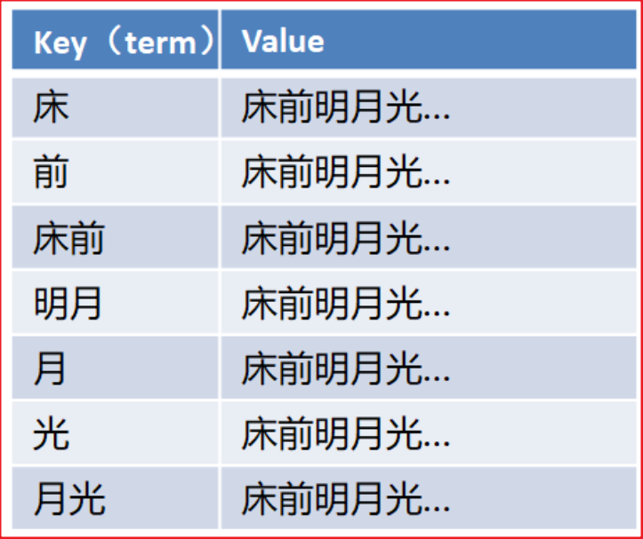  

+ 对 "明月几时有" 进行倒排索引

 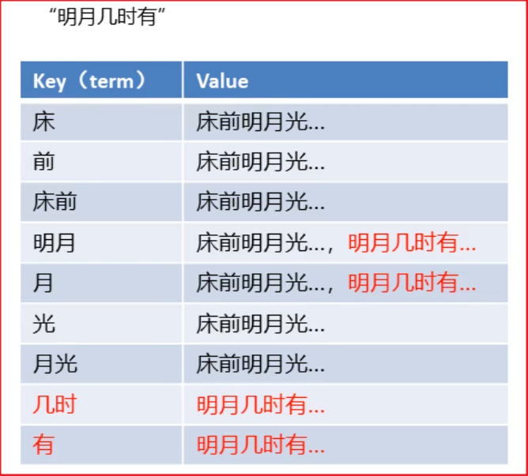

+ 倒排索引进行优化

 


#### 3.2ES存储和查询的原理

##### 3.2.1数据库查询存在的问题

1. 性能低：使用模糊查询，左边有通配符，不会走索引，会全表扫描，性能低
2. 功能弱：如果以”手机“作为条件，查询不出来数据

##### 3.2.2使用ES

+ Es使用倒排索引，对title 进行分词  

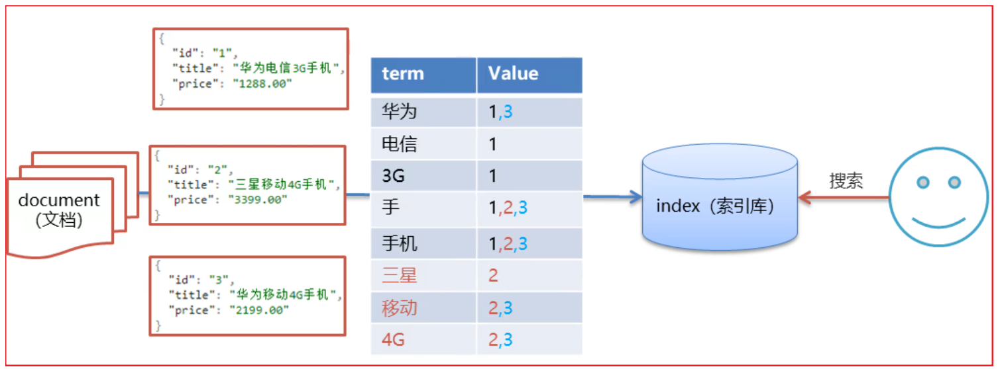 

+ 搜索

1. 使用“手机”作为关键字查询

   生成的倒排索引中，词条会排序，形成一颗树形结构，提升词条的查询速度

2. 使用“华为手机”作为关键字查询

   华为：1,3

   手机：1,2,3

   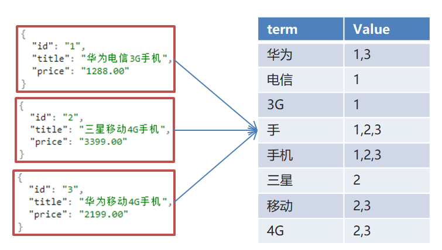

### 4.小结

1. 倒排(反向)索引

   ​	将文档进行分词, 将这些词条和文档唯一标识(一般是ID) 对应的关系 就是倒排(反向)索引


## 知识点-核心概念

### 1.目标

- [ ] 掌握ES的核心概念

### 2.路径

1. 核心概念
2. Field中有四个重要的属性

### 3.讲解

#### 3.1核心概念


| DB(MYSQL)        | elasticsearch  |
| ---------------- | -------------- |
| 数据库(database) | 索引(indices)  |
| 表(tables)       | types          |
| 行(rows)         | documents      |
| 列(columns)      | fields         |
| 列的限制         | 映射 (mapping) |

==type， Elasticsearch 7.X 中, Type 的概念已经被删除了。==   

+ 索引 index

​	一个索引就是一个拥有几分相似特征的文档的集合。比如说，你可以有一个客户数据的索引，另一个产品目录的索引，还有一个订单数据的索引。一个索引由一个名字来标识（必须全部是小写字母的），并且当我们要对对应于这个索引中的文档进行索引、搜索、更新和删除的时候，都要使用到这个名字。在一个集群中，可以定义任意多的索引。

+ 类型 type

​	在一个索引中，你可以定义一种或多种类型。一个类型是你的索引的一个逻辑上的分类/分区，其语义完全由你来定。通常，会为具有一组共同字段的文档定义一个类型。比如说，我们假设你运营一个博客平台并且将你所有的数据存储到一个索引中。在这个索引中，你可以为用户数据定义一个类型，为博客数据定义另一个类型，当然，也可以为评论数据定义另一个类型。

+ 文档 document

​	一个文档是一个可被索引的基础信息单元。比如，你可以拥有某一个客户的文档，某一个产品的一个文档，当然，也可以拥有某个订单的一个文档。文档以JSON（Javascript Object Notation）格式来表示，而JSON是一个到处存在的互联网数据交互格式。

​	在一个index/type里面，你可以存储任意多的文档。注意，尽管一个文档，物理上存在于一个索引之中，文档必须被索引/赋予一个索引的type。

​	注意：每一篇文档注意在进行创建的时候都会进行打分。用于进行排名，打分的公式实际上用的就是lucece的打分公式。

+ 字段Field

​	相当于是数据表的字段，对文档数据根据不同属性进行的分类标识

+ 映射 mapping

​	mapping是处理数据的方式和规则方面做一些限制，如某个字段的数据类型、默认值、分词器、是否被索引等等，这些都是映射里面可以设置的，其它就是处理es里面数据的一些使用规则设置也叫做映射，按着最优规则处理数据对性能提高很大，因此才需要建立映射，并且需要思考如何建立映射才能对性能更好。

例如：


#### 3.2Field中有四个重要的属性【面试】

1. 数据类型:定义了该Field的数据存储的方式 。有基本数据类型，字符串类型以及复杂的数据类型
2. 分词 : 分词就是根据某一个规则进行对文本拆分。 目的：为了建立倒排索引表结构。比如：要根据商品标题来搜索， title :是要分词的
   + 存储的时候分词    
   + 搜索的时候也可以对搜索的词语进行分词
3. 索引：为了能快速的进行搜索,决定了是否能够搜索出来 。比如： 商品的标题，要索引的（要有倒排索引结构）
4. 存储：存储与否 看页面是否展示。  比如：页面上要展示商品标题，商品标题 需要存储。（es中默认是不需要自己去存储的，但是可以展示，默认情况下数据是存储到es中_source中）

### 4.小结

1. 核心概念

| DB(MYSQL)        | elasticsearch  |
| ---------------- | -------------- |
| 数据库(database) | 索引(indices)  |
| 表(tables)       | types          |
| 行(rows)         | documents      |
| 列(columns)      | fields         |
| 列的限制         | 映射 (mapping) |

==type， Elasticsearch 7.X 中, Type 的概念已经被删除了。==   

2. 三个概念【面试】  
   + 分词:按照一定的规则对文档进行拆分, 分词的目的一般是为了索引  
   + 索引: 为了能够查询出来
   + 存储:为了能够在搜索的页面显示 但是ES自动会存储的, 不需要我们再手动设置


# 第二章-安装ElasticSearch

## 环境-安装ElasticSearch

### 1.目标

- [ ] 掌握elasticsearch的安装

### 2.路径

1. 下载
2. 解压, 安装
3. 启动
4. 测试

### 3.讲解

1. 下载

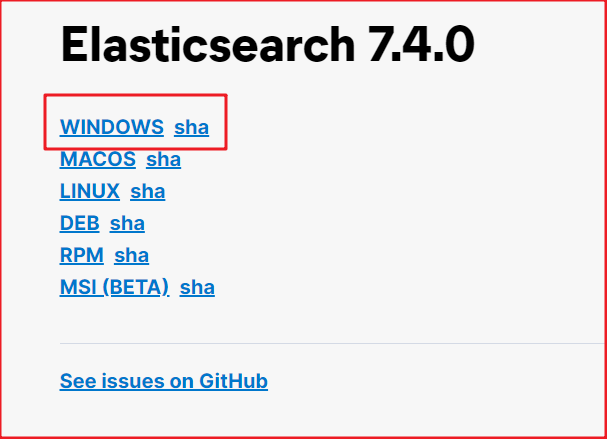 

 

2. 解压, 安装

   Window版的ElasticSearch的安装很简单，类似Window版的Tomcat，解压开即安装完毕，解压后的ElasticSearch的目录结构如下。注意：ES的目录==不要出现中文，也不要有特殊字符==。

    

3. 启动

   进入bin目录， 双击`elasticsearch.bat`

   9300是tcp通讯端口，集群间和TCPClient都执行该端口，可供java程序调用；

   9200是http协议的RESTful接口 。

   通过浏览器访问ElasticSearch服务器，看到如下返回的json信息，代表服务启动成功

4. 测试 浏览器输入 `http://localhost:9200/`

   

### 4.小结

#### 4.1常见问题

1. ElasticSearch5是使用java开发的，且本版本的es需要的jdk版本要是1.8以上，所以安装ElasticSearch之前保证JDK1.8+安装完毕，并正确的配置好JDK环境变量，否则启动ElasticSearch失败

2. 出现闪退，通过路径访问发现“空间不足”

   修改：解压目录下的/config/jvm.options文件


#### 4.2注意

解压的路径不要有空格和中文

## 知识点-IK分词器

### 1.目标

- [ ] 掌握IK分词器的安装使用

### 2.路径

1. 什么是分词器
2. 什么IK分词器
3. IK分词器安装
4. IK分词器测试
5.  自定义词库/词典

### 3.讲解

#### 3.1什么是分词器

分词器（Analyzer）：将一段文本，按照一定逻辑，分析成多个词语的一种工具。如：华为手机   --- >  华为、手、手机
ElasticSearch 内置分词器

+ Standard Analyzer - 默认分词器，按词切分，小写处理
+ Simple Analyzer - 按照非字母切分(符号被过滤), 小写处理
+ Stop Analyzer - 小写处理，停用词过滤(the,a,is)
+ Whitespace Analyzer - 按照空格切分，不转小写
+ Keyword Analyzer - 不分词，直接将输入当作输出
+ Patter Analyzer - 正则表达式，默认\W+(非字符分割)
+ Language - 提供了30多种常见语言的分词器

ElasticSearch 内置分词器对中文很不友好，处理方式为：==一个字一个词==

 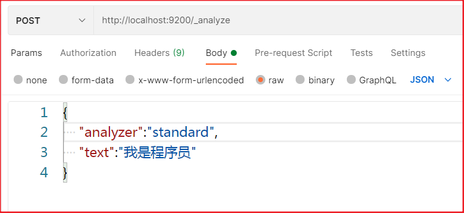 

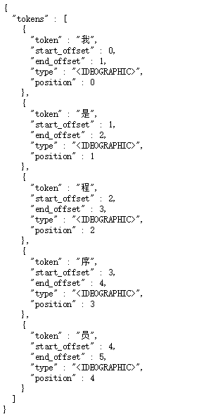 

#### 3.2 什么是IK分词器

​	IK分词是一款国人开发的相对简单的中文分词器。在工程应用中IK算是比较流行的一款！

​	默认的中文分词是将每个字看成一个词，这显然是不符合要求的，我们就使用IK分词器来解决这个问题。

#### 3.3IK分词器安装

​	下载地址：[https://github.com/medcl/elasticsearch-analysis-ik/releases](https://github.com/medcl/elasticsearch-analysis-ik/releases) 下载7.4.0版本

 

- 先将其解压，将解压后的elasticsearch文件夹重命名文件夹为ik
- 将ik文件夹拷贝到elasticsearch/plugins 目录下。
- 重新启动，即可加载IK分词器 

#### 3.4IK分词器测试

IK提供了两个分词算法`ik_smart` 和 `ik_max_word`. 其中 ik_smart 为最少切分，ik_max_word为最细粒度划分 

1. 最小切分

  

 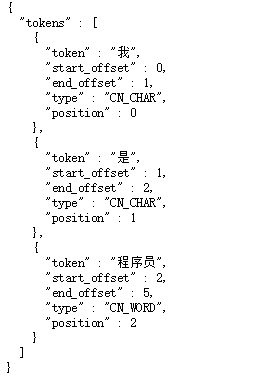

2. 最细切分

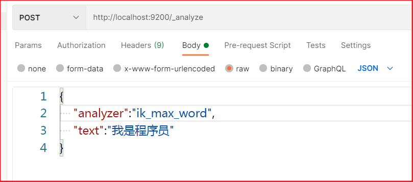 

 


#### 3.5 自定义词库/词典

##### 3.5.1  测试分词效果

 

```json
{
    "tokens": [
        {
            "token": "我",
            "start_offset": 0,
            "end_offset": 1,
            "type": "CN_CHAR",
            "position": 0
        },
        {
            "token": "是",
            "start_offset": 1,
            "end_offset": 2,
            "type": "CN_CHAR",
            "position": 1
        },
        {
            "token": "传",
            "start_offset": 2,
            "end_offset": 3,
            "type": "CN_CHAR",
            "position": 2
        },
        {
            "token": "智",
            "start_offset": 3,
            "end_offset": 4,
            "type": "CN_CHAR",
            "position": 3
        },
        {
            "token": "播",
            "start_offset": 4,
            "end_offset": 5,
            "type": "CN_CHAR",
            "position": 4
        },
        {
            "token": "客",
            "start_offset": 5,
            "end_offset": 6,
            "type": "CN_CHAR",
            "position": 5
        },
        {
            "token": "的",
            "start_offset": 6,
            "end_offset": 7,
            "type": "CN_CHAR",
            "position": 6
        },
        {
            "token": "学生",
            "start_offset": 7,
            "end_offset": 9,
            "type": "CN_WORD",
            "position": 7
        }
    ]
}
```

##### 3.5.2 添加自定义词库/词典

1. 传智播客没有作为整体被分词出来。我们需要将其扩展为一个词，此时我们需要自定义扩展词典

   + 进入elasticsearch/plugins/ik/config目录 

   + 新建一个my.dic文件（文件名任意），**特别注意**编辑内容(以utf8无bom保存, 如果不行加一些换行)

   ```
   传智播客
   ```

   + 修改IKAnalyzer.cfg.xml（在ik/config目录下）  

   ```
   <properties>
       <comment>IK Analyzer 扩展配置</comment>
       <!‐‐用户可以在这里配置自己的扩展字典 ‐‐>
       <entry key="ext_dict">my.dic</entry>
       <!‐‐用户可以在这里配置自己的扩展停止词字典‐‐>
       <entry key="ext_stopwords"></entry>
   </properties>
   ```

   + 测试

    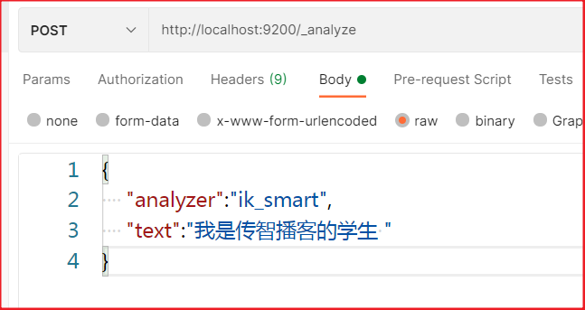

   ​	

   ```
   {
       "tokens": [
           {
               "token": "我",
               "start_offset": 0,
               "end_offset": 1,
               "type": "CN_CHAR",
               "position": 0
           },
           {
               "token": "是",
               "start_offset": 1,
               "end_offset": 2,
               "type": "CN_CHAR",
               "position": 1
           },
           {
               "token": "传智播客",
               "start_offset": 2,
               "end_offset": 6,
               "type": "CN_WORD",
               "position": 2
           },
           {
               "token": "的",
               "start_offset": 6,
               "end_offset": 7,
               "type": "CN_CHAR",
               "position": 3
           },
           {
               "token": "学生",
               "start_offset": 7,
               "end_offset": 9,
               "type": "CN_WORD",
               "position": 4
           }
       ]
   }
   ```

   

2. 如果需要停用一些词，比如有些文本在进行创建文档建立倒排索引的时候需要过滤掉一些没有用的词，则可以进行自定义词典：我们把他叫做**停用词典**

   + 进入elasticsearch/plugins/ik/config目录 

   + 创建一个stopwords.dic 文件，特别注意：编辑内容(以utf8无bom保存, 如果不行加一些换行)

   + 在文件中添加一个字为

   ```
   的
   ```

   + 修改IKAnalyzer.cfg.xml（在ik/config目录下） 

   ```xml
   <properties>
       <comment>IK Analyzer 扩展配置</comment>
       <!‐‐用户可以在这里配置自己的扩展字典 ‐‐>
       <entry key="ext_dict">my.dic</entry>
       <!‐‐用户可以在这里配置自己的扩展停止词字典‐‐>
       <entry key="ext_stopwords">stopwords.dic</entry>
   </properties>
   ```

   

   + 重启eslasticesarch服务器

     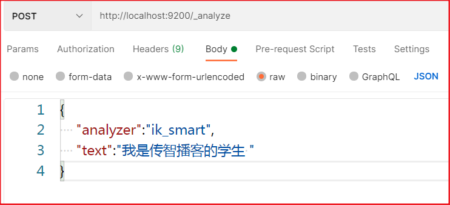 

     ```
     {
         "tokens": [
             {
                 "token": "我",
                 "start_offset": 0,
                 "end_offset": 1,
                 "type": "CN_CHAR",
                 "position": 0
             },
             {
                 "token": "是",
                 "start_offset": 1,
                 "end_offset": 2,
                 "type": "CN_CHAR",
                 "position": 1
             },
             {
                 "token": "传智播客",
                 "start_offset": 2,
                 "end_offset": 6,
                 "type": "CN_WORD",
                 "position": 2
             },
             {
                 "token": "学生",
                 "start_offset": 7,
                 "end_offset": 9,
                 "type": "CN_WORD",
                 "position": 3
             }
         ]
     }
     ```


### 4.小结

IK: 国人开发的一款分词器, 对中文分词很友好

注意: IK的版本需要和ES一致


## 环境-安装Kibana

### 1.目标

- [ ] 掌握Kibana的安装

### 2.路径

1. 什么是Kibana
2. 安装
   + 下载Kibana
   + 解压, 安装Kibana
   + 配置Kibana
   + 启动
   + 测试

### 3.讲解

#### 3.1什么是Kibana

​	Kibana是一个针对Elasticsearch的开源分析及可视化平台，用来搜索、查看交互存储在Elasticsearch索引中的数据。使用Kibana，可以通过各种图表进行高级数据分析及展示。

​	Kibana让海量数据更容易理解。它操作简单，基于浏览器的用户界面可以快速创建仪表板（dashboard）实时显示Elasticsearch查询动态。

#### 3.2安装Kibana

+ 下载Kibana

   

+ 解压, 安装Kibana

   

+ 配置Kibana, `config/kibana.yml`

```
i18n.locale: "zh-CN"
```

+ 启动

  进入bin目录, 双击`kibana.bat` 

+ 测试

  浏览器输入`http://localhost:5601/`

    

   

### 4.小结


# 第三章-脚本操作ES

## 实操-操作索引和映射

### 1.目标

- [ ] 掌握使用脚本操作索引和映射

### 2.路径

1. 操作索引
2. ES数据类型
3. 操作映射

### 3.讲解 

​	操作ES可以使用restful风格的接口发送请求, 也可以使用DSL语言,也可以使用语言(eg: Java)的API

#### 3.1操作索引

+ 创建索引

```
PUT	http://ip:端口/索引名称
```

 

+ 查询索引

```
GET http://ip:端口/索引名称  # 查询单个索引信息
GET http://ip:端口/索引名称1,索引名称2...  # 查询多个索引信息
GET http://ip:端口/_all  # 查询所有索引信息
```

 

+ 删除索引

```
DELETE http://ip:端口/索引名称
```


#### 3.2ES数据类型

##### 3.2.1简单数据类型

- 字符串类型

  + text：会分词，不支持聚合

  + keyword：不会分词，将全部内容作为一个词条，支持聚合(eg: 邮箱地址, 手机号码可以使用keyword)

    说明: 聚合：相当于mysql 中的sum（求和）

- 数值

```
long, integer, short, byte, double, float...
```

- 布尔：boolean
- 二进制：binary

- 日期:date

##### 3.2.2复杂数据类型

+ 数组：[ ]  
+ 对象：{ }  object

```
{ 
  "region": "US",
  "manager": { 
    "age":     30,
    "name": { 
      "first": "John",
      "last":  "Smith"
    }
  }
}
```


#### 3.3操作映射

+ 创建索引,添加映射

需求: 创建person索引, 创建映射, 设定name类型为text, age类型为Integer 

```json
 
 #创建索引并添加映射
 PUT /person1
{
  "mappings": {
    "properties": {
      "name": {
        "type": "text"
      },
      "age": {
        "type": "integer"
      }
    }
  }
}

GET person1/_mapping
```

+ 添加字段address

```json
#添加字段
PUT /person1/_mapping
{
  "properties": {
      "address": {
        "type": "text"
      }
    }
}
```


## 实操-操作文档

### 1.目标

- [ ] 掌握操作文档

### 2.路径

1. 添加文档
2. 删除文档
3. 查询文档

### 3.讲解

#### 3.1添加文档

+ 添加文档，指定id

```json
POST person1/_doc/1
{
  "name":"张三",
  "age":18,
  "address":"北京"
}

GET /person1/_doc/1
```

+ 添加文档，不指定id

```json
#添加文档，不指定id
POST /person1/_doc/
{
  "name":"张三",
  "age":18,
  "address":"北京"
}

#查询所有文档
GET /person1/_search
```

#### 3.2删除文档

```json
#删除指定id文档
DELETE /person1/_doc/1
```

#### 3.3查询文档

+ 词条查询：term 词条查询不会分析查询条件(不会对用户输入的词语进行分词)，只有当词条和查询字符串完全匹配时才匹配搜索
+ 全文查询：match   全文查询会分析查询条件(会对用户输入的词语进行分析)，先将查询条件进行分词，然后查询，求并集

1.创建索引，添加映射，并指定分词器为ik分词器

需求:  创建person2索引, 创建映射, 设定name类型为keyword age类型为Integer,addres类型为text 指定ik分词器

```json
PUT person2
{
  "mappings": {
    "properties": {
      "name":{
        "type": "keyword"
      },
      "age":{
        "type": "integer"
      },
      "address":{
        "type": "text",
        "analyzer": "ik_smart"
      }
    }
  }
}
```

2.添加文档

```
POST /person2/_doc/1
{
  "name":"张三",
  "age":18,
  "address":"北京海淀区"
}

POST /person2/_doc/2
{
  "name":"李四",
  "age":18,
  "address":"北京朝阳区"
}

POST /person2/_doc/3
{
  "name":"王五",
  "age":18,
  "address":"北京昌平区"
}

```


3.查询映射

```json
GET person2
```

 


4.查看分词效果

```json
GET _analyze
{
  "analyzer": "ik_max_word",
  "text": "北京海淀"
}

```

5.词条查询：term

```json
GET person2/_search
{
  "query": {
    "term": {
      "address": {
        "value": "北京昌平"
      }
    }
  }
}
```

6.全文查询：match

​           全文查询会分析查询条件，先将查询条件进行分词，然后查询，求并集

```
GET person2/_search
{
  "query": {
    "match": {
      "address": "北京昌平"
    }
  }
}
```


# 第四章-ElasticSearch JavaApi

## 环境-SpringBoot整合ES

### 1.需求

- [ ] 掌握SpringBoot整合ES

### 2.步骤

1. 创建elasticsearch-demo
2. 在pom文件添加坐标(SpringBoot,ES的)
3. 拷贝ElasticSearchConfig
4. 创建配置文件(配置ES)
5. 创建启动类

### 3.实现

+ 创建elasticsearch-demo

+ 在pom文件添加坐标

```xml
<?xml version="1.0" encoding="UTF-8"?>
<project xmlns="http://maven.apache.org/POM/4.0.0"
         xmlns:xsi="http://www.w3.org/2001/XMLSchema-instance"
         xsi:schemaLocation="http://maven.apache.org/POM/4.0.0 http://maven.apache.org/xsd/maven-4.0.0.xsd">
    <modelVersion>4.0.0</modelVersion>

    <groupId>com.itheima</groupId>
    <artifactId>elasticsearch-demo</artifactId>
    <version>1.0-SNAPSHOT</version>

    <parent>
        <groupId>org.springframework.boot</groupId>
        <artifactId>spring-boot-starter-parent</artifactId>
        <version>2.2.1.RELEASE</version>
        <relativePath/> <!-- lookup parent from repository -->
    </parent>

    <properties>
        <project.build.sourceEncoding>UTF-8</project.build.sourceEncoding>
        <maven.compiler.source>1.8</maven.compiler.source>
        <maven.compiler.target>1.8</maven.compiler.target>
    </properties>

    <dependencies>
        <dependency>
            <groupId>org.springframework.boot</groupId>
            <artifactId>spring-boot-starter</artifactId>
        </dependency>
        <dependency>
            <groupId>org.springframework.boot</groupId>
            <artifactId>spring-boot-starter-test</artifactId>
            <scope>test</scope>
            <exclusions>
                <exclusion>
                    <groupId>org.junit.vintage</groupId>
                    <artifactId>junit-vintage-engine</artifactId>
                </exclusion>
            </exclusions>
        </dependency>
        <dependency>
            <groupId>junit</groupId>
            <artifactId>junit</artifactId>
            <version>4.12</version>
            <scope>test</scope>
        </dependency>
        <!--引入es的坐标-->
        <dependency>
            <groupId>org.elasticsearch.client</groupId>
            <artifactId>elasticsearch-rest-high-level-client</artifactId>
            <version>7.4.0</version>
        </dependency>
        <dependency>
            <groupId>org.elasticsearch.client</groupId>
            <artifactId>elasticsearch-rest-client</artifactId>
            <version>7.4.0</version>
        </dependency>
        <dependency>
            <groupId>org.elasticsearch</groupId>
            <artifactId>elasticsearch</artifactId>
            <version>7.4.0</version>
        </dependency>

        <!--fastjson-->
        <dependency>
            <groupId>com.alibaba</groupId>
            <artifactId>fastjson</artifactId>
            <version>1.2.4</version>
        </dependency>

    </dependencies>


</project>
```

+ 拷贝ElasticSearchConfig

```java
package com.heima.es.config;

import org.apache.http.HttpHost;
import org.elasticsearch.client.RestClient;
import org.elasticsearch.client.RestHighLevelClient;
import org.springframework.boot.context.properties.ConfigurationProperties;
import org.springframework.context.annotation.Bean;
import org.springframework.context.annotation.Configuration;

@Configuration
@ConfigurationProperties(prefix="elasticsearch")
public class ElasticSearchConfig {

    private String host;

    private int port;


    public String getHost() {
        return host;
    }

    public void setHost(String host) {
        this.host = host;
    }

    public int getPort() {
        return port;
    }

    public void setPort(int port) {
        this.port = port;
    }
    @Bean
    public RestHighLevelClient client(){
        return new RestHighLevelClient(RestClient.builder(
                new HttpHost(host,port,"http")
        ));
    }
}
```

+ 创建配置文件application.yml

```yaml
server:
  port: 8081
elasticsearch:
  host: localhost
  port: 9200
```

+ 创建启动类

```java
package com.heima.es;

import org.springframework.boot.SpringApplication;
import org.springframework.boot.autoconfigure.SpringBootApplication;

/**
 * @Description:
 * @author: yp
 */
@SpringBootApplication
public class EsApplication {


    public static void main(String[] args) {
        SpringApplication.run(EsApplication.class,args);
    }

}

```

### 4.小结


## 案例-操作索引【了解】

### 1.需求

- [ ] 使用Java API 创建, 查询,删除索引

https://www.elastic.co/guide/en/elasticsearch/client/java-rest/7.4/java-rest-high.html

### 2.创建索引

#### 2.1步骤

1. 获得操作索引对象
2. 创建 创建索引请求对象 设置索引名称
3. 创建

#### 2.2实现

1.添加索引

 ```java
package com.heima.es.test;

import com.heima.es.EsApplication;
import org.elasticsearch.client.IndicesClient;
import org.elasticsearch.client.RequestOptions;
import org.elasticsearch.client.RestHighLevelClient;
import org.elasticsearch.client.indices.CreateIndexRequest;
import org.elasticsearch.client.indices.CreateIndexResponse;
import org.junit.Test;
import org.junit.runner.RunWith;
import org.springframework.beans.factory.annotation.Autowired;
import org.springframework.boot.test.context.SpringBootTest;
import org.springframework.test.context.junit4.SpringRunner;

import java.io.IOException;

/**
 * @Description:
 * @author: yp
 */
@SpringBootTest(classes = EsApplication.class)
@RunWith(SpringRunner.class)
public class EsTest {
    @Autowired
    private RestHighLevelClient client;

    //创建索引
    @Test
    public void fun01() throws IOException {
        //1.获得索引对象
        IndicesClient indices = client.indices();
        //2.创建 索引请求对象 设置索引名称
        CreateIndexRequest createIndexRequest = new CreateIndexRequest("itheima");
        //3.创建
        CreateIndexResponse response = indices.create(createIndexRequest, RequestOptions.DEFAULT);
        System.out.println(response.isAcknowledged());
    }
}

 ```
2.添加索引，并添加映射

```java
    //创建索引, 添加映射
    @Test
    public void fun02() throws IOException {
        //1.获得操作索引对象
        IndicesClient indices = client.indices();
        //2.创建 索引请求对象, 设置索引名称
        CreateIndexRequest createIndexRequest = new CreateIndexRequest("itcast");

        //3.设置mapping
        String mapping = "{\n" +
                "      \"properties\" : {\n" +
                "        \"address\" : {\n" +
                "          \"type\" : \"text\",\n" +
                "          \"analyzer\" : \"ik_max_word\"\n" +
                "        },\n" +
                "        \"age\" : {\n" +
                "          \"type\" : \"long\"\n" +
                "        },\n" +
                "        \"name\" : {\n" +
                "          \"type\" : \"keyword\"\n" +
                "        }\n" +
                "      }\n" +
                "    }";
        createIndexRequest.mapping(mapping, XContentType.JSON);

        //4.创建
        CreateIndexResponse response = indices.create(createIndexRequest, RequestOptions.DEFAULT);

        System.out.println(response.isAcknowledged());
    }
```


### 3.查询索引

#### 3.1步骤

1. 获得操作索引对象
2. 创建获得索引请求对象
3. 调用get()方法

#### 3.2实现

```java
   //查询索引
    @Test
    public void fun03() throws IOException {
        // 1. 获得操作索引对象
        IndicesClient indices = client.indices();
        // 2. 创建获得索引请求对象
        GetIndexRequest getIndexRequest = new GetIndexRequest("itcast");
        // 3. 调用get()方法
        GetIndexResponse response = indices.get(getIndexRequest, RequestOptions.DEFAULT);
        Map<String, MappingMetaData> mappings = response.getMappings();
    }
```

### 4.删除索引

#### 4.1步骤

1. 获得操作索引对象
2. 创建删除索引请求对象
3. 调用delete()方法

#### 4.2实现

```java
    //删除索引
    @Test
    public void fun04() throws IOException {
        // 1. 获得操作索引对象
        IndicesClient client = this.client.indices();
        // 2. 创建删除索引请求对象
        DeleteIndexRequest deleteIndexRequest = new DeleteIndexRequest("itcast");
        // 3. 调用delete()方法
        AcknowledgedResponse response = client.delete(deleteIndexRequest, RequestOptions.DEFAULT);
        System.out.println(response.isAcknowledged());
    }
```


## 案例-操作文档

### 1.需求

- [ ] 使用Java API对文档进行CRUD

### 2.添加文档

#### 2.1步骤

1. 创建IndexRequest
2. 调用index方法

#### 2.2实现

1.添加文档,使用map作为数据

```java
    //新增文档
    @Test
    public void fun05() throws IOException {
        Map<String, Object> map=new HashMap<>();
        map.put("name","张三");
        map.put("age","18");
        map.put("address","北京二环");
        //1. 创建IndexRequest
        IndexRequest indexRequest = new IndexRequest("itcast").id("1").source(map);
        //2. 调用index方法
        IndexResponse response = client.index(indexRequest, RequestOptions.DEFAULT);

        System.out.println(response.status().getStatus());
    }
```

 2.添加文档,使用对象作为数据

+ Person

```java
package com.heima.es.bean;

public class Person {
    private String id;
    private String name;
    private int age;
    private String address;

    public Person() {
    }

    public Person(String name, int age, String address) {
        this.name = name;
        this.age = age;
        this.address = address;
    }

    public String getId() {
        return id;
    }

    public void setId(String id) {
        this.id = id;
    }

    public String getName() {
        return name;
    }

    public void setName(String name) {
        this.name = name;
    }

    public int getAge() {
        return age;
    }

    public void setAge(int age) {
        this.age = age;
    }

    public String getAddress() {
        return address;
    }

    public void setAddress(String address) {
        this.address = address;
    }

    @Override
    public String toString() {
        return "Person{" +
                "id='" + id + '\'' +
                ", name='" + name + '\'' +
                ", age=" + age +
                ", address='" + address + '\'' +
                '}';
    }
}

```

+ 操作代码

```java
    //新增文档 使用对象作为数据
    @Test
    public void fun06() throws IOException {
        Person person = new Person("李四", 19, "深圳宝安");
        String data = JSON.toJSONString(person);

        //1. 创建IndexRequest
        IndexRequest indexRequest = new IndexRequest("itcast").source(data, XContentType.JSON);
        //2. 调用index方法
        IndexResponse response = client.index(indexRequest, RequestOptions.DEFAULT);

        System.out.println(response.status().getStatus());

    }
```


### 3.根据id查询文档

#### 3.1步骤

1. 创建GetRequest对象
2. 调用get()方法

#### 3.2实现

```java
    //查询id为1的文档
    @Test
    public void fun07() throws IOException {
        // 1. 创建GetRequest对象
        GetRequest getRequest = new GetRequest("itcast", "1");
        // 2. 调用get()方法
        GetResponse response = client.get(getRequest, RequestOptions.DEFAULT);
        System.out.println(response.getSourceAsString());
    }
```


### 4.修改文档

#### 4.1步骤

1. 创建IndexRequest
2. 调用index方法

#### 4.2实现

1.修改文档：添加文档时，如果id存在则修改，id不存在则添加

```java
    @Test
    public void fun08() throws IOException {
        Map<String, Object> map = new HashMap<>();
        map.put("name", "张三三");
        map.put("age", "18");
        map.put("address", "北京二环");
        //1. 创建IndexRequest
        IndexRequest indexRequest = new IndexRequest("itcast").id("1").source(map);
        //2. 调用index方法
        IndexResponse response = client.index(indexRequest, RequestOptions.DEFAULT);

        System.out.println(response.status().getStatus());
    }
```


### 4.根据id删除文档

#### 4.1步骤

1. 创建DeleteRequest
2. 调用delete方法

#### 4.2实现

```java
    //删除文档
    @Test
    public void fun09() throws IOException {
        //1.创建DeleteRequest对象
        DeleteRequest deleteRequest = new DeleteRequest("itcast").id("1");
        //2.调用delete()方法
        DeleteResponse response = client.delete(deleteRequest, RequestOptions.DEFAULT);
        System.out.println(response.status().getStatus());
    }
```

# 总结

## 一,概念

1. 什么是ES
2. 倒排索引
3. 3个概念【面试】
   + 分词
   + 索引
   + 存储

## 二,安装

+ ES
+ IK分词器
+ Kibana

## 三,脚本操作ES

+ 练一遍
+ 操作索引,映射,查询文档【多练一遍】

## 四,JavaAPI操作ES

+ 操作文档
+ 操作索引(可练可不练)

