# day02-Elasticsearch

# 第一章-ElasticSearch批量操作

## 知识点-bulk批量操作

### 1.目标

​	Bulk 批量操作是将文档的增删改查一些列操作，通过一次请求全都做完。减少网络传输次数。

### 2.路径

1. 使用脚本批量操作
2. 使用JavaAPI批量操作

### 3.讲解

#### 3.1脚本

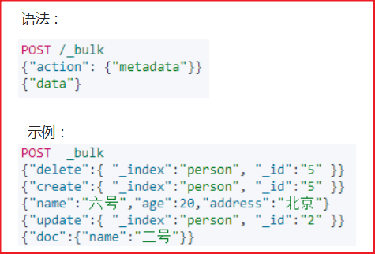 

+ 需求

```
1.删除5号记录
2.添加8号记录
3.修改2号记录名字为2号 
```

+ 批量操作文本

```json
POST _bulk
{"delete":{"_index":"person1","_id":"5"}}
{"create":{"_index":"person1","_id":"8"}}
{"name":"八号","age":18,"address":"北京"}
{"update":{"_index":"person1","_id":"2"}}
{"doc":{"name":"2号"}}
```

+ 结果

```json
{
  "took" : 51,
  "errors" : true,
  "items" : [
    {
      "delete" : {
        "_index" : "person1",
        "_type" : "_doc",
        "_id" : "5",
        "_version" : 2,
        "result" : "deleted",
        "_shards" : {
          "total" : 2,
          "successful" : 1,
          "failed" : 0
        },
        "_seq_no" : 6,
        "_primary_term" : 2,
        "status" : 200
      }
    },
    {
      "create" : {
        "_index" : "person1",
        "_type" : "_doc",
        "_id" : "8",
        "_version" : 1,
        "result" : "created",
        "_shards" : {
          "total" : 2,
          "successful" : 1,
          "failed" : 0
        },
        "_seq_no" : 7,
        "_primary_term" : 2,
        "status" : 201
      }
    },
    {
      "update" : {
        "_index" : "person1",
        "_type" : "_doc",
        "_id" : "2",
        "_version" : 2,
        "result" : "updated",
        "_shards" : {
          "total" : 2,
          "successful" : 1,
          "failed" : 0
        },
        "_seq_no" : 10,
        "_primary_term" : 2,
        "status" : 200
      }
    }
  ]
}

```

#### 3.2JavaAPI

**需求**

1. 删除5号记录
2. 添加6号记录
3. 修改3号记录 名称为 “三号”

**步骤**

1. 创建BulkRequest对象
2. 调用add()方法增加操作
3. 调用bulk()方法


**实现**

```java
    /**
     * bulk批量操作
     * 1. 删除8号记录
     * 2. 添加6号记录
     * 3. 修改3号记录 名称为 “三号”
     */
    @Test
    public void fun01() throws IOException {
        // 1. 创建BulkRequest对象
        BulkRequest bulkRequest = new BulkRequest();

        // 2. 调用add()方法增加操作
        DeleteRequest deleteRequest = new DeleteRequest("person2").id("8");
        bulkRequest.add(deleteRequest);

        Map<String, Object> map = new HashMap<>();
        map.put("name", "张6");
        map.put("age", "6");
        map.put("address", "北京6环");
        IndexRequest indexRequest = new IndexRequest("person2").id("6");
        indexRequest.source(map);
        bulkRequest.add(indexRequest);

        Map<String, Object> mapUpdate=new HashMap<>();
        mapUpdate.put("name","3号");
        UpdateRequest updateRequest = new UpdateRequest("person2", "3").doc(mapUpdate);
        bulkRequest.add(updateRequest);

        // 3. 调用bulk()方法
        BulkResponse response = client.bulk(bulkRequest, RequestOptions.DEFAULT);
        System.out.println(response.status().getStatus());
    }
```


## 知识点-导入数据

### 1.目标

- [ ] 将数据库中Goods表的数据导入到ElasticSearch中

### 2.步骤

1. mysql数据库的准备

2. 创建goods索引
3. 查询Goods表数据
4. 批量添加到ElasticSearch中

### 3.实现

#### 3.1持久层准备

+ 导入数据库脚本

 

+ pom添加坐标

```xml
<!--mybatis-plus-->
<dependency>
    <groupId>com.baomidou</groupId>
    <artifactId>mybatis-plus-boot-starter</artifactId>
    <version>3.4.1</version>
</dependency>
<dependency>
    <groupId>mysql</groupId>
    <artifactId>mysql-connector-java</artifactId>
</dependency>
```

+ 在 `application.yml` 配置文件中添加 mysql 数据库的相关配置

```xml
# DataSource Config
spring:
  datasource:
    driver-class-name: com.mysql.jdbc.Driver
    url: jdbc:mysql:///mydb?serverTimezone=UTC
    username: root
    password: 123456
```


+ Goods

```java
package com.heima.es.bean;

import com.baomidou.mybatisplus.annotation.IdType;
import com.baomidou.mybatisplus.annotation.TableField;
import com.baomidou.mybatisplus.annotation.TableId;
import com.baomidou.mybatisplus.annotation.TableName;

import java.util.Date;
import java.util.Map;

public class Goods {

    @TableId(value = "id", type = IdType.AUTO)
    private int id;

    @TableField(value = "title")
    private String title;

    @TableField(value = "price")
    private double price;

    @TableField(value = "stock")
    private int stock;

    @TableField(value = "saleNum")
    private int saleNum;

    @TableField(value = "createTime")
    private Date createTime;

    @TableField(value = "categoryName")
    private String categoryName;

    @TableField(value = "brandName")
    private String brandName;


    private Map spec;

    //@JSONField(serialize = false)//在转换JSON时，忽略该字段
    @TableField(value = "spec")
    private String specStr;//接收数据库的信息 "{}"


    public int getId() {
        return id;
    }

    public void setId(int id) {
        this.id = id;
    }

    public String getTitle() {
        return title;
    }

    public void setTitle(String title) {
        this.title = title;
    }

    public double getPrice() {
        return price;
    }

    public void setPrice(double price) {
        this.price = price;
    }

    public int getStock() {
        return stock;
    }

    public void setStock(int stock) {
        this.stock = stock;
    }

    public int getSaleNum() {
        return saleNum;
    }

    public void setSaleNum(int saleNum) {
        this.saleNum = saleNum;
    }

    public Date getCreateTime() {
        return createTime;
    }

    public void setCreateTime(Date createTime) {
        this.createTime = createTime;
    }

    public String getCategoryName() {
        return categoryName;
    }

    public void setCategoryName(String categoryName) {
        this.categoryName = categoryName;
    }

    public String getBrandName() {
        return brandName;
    }

    public void setBrandName(String brandName) {
        this.brandName = brandName;
    }

    public Map getSpec() {
        return spec;
    }

    public void setSpec(Map spec) {
        this.spec = spec;
    }

    public String getSpecStr() {
        return specStr;
    }

    public void setSpecStr(String specStr) {
        this.specStr = specStr;
    }

    @Override
    public String toString() {
        return "Goods{" +
                "id=" + id +
                ", title='" + title + '\'' +
                ", price=" + price +
                ", stock=" + stock +
                ", saleNum=" + saleNum +
                ", createTime=" + createTime +
                ", categoryName='" + categoryName + '\'' +
                ", brandName='" + brandName + '\'' +
                ", spec=" + spec +
                ", specStr='" + specStr + '\'' +
                '}';
    }
}
```

+ GoodMapper

```java
package com.itheima.mapper;

import com.baomidou.mybatisplus.core.mapper.BaseMapper;
import com.itheima.bean.Goods;

/**
 * @Description:
 * @author: yp
 */
public interface GoodMapper extends BaseMapper<Goods> {

}

```

+ 启动类上进行mapper扫描

 

#### 3.2索引库的准备

+ 索引

```json
PUT goods
{
	"mappings": {
		"properties": {
			"title": {
				"type": "text",
				"analyzer": "ik_smart"
			},
			"price": { 
				"type": "double"
			},
			"createTime": {
				"type": "date"
			},
			"categoryName": {	
				"type": "keyword"
			},
			"brandName": {	
				"type": "keyword"
			},
	
			"spec": {		
				"type": "object"
			},
			"saleNum": {	
				"type": "integer"
			},
			
			"stock": {	
				"type": "integer"
			}
		}
	}
}
```

+ 添加一条数据

```
POST goods/_doc/1
{
  "title":"小米手机",
  "price":1000,
  "createTime":"2019-12-01",
  "categoryName":"手机",
  "brandName":"小米",
  "saleNum":3000,
  "stock":10000,
  "spec":{
    "网络制式":"移动4G",
    "屏幕尺寸":"4.5"
  }
}
```


#### 3.3 代码实现

```java
    /**
     * 导入数据
     */
    @Test
    public void fun02() throws IOException {
        //1.创建BulkRequest对象
        BulkRequest bulkRequest = new BulkRequest();

        //2.调用add()方法
        List<Goods> goodsList = goodsMapper.selectList(null);
        for (Goods goods : goodsList) {
            Map map = JSON.parseObject(goods.getSpecStr(), Map.class);
            goods.setSpec(map);

            String data = JSON.toJSONString(goods);
            IndexRequest indexRequest = new IndexRequest("goods").id(goods.getId() + "");
            indexRequest.source(data,XContentType.JSON);

            bulkRequest.add(indexRequest);
        }

        //3.调用bulk()方法
        BulkResponse responses = client.bulk(bulkRequest, RequestOptions.DEFAULT);
        System.out.println(responses.status().getStatus());
    }
```


# 第二章-ElasticSearch查询

## 知识点-matchAll

### 1.目标

- [ ] 掌握matchAll查询

### 2.路径

1. matchAll概述
2. 脚本实现
3. JavaAPI实现  

### 3.讲解

#### 3.1matchAll概述

查询所有文档  

#### 3.2脚本

```shell
# 默认情况下，es一次展示10条数据,通过from和size来控制分页
# 查询结果详解

GET goods/_search
{
  "query": {
    "match_all": {}
  },
  "from": 0,
  "size": 100
}

GET goods
```

#### 3.3matchAll-JavaAPI 

**步骤**

1. 创建SearchRequest对象
2. 创建查询条件构建器SearchSourceBuilder
3. 构建查询条件对象QueryBuilder
4. 调用search()方法
5. 处理结果


**实现**

```java
    //matchAll 查询所有
    @Test
    public void fun03() throws IOException {
       // 1. 创建SearchRequest对象
        SearchRequest searchRequest = new SearchRequest("goods");
        // 2. 创建查询条件构建器SearchSourceBuilder
        SearchSourceBuilder searchSourceBuilder = new SearchSourceBuilder();
        // 3. 构建查询条件对象QueryBuilder
        MatchAllQueryBuilder matchAllQueryBuilder = QueryBuilders.matchAllQuery();
        searchSourceBuilder.query(matchAllQueryBuilder);
        searchRequest.source(searchSourceBuilder);
        // 4. 调用search()方法
        SearchResponse response = client.search(searchRequest, RequestOptions.DEFAULT);
        // 5. 处理结果
        //5.1 获取命中对象
        SearchHits hits = response.getHits();
        //5.2获得总记录数
        System.out.println("总记录数="+hits.getTotalHits().value);
        //5.3 获得数据
        List<Goods> goodsList = new ArrayList<Goods>();
        for (SearchHit hit : hits) {
            String data = hit.getSourceAsString();
            Goods goods = JSON.parseObject(data, Goods.class);
            goodsList.add(goods);
        }

        System.out.println(goodsList);
        client.close();
    }
```


## 知识点-termQuery【重点】

### 1.目标

- [ ] 掌握termQuery

### 2.路径

1. termQuery概述
2. 脚本实现
3. JavaAPI实现

### 3.讲解

#### 3.1概述

term查询：不会对查询条件进行分词  

#### 3.2脚本

```
GET goods/_search
{
  "query": {
    "term": {
      "title": {
        "value": "华为"
      }
    }
  }
}
```

term查询，查询text类型字段时，只有其中的单词相匹配都会查到

+ 例如：查询title 为“华为”的，title type 为text

 

 


+ 查询categoryName 字段时，categoryName字段为keyword  ,keyword：不会分词，将全部内容作为一个词条,即完全匹配，才能查询出结果

 

```json
GET goods/_search
{
  "query": {
    "term": {
      "categoryName": {
        "value": "华为手机"
      }
    }
  }
}
```


 


#### 3.3JavaAPI

**步骤**

1. 创建SearchRequest对象
2. 创建查询条件构建器SearchSourceBuilder
3. 构建查询条件对象QueryBuilder
4. 调用search()方法
5. 处理结果

**实现**

```java
    //termQuery 词条查询 对于查询条件不会进行分词
    @Test
    public void fun04() throws IOException {
        //1. 创建SearchRequest对象
        SearchRequest searchRequest = new SearchRequest("goods");
        //2. 创建查询条件构建器SearchSourceBuilder
        SearchSourceBuilder searchSourceBuilder = new SearchSourceBuilder();
        searchSourceBuilder.from(0);
        searchSourceBuilder.size(20);
        //3. 构建查询条件对象QueryBuilder
        TermQueryBuilder termQueryBuilder = QueryBuilders.termQuery("title", "华为");
        searchSourceBuilder.query(termQueryBuilder);
        searchRequest.source(searchSourceBuilder);
        //4. 调用search()方法
        SearchResponse response = client.search(searchRequest, RequestOptions.DEFAULT);
        //5. 处理结果
        SearchHits hits = response.getHits();
        //5.1 获取命中的总数
        System.out.println("总记录数="+hits.getTotalHits().value);
        //5.2 获取数据
        List<Goods> goodsList = new ArrayList<Goods>();
        for (SearchHit hit : hits) {
            String data = hit.getSourceAsString();
            Goods goods = JSON.parseObject(data, Goods.class);
            goodsList.add(goods);
        }
        System.out.println(goodsList.size());
        System.out.println(goodsList);
        client.close();
    }
```


## 知识点-matchQuery【重点】

### 1.目标

- [ ] 掌握matchQuery查询

### 2.路径

1. matchQuery概述
2. 脚本实现
3. JavaAPI实现

### 3.讲解

#### 3.1概述

matchQuery会对查询条件进行分词,然后将分词后的查询条件和词条进行等值匹配,

默认取并集（OR）  

#### 3.2脚本

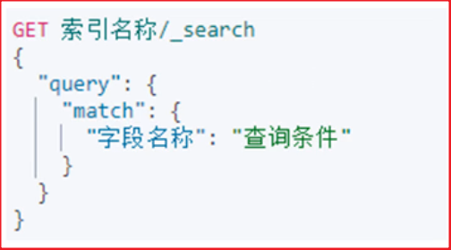 

```
# match查询
GET goods/_search
{
  "query": {
    "match": {
      "title": "华为手机"
    }
  },
  "size": 500
}
```


match 的默认搜索（or 并集）

例如：华为手机，会分词为 “华为”，“手机” 只要出现其中一个词条都会搜索到

match的 and（交集） 搜索

例如：例如：华为手机，会分词为 “华为”，“手机”  但要求“华为”，和“手机”同时出现在词条中

 

```shell
GET goods/_search
{
  "query": {
    "match": {
      "title": {
        "query": "华为手机",
        "operator": "and"
      }
    }
  }
}
```


#### 3.3JavaAPI

**步骤**

1. 创建SearchRequest对象
2. 创建查询条件构建器SearchSourceBuilder
3. 构建查询条件对象QueryBuilder
4. 调用search()方法
5. 处理结果

**实现**

```
    //mathQuery 匹配查询 对于查询条件进行分词
    @Test
    public void fun05() throws IOException {
        //1. 创建SearchRequest对象
        SearchRequest searchRequest = new SearchRequest("goods");
        //2. 创建查询条件构建器SearchSourceBuilder
        SearchSourceBuilder searchSourceBuilder = new SearchSourceBuilder();
        //3. 构建查询条件对象QueryBuilder
        MatchQueryBuilder matchQueryBuilder = QueryBuilders.matchQuery("title", "华为手机").operator(Operator.AND);
        searchSourceBuilder.query(matchQueryBuilder);
        searchRequest.source(searchSourceBuilder);

        //4. 调用search()方法
        SearchResponse response = client.search(searchRequest, RequestOptions.DEFAULT);
        //5. 处理结果
        SearchHits hits = response.getHits();
        //5.1 获取命中的总数
        System.out.println("总记录数="+hits.getTotalHits().value);
        //5.2 获取数据
        List<Goods> goodsList = new ArrayList<Goods>();
        for (SearchHit hit : hits) {
            String data = hit.getSourceAsString();
            Goods goods = JSON.parseObject(data, Goods.class);
            goodsList.add(goods);
        }
        System.out.println(goodsList);
        client.close();
    }
```


### 4.总结

- term query会去倒排索引中寻找确切的term，它并不知道分词器的存在。这种查询适合**keyword** 、**numeric**、**date**
- match query知道分词器的存在。并且理解是如何被分词的


## 知识点-模糊查询

### 1.目标

- [ ] 掌握模糊查询查询

### 2.路径

1. 模糊查询概述
2. 脚本实现
3. JavaAPI实现

### 3.讲解

#### 3.1概述

+ wildcard查询：会对查询条件进行分词。还可以使用通配符 ?（任意单个字符） 和 * （0个或多个字符）
+ regexp查询：正则查询
+ prefix查询：前缀查询  

#### 3.2脚本

##### 3.2.1-wildcard查询

+ wildcard查询：会对查询条件进行分词。还可以使用通配符 ?（任意单个字符） 和  * （0个或多个字符）

 

```
"*华*"  包含华字的
"华*"   华字后边0个或多个字符
"华?"  华字后边1个字符
"*华"或"?华" 会引发全表（全索引）扫描 注意效率问题
```

+ 示例

```json
# wildcard 查询。查询条件分词，模糊查询
GET goods/_search
{
  "query": {
    "wildcard": {
      "title": {
        "value": "华*"
      }
    }
  }
}
```

##### 3.2.2正则查询

+ regexp查询：正则查询

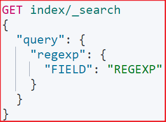 

| **符号**    | **作用**                           |
| ----------- | ---------------------------------- |
| \d          | 数字                               |
| \D          | 非数字                             |
| \w          | 单词：a-zA-Z0-9_                   |
| \W          | 非单词                             |
| .           | 通配符，匹配任意字符               |
| {n}         | 匹配n次                            |
| {n,}        | 大于或等于n次                      |
| {n,m}       | 在n次和m次之间                     |
| +           | 1~n次                              |
| *           | 0~n次                              |
| ?           | 0~1次                              |
| ^           | 匹配开头                           |
| $           | 匹配结尾                           |
| [a-zA-Z]    | 英文字母                           |
| [a-zA-Z0-9] | 英文字母和数字                     |
| [*xyz*]     | 字符集合, 匹配所包含的任意一个字符 |

正则查询取决于正则表达式的效率

+ 示例

```
GET goods/_search
{
  "query": {
    "regexp": {
      "title": "n[0-9].+"
    }
  }
}
```

##### 3.2.3前缀查询

+   prefix查询：前缀查询   对keyword类型支持比较好

```json
#前缀查询
GET goods/_search
{
  "query": {
    "prefix": {
      "brandName": {
        "value": "华"
      }
    }
  }
}
```

#### 3.3JavaAPI 

```java
//模糊查询
WildcardQueryBuilder query = QueryBuilders.wildcardQuery("title", "华*");//华后多个字符
//正则查询
 RegexpQueryBuilder query = QueryBuilders.regexpQuery("title", "\\w+(.)*");
 //前缀查询
 PrefixQueryBuilder query = QueryBuilders.prefixQuery("brandName", "三");
```


## 知识点-范围&排序查询【重点】

### 1.目标

- [ ] 掌握范围&排序查询

### 2.路径

1. 范围&排序查询概述
2. 脚本实现
3. JavaAPI实现

### 3.讲解

#### 3.1概述

+ range :查找指定字段在指定范围内包含值  
+ sort: 排序查询

#### 3.2脚本 

+ 语法

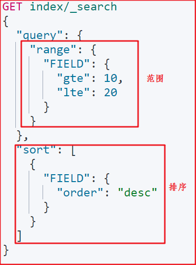 

+ 需求

  查询price在2000~3000之间的 并且按照价格降序

+ 示例

```json
# 范围查询

GET goods/_search
{
  "query": {
    "range": {
      "price": {
        "gte": 2000,
        "lte": 3000
      }
    }
  },
  "sort": [
    {
      "price": {
        "order": "desc"
      }
    }
  ]
}
```

#### 3.3JavaAPI

```java
 //范围查询 以price 价格为条件
RangeQueryBuilder query = QueryBuilders.rangeQuery("price");

//指定下限
query.gte(2000);
//指定上限
query.lte(3000);

sourceBuilder.query(query);

//排序  价格 降序排列
sourceBuilder.sort("price",SortOrder.DESC);
```


## 知识点-queryString查询【重点】

### 1.目标

- [ ] 掌握queryString查询

### 2.路径

1. queryString概述
2. 脚本实现
3. JavaAPI实现

### 3.讲解

#### 3.1概述

 	

+ 会对查询条件进行分词, 然后将分词后的查询条件和词条进行等值匹配,默认取并集
+ 可以指定多个查询字段

#### 3.2脚本

**语法**

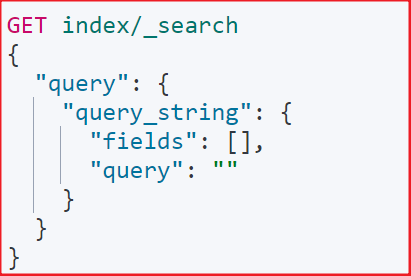 


query_string：识别query中的连接符（or 、and）

```
	# queryString

GET goods/_search
{
  "query": {
    "query_string": {
      "fields": ["title","categoryName","brandName"], 
      "query": "华为 AND 手机"  #查询title,categoryName,brandName里面包含华为手机的
    }
  }
}
```


simple_query_string：不识别query中的连接符（or 、and），查询时会将 “华为”、"and"、“手机”分别进行查询

```
GET goods/_search
{
  "query": {
    "simple_query_string": {
      "fields": ["title","categoryName","brandName"], 
      "query": "华为 AND 手机"
    }
  }
}
```


#### 3.3JavaAPI

+ 需求

  从title, categoryName,brandName三个字段里面搜索华为

+ 实现

```java
QueryStringQueryBuilder query = QueryBuilders.queryStringQuery("华为手机").field("title").field("categoryName")
.field("brandName").defaultOperator(Operator.AND);
```


注意：query中的or   and 是查询时 匹配条件是否同时出现----or 出现一个即可，and 两个条件同时出现


## 知识点-布尔查询【重点】

### 1.目标

- [ ] 掌握布尔查询

### 2.路径

1. 布尔查询概述
2. 脚本实现
3. JavaAPI实现

### 3.讲解

#### 3.1概述

boolQuery：对多个查询条件连接。

连接方式：

+ must（and）：条件必须成立
+ must_not（not）：条件必须不成立
+ should（or）：条件可以成立
+ filter：条件必须成立，性能比must高。不会计算得分

**得分:**即条件匹配度,匹配度越高，得分越高

#### 3.2脚本

**需求**

+ 查询华为的品牌的手机, 并且价格在2000~3000之间

**语法**

 

**实现**

```json 
#7.boolean查询
#需求:查询华为的品牌的手机, 并且价格在2000~3000之间
GET goods/_search
{
  "query": {
    "bool": {
      "must": [
        {
          "term": {
            "brandName": {
              "value": "华为"
            }
          }
        }
      ],
      "filter": [
        {
          "match": {
            "title": "手机"
          }
        },
        {
          "range": {
            "price": {
              "gte": 2000,
              "lte": 3000
            }
          }
        }
        ]
    }
  }
}
```

#### 3.3JavaAPI

**需求**

1. 查询品牌名称为:华为 
2. 查询标题包含：手机
3. 查询价格在：2000-3000 

**实现**

must 、filter为连接方式

term、match为不同的查询方式

```java
        BoolQueryBuilder boolQueryBuilder = QueryBuilders.boolQuery();

        TermQueryBuilder termQueryBuilder = QueryBuilders.termQuery("brandName", "华为");
        MatchQueryBuilder matchQueryBuilder = QueryBuilders.matchQuery("title", "手机");
        RangeQueryBuilder rangeQueryBuilder = QueryBuilders.rangeQuery("price").gte(2000).lte(3000);


        boolQueryBuilder.filter(termQueryBuilder);
        boolQueryBuilder.filter(matchQueryBuilder);
        boolQueryBuilder.filter(rangeQueryBuilder);

        searchSourceBuilder.query(boolQueryBuilder);
        searchRequest.source(searchSourceBuilder);
```


## 知识点-聚合查询

### 1.目标

- [ ] 掌握聚合查询

### 2.路径

1. 聚合查询概述
2. 脚本实现
3. JavaAPI实现

### 3.讲解

#### 3.1概述

+ 指标聚合：相当于MySQL的聚合函数。max、min、avg、sum等
+ 桶聚合：相当于MySQL的 group by 操作。不要对==text类型的数据进行分组==，会失败。

#### 3.2脚本

##### 3.2.1指标聚合

**语法**

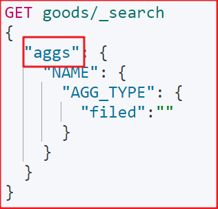  

**需求**

+ 统计出title=手机的最大价格

**实现**

```json
#8.统计出title=手机的最大价格 指标聚合
GET goods/_search
{
  "query": {
    "match": {
      "title": "手机"
    }
  },
  "aggs": {
    "max_price": {
      "max": {
        "field": "price"
      }
    }
  }
}
```

##### 3.2.2桶聚合【重点】

**语法**

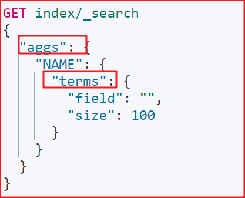 

**需求**

+ 查询title包含手机的数据的品牌列表

**实现**

```shell
#8.2 聚合桶聚合 查询title包含手机的数据的品牌列表
GET goods/_search
{
  "query": {
    "match": {
      "title": "手机"
    }
  },
  "aggs": {
    "goods_brands": {
      "terms": {
        "field": "brandName",
        "size": 100
      }
    }
  }
}
```


#### 3.3JavaAPI 

**需求**

1. 查询title包含手机的数据的品牌列表

**实现**

```java 
    //聚合查询 查询title包含手机的数据的品牌列表
    @Test
    public void fun10() throws IOException {
        //1. 创建SearchRequest对象
        SearchRequest searchRequest = new SearchRequest("goods");
        //2. 创建查询条件构建器SearchSourceBuilder
        SearchSourceBuilder searchSourceBuilder = new SearchSourceBuilder();
        //3. 构建查询条件对象QueryBuilder
        MatchQueryBuilder matchQueryBuilder = QueryBuilders.matchQuery("title", "手机");
        searchSourceBuilder.query(matchQueryBuilder);


        AggregationBuilder aggregationBuilder = AggregationBuilders.terms("goods_brands").field("brandName").size(100);
        searchSourceBuilder.aggregation(aggregationBuilder);

        searchRequest.source(searchSourceBuilder);


        //4. 调用search()方法
        SearchResponse response = client.search(searchRequest, RequestOptions.DEFAULT);
        //5. 处理结果
        SearchHits hits = response.getHits();
        //5.1 获取命中的总数
        System.out.println("总记录数=" + hits.getTotalHits().value);
        //5.2 获取数据
        List<Goods> goodsList = new ArrayList<Goods>();
        for (SearchHit hit : hits) {
            String data = hit.getSourceAsString();
            Goods goods = JSON.parseObject(data, Goods.class);
            goodsList.add(goods);
        }
        System.out.println(goodsList);

        //6.获取aggregations
        Aggregations aggregations = response.getAggregations();
        Map<String, Aggregation> aggregationMap = aggregations.asMap();
        Terms terms = (Terms) aggregationMap.get("goods_brands");
        List<? extends Terms.Bucket> buckets = terms.getBuckets();
        for (Terms.Bucket bucket : buckets) {
            System.out.println(bucket.getKey()+":"+bucket.getDocCount());
        }

        client.close();
    }
```


## 知识点-高亮查询【重点】

### 1.目标

- [ ] 掌握高亮查询

### 2.路径

1. 高亮查询概述
2. 脚本实现
3. JavaAPI实现

### 3.讲解

#### 3.1概述

在进行关键字搜索时，搜索出的内容中的关键字会显示不同的颜色，称之为高亮

+ 百度搜索关键字"传智播客"

​    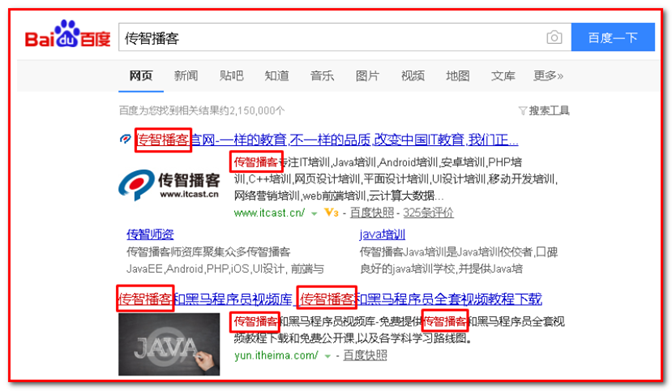

+ 京东商城搜索"笔记本"

   

+ 在百度搜索"elasticsearch",查看页面源码分析

   

   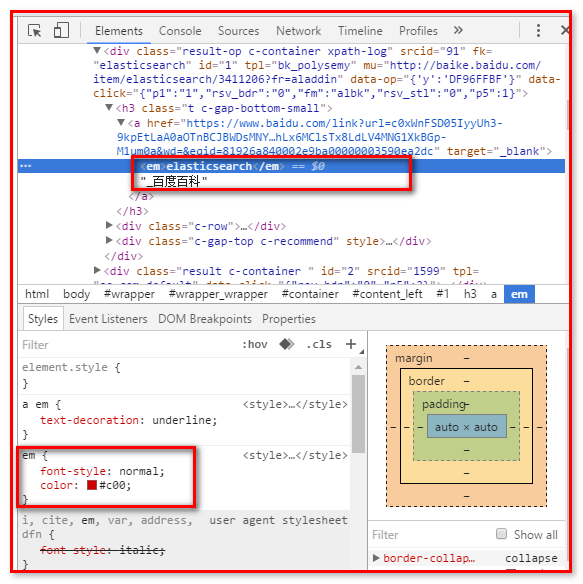

  

高亮三要素：

+ 高亮字段
+ 前缀
+ 后缀

#### 3.2脚本

默认前后缀 ：em

```html
<em>手机</em>
```

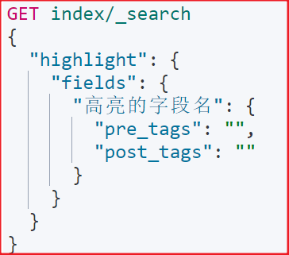 

```json
GET goods/_search
{
  "query": {
    "match": {
      "title": "电视"
    }
  },
  "highlight": {
    "fields": {
      "title": {
        "pre_tags": "<font color='red'>",
        "post_tags": "</font>"
      }
    }
  }
}
```


#### 3.3JavaAPI

  实施步骤：

1. 设置高亮(高亮字段,前缀, 后缀)
2. 将高亮了的字段数据，替换原有数据

代码实现:

```java
    //高亮查询
    @Test
    public void fun11() throws IOException {
        //1. 创建SearchRequest对象
        SearchRequest searchRequest = new SearchRequest("goods");
        //2. 创建查询条件构建器SearchSourceBuilder
        SearchSourceBuilder searchSourceBuilder = new SearchSourceBuilder();
        //3. 构建查询条件对象QueryBuilder
        MatchQueryBuilder matchQueryBuilder = QueryBuilders.matchQuery("title", "手机");
        searchSourceBuilder.query(matchQueryBuilder);

        //4.构建高亮
        HighlightBuilder highlightBuilder = new HighlightBuilder();
        highlightBuilder.field("title").preTags("<em>").postTags("</em>");
        searchSourceBuilder.highlighter(highlightBuilder);


        searchRequest.source(searchSourceBuilder);


        //4. 调用search()方法
        SearchResponse response = client.search(searchRequest, RequestOptions.DEFAULT);
        //5. 处理结果
        SearchHits hits = response.getHits();
        //5.1 获取命中的总数
        System.out.println("总记录数=" + hits.getTotalHits().value);
        //5.2 获取数据
        List<Goods> goodsList = new ArrayList<Goods>();
        for (SearchHit hit : hits) {
            String data = hit.getSourceAsString();
            Goods goods = JSON.parseObject(data, Goods.class);

            //5.3处理高亮
            Map<String, HighlightField> highlightFields = hit.getHighlightFields();
            HighlightField highlightField = highlightFields.get("title");
            goods.setTitle(highlightField.getFragments()[0].toString());

            goodsList.add(goods);
        }
        System.out.println(goodsList);


        client.close();
    }
```


# 第三章-重建索引&索引别名

## 知识点-重建索引&索引别名【了解】

### 1.目标

- [ ] 掌握重建索引和索引别名的使用

### 2.路径

1. 为什么要重建索引
2. 重建索引实操
3. 索引别名实操

### 3.讲解

#### 3.1为什么要重建索引

​	随着业务需求的变更，索引的结构可能发生改变。ElasticSearch的索引一旦创建，==只允许添加字段，不允许改变字段==。因为改变字段，需要重建倒排索引，影响内部缓存结构，性能太低。
​	那么此时，就需要重建一个新的索引，并将原有索引的数据导入到新索引中。

​	 

#### 3.2重建索引实操

##### 3.2.1需求

把student_index_v1索引库迁移到student_index_v2

##### 3.2.2语法

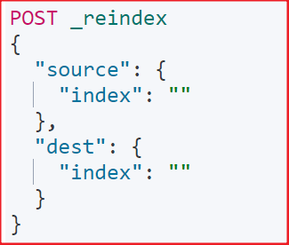 

##### 3.2.3实操

1.新建student_index_v1索引

```json
# -------重建索引-----------

# 新建student_index_v1。索引名称必须全部小写

PUT student_index_v1
{
  "mappings": {
    "properties": {
      "birthday":{
        "type": "date"
      }
    }
  }
}
#查看 student_index_v1 结构
GET student_index_v1
#添加数据
PUT student_index_v1/_doc/1
{
  "birthday":"1999-11-11"
}
#查看数据
GET student_index_v1/_search

#添加数据
PUT student_index_v1/_doc/2
{
  "birthday":"1999年11月11日"
}
```

2.重建索引:将student_index_v1 数据拷贝到 student_index_v2

```json
# 业务变更了，需要改变birthday字段的类型为text

# 1. 创建新的索引 student_index_v2
# 2. 将student_index_v1 数据拷贝到 student_index_v2

# 创建新的索引 student_index_v2
PUT student_index_v2
{
  "mappings": {
    "properties": {
      "birthday":{
        "type": "text"
      }
    }
  }
}
# 将student_index_v1 数据拷贝到 student_index_v2
# _reindex 拷贝数据
POST _reindex
{
  "source": {
    "index": "student_index_v1"
  },
  "dest": {
    "index": "student_index_v2"
  }
}

GET student_index_v2/_search


PUT student_index_v2/_doc/2
{
  "birthday":"1999年11月11日"
}

```

#### 3.3索引别名实操

##### 3.3.1重建索引后的问题

重建索引后，代码中还是使用的老索引在操作ElasticSearch，需要操作新的索引。

1. 改代码（不推荐）
2. 使用别名（推荐）

##### 3.2.2语法

```
PUT 索引名/_alias/别名
```

##### 3.2.3实现

```json
# 步骤：
# 0. 先删除student_index_v1
# 1. 给student_index_v2起个别名 student_index_v1
DELETE student_index_v1
PUT student_index_v2/_alias/student_index_v1

```

注意：DELETE student_index_v1 这一操作将删除student_index_v1索引库，并不是删除别名


JavaAPI: https://www.elastic.co/guide/en/elasticsearch/client/java-rest/7.4/java-rest-high.html

DSL: https://www.elastic.co/guide/en/elasticsearch/reference/7.4/search-search.html?baymax=rec&rogue=pop-1&elektra=docs


# 总结

## 1.批量操作

+ 一般用在==第一次== 数据库和索引库的数据同步的时候
+ 数据同步

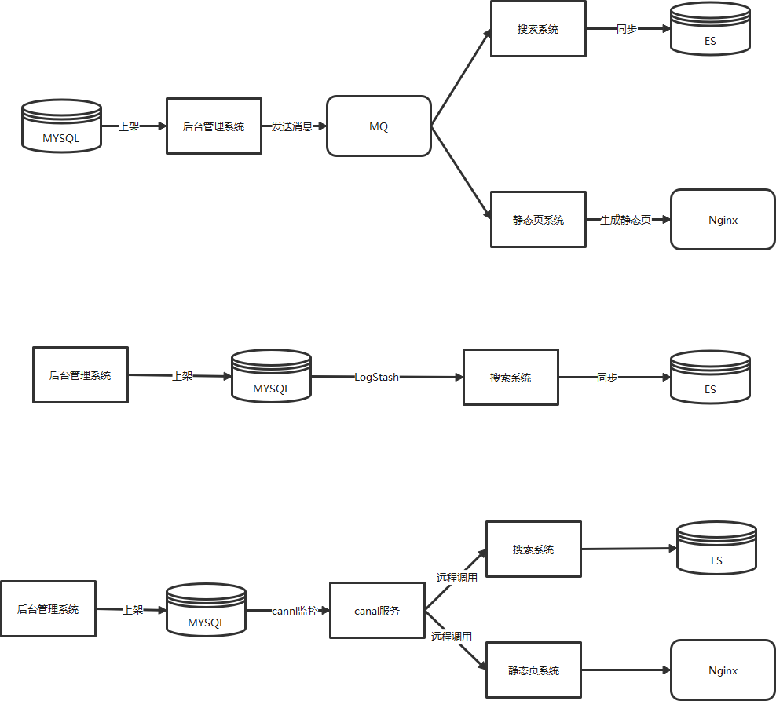

## 2.查询【重点】

+ 标了重点最低2遍

