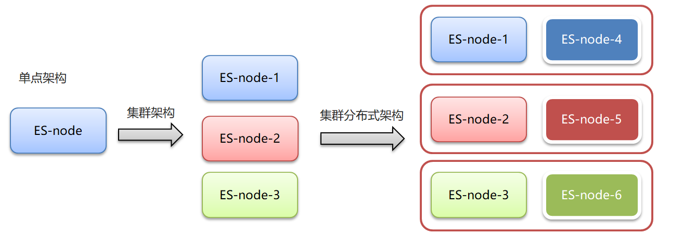
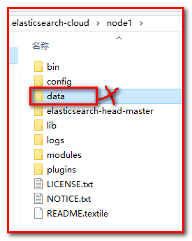
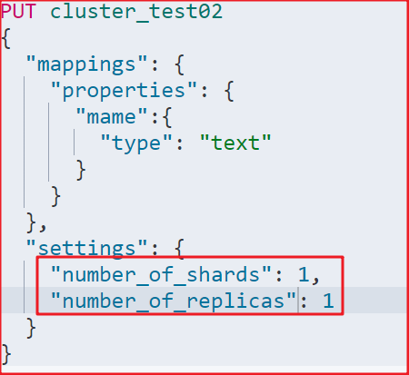
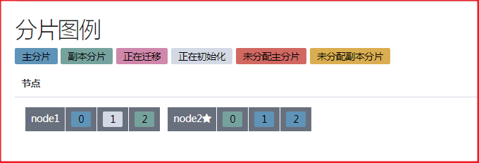
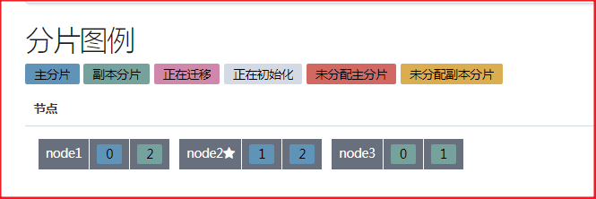
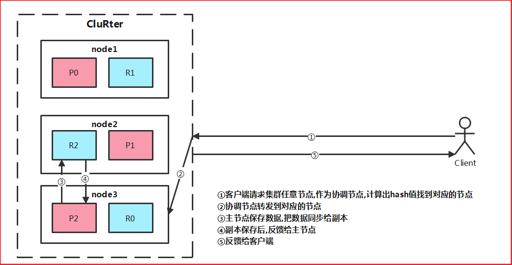

# 扩展-ElasticSearch

## 知识点-集群介绍

### 1.目标

- [ ] 掌握集群和分布式的区别以及ES集群相关的概念

### 2.路径

1. 集群的概念
2. 集群和分布式的区别
3. ES集群相关的概念

### 3.讲解

#### 3.1什么是集群

​	集群是一种计算机系统， 它通过一组松散集成的计算机软件和/或硬件连接起来高度紧密地协作完成计算工作。在某种意义上，他们可以被看作是一台计算机。集群系统中的单个计算机通常称为节点，通常通过局域网连接，但也有其它的可能连接方式。集群计算机通常用来改进单个计算机的计算速度和/或可靠性。一般情况下集群计算机比单个计算机，比如工作站或超级计算机性能价格比要高得多。

**特点**

+ 可扩展性：集群的性能不限制于单一的服务实体，新的服务实体可以动态的添加到集群，从而增强集群的性能。

+ 高可用性：集群当其中一个节点发生故障时，这台节点上面所运行的应用程序将在另一台节点被自动接管，消除单点故障对于增强数据可用性、可达性和可靠性是非常重要的。

**两大能力**

+ 负载均衡：负载均衡把任务比较均匀的分布到集群环境下的计算和网络资源，以提高数据吞吐量。
+  错误恢复：如果集群中的某一台服务器由于故障或者维护需要无法使用，资源和应用程序将转移到可用的集群节点上。这种由于某个节点的资源不能工作，另一个可用节点中的资源能够透明的接管并继续完成任务的过程，叫做错误恢复。

#### 3.2集群和分布式的区别

​	说到集群，可能大家会立刻联想到另一个和它很相近的一个词----“分布式”。那么集群和分布式是一回事吗？有什么联系和区别呢?

+ 相同点：

  分布式和集群都是需要有很多节点服务器通过网络协同工作完成整体的任务目标。

+ 不同点：

  分布式是指将业务系统进行拆分，即分布式的每一个节点都是实现不同的功能。而集群每个节点做的是同一件事情。

+ 例子:

  +  这样古代乐队的图就属于集群

     

  + 而现代乐队这样图就是分布式

     


- 集群和分布式架构往往是并存的



#### 3.3ES集群相关的概念

##### 3.3.1集群 cluster

​	一个集群就是由一个或多个节点组织在一起，它们共同持有整个的数据，并一起提供索引和搜索功能。一个集群由一个唯一的名字标识，这个名字默认就是“elasticsearch”。这个名字是重要的，因为一个节点只能通过指定某个集群的名字，来加入这个集群

##### 3.1.2节点 node

​	一个节点是集群中的一个服务器，作为集群的一部分，它存储数据，参与集群的索引和搜索功能。和集群类似，一个节点也是由一个名字来标识的，默认情况下，这个名字是一个随机的漫威漫画角色的名字，这个名字会在启动的时候赋予节点。这个名字对于管理工作来说挺重要的，因为在这个管理过程中，你会去确定网络中的哪些服务器对应于Elasticsearch集群中的哪些节点。

​	一个节点可以通过配置集群名称的方式来加入一个指定的集群。默认情况下，每个节点都会被安排加入到一个叫做“elasticsearch”的集群中，这意味着，如果你在你的网络中启动了若干个节点，并假定它们能够相互发现彼此，它们将会自动地形成并加入到一个叫做“elasticsearch”的集群中。

​	在一个集群里，只要你想，可以拥有任意多个节点。而且，如果当前你的网络中没有运行任何Elasticsearch节点，这时启动一个节点，会默认创建并加入一个叫做“elasticsearch”的集群。

##### 3.1.3分片和复制 shards&replicas

​	一个索引可以存储超出单个结点硬件限制的大量数据。比如，一个具有10亿文档的索引占据1TB的磁盘空间，而任一节点都没有这样大的磁盘空间；或者单个节点处理搜索请求，响应太慢。为了解决这个问题，Elasticsearch提供了将索引划分成多份的能力，这些份就叫做分片。当你创建一个索引的时候，你可以指定你想要的分片的数量。每个分片本身也是一个功能完善并且独立的“索引”，这个“索引”可以被放置到集群中的任何节点上。分片很重要，主要有两方面的原因： 1）允许你水平分割/扩展你的内容容量。 2）允许你在分片（潜在地，位于多个节点上）之上进行分布式的、并行的操作，进而提高性能/吞吐量。

​	至于一个分片怎样分布，它的文档怎样聚合回搜索请求，是完全由Elasticsearch管理的，对于作为用户的你来说，这些都是透明的。

​	在一个网络/云的环境里，失败随时都可能发生，在某个分片/节点不知怎么的就处于离线状态，或者由于任何原因消失了，这种情况下，有一个故障转移机制是非常有用并且是强烈推荐的。为此目的，Elasticsearch允许你创建分片的一份或多份拷贝，这些拷贝叫做复制分片，或者直接叫复制。

​	复制之所以重要，有两个主要原因：在分片/节点失败的情况下，提供了高可用性。因为这个原因，注意到复制分片从不与原/主要（original/primary）分片置于同一节点上是非常重要的。扩展你的搜索量/吞吐量，因为搜索可以在所有的复制上并行运行。总之，每个索引可以被分成多个分片。一个索引也可以被复制0次（意思是没有复制）或多次。一旦复制了，每个索引就有了主分片（作为复制源的原来的分片）和复制分片（主分片的拷贝）之别。分片和复制的数量可以在索引创建的时候指定。在索引创建之后，你可以在任何时候动态地改变复制的数量，但是你事后不能改变分片的数量。

​	默认情况下，Elasticsearch中的每个索引被分片5个主分片和1个复制，这意味着，如果你的集群中至少有两个节点，你的索引将会有5个主分片和另外5个复制分片（1个完全拷贝），这样的话每个索引总共就有10个分片。


使用Kibana的时候, 用DSL语句创建索引的时候: 默认是1个分片,1个复制

使用Head插件客户端的创建索引的时候: 默认是5个分片,1个复制


### 4.小结

## 实操-ES集群的搭建

### 1.目标

- [ ] 掌握ES集群的搭建

### 2.步骤

1. 准备三台elasticsearch服务器
2.  修改每台服务器配置
3. 启动各个节点服务器
4. kibina管理集群


### 3.讲解

#### 3.1准备三台elasticsearch服务器

创建elasticsearch-cluster文件夹，在内部复制三个elasticsearch服务


#### 3.2 修改每台服务器配置

修改elasticsearch-cluster\node*\config\elasticsearch.yml配置文件

+ node1节点

```yaml
#集群名称
cluster.name: my-es
#节点名称
node.name: node1 
#是不是有资格主节点
node.master: true
#是否存储数据
node.data: true
#最大集群节点数
node.max_local_storage_nodes: 3 
#ip地址
network.host: 0.0.0.0
#端口
http.port: 9201
#内部节点之间沟通端口
transport.tcp.port: 9700
#es7.x 之后新增的配置，节点发现
discovery.seed_hosts: ["localhost:9700","localhost:9800","localhost:9900"]
#es7.x 之后新增的配置，初始化一个新的集群时需要此配置来选举master
cluster.initial_master_nodes: ["node1", "node2","node3"] 
#数据和存储路径
#path.data: ../data
#path.logs: ../logs
```

+ node2节点

```yaml
#集群名称
cluster.name: my-es
#节点名称
node.name: node2 
#是不是有资格主节点
node.master: true
#是否存储数据
node.data: true
#最大集群节点数
node.max_local_storage_nodes: 3 
#ip地址
network.host: 0.0.0.0
#端口
http.port: 9202
#内部节点之间沟通端口
transport.tcp.port: 9800
#es7.x 之后新增的配置，节点发现
discovery.seed_hosts: ["localhost:9700","localhost:9800","localhost:9900"]
#es7.x 之后新增的配置，初始化一个新的集群时需要此配置来选举master
cluster.initial_master_nodes: ["node1", "node2","node3"] 
#数据和存储路径
#path.data: /opt/data
#path.logs: /opt/logs
```

+ node3节点

```yaml
#集群名称
cluster.name: my-es
#节点名称
node.name: node3 
#是不是有资格主节点
node.master: true
#是否存储数据
node.data: true
#最大集群节点数
node.max_local_storage_nodes: 3 
#ip地址
network.host: 0.0.0.0
#端口
http.port: 9203
#内部节点之间沟通端口
transport.tcp.port: 9900
#es7.x 之后新增的配置，节点发现
discovery.seed_hosts: ["localhost:9700","localhost:9800","localhost:9900"]
#es7.x 之后新增的配置，初始化一个新的集群时需要此配置来选举master
cluster.initial_master_nodes: ["node1", "node2","node3"] 
#数据和存储路径
#path.data: /opt/data
#path.logs: /opt/logs
```

==注意：这里需要先删除node1，node2，node3的data文件，防止数据冲突==

 

#### 3.3启动各个节点服务器

双击elasticsearch-cluster\node*\bin\elasticsearch.bat

+ 启动节点1


+ 启动节点2

  

+ 启动节点3

  


#### 3.4.kibina管理集群

 

```shell
vim  kibana-7.4.0-linux-x86_64-cluster/config/kibana.yml
```

kibana.yml

```yaml
i18n.locale: "zh-CN"
elasticsearch.hosts: ["http://localhost:9201","http://localhost:9202","http://localhost:9203"]
```


## 知识点-分片配置和路由原理

### 1.目标

- [ ] 掌握分片配置路由原理

### 2.路径

1. 分片配置
   + 手动进行分片
   + 分片特点
   + 索引分片推荐配置方案
2. 路由原理
   + 什么是路由
   + 路由算法

### 3.讲解

#### 3.1分片配置

##### 3.1.1手动进行分片

​	在创建索引时，如果不指定分片配置，则默认主分片1，副本分片1。

​	在创建索引时，可以通过settings设置分片:

  

```
PUT cluster02
{
  "mappings": {
    "properties": {
      "name":{
        "type": "text"
      }
    }
  },
  "settings": {
    "number_of_shards": 3,
    "number_of_replicas": 1
  }
}
```


##### 3.1.2分片特点

 


+ 分片与自平衡：当节点挂掉后，挂掉的节点分片会自平衡到其他节点中

  + 三个节点正常运行（0、1、2分片标号）

   

  + node3 挂掉

   

  

  + 将挂掉节点的分片，自平衡到其他节点

   

  + node3 恢复正常后，节点分片将自平衡回去（并不一定是原来的分片）

   

+ 在Elasticsearch 中，每个查询在每个分片的单个线程中执行，但是，可以并行处理多个分片。

+ ==分片数量一旦确定好，不能修改。==

##### 3.1.3索引分片推荐配置方案

+ 每个分片推荐大小10-30GB
+ 分片数量推荐 = 节点数量 * 1~3倍

比如有1000GB数据，应该有多少个分片？多少个节点?
40个分片	20个节点  

#### 3.2路由原理

##### 3.2.1什么是路由

​	一个index(索引)的数据会被分为多个shard(分片)中。所以说一个document，只能存在于一个shard中。当客户端创建document的时候，es此时就需要决定这个document是放在这个index的哪个shard上。这个过程,就称之为document routing，即数据路由。

##### 3.2.2路由算法

```
shard_index = hash(id) % number_of_primary_shards(主片的数量不算副本)  3
```


### 4.小结


## ElasticSearch 集群读写原理

### 1.目标

- [ ] 掌握ElasticSearch 集群读写流程

### 2.路径

1. 写流程
2. 读流程

### 3.讲解

#### 3.1写流程

 

①客户端请求集群任意节点,作为协调节点,计算出hash值找到对应的节点

②协调节点转发到对应的节点

③主节点保存数据,把数据同步给副本

④副本保存后,反馈给主节点

⑤反馈给客户端

写是先写到主片, 再同步给副本

#### 3.2读流程

  

①客户端请求集群任意节点,作为协调节点,计算出hash值找到所有的对应的节点(主从)

②以轮询负载均衡算法,转给对应的节点

③节点返回查询的结果,将结果反馈给客户端

主片和副本都会工作, 在读的流程里面 主片和副本是同级的

### 4.小结


## 知识点-脑裂

### 1.目标

- [ ] 掌握怎么避免脑裂

### 2.路径

1. 什么是脑裂现象
2. 脑裂产生的原因
3. 避免脑裂

### 3.讲解

#### 3.1什么是脑裂现象

+ ElasticSearch 集群正常状态

  ​	 一个正常es集群中只有一个主节点（Master），主节点负责管理整个集群。如创建或删除索引，跟踪哪些节点是群集的一部分，并决定哪些分片分配给相关的节点。集群的所有节点都会选择同一个节点作为主节点。

+ 脑裂

  ​	脑裂问题的出现就是因为从节点在选择主节点上出现分歧导致一个集群出现多个主节点从而使集群分裂，使得集群处于异常状态。


#### 3.2脑裂产生的原因

1. 网络原因：网络延迟
   + 一般es集群会在内网部署，也可能在外网部署，比如阿里云。
   + 内网一般不会出现此问题，外网的网络出现问题的可能性大些。

2. 节点负载
   + 主节点的角色既为master又为data。数据访问量较大时，可能会导致Master节点停止响应（假死状态）。

​	       

3. JVM内存回收
   + 当Master节点设置的JVM内存较小时，引发JVM的大规模内存回收，造成ES进程失去响应。

#### 3.3避免脑裂

1. 网络原因：discovery.zen.ping.timeout 超时时间配置大一点。默认是3S

2. 节点负载：角色分离策略

   + 候选主节点配置为

   ```
   node.master: true
   node.data: false
   ```

   + 数据节点配置为

   ```
   node.master: false
   node.data: true
   ```

3. JVM内存回收：修改 config/jvm.options 文件的 -Xms 和 -Xmx 为服务器的内存一半。

### 4.小结

## 知识点-JavaAPI 访问集群

### 1.目标

- [ ] 掌握JavaAPI访问集群

### 2.步骤

1. application.yml统计阶段信息
2. 创建ElasticSearchConfig
3. 编写Java代码操作

### 3.讲解

#### 3.1准备cluster_test索引

```
PUT cluster_test
{
  "mappings": {
    "properties": {
      "name":{
        "type": "text"
      }
    }
  }
}

GET cluster_test
GET cluster_test/_search

POST /cluster_test/_doc/1
{
  "name":"张三"
}
```

#### 3.2实现

+ application.yml

```yaml
elasticsearch:
   host1: 127.0.0.1
   port1: 9201
   host2: 127.0.0.1
   port2: 9202
   host3: 127.0.0.1
   port3: 9203
```

+ ElasticSearchConfig

```java
package com.heima.es.config;

import org.apache.http.HttpHost;
import org.elasticsearch.client.RestClient;
import org.elasticsearch.client.RestHighLevelClient;
import org.springframework.beans.factory.annotation.Value;
import org.springframework.boot.context.properties.ConfigurationProperties;
import org.springframework.context.annotation.Bean;
import org.springframework.context.annotation.Configuration;

/**
 * @Description:
 * @author: yp
 */
@Configuration
@ConfigurationProperties(prefix = "elasticsearch")
public class ElasticSearchConfig02 {

    private String host1;

    private int port1;

    private String host2;

    private int port2;

    private String host3;

    private int port3;

    public String getHost1() {
        return host1;
    }

    public void setHost1(String host1) {
        this.host1 = host1;
    }

    public int getPort1() {
        return port1;
    }

    public void setPort1(int port1) {
        this.port1 = port1;
    }

    public String getHost2() {
        return host2;
    }

    public void setHost2(String host2) {
        this.host2 = host2;
    }

    public int getPort2() {
        return port2;
    }

    public void setPort2(int port2) {
        this.port2 = port2;
    }

    public String getHost3() {
        return host3;
    }

    public void setHost3(String host3) {
        this.host3 = host3;
    }

    public int getPort3() {
        return port3;
    }

    public void setPort3(int port3) {
        this.port3 = port3;
    }

    @Bean("clusterClient")
    public RestHighLevelClient clusterClient(){
        return new RestHighLevelClient(RestClient.builder(
                new HttpHost(host1,port1,"http"),
                new HttpHost(host2,port2,"http"),
                new HttpHost(host3,port3,"http")
        ));
    }
}

```

+ Java代码

```java
package com.heima.es.test;

import com.alibaba.fastjson.JSON;
import com.heima.es.EsApplication;
import com.heima.es.bean.Goods;
import com.heima.es.mapper.GoodsMapper;
import org.elasticsearch.action.bulk.BulkRequest;
import org.elasticsearch.action.bulk.BulkResponse;
import org.elasticsearch.action.delete.DeleteRequest;
import org.elasticsearch.action.index.IndexRequest;
import org.elasticsearch.action.search.SearchRequest;
import org.elasticsearch.action.search.SearchResponse;
import org.elasticsearch.action.update.UpdateRequest;
import org.elasticsearch.client.IndicesClient;
import org.elasticsearch.client.RequestOptions;
import org.elasticsearch.client.RestHighLevelClient;
import org.elasticsearch.client.indices.GetIndexRequest;
import org.elasticsearch.client.indices.GetIndexResponse;
import org.elasticsearch.common.xcontent.XContentType;
import org.elasticsearch.index.query.*;
import org.elasticsearch.search.SearchHit;
import org.elasticsearch.search.SearchHits;
import org.elasticsearch.search.aggregations.Aggregation;
import org.elasticsearch.search.aggregations.AggregationBuilder;
import org.elasticsearch.search.aggregations.AggregationBuilders;
import org.elasticsearch.search.aggregations.Aggregations;
import org.elasticsearch.search.aggregations.bucket.terms.Terms;
import org.elasticsearch.search.builder.SearchSourceBuilder;
import org.elasticsearch.search.fetch.subphase.highlight.HighlightBuilder;
import org.elasticsearch.search.fetch.subphase.highlight.HighlightField;
import org.elasticsearch.search.sort.SortOrder;
import org.junit.Test;
import org.junit.runner.RunWith;
import org.springframework.beans.factory.annotation.Autowired;
import org.springframework.boot.test.context.SpringBootTest;
import org.springframework.test.context.junit4.SpringRunner;

import javax.annotation.Resource;
import java.io.IOException;
import java.util.ArrayList;
import java.util.HashMap;
import java.util.List;
import java.util.Map;

/**
 * @Description: 集群的测试
 * @author: yp
 */
@SpringBootTest(classes = EsApplication.class)
@RunWith(SpringRunner.class)
public class EsTest03 {

    @Resource(name = "clusterClient")
    private RestHighLevelClient clusterClient;

    @Test
    public void fun01() throws IOException {
        IndicesClient indices = clusterClient.indices();
        GetIndexRequest getIndexRequest = new GetIndexRequest("cluster_test");
        GetIndexResponse response = indices.get(getIndexRequest, RequestOptions.DEFAULT);
        System.out.println(response.getMappings());


    }
}

```


### 4.小结

## ElasticSearch 集群-集群扩容

 按照集群搭建步骤再复制Es节点进行配置，参见ElasticSearch 集群-集群搭建.md