# SpringCloud-Day01

# 学习目标

- [ ] 理解微服务架构
- [ ] 能够理解SpringCloud是什么
- [ ] 能够理解nacos的作用
- [ ] 能够搭建nacos服务端
- [ ] 能够使用Ribbon负载均衡
- [ ] 了解nacos的服务发现注册原理

# 第一章-初识Spring Cloud

## 知识点- SpringCloud简介

### 1.目标

- [ ] 知道什么是SpringCloud

### 2.路径

1. 什么是SpringCloud

2. 为什么要学习SpringCloudAlibaba

3. 什么是SpringCloudAlibaba

4. SpringCloudAlibaba的作用

5. SpringCloudAlibaba的组件

### 3.讲解

#### 3.1SpringCloud介绍	

​	Spring Cloud 是==基于SpringBoot开发==的==一系列框架==的有序集合,把非常流行的微服务的技术整合到一起，提供一个简单易用(注解+起步依赖)的工具包给开发人员，提高开发效率；并隐藏和屏蔽掉复杂的分布式系统中开发的细节。

https://spring.io/projects/spring-cloud

+ Spring cloud 和dubbo对比

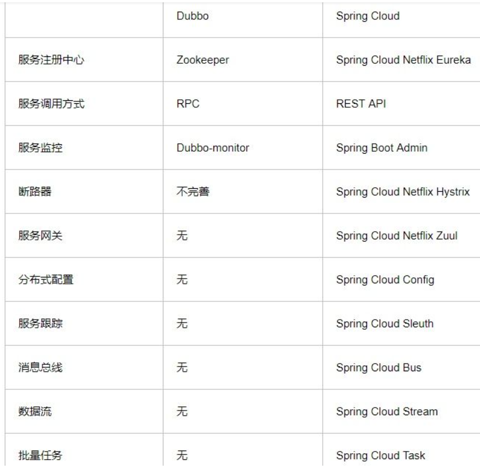


​	Dubbo只是实现了服务治理，而Spring Cloud下面有17个子项目（可能还会新增）分别覆盖了微服务架构下的方方面面，服务治理只是其中的一个方面，

​	SpringCloud抛弃了Dubbo的RPC通信，采用的是基于HTTP的REST方式。 严格来说，这两种方式各有优劣。虽然从一定程度上来说，后者牺牲了服务调用的性能，但也避免了上面提到的原生RPC带来的问题。而且REST相比RPC更为灵活，服务提供方和调用方的依赖只依靠一纸契约，不存在代码级别的强依赖，这在强调快速演化的微服务环境下，显得更加合适。

#### 3.2为什么要学习SpringCloudAlibaba

​		Spring Cloud Netflix项目进入维护模式，维护模式是：将模块置于维护模式意味着Spring Cloud团队将不再向该模块添加新功能。说简单一点：Spring Cloud停止更新了。

 


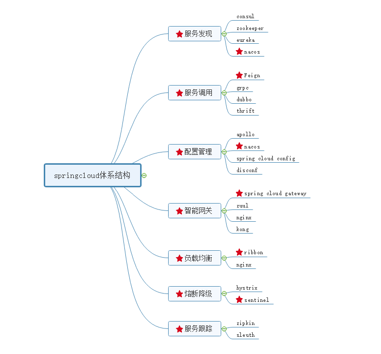 

#### 3.2什么是SpringCloudAlibaba

​	 Dubbo  			      阿里

​     Dubbox                   当当

​     SpringCloud            Spring,Netflix  

​      Dubbo                     阿里

   SpringCloud Alibaba Spring,  阿里


​	Spring Cloud Alibaba 致力于提供==微服务开发的一站式解决方案==。此项目包含开发分布式应用微服务的必需组件，方便开发者通过 Spring Cloud 编程模型轻松使用这些组件来开发分布式应用服务。

​	依托 Spring Cloud Alibaba，您只需要添加一些注解和少量配置，就可以将 Spring Cloud 应用接入阿里微服务解决方案，通过阿里中间件来迅速搭建分布式应用系统。

> Github: https://github.com/alibaba/spring-cloud-alibaba/blob/master/README-zh.md

> 官网：https://spring.io/projects/spring-cloud-alibaba#learn

#### 3.3SpringCloudAlibaba的作用

- **服务限流降级**：默认支持 WebServlet、WebFlux, OpenFeign、RestTemplate、Spring Cloud Gateway, Zuul, Dubbo 和 RocketMQ 限流降级功能的接入，可以在运行时通过控制台实时修改限流降级规则，还支持查看限流降级 Metrics 监控。
- **服务注册与发现**：适配 Spring Cloud 服务注册与发现标准，默认集成了 Ribbon 的支持。
- **分布式配置管理**：支持分布式系统中的外部化配置，配置更改时自动刷新。
- **消息驱动能力**：基于 Spring Cloud Stream 为微服务应用构建消息驱动能力。
- **分布式事务**：使用 @GlobalTransactional 注解， 高效并且对业务零侵入地解决分布式事务问题。。
- **阿里云对象存储**：阿里云提供的海量、安全、低成本、高可靠的云存储服务。支持在任何应用、任何时间、任何地点存储和访问任意类型的数据。
- **分布式任务调度**：提供秒级、精准、高可靠、高可用的定时（基于 Cron 表达式）任务调度服务。同时提供分布式的任务执行模型，如网格任务。网格任务支持海量子任务均匀分配到所有 Worker（schedulerx-client）上执行。
- **阿里云短信服务**：覆盖全球的短信服务，友好、高效、智能的互联化通讯能力，帮助企业迅速搭建客户触达通道。

#### 3.4SpringCloudAlibaba的组件

- Sentinel：把流量作为切入点，从流量控制、熔断降级、系统负载保护等多个维度保护服务的稳定性。
- Nacos：一个更易于构建云原生应用的动态服务发现、配置管理和服务管理平台。
- RocketMQ：一款开源的分布式消息系统，基于高可用分布式集群技术，提供低延时的、高可靠的消息发布与订阅服务。
- Dubbo：Apache Dubbo™ 是一款高性能 Java RPC 框架。
- Seata：阿里巴巴开源产品，一个易于使用的高性能微服务分布式事务解决方案。
- Alibaba Cloud ACM：一款在分布式架构环境中对应用配置进行集中管理和推送的应用配置中心产品。
- Alibaba Cloud OSS: 阿里云对象存储服务（Object Storage Service，简称 OSS），是阿里云提供的海量、安全、低成本、高可靠的云存储服务。您可以在任何应用、任何时间、任何地点存储和访问任意类型的数据。
- Alibaba Cloud SchedulerX: 阿里中间件团队开发的一款分布式任务调度产品，提供秒级、精准、高可靠、高可用的定时（基于 Cron 表达式）任务调度服务。
- Alibaba Cloud SMS: 覆盖全球的短信服务，友好、高效、智能的互联化通讯能力，帮助企业迅速搭建客户触达通道。

#### 3.5版本对应关系

`https://github.com/alibaba/spring-cloud-alibaba/wiki/%E7%89%88%E6%9C%AC%E8%AF%B4%E6%98%8E`

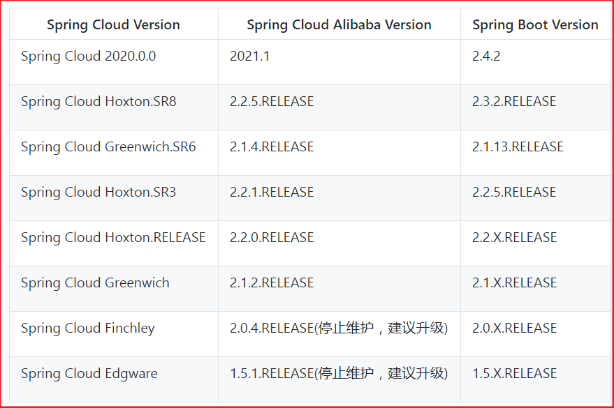 


### 4. 小结

1. SpringCloud

   Spring Cloud本身也是基于SpringBoot开发而来，SpringCloud是一系列框架的有序集合,也是把非常流行的微服务的技术整合到一起。

   dubbo本身只是众多分布式开发中解决问题的其中某一种方式（服务调用），而spring cloud 是一系列的有序集合。

2. SpringCloud和SpringCloudAlibaba

| 框架               | 注册中心  | 服务调用            | 配置中心  | 网关              | 总线      | 熔断         |
| ------------------ | --------- | ------------------- | --------- | ----------------- | --------- | ------------ |
| SpringCloud        | eureka    | feign,**openfeign** | config    | zuul,**gategway** | bus       | hystrix      |
| SpringCloudAlibaba | **nacos** | dubbo               | **nacos** |                   | **nacos** | **sentinel** |
| 其它               | zookeeper |                     |           |                   |           |              |

## 知识点-微服务架构介绍

### 1.目标

- [ ] 掌握微服务架构的特点

### 2.路径

1. 什么是微服务 
2. 微服务的SOA区别 
3. 微服务项目架构图

### 3.讲解

#### 3.1什么是微服务 【面试】

​	==微服务架构是一种架构模式或者说是一种架构风格，它提倡将单一应用程序划分成一组小的服务，每个服务运行在其独立的进程中，服务之间互相协调、互相配合，为用户提供最终价值====。服务之间采用轻量级的通信机制互相沟通（通常是基于HTTP的RESTful API）。==每个服务都围绕着具体业务进行构建，并且能够被独立地部署到生产环境、类生产环境等。另外，应尽量避免统一的、集中式的服务管理机制，对具体的一个服务而言，应根据业务上下文，选择合适的语言、工具对其进行构建，可以有一个非常轻量级的集中式管理来协调这些服务，可以使用不同的语言来编写服务，也可以使用不同的数据存储。

​	从开发角度来说: 微服务微的核心就是将传统的一站式应用，根据业务拆分成一个一个的服务，彻底解耦合,每一个微服务提供单个业务功能的服务，一个服务做一件事，从技术角度看就是一种小而独立的处理过程，类似进程概念==，能够自行单独启动,部署或销毁，拥有自己独立的数据库。==

> 微服务由马丁.福勒（Martin Fowler）最先提出来的, 论文网址 https://martinfowler.com/articles/microservices.html


#### 3.2微服务的SOA区别 

​	SOA和微服务的确是一脉相承的，大神Martin Fowler提出来这一概念可以说把==SOA的理念继续升华，精进了一步==。其核心思想是在应用开发领域，使用一系列微小服务来实现单个应用的方式途径，或者说微服务的目的是有效的拆分应用，实现敏捷开发和部署 ，可以是使用不同的编程语言编写。而SOA可能包含的意义更泛一些，更不准确一些。

| 功能     | SOA                  | 微服务                       |
| -------- | -------------------- | ---------------------------- |
| 组件大小 | 大块业务逻辑         | 单独任务或小块业务逻辑       |
| 耦合     | 通常松耦合           | 总是松耦合                   |
| 公司架构 | 任何类型             | 专注于功能交叉团队           |
| 管理     | 着重中央管理         | 着重分散管理                 |
| 目标     | 确保应用能够交互操作 | 执行新功能、快速拓展开发团队 |

==微服务比SOA的粒度更细==  

#### 3.3微服务项目架构图

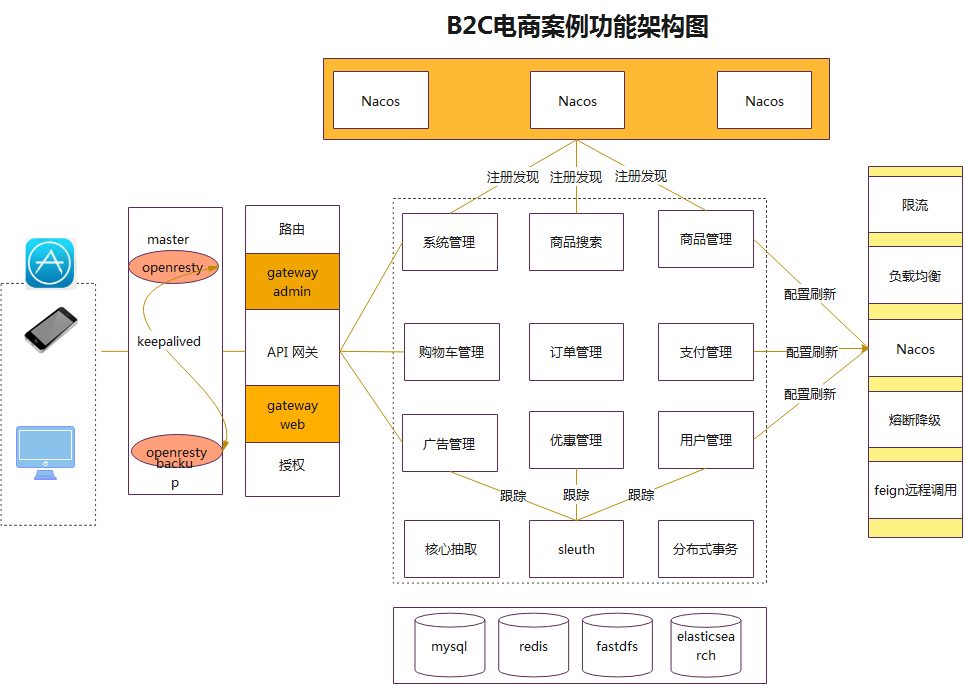 

1.手机app端等前端系统  请求通过openresty
2.openresty进行限流并将请求代理路由给了网关
3.网关进行智能路由到不同的子系统
4.各个子系统之间通过自动服务发现来进行微服务的调用 
5.各个子系统将自身进行注册给nacos注册中心
6.服务调用时候进行熔断降级，负载均衡，限流等操作 
7.数据存储到mysql等存储介质中

### 4.小结

微服务架构：就是将相关的功能独立出来，单独创建一个项目，并且连数据库也独立出来，单独创建对应的数据库。


## 知识点-http和RPC【面试】

### 1.目标

- [ ] 理解http和RPC的区别

### 2.路径

1. 什么是Http和RPC
2. Http和RPC相同点和不同点

### 3.讲解

#### 3.1什么是Http和RPC

​		常见的服务直接的调用一般采用==Http或者RPC==的方式。而RPC我们已经学过了，接下来我们简单说明下这两者的区别。无论是使用http还是RPC 我们的系统开发的目的基于以上的案例都需要实现远程调用。

+ RPC：Remote Produce Call远程过程调用，类似的还有RMI（Remote Methods Invoke 远程方法调用，是JAVA中的概念，是JAVA十三大技术之一）。==自定义数据格式==，基于原生==TCP通信==，速度快，效率高。早期的webService现在流行的DUBBO都是RPC的典型。

+ Http：http其实是一种网络传输协议，基于TCP，==规定了数据传输的格式==。现在客户端浏览器与服务端通信基本都是采用Http协议。也可以用来进行远程服务调用。缺点是==消息封装臃肿==。现在热门的Rest风格，就可以通过http协议来实现。

#### 3.2Http和RPC相同点和不同点

+ 相同点
  + 底层通讯都是基于socket，都可以实现远程调用，都可以实现服务调用服务

+ 不同点
  + RPC:   ==RPC属于传输层==，调用速度快、处理快，但是需要使用相同的RPC框架，需要相同的操作语言。不是协议
  + HTTP:  ==http属于应用层==，调用速度慢，但是处理时，遵循相同的数据格式即可，可以==跨语言和平台，通用性较强。==

+ 如何选择：
  + 微服务强调的是独立性，自治，灵活，所以此处我们选择使用http的方式实现远程调用。
  + 实现http的远程调用的技术有许多：feign httpclient restTemplate...等 我们先用restTemplate来使用讲解知识，等后面选型时最终定型为feign.

### 4.小结

1. RPC不是协议, 基于TCP, 属于传输层, 可以自定义数据格式,性能要高一些.  eg: Dubbo
2. HTTP是协议, 基于TCP, 属于应用层, 数据格式都规定好了, 性能没有RPC高. 通用性更强,   eg: SpringCloud


# 第二章-服务调用

## 案例-使用RestTemplate实现服务远程调用

### 1.需求

  

+ 用户通过发送请求到订单系统获取订单信息，并订单系统通过远程调用（有很多方式）获取商品系统中的商品信息。

### 2.分析

#### 2.1RestTemplate的介绍

​	RestTemplate 是spring家族中==一款基于http协议的组件==，他的**作用**就是：用来实现基于http的协议方式的服务之间的通信（也就是服务调用）。

`RestTemplate` 采用同步方式执行 HTTP 请求的类，底层使用 JDK 原生 `HttpURLConnection` API ，或者 `HttpComponents`等其他 HTTP 客户端请求类库。

简单理解：RestTemplate是spring提供的一个 用来模拟浏览器发送请求和接收响应的一个类。能实现远程调用。

#### 2.2步骤分析

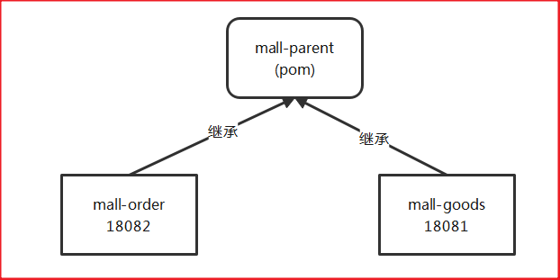 

1.创建父工程
2.创建订单微服务
3.创建商品微服务
4.实现远程调用

### 3.实现

#### 3.1创建父工程

 

+ 创建mall-parent

```xml
<?xml version="1.0" encoding="UTF-8"?>
<project xmlns="http://maven.apache.org/POM/4.0.0"
         xmlns:xsi="http://www.w3.org/2001/XMLSchema-instance"
         xsi:schemaLocation="http://maven.apache.org/POM/4.0.0 http://maven.apache.org/xsd/maven-4.0.0.xsd">
    <modelVersion>4.0.0</modelVersion>

    <groupId>com.itheima</groupId>
    <artifactId>mall-parent</artifactId>
    <version>1.0-SNAPSHOT</version>
    <modules>
        <module>mall-order</module>
        <module>mall-goods</module>
    </modules>
    <packaging>pom</packaging>
    <properties>
        <project.build.sourceEncoding>UTF-8</project.build.sourceEncoding>
        <maven.compiler.source>1.8</maven.compiler.source>
        <maven.compiler.target>1.8</maven.compiler.target>
        <!--spring cloud版本-->
        <spring-cloud.version>Hoxton.SR9</spring-cloud.version>
        <!--spring cloud alibaba 版本-->
        <spring-cloud-alibba.version>2.2.5.RELEASE</spring-cloud-alibba.version>
        <skipTests>true</skipTests>
    </properties>

    <parent>
        <groupId>org.springframework.boot</groupId>
        <artifactId>spring-boot-starter-parent</artifactId>
        <version>2.3.8.RELEASE</version>
    </parent>
    <dependencyManagement>
        <dependencies>
            <dependency>
                <groupId>org.springframework.cloud</groupId>
                <artifactId>spring-cloud-dependencies</artifactId>
                <version>${spring-cloud.version}</version>
                <type>pom</type>
                <scope>import</scope>
            </dependency>

            <dependency>
                <groupId>com.alibaba.cloud</groupId>
                <artifactId>spring-cloud-alibaba-dependencies</artifactId>
                <version>${spring-cloud-alibba.version}</version>
                <type>pom</type>
                <scope>import</scope>
            </dependency>
        </dependencies>

    </dependencyManagement>


</project>
```

#### 3.2创建订单微服务

步骤:

1. 创建工程, 在pom添加坐标
2. 创建配置文件
3. 创建启动类

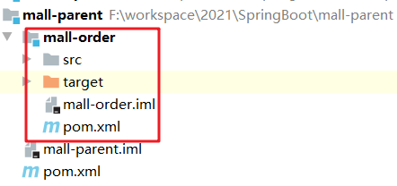 

+ 创建mall-order

```xml
<?xml version="1.0" encoding="UTF-8"?>
<project xmlns="http://maven.apache.org/POM/4.0.0"
         xmlns:xsi="http://www.w3.org/2001/XMLSchema-instance"
         xsi:schemaLocation="http://maven.apache.org/POM/4.0.0 http://maven.apache.org/xsd/maven-4.0.0.xsd">
    <parent>
        <artifactId>mall-parent</artifactId>
        <groupId>com.itheima</groupId>
        <version>1.0-SNAPSHOT</version>
    </parent>
    <modelVersion>4.0.0</modelVersion>

    <artifactId>mall-order</artifactId>
    <dependencies>
        <!--web起步依赖-->
        <dependency>
            <groupId>org.springframework.boot</groupId>
            <artifactId>spring-boot-starter-web</artifactId>
        </dependency>

        <!--lombox-->
        <dependency>
            <groupId>org.projectlombok</groupId>
            <artifactId>lombok</artifactId>
        </dependency>

    </dependencies>

    <build>
        <plugins>
            <!--springboot maven插件-->
            <plugin>
                <groupId>org.springframework.boot</groupId>
                <artifactId>spring-boot-maven-plugin</artifactId>
            </plugin>
        </plugins>
    </build>


</project>
```

+ application.yml

```yaml
spring:
  application:
    name: mall-order
server:
  port: 18082
```

+ 启动类

```java
package com.itheima.order;

import org.springframework.boot.SpringApplication;
import org.springframework.boot.autoconfigure.SpringBootApplication;

@SpringBootApplication
public class OrderApplication {
    public static void main(String[] args) {
        SpringApplication.run(OrderApplication.class, args);
    }
   
}

```

+ pojo

```java
package com.itheima.order.pojo;

import lombok.AllArgsConstructor;
import lombok.Data;
import lombok.NoArgsConstructor;

import java.io.Serializable;


@Data
@AllArgsConstructor
@NoArgsConstructor
public class Order implements Serializable{
	private String id;//订单id
	private Integer totalMoney;//金额合计
	private String username;//用户名称
	private String receiverContact;//收货人
	private String name;//SKU名称
	private Integer price;//价格（分）
	private Integer num;//库存数量
	private String brandName;//品牌名称
}

```


#### 3.3创建商品微服务

步骤:

1. 创建工程,导入坐标
2. 创建配置文件
3. 创建启动类
4. 创建pojo
5. 创建Controller 根据id查询


 

+ 创建mall-goods

```xml
<?xml version="1.0" encoding="UTF-8"?>
<project xmlns="http://maven.apache.org/POM/4.0.0"
         xmlns:xsi="http://www.w3.org/2001/XMLSchema-instance"
         xsi:schemaLocation="http://maven.apache.org/POM/4.0.0 http://maven.apache.org/xsd/maven-4.0.0.xsd">
    <parent>
        <artifactId>mall-parent</artifactId>
        <groupId>com.itheima</groupId>
        <version>1.0-SNAPSHOT</version>
    </parent>
    <modelVersion>4.0.0</modelVersion>

    <artifactId>mall-goods</artifactId>

    <dependencies>
        <!--web起步依赖-->
        <dependency>
            <groupId>org.springframework.boot</groupId>
            <artifactId>spring-boot-starter-web</artifactId>
        </dependency>

        <dependency>
            <groupId>org.projectlombok</groupId>
            <artifactId>lombok</artifactId>
        </dependency>
    </dependencies>

    <build>
        <plugins>
            <!--springboot maven插件-->
            <plugin>
                <groupId>org.springframework.boot</groupId>
                <artifactId>spring-boot-maven-plugin</artifactId>
            </plugin>
        </plugins>
    </build>


</project>
```

+ application.yml

```yaml
spring:
  application:
    name: mall-goods
server:
  port: 18081
```

+ 启动类

```java
package com.itheima.goods;

import org.springframework.boot.SpringApplication;
import org.springframework.boot.autoconfigure.SpringBootApplication;

@SpringBootApplication
public class GoodsApplication {
    public static void main(String[] args) {
        SpringApplication.run(GoodsApplication.class,args);
    }
}
```

+ pojo

```java
package com.itheima.goods.pojo;

import lombok.AllArgsConstructor;
import lombok.Data;
import lombok.NoArgsConstructor;

import java.io.Serializable;


@Data
@AllArgsConstructor
@NoArgsConstructor
public class Sku implements Serializable {
	private String id;//商品id
	private String name;//SKU名称
	private Integer price;//价格（分）
	private Integer num;//库存数量
	private String brandName;//品牌名称
	private String status;//商品状态 1-正常，2-下架，3-删除
}

```

+ SkuController

```java
package com.itheima.goods.controller;

import com.itheima.goods.pojo.Sku;
import org.springframework.web.bind.annotation.GetMapping;
import org.springframework.web.bind.annotation.PathVariable;
import org.springframework.web.bind.annotation.RequestMapping;
import org.springframework.web.bind.annotation.RestController;

@RestController
@RequestMapping("/sku")
public class SkuController {
    @GetMapping("/{id}")
    public Sku findById(@PathVariable(name="id")String id){
        Sku sku = new Sku(id, "华为手机", 1999, 10, "华为", "1");
        return sku;
    }
}

```

#### 3.4远程调用

+ mall-order注册RestTemplate

 

+ 远程调用

```java
package com.itheima.order.controller;

import com.itheima.order.pojo.Order;
import com.itheima.order.pojo.Sku;
import org.springframework.beans.factory.annotation.Autowired;
import org.springframework.web.bind.annotation.PathVariable;
import org.springframework.web.bind.annotation.RequestMapping;
import org.springframework.web.bind.annotation.RestController;
import org.springframework.web.client.RestTemplate;

/**
 * @Description:
 * @author: yp
 */
@RestController
@RequestMapping("/order")
public class OrderController {

    @Autowired
    private RestTemplate restTemplate;

    @RequestMapping("/{id}")
    public Order findById(@PathVariable("id") String id){
        //1.远程调用mall-goods服务, 获得商品的数据
        Sku sku = restTemplate.getForObject("http://localhost:18081/sku/1", Sku.class);
        //2.封装到order返回
        Order order = new Order(id,2000,"zs","小叶子",sku.getName(),sku.getPrice(),sku.getNum(),sku.getBrandName());
        return order;
    }

}

```

测试：启动两个微服务，并浏览器输入地址

```

http://localhost:18082/order/1
```

结果：

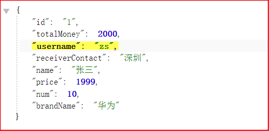 


### 4.小结

1. RestTemplate

   ​	Spring里面封装的一个发送Http请求的客户端, 用来进行服务间的远程调用

2. 步骤

   + 注册RestTemplate
   + 注入RestTemplate
   + 调用getForObject("路径",类.class)


# 第三章-注册中心

## 知识点-注册中心介绍

### 1.目标

- [ ] 了解种注册中心的区别

### 2.路径

1. 为什么要用注册中心
2. 注册中心介绍

3. 各种注册中心比较

### 3.讲解

#### 3.1为什么要用注册中心

刚才我们已经实现服务调用了，但是有一些问题：

1. 服务调用的url地址被硬编码进了代码中，不容易维护
2.  服务调用时如果商品微服务宕机，更换了服务器ip和端口，但是调用方 无法进行感知
3.  如果做集群，无法进行负载均衡
   ...

为此我们需要解决这些问题：

​	如果 动态的获取IP和端口，进行动态的调用，即使宕机，那么获取到的是最新的ip地址和端口就好了。此时应当将微服务的ip地址和端口等信息 注册到一个注册中心，其他微服务进行动态的获取ip地址即可。此时就需要用到注册中心.

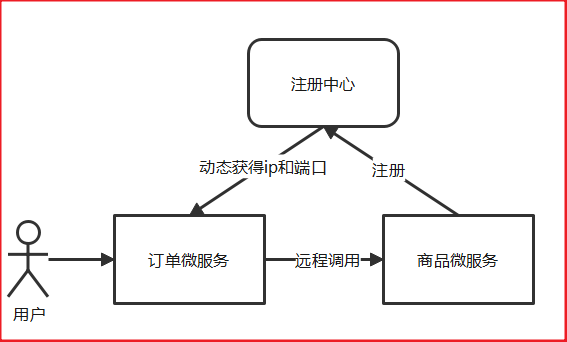 

#### 3.2注册中心介绍

​	注册中心组件用于解决以上说明的问题：它能提供服务的注册和发现，状态监控，动态的路由等功能。

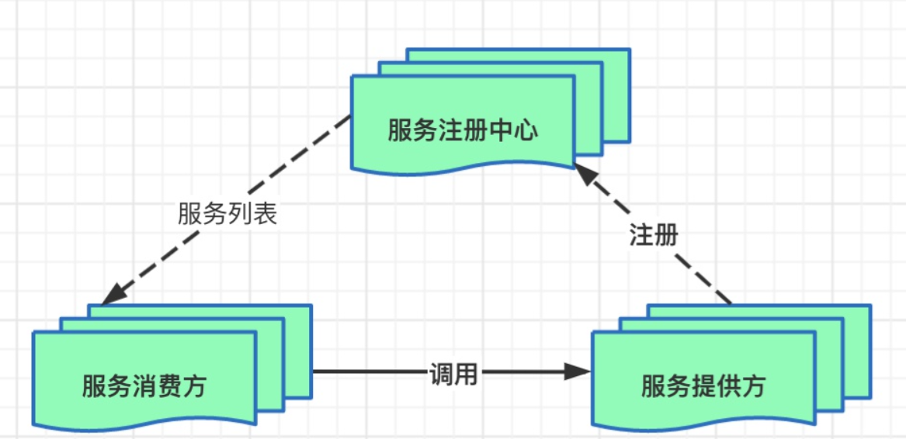


#### 3.3各种注册中心比较

 

技术选型:  

1. 是否适合当前公司的情况
   + 成本
   + 业务
2. 技术是否稳定
3. 技术社区是否活跃
   + 技术是否好维护
4. 技术是否出自大厂或者权威的机构

### 4.小结


## 知识点-Nacos介绍

### 1.目标

- [ ] 掌握什么是Nacos已经Nacos的作用

### 2.路径

1. 什么是Nacos
2. Nacos的作用
3. Nacos生态图
4. Nacos支持AP和CP模式的切换

### 3.讲解

#### 3.1什么是Nacos

​	一个更易于构建云原生应用的动态服务发现(作为注册中心)、配置管理(配置中心)和服务管理平台。

> 官网：https://nacos.io/

> Github: https://github.com/alibaba/Nacos

#### 3.2Nacos的主要作用

1. 做服务注册中心
2. 做服务配置中心

### 4.小结


## 实操-Nacos的安装

### 1.目标

- [ ] 能够安装Nacos，并且启动

### 2.路径

1. Nacos下载
2. Nacos安装启动

### 3.讲解

#### 3.1Nacos下载

+ 从官网下载：

```
https://github.com/alibaba/nacos/releases
```

资料中已经提供，可直接使用:如下图 使用1.4.1的版本：

 

+ 解压到一个没有中文和空格的目录


#### 3.2Nacos安装启动

1. 解压安装包，到bin目录下的
   + window  `startup.cmd -m standalone`
   + Linux `sh startup.sh -m standalone`
2. 命令运行成功后直接访问http://localhost:8848/nacos（默认账户密码都是nacos）
3. 结果页面

 

### 4.小结

1. 解压到一个没有中文和空格的目录
2. 单机启动 `startup.cmd -m standalone`


## 案例-Nacos作为注册中心

### 1.目标

- [ ] 注册mall-goods和mall-order到nacos

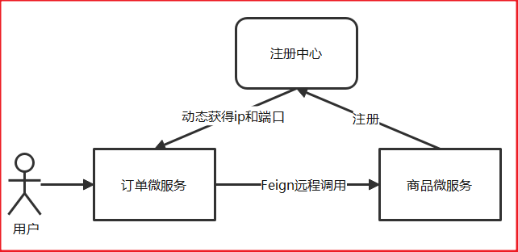 

### 2.步骤

1. 添加nacos起步依赖
2. application.yml中进行配置
3. 启动类中进行配置@EnableDiscoveryClient

### 3.实现

- 添加nacos起步依赖

```xml
<dependency>
    <groupId>com.alibaba.cloud</groupId>
    <artifactId>spring-cloud-starter-alibaba-nacos-discovery</artifactId>
</dependency>
```


- application.yml中进行配置

```
spring:
  cloud:
    nacos:
      discovery:
        server-addr: localhost:8848 #配置了注册中心（nacos-server）的地址
```

- 启动类中进行配置@EnabledDiscovery

```java
package com.itheima.order;

import org.springframework.boot.SpringApplication;
import org.springframework.boot.autoconfigure.SpringBootApplication;
import org.springframework.cloud.client.discovery.EnableDiscoveryClient;
import org.springframework.context.annotation.Bean;
import org.springframework.web.client.RestTemplate;

@SpringBootApplication
@EnableDiscoveryClient
public class OrderApplication {

    public static void main(String[] args) {
        SpringApplication.run(OrderApplication.class, args);
    }
    @Bean
    public RestTemplate restTemplate(){
        return new RestTemplate();
    }
}

```

+ 启动nacos-server, 依次启动mall-goods和mall-order

 

### 4.小结

1. 在pom文件里面添加nacos的起步依赖
2. 在配置文件里面配置nacos的地址
3. 在启动类上面添加 `@EnableDiscoveryClient`


## 知识点-nacos 原理【面试】

### 1.目标

- [ ] 了解nacos 原理

### 2.路径

1. 架构设计图
2. 原理讲解

### 3.讲解

#### 3.1 架构设计图

 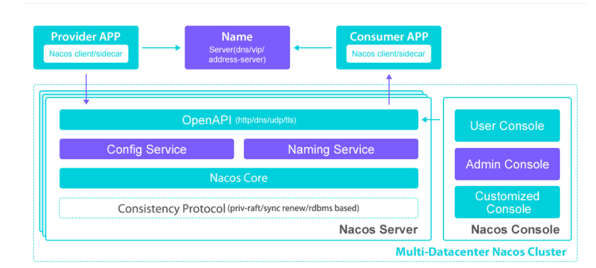


- Provider APP：服务提供者
- Consumer APP：服务消费者
- Name Server：通过VIP（Virtual IP）或DNS的方式实现Nacos高可用集群的服务路由
- Nacos Server：里面包含的Open API是功能访问入口，Config Service、Naming Service 是Nacos提供的配置服务、命名服务模块。Consitency Protocol是一致性协议，用来实现Nacos集群节点的数据同步，这里使用的是Raft算法。
- Nacos Console：控制台


#### 3.2 原理讲解

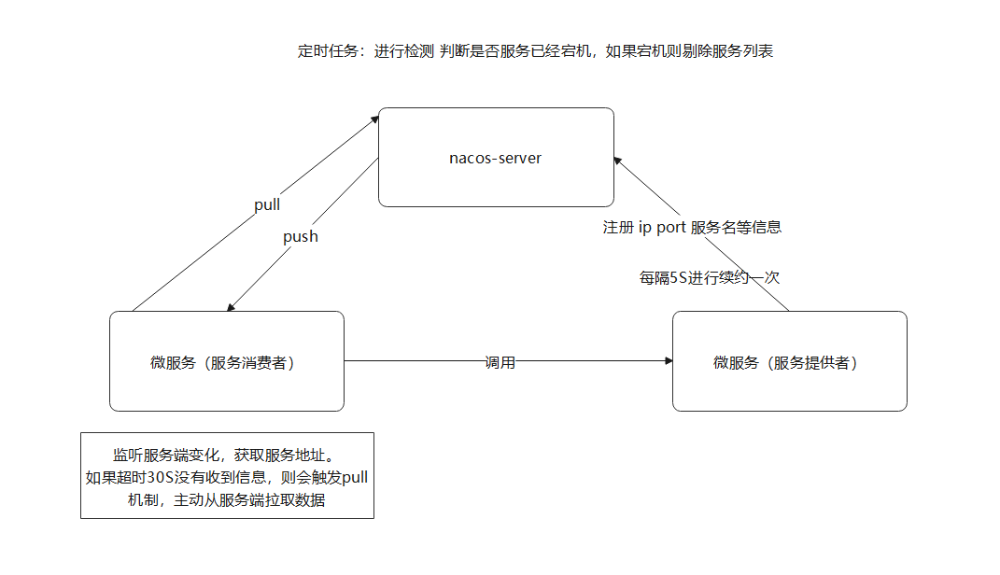

1.服务提供者 注册 本身的Ip和端口以及服务名等信息给注册中心（nacos-server）每隔5S钟进行续约
2.服务消费者 监听 nacos-server，一旦有服务信息，则 服务消费者即可获取到 服务提供者信息
3.如果监听超时(30S) 那么触发pull机制 主动发送请求给nacos-server 获取 服务提供者信息
4.nacos-server端进行定时开启定时任务进行检测，如果超过15s没收到心跳,把实例的健康状态改为false; 如果超过30s没收到心跳, 剔除服务列表信息

#### 3.3Nacos的注册表的结构


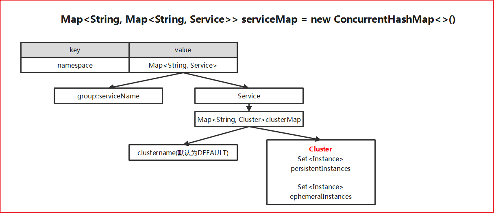 


# 第四章-SpringCloud Feign

## 知识点-Feign介绍

### 1.目标

- [ ] 知道什么是Feign

### 2.路径

1. 什么是Feign
2. Feign的特点

### 3.讲解

#### 3.1什么是Feign

​		Feign（也叫open feign 为现在的一个叫法）是一个声明式WebService客户端。使用Feign能让编写WebService客户端更加简单,它的使用方法是==定义一个接口，然后在上面添加注解==。不再需要拼接URL，参数等操作。

​	网址：https://github.com/OpenFeign/feign 。

#### 3.2Feign的特点

- 集成Ribbon的负载均衡功能
- 集成了Hystrix的熔断器功能
- 也能结合sentinel实现熔断功能
- 支持请求压缩
- 大大简化了远程调用的代码，同时功能还增强
- Feign以更加优雅的方式编写远程调用代码，并简化重复代码

### 4.小结

<details>
    <summary>1.什么是Feign</summary>
    feign是一个声明式的http客户端端，封装了RestTemplate, 通常用作微服务间的远程调用<br/>
</details>


## 案例-使用Feign远程调用

### 1.需求

- [ ] 使用Feign替代RestTemplate发送HTTP求

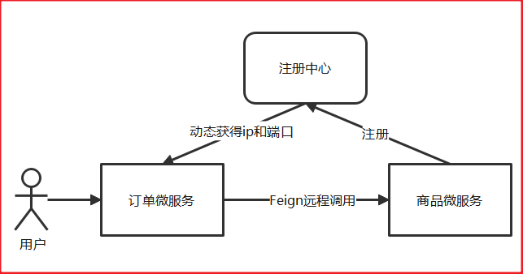 

### 2.步骤

1. 导入feign起步依赖
2. 编写（声明）Feign客户端接口
3. 消费者启动引导类开启Feign功能注解
4. 调用

### 3.实现

- 在mall-order, 导入feign起步依赖

```xml
<!--openfeign-->
<dependency>
    <groupId>org.springframework.cloud</groupId>
    <artifactId>spring-cloud-starter-openfeign</artifactId>
</dependency>
```

- 在mall-order, 编写（声明）Feign客户端接口

```
package com.itheima.order.feign;

import com.itheima.order.pojo.Sku;
import org.springframework.cloud.openfeign.FeignClient;
import org.springframework.web.bind.annotation.GetMapping;
import org.springframework.web.bind.annotation.PathVariable;

/**
 * @Description:
 * @author: yp
 */
@FeignClient(value = "mall-goods")
public interface GoodsFeign {
    
    @GetMapping("/sku/{id}")
    Sku findById(@PathVariable(name="id")String id);
}

```

- 在mall-order,消费者启动引导类开启Feign功能注解

 


- 调用

```java
package com.itheima.order.controller;

import com.itheima.order.feign.GoodsFeign;
import com.itheima.order.pojo.Order;
import com.itheima.order.pojo.Sku;
import org.springframework.beans.factory.annotation.Autowired;
import org.springframework.web.bind.annotation.GetMapping;
import org.springframework.web.bind.annotation.PathVariable;
import org.springframework.web.bind.annotation.RequestMapping;
import org.springframework.web.bind.annotation.RestController;
import org.springframework.web.client.RestTemplate;

@RestController
@RequestMapping("/order")
public class OrderController {

    @Autowired
    private RestTemplate restTemplate;

    @Autowired
    private GoodsFeign goodsFeign;

    @GetMapping("/{id}")
    public Order getOrderInfo(@PathVariable(name = "id") String id) {
        //1.根据商品的ID 获取商品的信息（使用resTemplate模拟浏览器发送请求获取数据）
        //Sku sku = restTemplate.getForObject("http://localhost:18081/sku/1", Sku.class);
        Sku sku = goodsFeign.findById(id);
        //2.模拟数据返回
        Order order = new Order(id,2000,"zs","深圳","张三",sku.getPrice(),sku.getNum(),sku.getBrandName());
        //3.返回给前端
        return order;
    }
}
```


### 4.@FeignClient的Path属性

​	在写ItemFeign接口的时候。由于每一个路径上可能都带有/item ,每次都要写就比较麻烦，那么能否抽取出来呢?答案是肯定的，这里feign支持springmvc的注解，也可以用Path属性来进行设置，如下图：

+ 使用Path（推荐使用）

 

+ 使用@requestMapping   类似于springmvc的注解写在controller上边

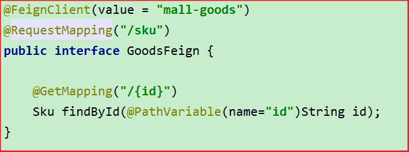 

​	以上这两种方式都可以。但是 如果使用@requestmapping的方式，在集成hystrix的时候会有问题。推荐使用PATH

### 5.小结

1. 添加feign起步依赖
2. 定义feign接口(和需要远程调用的Controller接口一样   )
   + 返回值一样
   + 参数一样
   + 方法名一样
   + 路径一样
   + 没有方法体
3. 在启动类上面添加@EnableFeignClients
4. 注入调用

# 总结

## 1.概念

1. 什么SpringCloud和SpringCloudAlibaba

2. 为什么要学习SpringCloudAlibaba

3. 框架

   | 框架               | 注册中心  | 服务调用            | 配置中心  | 网关              | 总线      | 熔断         |
   | ------------------ | --------- | ------------------- | --------- | ----------------- | --------- | ------------ |
   | SpringCloud        | eureka    | feign,**openfeign** | config    | zuul,**gategway** | bus       | hystrix      |
   | SpringCloudAlibaba | **nacos** | dubbo               | **nacos** |                   | **nacos** | **sentinel** |
   | 其它               | zookeeper |                     |           |                   |           |              |

4. 微服务

5. HTTP(SpringCloud)和RPC(dubbo)

6. Nacos

   + 注册中心
   + 配置中心

7. nacos原理

   + 注册表  map

## 2.安装

## 3.Nacos注册中心使用

+ 导入nacos起步依赖
+ 在配置文件配置nacos地址
+ 在启动类上面添加 @EnableDiscoveryClient

## 4.Feign使用

+ 导入Feign起步依赖
+ 定义client接口
+ 在启动类上面添加@EnableFeignClients
+ 注入,调用


# 源码结论

## 一,服务注册

+ 本质就是微服务向nacos发送HTTP POST方式请求
  + 每隔5s发送和nacos服务心跳, 本质还是发送HTTP请求
+ 如果成功了,nacos把服务节点信息保存到ConcurrentHashMap<>()


