# SpringCloudDay02

# 学习目标

- [ ] 能理解Feign是什么以及掌握Feign的使用
- [ ] 能理解什么是网关以及场景案例
- [ ] 能掌握搭建网关系统，并实现基本的路由配置
- [ ] 能掌握网关系统的自定义全局过滤器的开发和作用
- [ ] 能够掌握配置中心

# 第一章-负载均衡Spring Cloud Ribbon

## 案例-负载均衡案例

### 1.目标

​	很多情况下，如果服务宕机则非常严重，所以一般情况下为了解决这个问题，我们需要搭建集群，但是搭建集群之后，就会带来一个新的问题，如何实现负载均衡，如果不实现负载均衡，请求总是在一台服务器上，那么搭建集群的意义也就失去了。如下图所示：

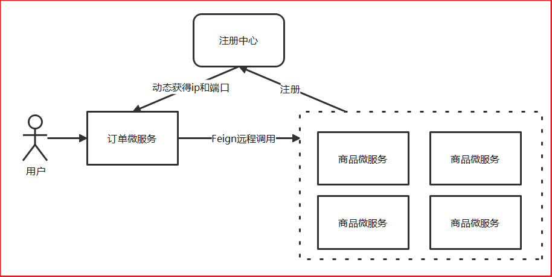 

### 2.路径

1.  什么是Ribbon
2. 案例实现负载均衡

### 3.讲解

#### 3.1什么是Ribbon

​	Ribbon是Netflix发布的负载均衡器，有助于控制HTTP客户端行为。为Ribbon配置服务提供者地址列表后，Ribbon就可基于负载均衡算法，自动帮助服务消费者请求。

#### 3.2案例实现负载均衡

Feign自身已经集成了Ribbon，因此使用Feign的时候，不需要额外引入依赖。直接调用即可实现负载均衡。

Ribbon负载均衡算法默认的是区域权衡【扩展了轮询策略】。


Feign内置的ribbon默认设置了请求超时时长，默认是1000，可以修改


```yml
feign:
  client:
    config:
      default: # default指定的是所有的feign客户端 都设置为该配置超时时间
        connectTimeout: 5000 # 链接超时时间
        readTimeout: 5000 # 读取的超时时间
```

### 4.小结


## 知识点-Ribbon深入

### 1.目标

- [ ] 掌握Ribbon默认负载均衡策略的类型

### 2.路径

1. 负载均衡策略
2. 配置负载均衡算法
3. 自定义负载均衡策略

### 3.讲解

#### 3.1负载均衡策略

​	IRule是一个接口用来定义负载均衡的, SpringCloud为我们提供了7种负载均衡算法

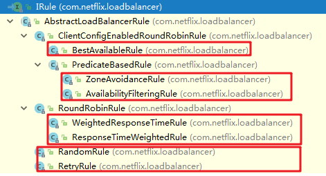


+ RoundRobinRule: 轮询
+ RandomRule: 随机
+ AvailabilityFilteringRule: 会先过滤掉由于多次访问故障而处于断路器跳闸状态的服务,还有并发的连接数超过阈值的服务,然后对剩余的服务列表按照轮询策略进行访问
+ WeightResponseTimeRule: 根据平均响应时间就算所有服务的权重,响应时间越快服务权重越大被选中 的概率越高.刚启动时如果统计信息不足,则使用RoudRobinRule策略,等统计信息足够,会切换到WeightedResponseTimeRule
+ RetryRule: 先按照RoundRobinRule的策略获取服务,如果获取服务失败则在指定时间内会进行重试,获取可用的服务
+ BestAvailableRule: 会过滤掉由于多次访问故障而处于断路器跳闸状态的服务,然后选择一个并发量最小的服务
+ ZoneAvoidanceRule: 扩展了轮询策略。复合判断server所在区域的性能和server的可用性选择服务器 【默认】


#### 3.2配置负载均衡算法

+ 方式一

```javascript
/**
* 设置为随机算法
*/
@Bean
public IRule getRule() {
    return new RandomRule();
}
```

+ 方式二


```yaml
#{服务提供者spring.application.name}:
#  ribbon:
#    NFLoadBalancerRuleClassName: {负载均衡策略的全包名}
mall-goods:
  ribbon:
    NFLoadBalancerRuleClassName: com.netflix.loadbalancer.RandomRule
```

#### 3.3自定义负载均衡策略

##### 3.3.1需求

自定义负载均衡策略, 实现根据请求路径的hashcode来决定是哪个服务处理这个请求

##### 3.3.2步骤

1. 创建一个类继承AbstractLoadBalancerRule
2. 配置负载均衡规则

##### 3.2.3实现

- 创建一个类继承AbstractLoadBalancerRule

```java
package com.itheima.order.rule;

import com.netflix.client.config.IClientConfig;
import com.netflix.loadbalancer.AbstractLoadBalancerRule;
import com.netflix.loadbalancer.Server;
import lombok.extern.slf4j.Slf4j;
import org.slf4j.Logger;
import org.slf4j.LoggerFactory;
import org.springframework.web.context.request.RequestContextHolder;
import org.springframework.web.context.request.ServletRequestAttributes;

import javax.servlet.http.HttpServletRequest;
import java.util.List;

@Slf4j
public class MyRule extends AbstractLoadBalancerRule {

    @Override
    public void initWithNiwsConfig(IClientConfig iClientConfig) {
    }

    //例如根据当前的请求获取hashcode值并进行取模 完成负载均衡
    @Override
    public Server choose(Object o) {
        ServletRequestAttributes requestAttributes = (ServletRequestAttributes) RequestContextHolder.getRequestAttributes();
        HttpServletRequest request = requestAttributes.getRequest();
        log.info("key:" + o);
        List<Server> allServers = getLoadBalancer().getAllServers();
        log.info(allServers.toString());
        int code = request.getRequestURI().toString().hashCode();
        if (code < 0) {
            code = -code;
        }
        return allServers.get( code % allServers.size());
    }


}
```

+ 配置负载均衡规则

方式一: 在配置文件配置

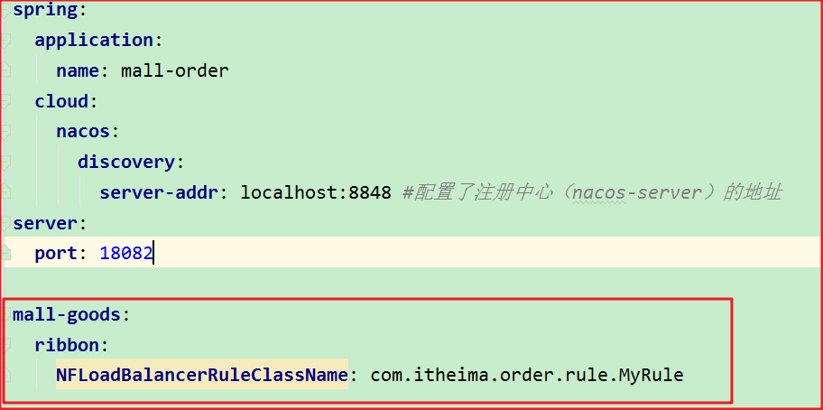 

```yaml
spring:
  application:
    name: mall-order
  cloud:
    nacos:
      discovery:
        server-addr: localhost:8848 #配置了注册中心（nacos-server）的地址
server:
  port: 18082

mall-goods:
  ribbon:
    NFLoadBalancerRuleClassName: com.itheima.order.rule.MyRule
```

方式二: bean的方式配置

```java
@Bean
public IRule getRule() {
    //return new RoundRobinRule();
    return new MyRule();
}
```


### 4.小结


# 第二章-服务网关SpringCloud Gateway

## 知识点-网关介绍

### 1.目标

- [ ] 知道为什么要使用网关

### 2.路径

1. 为什么要使用网关
2. 什么是SpringCloudGateway
3. SpringCloudGateway的作用

### 3.讲解

#### 3.1为什么要使用网关

​	不同的微服务一般有不同的网络地址，而外部的客户端可能需要调用多个服务的接口才能完成一个业务需求。比如一个电影购票的收集APP,可能回调用电影分类微服务，用户微服务，支付微服务等。如果客户端直接和微服务进行通信，会存在一下问题： 

+ 客户端会多次请求不同微服务，增加客户端的复杂性

+ 存在跨域请求，在一定场景下处理相对复杂

+ 认证复杂，每一个服务都需要独立认证

+ 难以重构，随着项目的迭代，可能需要重新划分微服务，如果客户端直接和微服务通信，那么重构会难以实施

+ 某些微服务可能使用了其他协议，直接访问有一定困难

  ...

   上述问题，都可以借助微服务网关解决。微服务网关是介于客户端和服务器端之间的中间层，所有的外部请求都会先经过微服务网关。
  
  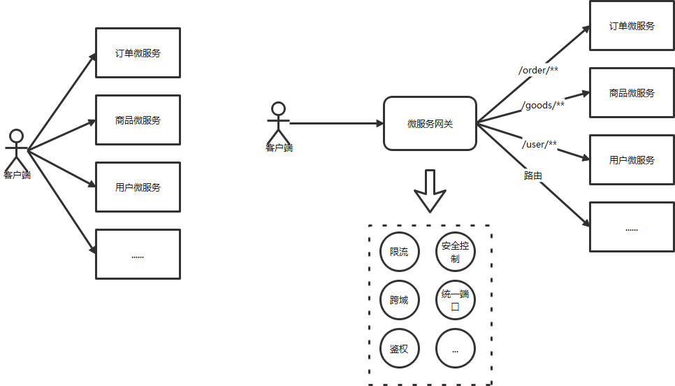 

#### 3.2什么是SpringCloudGateway

​	Spring Cloud Gateway 是Spring Cloud团队的一个全新项目，基于Spring 5.0、SpringBoot2.0、Project Reactor 等技术开发的网关。 旨在为微服务架构提供一种简单有效统一的API路由管理方式。

​	Spring Cloud Gateway 作为SpringCloud生态系统中的网关，目标是替代Netflix Zuul。Gateway不仅提供统一路由方式，并且基于Filter链的方式提供网关的基本功能。例如：安全，监控/指标，和限流。

注:Spring cloud gateway 本身也是一个微服务；

#### 3.3SpringCloudGateway的作用

+ 身份认证和安全: 识别每一个资源的验证要求，并拒绝那些不符的请求
+ 审查与监控
+ 动态路由:动态将请求路由到不同后端集群
+ 压力测试：逐渐增加指向集群的流量，以了解性能
+ 负载分配：为每一种负载类型分配对应容量，并弃用超出限定值的请求

 

### 4.小结


## 案例-GateWay路由配置

### 1.需求

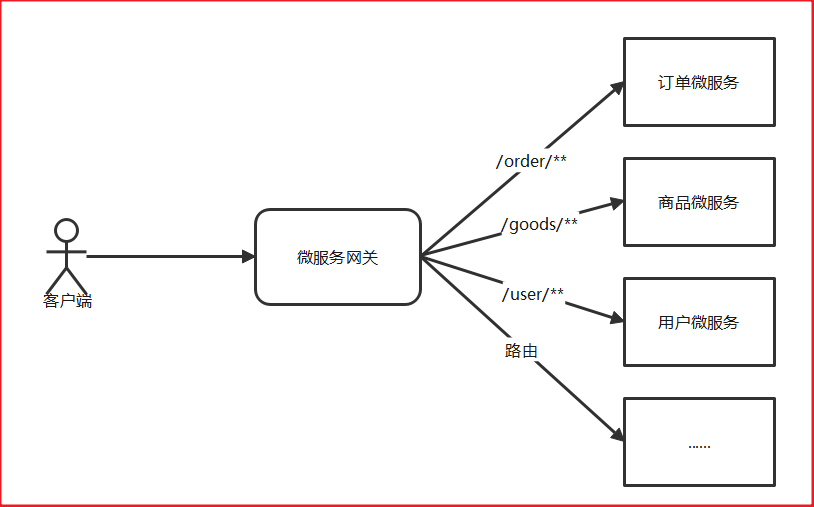


### 2.分析

1. 创建mall-gateway工程 ,添加依赖（网关的起步依赖以及注册中心的起步依赖）
3. 创建启动类 
3. 创建yml文件 配置网关路由规则
6. 测试

### 3.实现

- 创建mall-gateway工程 ,添加依赖（网关的起步依赖以及注册中心的起步依赖）

```xml
<?xml version="1.0" encoding="UTF-8"?>
<project xmlns="http://maven.apache.org/POM/4.0.0"
         xmlns:xsi="http://www.w3.org/2001/XMLSchema-instance"
         xsi:schemaLocation="http://maven.apache.org/POM/4.0.0 http://maven.apache.org/xsd/maven-4.0.0.xsd">
    <parent>
        <artifactId>mall-parent</artifactId>
        <groupId>com.itheima</groupId>
        <version>1.0-SNAPSHOT</version>
    </parent>
    <modelVersion>4.0.0</modelVersion>

    <artifactId>mall-gateway</artifactId>

    <dependencies>
        <dependency>
            <groupId>org.springframework.cloud</groupId>
            <artifactId>spring-cloud-starter-gateway</artifactId>
        </dependency>

        <dependency>
            <groupId>com.alibaba.cloud</groupId>
            <artifactId>spring-cloud-starter-alibaba-nacos-discovery</artifactId>
        </dependency>
    </dependencies>


</project>
```

- 创建启动类 

```java
package com.itheima.gateway;

import org.springframework.boot.SpringApplication;
import org.springframework.boot.autoconfigure.SpringBootApplication;
import org.springframework.cloud.client.discovery.EnableDiscoveryClient;

@SpringBootApplication
@EnableDiscoveryClient//启用服务发现和注册
public class GatewayApplication {
    public static void main(String[] args) {
        SpringApplication.run(GatewayApplication.class, args);
    }
}

```

- 创建yml文件 配置网关路由规则

```yaml
server:
  port: 18084
spring:
  application:
    name: mall-gateway
  cloud:
    nacos:
      discovery:
        server-addr: localhost:8848
    gateway:
      routes: #路由配置
        - id: mall-order #唯一标识,默认是UUID
          uri: http://localhost:18082 #转发的路径
          predicates: #条件, 用于请求网络路径的匹配规则
            - Path=/order/**

        - id: mall-goods #唯一标识,默认是UUID
          uri: http://localhost:18081 #转发的路径
          predicates: #条件, 用于请求网络路径的匹配规则
            - Path=/sku/**
```

- 测试

```
http://localhost:18084/sku/1
```

### 4.小结

<details>
    <summary>一,使用步骤</summary>
    1. 创建mall-gateway工程 ,添加依赖（网关的起步依赖以及注册中心的起步依赖）<br/>
    2. 创建启动类 <br/>
    3. 创建yml文件 配置网关路由规则<br/>
    4. 测试<br/>
</details>

### 5.动态路由

​	刚才路由规则中，我们把路径对应服务地址写死了！如果服务提供者集群的话，这样做不合理。应该是根据服务名称，去Nacos注册中心查找服务对应的所有实例列表，然后进行动态路由！

​	修改application.yml文件如下:标识动态从NACOS注册中心获取ip和端口，通过spring cloud common中的LoadBalancerClient 选择负载均衡策略的方式 选择一个 再进行路由，默认的情况下采用的是轮询的策略。

+ 语法,修改uri的属性

```
uri:lb://服务名称
```

+ 修改

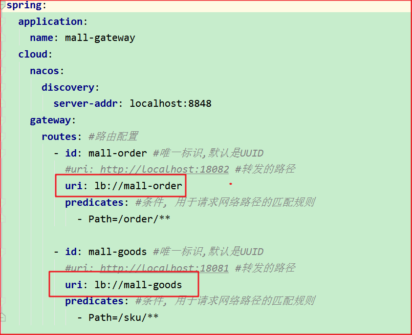 

```yaml
server:
  port: 18084
spring:
  application:
    name: mall-gateway
  cloud:
    nacos:
      discovery:
        server-addr: localhost:8848
    gateway:
      routes: #路由配置
        - id: mall-order #唯一标识,默认是UUID
          #uri: http://localhost:18082 #转发的路径
          uri: lb://mall-order
          predicates: #条件, 用于请求网络路径的匹配规则
            - Path=/order/**

        - id: mall-goods #唯一标识,默认是UUID
          #uri: http://localhost:18081 #转发的路径
          uri: lb://mall-goods
          predicates: #条件, 用于请求网络路径的匹配规则
            - Path=/sku/**
```


## 知识点-GateWay过滤器

### 1.目标

- [ ] 掌握GateWay过滤器的使用

### 2.路径

1. 过滤器介绍
2. 局部过滤器
3. 全局过滤器的使用
4. 自定义过滤器

### 3.讲解

#### 3.1过滤器介绍

​	过滤器作为Gateway的重要功能。常用于请求鉴权、服务调用时长统计、修改请求或响应header、限流、去除路径等等...

Gateway 还提供了两种类型过滤器

+  GatewayFilter：局部过滤器，针对单个路由
+  GlobalFilter ：全局过滤器，针对所有路由  

#### 3.2局部过滤器

##### 3.2.1说明

​	GatewayFilter 局部过滤器，是针对单个路由的过滤器。在Spring Cloud Gateway 组件中提供了大量内置的局部过滤器，对请求和响应做过滤操作。  

| 过滤器名称          | 说明                         |
| ------------------- | ---------------------------- |
| AddRequestHeader    | 对匹配上的请求加上Header     |
| AddRequestParameter | 对匹配上的请求参数           |
| AddResponseHeader   | 对从网关返回的响应添加Header |
| PrefixPath          | 为原始请求路径添加前缀       |
| ==StripPrefix==     | 对匹配上的请求路径去除前缀   |

 

详细说明官方[链接](https://cloud.spring.io/spring-cloud-static/spring-cloud-gateway/2.1.1.RELEASE/single/spring-cloud-gateway.html#_gatewayfilter_factories)

##### 3.2.2使用

+ 添加请求参数 AddRequestParameter

```
        - id: mall-goods #唯一标识,默认是UUID
          #uri: http://localhost:18081 #转发的路径
          uri: lb://mall-goods
          predicates: #条件, 用于请求网络路径的匹配规则
            - Path=/sku/**
          filters:
            - AddRequestParameter=name,zs 
```

  

+ 添加路径前缀  PrefixPath

```yaml
        - id: mall-goods #唯一标识,默认是UUID
          #uri: http://localhost:18081 #转发的路径
          uri: lb://mall-goods
          predicates: #条件, 用于请求网络路径的匹配规则
            - Path=/**
          filters:
            - AddRequestParameter=name,zs
            - PrefixPath=/sku    #解释: http://localhost:18084/1==>http://localhost:18081/sku/1
```


+ 去除路径前缀  StripPrefix

```yaml
        - id: mall-goods #唯一标识,默认是UUID
          uri: lb://mall-goods
          predicates: #条件, 用于请求网络路径的匹配规则
            - Path=/sku/**
          filters:
            - StripPrefix=1 #请求地址去除一个前缀路径 http://localhost:18084/sku/sku/1-->http://localhost:18081/sku/1
```


#### 3.3全局过滤器

##### 3.3.1说明

​	GlobalFilter 全局过滤器，系统初始化时加载，作用在每个路由上。 Spring Cloud Gateway 核心的功能也是通过内置的全局过滤器来完成 。

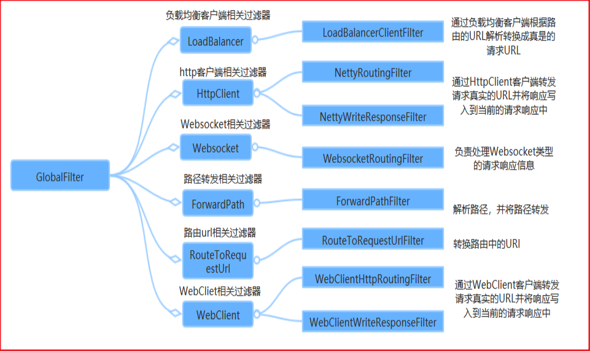 

##### 3.3.2使用

+ 可以在default-filters配置

```yaml
spring:
  cloud:
    gateway:
     # 配置全局默认过滤器
      default-filters:
      # 往响应过滤器中加入信息
        - AddResponseHeader=X-Response-Default-MyName,itheima
```

#### 3.4自定义过滤器

##### 3.4.1说明

​	当系统默认的过滤器满足不了我们的业务时候,我们可以自定义。既可以自定义全局的， 也可以自定义局部的。自定义局部的基本很少使用， 我们来讲解以自定义全局的。

##### 3.4.2需求

如果请求中有token参数，则认为请求有效放行，如果没有则拦截提示授权无效

##### 3.4.3步骤

1. 创建过滤器类实现GlobalFilter接口,Ordered接口
2. 编写业务逻辑代码
3. 访问接口测试，加token和不加token。

##### 3.4.4实现

```java
package com.itheima.gateway.filter;

import org.apache.commons.lang.StringUtils;
import org.springframework.cloud.gateway.filter.GatewayFilterChain;
import org.springframework.cloud.gateway.filter.GlobalFilter;
import org.springframework.core.Ordered;
import org.springframework.http.HttpStatus;
import org.springframework.http.server.reactive.ServerHttpRequest;
import org.springframework.http.server.reactive.ServerHttpResponse;
import org.springframework.stereotype.Component;
import org.springframework.web.server.ServerWebExchange;
import reactor.core.publisher.Mono;

/**
 * @Description:
 * @author: yp
 */
@Component
public class TokenFilter implements GlobalFilter, Ordered {


    @Override
    public Mono<Void> filter(ServerWebExchange exchange, GatewayFilterChain chain) {
        //1.获得请求头
        ServerHttpRequest request = exchange.getRequest();
        ServerHttpResponse response = exchange.getResponse();
        String token = request.getHeaders().getFirst("token");
        //2.判断是否有Token
        if(StringUtils.isEmpty(token)){
            response.setStatusCode(HttpStatus.UNAUTHORIZED);
            return response.setComplete();
        }
        return chain.filter(exchange);
    }

    //值越小优先级越高
    @Override
    public int getOrder() {
        return 0;
    }
}

```


### 4.小结


## 知识点- 网关实现跨域解决

### 1.目标

- [ ] 能够使用网关实现跨域解决

### 2.路径

1. 什么是跨域
2. 为什么会出现跨域问题
3. 跨域问题演示
4. 常见的跨域问题解决方案
5. 跨域问题解决

### 3.讲解

#### 3.1 什么是跨域

​	当一个请求url的**协议、域名、端口**三者之间任意一个与当前页面url不同即为跨域

 

 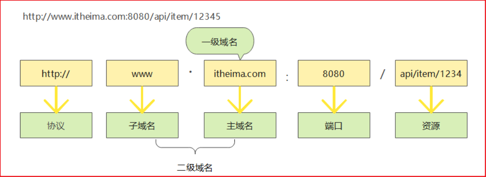 

#### 3.2为什么会出现跨域问题

​	出于浏览器的同源策略限制。同源策略（Sameoriginpolicy）是一种约定，它是浏览器最核心也最基本的安全功能，如果缺少了同源策略，则浏览器的正常功能可能都会受到影响。可以说Web是构建在同源策略基础之上的，浏览器只是针对同源策略的一种实现。同源策略会阻止一个域的javascript脚本和另外一个域的内容进行交互。所谓同源（即指在同一个域）就是两个页面具有相同的协议（protocol），主机（host）和端口号（port）

#### 3.3跨域问题演示

+ 导入mall-front到mall-parent

 

+ mall-parent的pom文件

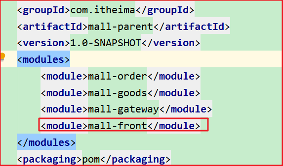 

+ 部署mall-front, mall-gateway,mall-goods
+ 访问

```
http://localhost:18089/html/index.html
```

 

#### 3.4常见的跨域问题解决方案

1. 使用CORS协议采用@crossorgin的注解进行实现
2.  使用spring cloud gateway网关（也可以使用其他的网关技术例如：nginx）的方式来进行实现（推荐
3.  JSONP的方式来进行实现

#### 3.5跨域问题解决

##### 3.5.1方式一

+ 使用@CrossOrigin

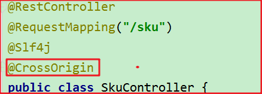 

##### 3.5.2方式二【推荐】

+ 使用网关spring cloud gateway的方式, 在网关工程的application.yml里面:

```yaml
server:
  port: 18084
spring:
  application:
    name: mall-gateway
  cloud:
    nacos:
      discovery:
        server-addr: localhost:8848
    gateway:
      routes: #路由配置
        - id: mall-order #唯一标识,默认是UUID
          #uri: http://localhost:18082 #转发的路径
          uri: lb://mall-order
          predicates: #条件, 用于请求网络路径的匹配规则
            - Path=/order/**


        - id: mall-goods #唯一标识,默认是UUID
          uri: lb://mall-goods
          predicates: #条件, 用于请求网络路径的匹配规则
            - Path=/sku/**
          filters:
            - StripPrefix=1 #请求地址去除一个前缀路径 http://localhost:18084/sku/sku/1-->http://localhost:18081/sku/1

      globalcors:
        cors-configurations:
          '[/**]': # 匹配所有的请求
            allowedOrigins: "*" # 允许所有的域来访问
            allowedHeaders: "*" # 允许所有的头携带过来
            allowedMethods:  # 允许以下的方法的请求来访问
              - GET
              - DELETE
              - POST
              - PUT
```

> https://docs.spring.io/spring-cloud-gateway/docs/current/reference/html/#cors-configuration

统一网关进行处理，解耦，升级维护方便，不用再在所有的controller类上边进行配置了。


# 第三章- 配置中心SpringCloudAliabaNacos

## 案例-Nacos作为配置中心入门

### 1.目标

- [ ] 掌握Nacos作为配置中心入门

### 2.路径

1. 配置中心简介
2. 配置中心选型

3. 环境的搭建

4. 基本配置

### 3.讲解

#### 3.1 配置中心简介

​	随着业务的发展、微服务架构的升级，服务的数量、程序的配置日益增多（各种微服务、各种服务器地址、各种参数），传统的配置文件方式和数据库的方式已无法满足开发人员对配置管理的要求：

- 安全性：配置跟随源代码保存在代码库中，容易造成配置泄漏
- 时效性：修改配置，需要重启服务才能生效
- 局限性：无法支持动态调整：例如日志开关、功能开关

因此，我们需要配置中心来统一管理配置文件，一旦配置修改，则应用即可立即生效。

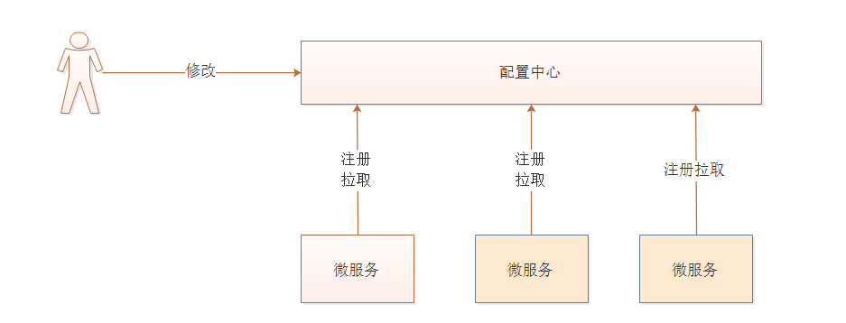


#### 3.2 配置中心选型


|    功能点    |                  Spring Cloud Config                   | Apollo                                    | Nacos                                |
| :----------: | :----------------------------------------------------: | ----------------------------------------- | ------------------------------------ |
|   开源时间   |                         2014.9                         | 2016.5                                    | 2018.6                               |
| 配置实时推送 |                支持（Spring Cloud Bus）                | 支持（HTTP长轮询1S内）                    | 支持（HTTP长轮询1S内）               |
|   版本管理   |                      支持（Git）                       | 支持                                      | 支持                                 |
|   配置回滚   |                      支持（Git）                       | 支持                                      | 支持                                 |
|   灰度发布   |                          支持                          | 支持                                      | 待支持                               |
|   权限管理   |                          支持                          | 支持                                      | 支持                                 |
|    多集群    |                          支持                          | 支持                                      | 支持                                 |
|    多环境    |                          支持                          | 支持                                      | 支持                                 |
|   监听查询   |                          支持                          | 支持                                      | 支持                                 |
|    多语言    |                       只支持java                       | Go、C++、java、Python、PHP、.net、OpenAPI | Python、Java、Node.js、OpenAPI       |
|   单机部署   | Config-server+Git+Spring Cloud Bus（支持配置实时推送） | Apollo-quikstart+MySQL                    | Nacos单节点                          |
|  分布式部署  |            Config-server+Git+MQ（部署复杂）            | Config+Admin+Portal+MySQL（部署复杂）     | Nacos+MySQL（部署简单）              |
| 配置格式校验 |                         不支持                         | 支持                                      | 支持                                 |
|   通信协议   |                       HTTP和AMQP                       | HTTP                                      | HTTP                                 |
|  数据一致性  |      Git保证数据一致性，Config-server从Git读数据       | 数据库模拟消息队列，Apollo定时读消息      | HTTP异步通知                         |
|    单机读    |                     7（限流所致）                      | 9000                                      | 15000                                |
|    单机写    |                     5（限流所致）                      | 1100                                      | 1800                                 |
|   3节点读    |                     21（限流所致）                     | 27000                                     | 45000                                |
|   3节点写    |                     5（限流所致）                      | 3300                                      | 5600                                 |
|     文档     |                          详细                          | 详细                                      | 有待完善（目前只有java开发相关文档） |

以上。我们建议使用nacos或者apollo。由于nacos和spring cloud做了很好集成，建议使用spring cloud alibaba nacos.


#### 3.3环境的搭建(配置mall-goods)


+ pom

```xml
    <!--nacos-config-->
    <dependency>
        <groupId>com.alibaba.cloud</groupId>
        <artifactId>spring-cloud-starter-alibaba-nacos-config</artifactId>
    </dependency>
```

+ bootstrap.yml

```yaml
spring:
  application:
    name: mall-goods
  cloud:
    nacos:
      discovery:
        server-addr: 127.0.0.1:8848 #配置了注册中心（nacos-server）的地址
      config:
        server-addr: 127.0.0.1:8848 #Nacos作为配置中心地址
        file-extension: yml #指定yml格式的配置
```

在项目初始化时, 要保证先从配置中心进行配置拉取, 拉取配置之后, 才能保证项目的正常启动.

优先级: bootstrap.yml > application.yml

#### 3.4基本配置

+ 新增配置 

 

DataId：`mall-goods.yml` 

```yaml
server:
  port: 18081
info: hello...
```

+ 修改mall-goods的SkuController(添加@RefreshScope注解)

```java
package com.itheima.goods.controller;

import com.itheima.goods.pojo.Sku;
import lombok.extern.slf4j.Slf4j;
import org.springframework.beans.factory.annotation.Value;
import org.springframework.cloud.context.config.annotation.RefreshScope;
import org.springframework.web.bind.annotation.*;

@RestController
@RequestMapping("/sku")
@Slf4j
@RefreshScope
public class SkuController {

    @Value("${server.port}")
    private String port;

    @Value("${info}")
    private String info;

    @GetMapping("/{id}")
    public Sku findById(@PathVariable(name="id")String id,String name){
        log.info("SkuController..."+port);
        log.info("name={}",name);
        log.info("info={}",info);
        Sku sku = new Sku(id, "华为手机", 1999, 10, "华为", "1");
        return sku;
    }
}

```


### 4.小结


## 知识点-Nacos作为配置中心进阶

### 1.目标

- [ ] 掌握多环境的配置

### 2.路径

1. Nacos配置管理模型

2. 三种方案加载配置

### 3.讲解

#### 3.1Nacos配置管理模型

​	在 Nacos中，本身有多个不同管理级别的概念，包括：Data ID、Group、Namespace，进行多环境管理。

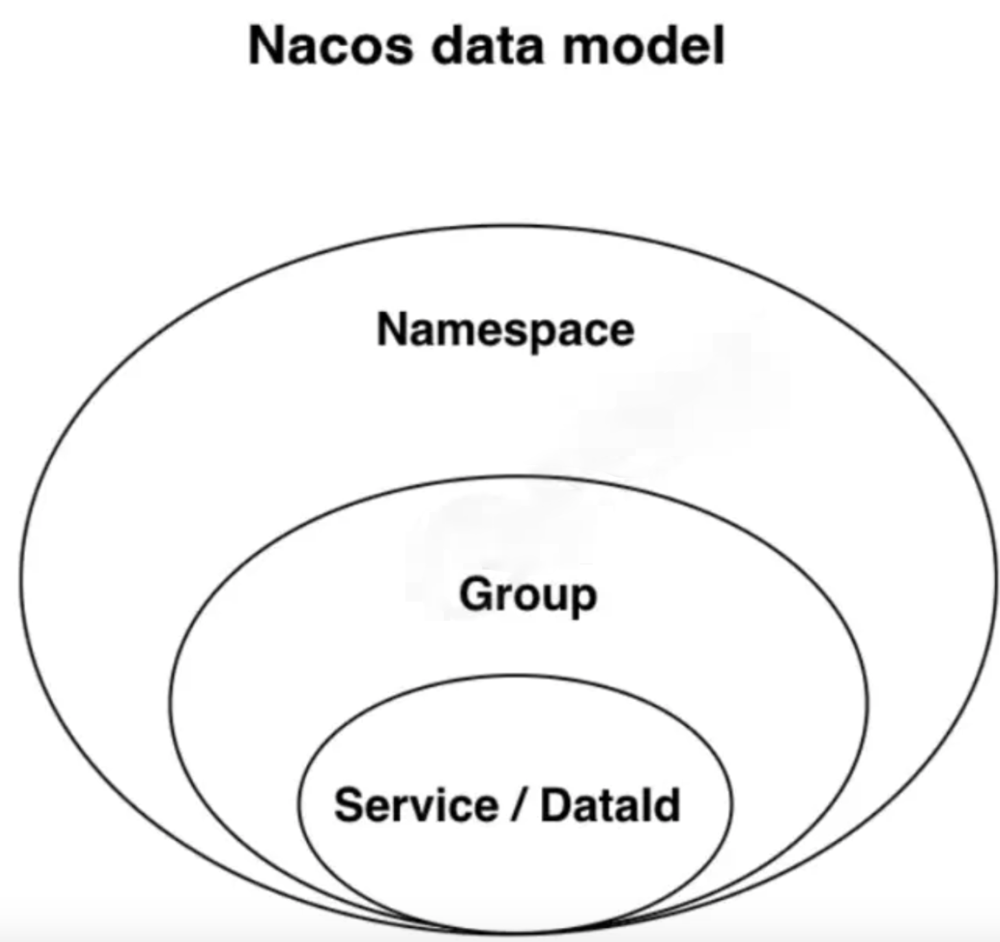

+ 配置项
       配置集中包含的一个个配置内容就是配置项。它代表一个具体的可配置的参数与其值域，通常以 key=value 的形式存在。例如我们常配置系统的日志输出级别（logLevel=INFO|WARN|ERROR） 就是一个配置项。
+ 配置集(Data ID)
   在系统中，一个配置文件通常就是一个配置集，一个配置集可以包含了系统的各种配置信息，例如，一个配置集可能包含了数据源、线程池、日志级别等配置项。每个配置集都可以定义一个有意义的名称，就是配置集的ID即DataID。
+ 配置分组(Group)
      配置分组是对配置集进行分组，通过一个有意义的字符串（如 Buy 或 Trade ）来表示，不同的配置分组下可以有相同的配置集（Data ID）。当您在 Nacos 上创建一个配置时，如果未填写配置分组的名称，则配置分组的名称默认采用 DEFAULT_GROUP 。配置分组的常见场景：可用于区分不同的项目或应用，例如：学生管理系统的配置集可以定义一个group为：STUDENT_GROUP。
+ 命名空间(Namespace)
  命名空间（namespace）可用于进行不同环境的配置隔离。例如可以隔离开发环境、测试环境和生产环境，因为它们的配置可能各不相同，或者是隔离不同的用户，不同的开发人员使用同一个nacos管理各自的配置，可通过namespace隔离。不同的命名空间下，可以存在相同名称的配置分组(Group) 或 配置集。


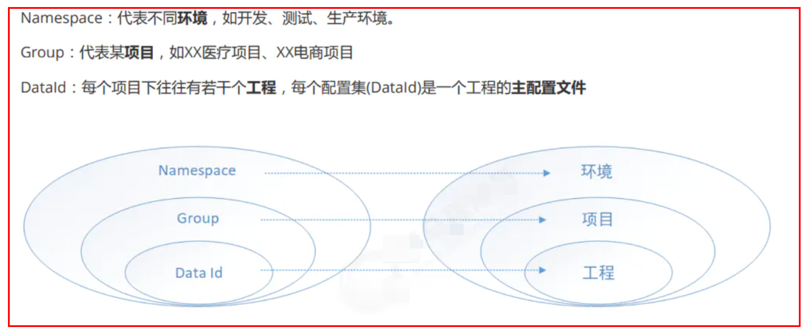  

#### 3.2三种方案加载配置

##### 3.2.1使用 Data ID 与 profiles 实现

**说明:**

Data Id 完整格式为：`${prefix}-${spring.profile.active}.${file-extension}`。

- prefix 默认为 `spring.application.name` 的值，也可以通过配置项 `spring.cloud.nacos.config.prefix`来配置。
- spring.profile.active  即为当前环境对应的 profile ，详情可以参考 Spring Boot文档。
  注意：当 `spring.profile.active` 为空时，对应的连接符也将不存在，dataId 的拼接格式变成 `${prefix}.${file-extension}`
- file-exetension为配置内容的数据格式，可以通过配置项 spring.cloud.nacos.config.file-extension 来配置。目前只支持 properties 和 yaml 类型。

**示例:**

+ 在mall-goods创建: application.yml

```yml
spring:
  profiles:
    active: dev # 表示开发环境
    #active: test # 表示测试环境
    #active: info
```

+ 在nacos新增配置 dataId为 `mall-goods-dev.yml`

```
server:
  port: 18081
info: hello...
```

##### 3.2.2使用Group实现

**说明:**

通过不同的 Group ，可以根据不同的环境使用不同的配置，但是它们的 Data ID 是完全相同的

此时项目的配置文件需要根据添加 group 来区分

**示例:**

+ 在nacos新增配置 dataId为 `mall-goods-pro.yml` , group为`g1`

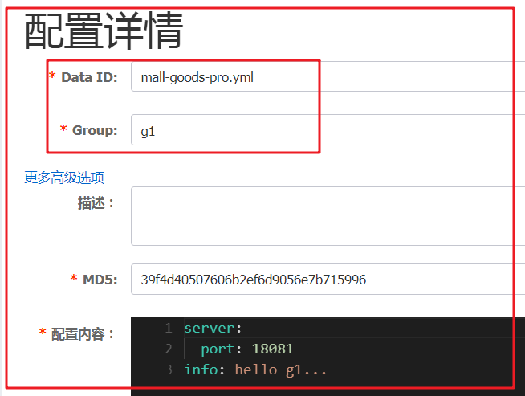  

```yaml
server:
  port: 18081
info: hello g1...
```

+ 在nacos新增配置 dataId为 `mall-goods-pro.yml` , group为`g2`

 

```
server:
  port: 18081
info: hello g2...
```

+ 修改mall-goods的application.yml

```
spring:
  profiles:
    active: pro # 表示开发环境
```


+ 在mall-goods的bootstrap.yml新增group

```yaml
spring:
  application:
    name: mall-goods
  cloud:
    nacos:
      discovery:
        server-addr: 127.0.0.1:8848 #配置了注册中心（nacos-server）的地址
      config:
        server-addr: 127.0.0.1:8848 #Nacos作为配置中心地址
        file-extension: yml #指定yml格式的配置
        group: g2
```


##### 3.2.3使用 Namespace 实现

**说明**

​	Namespace 用于进行租户粒度的配置隔离。不同的命名空间下，可以存在相同的 Group 或 Data ID 的配置。常用于不同环境的配置的区分隔离，例如：开发测试环境和生产环境的资源（如配置、服务）隔离等。

**示例**

1. 创建命名空间

 

2. 在dev新建配置

  

+ dataId : `mall-goods`
+ group: `jd`
+ 内容

```yaml
server:
  port: 18081
info: hello dev jd...
```


3. 修改mall-goods的 bootstrap.yml

```yaml
spring:
  application:
    name: mall-goods
  cloud:
    nacos:
      discovery:
        server-addr: 127.0.0.1:8848 #配置了注册中心（nacos-server）的地址
      config:
        server-addr: 127.0.0.1:8848 #Nacos作为配置中心地址
        file-extension: yml #指定yml格式的配置
        group: jd
        namespace: b7c81607-4942-4093-9c32-4df5a25b71b3
```

4. 删除application.yml 或者去掉`spring.profile.active`
5. 访问

```
http://localhost:18081/sku/1
```


### 4.小结


## 知识点-Nacos持久化配置

### 1.目标

- [ ] 掌握Nacos持久化配置

### 2.路径

1. Nacos持久化配置说明
2. Nacos持久化配置操作

### 3.讲解

#### 3.1Nacos持久化配置说明

​	当我们使用默认配置启动Nacos时，所有配置的信息都被Nacos保存在了内嵌数据库derby中。会存在以下问题：

1. 使用内嵌数据库，注定会有存储上限
2. 不适合集群，分布式环境
3. 不方便观察数据存储的基本情况

0.7版本之后增加了支持mysql数据源能力，也是工作里面常用的方式。

#### 3.2Nacos持久化配置操作

1. nacos\conf目录下找到sql脚本，新建一个nacos_config的数据库,执行脚本

 

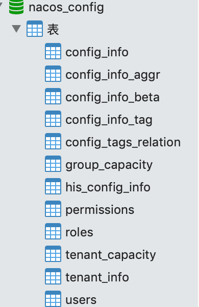 

2. 修改nacos\conf目录下找到application.properties

 

```
spring.datasource.platform=mysql
db.num=1
db.url.0=jdbc:mysql://127.0.0.1:3306/nacos_config?characterEncoding=utf8&serverTimezone=UTC
db.user=root
db.password=123456
```

3. 启动Nacos

### 4.小结