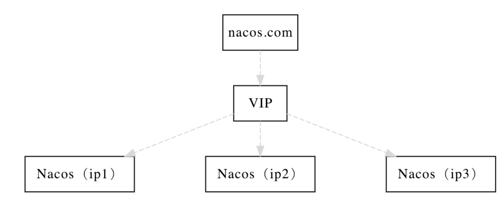
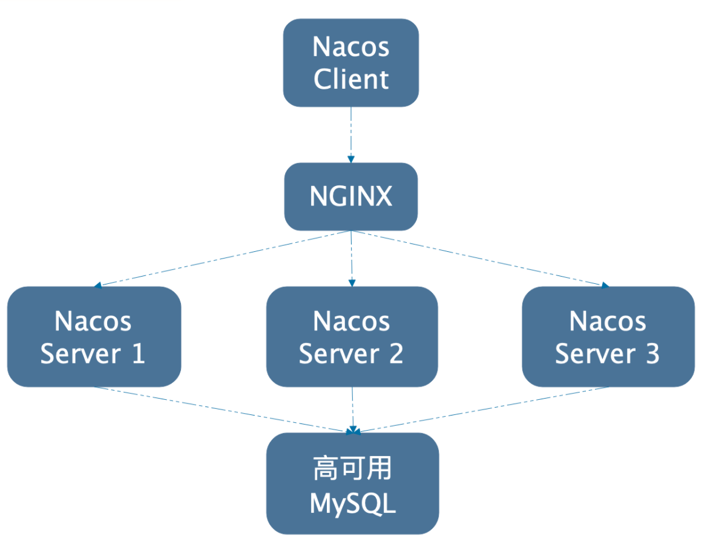
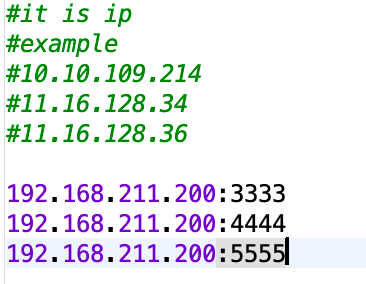
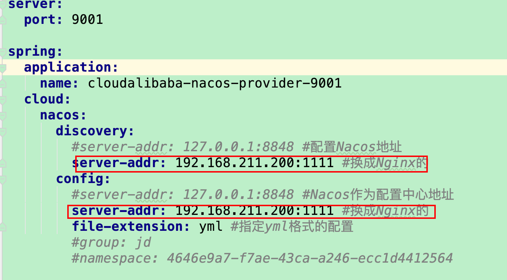
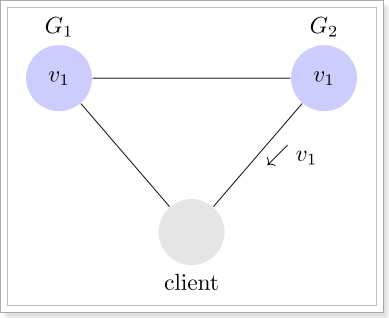

# 扩展

## 知识点-Nacos集群

### 1.目标

- [ ] 掌握Nacos集群

### 2.路径

1. nacos集群介绍
2. nacos集群搭建
3. 微服务配置Nacos集群

### 3.讲解

#### 3.1nacos集群介绍

https://nacos.io/zh-cn/docs/cluster-mode-quick-start.html

 

因此开源的时候推荐用户把所有服务列表放到一个vip下面，然后挂到一个域名下面

[http://ip1](http://ip1/):port/openAPI 直连ip模式，机器挂则需要修改ip才可以使用。

[http://VIP](http://vip/):port/openAPI 挂载VIP模式，直连vip即可，下面挂server真实ip，可读性不好。

[http://nacos.com](http://nacos.com/):port/openAPI 域名 + VIP模式，可读性好，而且换ip方便，推荐模式。


#### 3.2nacos集群搭建

 

1个Nginx+3个nacos+1个mysql

+ 安装mysql
+ 上传nacos，Nginx到服务器，解压到/usr/local目录下
+ 运行nacos/config/nacos-mysql.sql脚本
+ 修改nacos/config/application.properties配置

```
spring.datasource.platform=mysql
db.num=1
db.url.0=jdbc:mysql://127.0.0.1:3306/nacos_config?characterEncoding=utf8&serverTimezone=UTC
db.user.0=root
db.password.0=123456
```

+ 复制三份Nacos安装包，将 `conf/application.properties` 中的 `server.port=8848` 分别改成

```
server.port=3333
server.port=4444
server.port=5555
```

+ 修改nacos/config/cluster.conf.example(3个都需要改)

```
cp cluster.conf.example cluster.conf
vim cluster.conf
```

 

+ 三台都启动

```
sh start
```

+ Nginx的配置，修改nignx的配置文件

```conf
    upstream cluster{
    	   server 127.0.0.1:3333;
	   		 server 127.0.0.1:4444;
	  		 server 127.0.0.1:5555;    	
    }

    server {
        listen       1111;
        server_name  localhost;

        #charset koi8-r;

        #access_log  logs/host.access.log  main;

        location / {
        	  proxy_pass http://cluster;
            #root   html;
            #index  index.html index.htm;
        }
```

+ 启动Nginx

```
./nginx -c /usr/local/nginx/conf/nginx.conf
```

+ 访问 http://192.168.211.200:1111/nacos/

 


#### 3.3微服务配置Nacos集群

 


### 4.小结


## 知识点-Nacos之CAP

### 1.目标

- [ ] 掌握Nacos的CA和CP的切换

### 2.路径

1. CAP定理
2. CA和CP的切换

### 3.讲解

####  3.1CAP定理

什么是CAP定理呢？

 

1998年，加州大学的计算机科学家 Eric Brewer 提出，分布式系统有三个指标。

- Consistency（一致性）
- Availability（可用性）
- Partition tolerance （分区容错性）

它们的第一个字母分别是 C、A、P。

Eric Brewer 说，这三个指标不可能同时做到。这个结论就叫做 CAP 定理。

##### 3.1.1 Partition tolerance 

先看 Partition tolerance，中文叫做"分区容错"。

大多数分布式系统都分布在多个子网络。每个子网络就叫做一个区（partition）。分区容错的意思是，区间通信可能失败。比如，一台服务器（机房）放在深圳，另一台服务器（机房）放在北京，这就是两个区，它们之间可能因网络问题无法通信。

如图：

 

上图中，G1 和 G2 是两台跨区的服务器。G1 向 G2 发送一条消息，G2 可能无法收到。系统设计的时候，必须考虑到这种情况。

一般来说，分布式系统，分区容错无法避免，因此可以认为 CAP 的 P 总是成立。根据CAP 定理，剩下的 C 和 A 无法同时做到。

##### 3.1.2.Consistency

Consistency 中文叫做"一致性"。意思是，写操作之后的读操作，必须返回该值。举例来说，某条记录是 v0，用户向 G1 发起一个写操作，将其改为 v1。

 

接下来，用户的读操作就会得到 v1。这就叫一致性。

 

问题是，用户有可能向 G2 发起读操作，由于 G2 的值没有发生变化，因此返回的是 v0。G1 和 G2 读操作的结果不一致，这就不满足一致性了。


为了让 G2 也能变为 v1，就要在 G1 写操作的时候，让 G1 向 G2 发送一条消息，要求 G2 也改成 v1。

 

这样的话，用户向 G2 发起读操作，也能得到 v1。

 

##### 3.1.3.Availability 

 Availability 中文叫做"可用性"，意思是只要收到用户的请求，服务器就必须给出回应（对和错不论）。

用户可以选择向 G1 或 G2 发起读操作。不管是哪台服务器，只要收到请求，就必须告诉用户，到底是 v0 还是 v1，否则就不满足可用性。

##### 3.1.4.Consistency 和 Availability 的矛盾

一致性和可用性，为什么不可能同时成立？

答案很简单，因为可能通信失败（即出现分区容错）。

如果保证 G2 的一致性，那么 G1 必须在写操作时，锁定 G2 的读操作和写操作。只有数据同步后，才能重新开放读写。锁定期间，G2 不能读写，没有可用性。

如果保证 G2 的可用性，那么势必不能锁定 G2，所以一致性不成立。

综上所述，G2 无法同时做到一致性和可用性。系统设计时只能选择一个目标。如果追求一致性，那么无法保证所有节点的可用性；如果追求所有节点的可用性，那就没法做到一致性。

#### 3.2AP和CP的切换

​	一般来说，如果不需要存储服务级别的信息且服务实例是通过nacos-client注册，并能够保持心跳上报，那么就可以选择AP模式。当前主流的服务如Spring Cloud 和 Dubbo服务，都适用于AP模式，AP模式为了服务的可用性而减弱了一致性，因此AP模式下只支持注册临时实例。 默认AP。

​	如果需要在服务级别编辑或者存储配置信息，那么CP是必须的，K8S服务和DNS服务则适用于CP模式。CP模式下支持注册持久化实例，此时则是以Raft协议为集群运行模式，该模式下注册实例之前必须先注册服务，如果服务不存在，则会返回错误。


