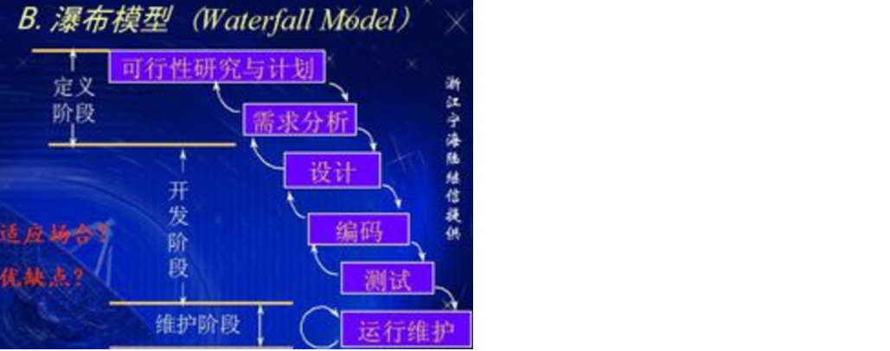
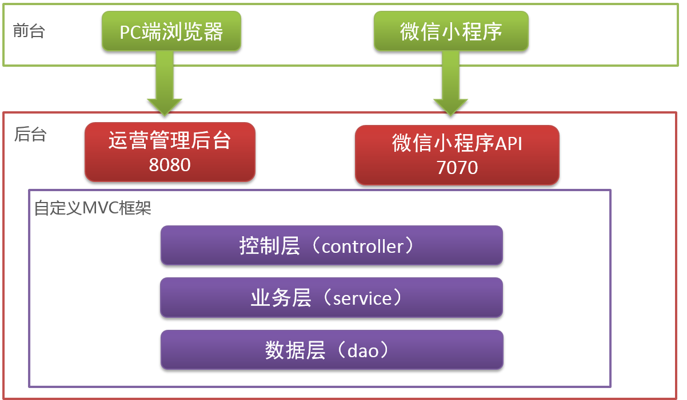
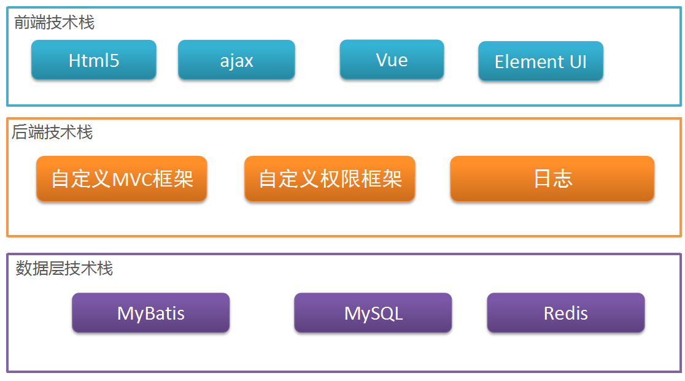
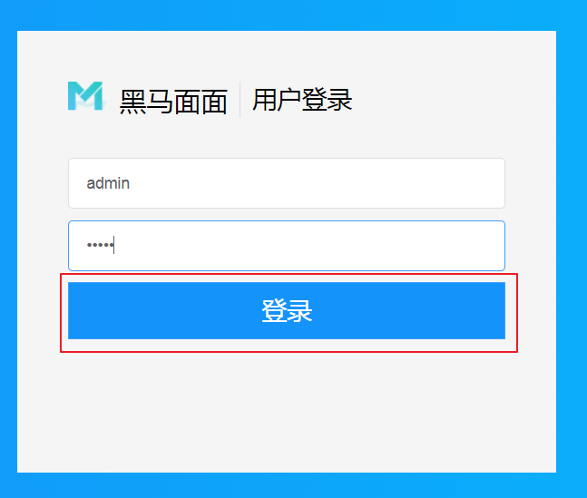
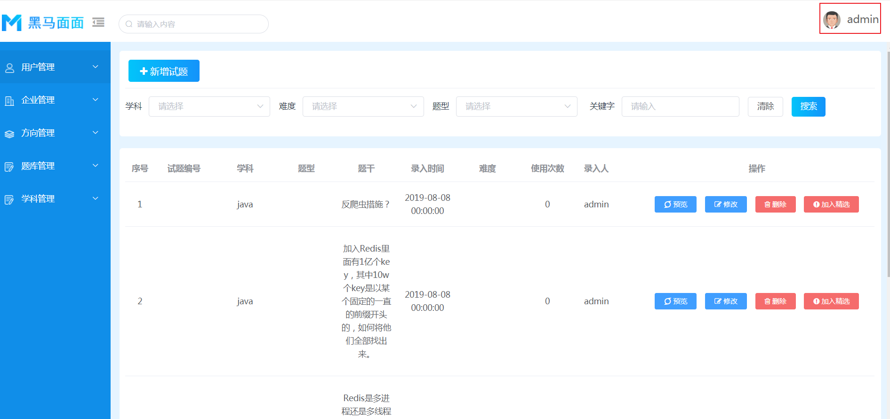
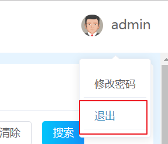
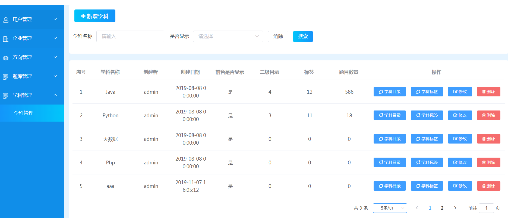
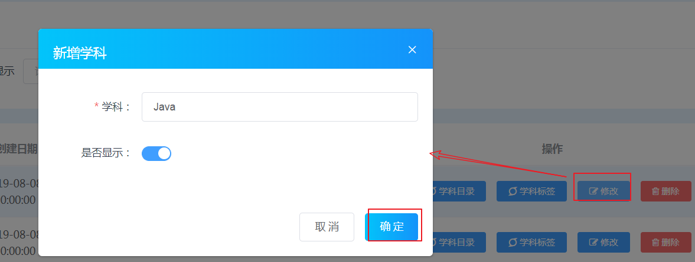

#  day40 - 面面项目第二天

# 今日目标

- [ ] 了解什么是ElementUI
- [ ] 了解ElementUI常用组件使用
- [ ] 了解项目的开发流程
- [ ] 了解项目功能与工程结构
- [ ] 能够完成项目工程初始化及模块创建
- [ ] 能够完成后台系统的登录
- [ ] 能够完成后台系统的的退出 
- [ ] 能够完成学科管理的增删改查功能 

# 第一章-ElementUI 

## 知识点-ElementUI的介绍

### 1.目标

​	传智健康项目后台系统就是使用ElementUI来构建页面. 

### 2.路径

+ ElementUI介绍
+ ElementUI的使用前的导入

### 3.讲解

#### 3.1 什么是ElementUI

​	ElementUI是一套基于VUE2.0的桌面端组件库，ElementUI提供了丰富的组件帮助开发人员快速构建功能强大、风格统一的页面。

官网地址：http://element-cn.eleme.io/#/zh-CN

#### 3.2ElementUI的使用前的导入

在页面上引入 js 和 css 文件即可开始使用，如下：

~~~html
<!-- 引入ElementUI样式 -->
<link rel="stylesheet" href="https://unpkg.com/element-ui/lib/theme-chalk/index.css">
<script src="https://unpkg.com/vue/dist/vue.js"></script>
<!-- 引入ElementUI组件库 -->
<script src="https://unpkg.com/element-ui/lib/index.js"></script>
~~~

### 4.小结

1. ElementUI是饿了么开发的一套基于vue的组件库, 适合做**后台管理系统页面**

2. 使用步骤

   + 导入ElementUI 的js文件和css文件
   + 创建vue实例


## 知识点-常用组件

### 1.目标

+ 了解ElementUI常用组件使用

### 2.路径

+ Container 布局容器
+ Dropdown 下拉菜单
+ NavMenu 导航菜单
+ Table 表格
+ Pagination 分页
+ Message 消息提示
+ Tabs 标签页
+ Form 表单

### 3.讲解

#### 3.1 Container 布局容器

用于布局的容器组件，方便快速搭建页面的基本结构：

`<el-container>`：外层容器。当子元素中包含 `<el-header>` 或 `<el-footer>` 时，全部子元素会垂直上下排列，否则会水平左右排列

`<el-header>`：顶栏容器

`<el-aside>`：侧边栏容器

`<el-main>`：主要区域容器

`<el-footer>`：底栏容器

~~~html
<body>
  <div id="app">
    <el-container>
      <el-header>Header</el-header>
      <el-container>
        <el-aside width="200px">Aside</el-aside>
        <el-container>
          <el-main>Main</el-main>
          <el-footer>Footer</el-footer>
        </el-container>
      </el-container>
    </el-container>
  </div>
  <style>
    .el-header, .el-footer {
      background-color: #B3C0D1;
      color: #333;
      text-align: left;
      line-height: 60px;
    }

    .el-aside {
      background-color: #D3DCE6;
      color: #333;
      text-align: center;
      line-height: 200px;
    }

    .el-main {
      background-color: #E9EEF3;
      color: #333;
      text-align: center;
      line-height: 590px;
    }
  </style>
</body>
<script>
  new Vue({
    el:'#app'
  });
</script>
~~~

#### 3.2 Dropdown 下拉菜单

将动作或菜单折叠到下拉菜单中。

~~~html
<body>
<div id="app">
    <el-dropdown>
  <span class="el-dropdown-link">
    下拉菜单<i class="el-icon-arrow-down el-icon--right"></i>
  </span>
        <el-dropdown-menu slot="dropdown">
            <el-dropdown-item>黄金糕</el-dropdown-item>
            <el-dropdown-item>狮子头</el-dropdown-item>
            <el-dropdown-item>螺蛳粉</el-dropdown-item>
            <el-dropdown-item disabled>双皮奶</el-dropdown-item>
            <el-dropdown-item divided>蚵仔煎</el-dropdown-item>
        </el-dropdown-menu>
    </el-dropdown>
</div>
<style>
    .el-dropdown-link {
        cursor: pointer;
        color: #409EFF;
    }
    .el-icon-arrow-down {
        font-size: 12px;
    }
</style>
</body>

<script>
    new Vue({
        el:"#app"
    });
</script>
~~~

#### 3.3 NavMenu 导航菜单

为网站提供导航功能的菜单。

~~~html
<body>
<div id="app">
    <el-row class="tac">
        <el-col :span="12">
            <h5>默认颜色</h5>
            <el-menu
                    default-active="2"
                    class="el-menu-vertical-demo"
                    @open="handleOpen"
                    @close="handleClose">
                <el-submenu index="1">
                    <template slot="title">
                        <i class="el-icon-location"></i>
                        <span>导航一</span>
                    </template>
                    <el-menu-item-group>
                        <template slot="title">分组一</template>
                        <el-menu-item index="1-1">选项1</el-menu-item>
                        <el-menu-item index="1-2">选项2</el-menu-item>
                    </el-menu-item-group>
                    <el-menu-item-group title="分组2">
                        <el-menu-item index="1-3">选项3</el-menu-item>
                    </el-menu-item-group>
                    <el-submenu index="1-4">
                        <template slot="title">选项4</template>
                        <el-menu-item index="1-4-1">选项1</el-menu-item>
                    </el-submenu>
                </el-submenu>
                <el-menu-item index="2">
                    <i class="el-icon-menu"></i>
                    <span slot="title">导航二</span>
                </el-menu-item>
                <el-menu-item index="3" disabled>
                    <i class="el-icon-document"></i>
                    <span slot="title">导航三</span>
                </el-menu-item>
                <el-menu-item index="4">
                    <i class="el-icon-setting"></i>
                    <span slot="title">导航四</span>
                </el-menu-item>
            </el-menu>
        </el-col>
        <el-col :span="12">
            <h5>自定义颜色</h5>
            <el-menu
                    default-active="2"
                    class="el-menu-vertical-demo"
                    @open="handleOpen"
                    @close="handleClose"
                    background-color="#545c64"
                    text-color="#fff"
                    active-text-color="#ffd04b">
                <el-submenu index="1">
                    <template slot="title">
                        <i class="el-icon-location"></i>
                        <span>导航一</span>
                    </template>
                    <el-menu-item-group>
                        <template slot="title">分组一</template>
                        <el-menu-item index="1-1">选项1</el-menu-item>
                        <el-menu-item index="1-2">选项2</el-menu-item>
                    </el-menu-item-group>
                    <el-menu-item-group title="分组2">
                        <el-menu-item index="1-3">选项3</el-menu-item>
                    </el-menu-item-group>
                    <el-submenu index="1-4">
                        <template slot="title">选项4</template>
                        <el-menu-item index="1-4-1">选项1</el-menu-item>
                    </el-submenu>
                </el-submenu>
                <el-menu-item index="2">
                    <i class="el-icon-menu"></i>
                    <span slot="title">导航二</span>
                </el-menu-item>
                <el-menu-item index="3" disabled>
                    <i class="el-icon-document"></i>
                    <span slot="title">导航三</span>
                </el-menu-item>
                <el-menu-item index="4">
                    <i class="el-icon-setting"></i>
                    <span slot="title">导航四</span>
                </el-menu-item>
            </el-menu>
        </el-col>
    </el-row>
</div>
<style>
    .el-dropdown-link {
        cursor: pointer;
        color: #409EFF;
    }
    .el-icon-arrow-down {
        font-size: 12px;
    }
</style>
</body>

<script>
    new Vue({
        el:"#app",
        methods: {
            handleOpen(key, keyPath) {
                console.log(key, keyPath);
            },
            handleClose(key, keyPath) {
                console.log(key, keyPath);
            }
        }
    });
</script>
~~~

#### 3.4 Table 表格【重要】

用于展示多条结构类似的数据，可对数据进行排序、筛选、对比或其他自定义操作。

~~~html
<body>
<div id="app">
    <template>
        <el-table
                :data="tableData"
                style="width: 100%"
                :row-class-name="tableRowClassName">
            <el-table-column
                    prop="date"
                    label="日期"
                    width="180">
            </el-table-column>
            <el-table-column
                    prop="name"
                    label="姓名"
                    width="180">
            </el-table-column>
            <el-table-column
                    prop="address"
                    label="地址">
            </el-table-column>
        </el-table>
    </template>
</div>
<style>
    .el-table .warning-row {
        background: oldlace;
    }

    .el-table .success-row {
        background: #f0f9eb;
    }
</style>
</body>

<script>
    new Vue({
        el:"#app",
        methods: {
            tableRowClassName({row, rowIndex}) {
                if (rowIndex === 1) {
                    return 'warning-row';
                } else if (rowIndex === 3) {
                    return 'success-row';
                }
                return '';
            }
        },
        data() {
            return {
                tableData: [{
                    date: '2016-05-02',
                    name: '王小虎',
                    address: '上海市普陀区金沙江路 1518 弄',
                }, {
                    date: '2016-05-04',
                    name: '王小虎',
                    address: '上海市普陀区金沙江路 1518 弄'
                }, {
                    date: '2016-05-01',
                    name: '王小虎',
                    address: '上海市普陀区金沙江路 1518 弄',
                }, {
                    date: '2016-05-03',
                    name: '王小虎',
                    address: '上海市普陀区金沙江路 1518 弄'
                }]
            }
        }
    });
</script>
~~~

#### 3.5 Pagination 分页【重要】

当数据量过多时，使用分页分解数据。

~~~html
<body>
<div id="app">
    <template>
        <div class="block">
            <span class="demonstration">显示总数</span>
            <el-pagination
                    @size-change="handleSizeChange"
                    @current-change="handleCurrentChange"
                    :current-page.sync="currentPage1"
                    :page-size="100"
                    layout="total, prev, pager, next"
                    :total="1000">
            </el-pagination>
        </div>
        <div class="block">
            <span class="demonstration">调整每页显示条数</span>
            <el-pagination
                    @size-change="handleSizeChange"
                    @current-change="handleCurrentChange"
                    :current-page.sync="currentPage2"
                    :page-sizes="[100, 200, 300, 400]"
                    :page-size="100"
                    layout="sizes, prev, pager, next"
                    :total="1000">
            </el-pagination>
        </div>
        <div class="block">
            <span class="demonstration">直接前往</span>
            <el-pagination
                    @size-change="handleSizeChange"
                    @current-change="handleCurrentChange"
                    :current-page.sync="currentPage3"
                    :page-size="100"
                    layout="prev, pager, next, jumper"
                    :total="1000">
            </el-pagination>
        </div>
        <div class="block">
            <span class="demonstration">完整功能</span>
            <el-pagination
                    @size-change="handleSizeChange"
                    @current-change="handleCurrentChange"
                    :current-page="currentPage4"
                    :page-sizes="[100, 200, 300, 400]"
                    :page-size="100"
                    layout="total, sizes, prev, pager, next, jumper"
                    :total="400">
            </el-pagination>
        </div>
    </template>
</div>
<style>
    .el-table .warning-row {
        background: oldlace;
    }

    .el-table .success-row {
        background: #f0f9eb;
    }
</style>
</body>

<script>
    new Vue({
        el:"#app",
        methods: {
            handleSizeChange(val) {
                console.log(`每页 ${val} 条`);
            },
            handleCurrentChange(val) {
                console.log(`当前页: ${val}`);
            }
        },
        data() {
            return {
                currentPage1: 5,
                currentPage2: 5,
                currentPage3: 5,
                currentPage4: 4
            };
        }
    });
</script>
~~~

#### 3.6 Message 消息提示【重要】

常用于主动操作后的反馈提示。

~~~html
<body>
<div id="app">
    <template>
        <el-button :plain="true" @click="open2">成功</el-button>
        <el-button :plain="true" @click="open3">警告</el-button>
        <el-button :plain="true" @click="open1">消息</el-button>
        <el-button :plain="true" @click="open4">错误</el-button>
    </template>
</div>
<style>
    .el-table .warning-row {
        background: oldlace;
    }

    .el-table .success-row {
        background: #f0f9eb;
    }
</style>
</body>

<script>
    new Vue({
        el:"#app",
        methods: {
            open1() {
                this.$message('这是一条消息提示');
            },
            open2() {
                this.$message({
                    message: '恭喜你，这是一条成功消息',
                    type: 'success'
                });
            },

            open3() {
                this.$message({
                    message: '警告哦，这是一条警告消息',
                    type: 'warning'
                });
            },

            open4() {
                this.$message.error('错了哦，这是一条错误消息');
            }
        }
    });
</script>
~~~

#### 3.7 Tabs 标签页

分隔内容上有关联但属于不同类别的数据集合。

~~~html
<body>
<div id="app">
    <el-tag
            :key="tag"
            v-for="tag in dynamicTags"
            closable
            :disable-transitions="false"
            @close="handleClose(tag)">
        {{tag}}
    </el-tag>
    <el-input
            class="input-new-tag"
            v-if="inputVisible"
            v-model="inputValue"
            ref="saveTagInput"
            size="small"
            @keyup.enter.native="handleInputConfirm"
            @blur="handleInputConfirm"
    >
    </el-input>
    <el-button v-else class="button-new-tag" size="small" @click="showInput">+ New Tag</el-button>

</div>
<style>
    .el-tag + .el-tag {
        margin-left: 10px;
    }
    .button-new-tag {
        margin-left: 10px;
        height: 32px;
        line-height: 30px;
        padding-top: 0;
        padding-bottom: 0;
    }
    .input-new-tag {
        width: 90px;
        margin-left: 10px;
        vertical-align: bottom;
    }
</style>
</body>

<script>
    new Vue({
        el:"#app",
        data() {
            return {
                dynamicTags: ['标签一', '标签二', '标签三'],
                inputVisible: false,
                inputValue: ''
            };
        },
        methods: {
            handleClose(tag) {
                this.dynamicTags.splice(this.dynamicTags.indexOf(tag), 1);
            },

            showInput() {
                this.inputVisible = true;
                this.$nextTick(_ => {
                    this.$refs.saveTagInput.$refs.input.focus();
                });
            },

            handleInputConfirm() {
                let inputValue = this.inputValue;
                if (inputValue) {
                    this.dynamicTags.push(inputValue);
                }
                this.inputVisible = false;
                this.inputValue = '';
            }
        }
    });
</script>
~~~

#### 3.8 Form 表单【重要】

由输入框、选择器、单选框、多选框等控件组成，用以收集、校验、提交数据。在 Form 组件中，每一个表单域由一个 Form-Item 组件构成，表单域中可以放置各种类型的表单控件，包括 Input、Select、Checkbox、Radio、Switch、DatePicker、TimePicker。

~~~html
<body>
<div id="app">
    <!--
	rules：表单验证规则
-->
    <el-form ref="aa" :model="form" :rules="rules" label-width="80px">
        <!--
            prop：表单域 model 字段，在使用 validate、resetFields 方法的情况下，该属性是必填的
        -->
        <el-form-item label="活动名称" prop="name">
            <el-input v-model="form.name"></el-input>
        </el-form-item>
        <el-form-item label="活动区域" prop="region">
            <el-select v-model="form.region" placeholder="请选择活动区域">
                <el-option label="区域一" value="shanghai"></el-option>
                <el-option label="区域二" value="beijing"></el-option>
            </el-select>
        </el-form-item>
        <el-form-item label="活动时间">
            <el-col :span="11">
                <el-date-picker type="date" placeholder="选择日期" v-model="form.date1" style="width: 100%;"></el-date-picker>
            </el-col>
            <el-col class="line" :span="2">-</el-col>
            <el-col :span="11">
                <el-time-picker type="fixed-time" placeholder="选择时间" v-model="form.date2" style="width: 100%;"></el-time-picker>
            </el-col>
        </el-form-item>
        <el-form-item label="即时配送">
            <el-switch v-model="form.delivery"></el-switch>
        </el-form-item>
        <el-form-item label="活动性质">
            <el-checkbox-group v-model="form.type">
                <el-checkbox label="美食/餐厅线上活动" name="type"></el-checkbox>
                <el-checkbox label="地推活动" name="type"></el-checkbox>
                <el-checkbox label="线下主题活动" name="type"></el-checkbox>
                <el-checkbox label="单纯品牌曝光" name="type"></el-checkbox>
            </el-checkbox-group>
        </el-form-item>
        <el-form-item label="特殊资源">
            <el-radio-group v-model="form.resource">
                <el-radio label="线上品牌商赞助"></el-radio>
                <el-radio label="线下场地免费"></el-radio>
            </el-radio-group>
        </el-form-item>
        <el-form-item label="活动形式">
            <el-input type="textarea" v-model="form.desc"></el-input>
        </el-form-item>
        <el-form-item>
            <el-button type="primary" @click="onSubmit">立即创建</el-button>
        </el-form-item>
    </el-form>
</div>

</body>

<script>
    new Vue({
        el: '#app',
        data:{
            form: {
                name: '',
                region: '',
                date1: '',
                date2: '',
                delivery: false,
                type: [],
                resource: '',
                desc: ''
            },
            //定义校验规则
            rules: {
                name: [
                    { required: true, message: '请输入活动名称', trigger: 'blur' },
                    { min: 3, max: 5, message: '长度在 3 到 5 个字符', trigger: 'blur' }
                ],
                region: [
                    { required: true, message: '请选择活动区域', trigger: 'change' }
                ]
            }
        },
        methods:{
            onSubmit() {
                console.log(this.form);
                //validate：对整个表单进行校验的方法，参数为一个回调函数。
                //该回调函数会在校验结束后被调用，并传入两个参数：是否校验成功和未通过校验的字段。
                this.$refs['aa'].validate((valid) => {
                    if (valid) {
                        alert('submit!');
                    } else {
                        console.log('error submit!!');
                        return false;
                    }
                });
            }
        }
    })
</script>
~~~

### 4.小结

1. 大家根据官网过一遍, 目的后面的面面项目 不怕页面就行了

# 第二章-项目介绍和环境搭建

## 知识点-项目的开发流程

### 1.目标

- [ ] 了解项目的开发流程

### 2.讲解

软件开发一般会经历如下几个阶段，整个过程是顺序展开，所以通常称为`瀑布模型`  | `敏捷开发`



### 3.小结

1. `瀑布模型`定义项目的各个阶段

## 知识点-面面项目介绍

### 1.目标

- [ ] 了解面面项目的背景和需求

### 2.路径

1. 项目介绍
2. 原型展示
3. 架构介绍
4. 功能介绍

### 3.讲解

#### 3.1 项目介绍

​	黑马面面是一款**面向程序员的面试刷题小程序**。针对目前大量学员在培训完之后直接去面试企业的通过率低的问题，公司研发了黑马面面小程序，学员在空闲时间可以通过查看企业真实面试题，不仅可以查看企业真题，也可以通过刷题寻找自己的短板进行补充。

`资料\01-需求文档\黑马面面_V2.0.181212.docx`

#### 3.2  原型展示

`资料\02-产品原型\后台原型`

#### 3.3架构介绍

##### 3.1系统架构

​		运营管理后台主要面向公司内部运营人员使用，访问人员主要来自公司内部，未来从安全性和访问量考虑分析，可以和小程序端API接口应用隔离安装部署，所以也需要单独构建一个Web应用。

​		微信小程序面向前端用户，未来从业务增长速度来讲，可能访问的用户越来越多，故从安全性、可维护升级和可扩展性等角度分析，微信。需要独立安装部署，所以需要单独构建一个Web应用；

​	



##### 3.2 技术架构

 

#### 3.4功能介绍

##### 3.4.1 管理后台功能列表

| 序号 | 模块     | 子模块       | 描述                                                         |
| ---- | -------- | :----------- | ------------------------------------------------------------ |
| 1    | 用户管理 | 角色管理     | 通过添加角色并对不同角色赋予不用的权限从而完成对系统中试题录入、审核等角色的配置，实现不同用户操作不同资源。 |
|      |          | 用户管理     | 通过用户管理，可以派生不同角色和权限的新用户。<br />创建的新用户需要指定角色及权限。 |
| 2    | 企业管理 | 企业管理     | 面试真题来源企业，通过企业管理可以完成对面试题所属企业的管理。<br />新增题目可以关联所属企业。 |
| 3    | 方向管理 | 方向管理     | 方向为行业方向，比如电子商务、互联网金融、O2O、医疗服务等。<br />新增企业，必须选择1个或多个行业方向。<br />方向管理可以实现对行业方向的管理操作。 |
| 4    | 学科管理 | 学科管理     | 题目必须隶属某一个学科，通过学科管理可以管理面试题目的大学科，比如Java、Python、PHP等。 |
|      |          | 学科目录管理 | 每个学科下面可以管理学科二级目录，比如Java学科，可以设置Java基础、Java Web、Spring框架等二级目录，目前仅创建学科二级目录。 |
|      |          | 学科标签管理 | 新增题目时，可以为题目设置多个技术标签，标签是创建在学科下面的。<br />通过学科标签管理，实现对学科标签的操作管理。 |
| 5    | 题库管理 | 基础题库     | 用户根据自己的权限，可以录入基础题库。<br />基础题库模块可实现题目的新增、更新、预览、加入精选、复杂查询等操作。 |
|      |          | 精选题库     | 用户根据自己的权限，可以录入精选题库。<br />基础题库模块可实现题目的新增、更新、预览、题目审核、复杂查询等操作。 |
|      |          | 新增题目     | 题目必须隶属某一学科下的某一二级目录，可以为试题指定多个技术标签。<br />题目可以选择来源企业，选择来源企业可以选定其所在城市及行业方向<br />题目分为单选、多选及简答三种类型。<br />单选、多选选项可以选择图片上传<br />题目可以选择学科下的多个标签 |
|      |          | 试题预览     | 试题列表中的题目都可以通过预览方式查看显示效果。             |
|      |          | 试题审核     | 只要精选题目列表中的题目，可以进行试题审核。<br />审核通过自动发布。 |

##### 3.4.2  微信小程序功能列表

| 序号 | 模块               | 子模块             | 描述                                                         |
| ---- | ------------------ | ------------------ | ------------------------------------------------------------ |
| 1    | 用户登录           | 用户登录           | 当前系统必须授权登录方可访问                                 |
| 2    | 设置城市及学科方向 | 设置城市及学科方向 | 后续看到的题目数据全部根据当前用户所选的城市及学科方向来提取数据 |
| 3    | 题库分类列表       | 题库分类列表       | 分类有三种方式（按技术、按企业、按方向）<br />按技术实际是按学科目录，后台接口根据当前学科的学科目录来提前学科目录列表<br />按企业，后台接口根据当前城市提前企业所属城市列表<br />按方向，后台接口根据所选城市和学科选取行业方向列表<br />列表中包含所有分类数据及用户记录数据（已完成题目记录） |
| 4    | 题库分类题目列表   | 题库分类题目列表   | 根据所选分类，提前对应的题目列表，包含题目详情信息           |
| 5    | 题目操作           | 收藏               | 针对某一题目，用户可以收藏这个题目                           |
|      | 答案提交           | 答题               | 答题是在客户端完成<br />单选题目，只要选中某一选项，自动判断对错<br />多项选择，需要选择选项后，单独提交答案，完成判断对错<br />简单题，需要用户根据自己对题目的分析判断，通过查看解析后，完成理想与不理想操作提交 |
|      |                    | 提交答案           | 无论单选、多选还是简单，最终需要把当前题目信息提交到后端，后端保存用户做题记录。 |
| 6    | 个人中心           | 个人中心           | 获取用户信息数据，展示在个人中心                             |
|      |                    | 继续答题           | 跳转到最后一次完成答题的位置，继续答题                       |

### 4.小结


## 实操-环境的搭建

### 1.目标

- [ ] 掌握环境的搭建

### 2.路径

1. 数据库的创建
2. 项目的创建

### 3.讲解

#### 3.1 数据库的创建

​	本项目一共有18张表，其中13张主表，5张关系表。

| 序号 | 中文名              | 表名               | 备注                                                         |
| ---- | ------------------- | ------------------ | ------------------------------------------------------------ |
| 1    | t_user              | 用户名表           | 管理后台用户表                                               |
| 2    | t_role              | 角色表             |                                                              |
| 3    | t_permission        | 权限表             |                                                              |
| 4    | tr_user_role        | 用户角色关系表     | 关系表                                                       |
| 5    | tr_role_permission  | 角色权限关系表     | 关系表                                                       |
| 6    | t_dict              | 数据字典表         | 存储项目中的常规数据信息，比如省市数据、邮政编码、职业类型等等。 |
| 7    | t_company           | 公司表             | 题目来源公司表                                               |
| 8    | t_industry          | 行业方向表         | 城市所属行业信息表                                           |
| 9    | tr_company_industry | 公司行业方向关系表 | 关系表                                                       |
| 10   | t_course            | 学科表             |                                                              |
| 11   | t_catalog           | 学科目录表         | 学科二级目录                                                 |
| 12   | t_tag               | 学科标签表         | 学科所属标签                                                 |
| 13   | t_question          | t题目表            | 存储题目信息                                                 |
| 14   | t_question_item     | t题目选项表        | 存储题目选项信息（单选、多选选项）                           |
| 15   | tr_question_tag     | 题目标签关系表     | 关系表                                                       |
| 16   | t_review_log        | 题目审核表         | 存储审核记录                                                 |
| 17   | t_wx_member         | 会员表             | 小程序登录用户信息表                                         |
| 18   | tr_member_question  | 会员做题记录表     | 关系表，c存储会员所有做题记录                                |

创建数据库`itheima_mm`, 导入数据库, 数据库资料在  `资料\04-数据库`

#### 3.2 后台管理工程的创建

​	通过系统概述分析，微信小程序端使用微信小程序开发工具来完成小程序端页面的开发，微信小程序API接口、运营管理后台API接口及运营管理后台网页中的ajax通信全部通过IDEA开发工具来开发。

##### 3.2.1步骤

1. 创建day40_mm 打包方式为war

2. 拷贝坐标

3. 创建包结构, 拷贝pojo, 工具类, 实体类, 配置文件

4. 在web.xml配置DispatcherServlet 【有问题！】

5. 拷贝页面

   

##### 3.2.2实现

1. 创建子工程day40_mm 打包方式为war
2. 拷贝依赖到你的项目的pom.xml中

```xml


  <properties>
    <project.build.sourceEncoding>UTF-8</project.build.sourceEncoding>
    <maven.compiler.source>1.8</maven.compiler.source>
    <maven.compiler.target>1.8</maven.compiler.target>
    <junit.version>4.12</junit.version>
    <javax.servlet-api.version>3.1.0</javax.servlet-api.version>
    <fastjson.version>1.2.47</fastjson.version>
    <mysql-connector-java.version>5.1.38</mysql-connector-java.version>
    <mybatis.version>3.4.5</mybatis.version>
    <log4j.version>1.2.17</log4j.version>
    <slf4j-api.version>1.7.25</slf4j-api.version>
    <commons-fileupload.version>1.3.1</commons-fileupload.version>
    <commons-io.version>2.6</commons-io.version>
    <lombok.version>1.18.8</lombok.version>
    <tomcat7-maven-plugin.version>2.2</tomcat7-maven-plugin.version>
    <dom4j.version>1.6.1</dom4j.version>
    <jaxen.version>1.2.0</jaxen.version>
    <druid.version>1.1.10</druid.version>
    <okhttp.version>3.1.0</okhttp.version>
    <okio.version>1.4.0</okio.version>
    <bcprov-jdk16.version>1.45</bcprov-jdk16.version>
    <jedis.version>2.7.0</jedis.version>
    <jackson.version>2.3.3</jackson.version>
  </properties>
  <dependencies>
    <!--
		自定义MVC 大家导入这个mvc的jar包的时候一定会报错，因为你们的仓库里面没有这个jar包。
		这里用的应该是前天写的mvc框架的终极版本打出来的jar包

		具体步骤：
		    1. 把day39_mvc02的pom.xml中的打包方式修改为 jar
		    2. 把day39_mvc02 安装到本地仓库
		    3. 在这里就添加day39_mvc02的依赖即可
	-->
    <dependency>
      <groupId>com.itheima</groupId>
      <artifactId>mm_mvc</artifactId>
      <version>1.0-SNAPSHOT</version>
    </dependency>
    <!--单元测试-->
    <dependency>
      <groupId>junit</groupId>
      <artifactId>junit</artifactId>
      <version>${junit.version}</version>
    </dependency>
    <!--Servlet-->
    <dependency>
      <groupId>javax.servlet</groupId>
      <artifactId>javax.servlet-api</artifactId>
      <version>${javax.servlet-api.version}</version>
      <scope>provided</scope>
    </dependency>

    <dependency>
      <groupId>com.alibaba</groupId>
      <artifactId>fastjson</artifactId>
      <version>${fastjson.version}</version>
    </dependency>
    <!--jackson-->
    <dependency>
      <groupId>com.fasterxml.jackson.core</groupId>
      <artifactId>jackson-databind</artifactId>
      <version>${jackson.version}</version>
    </dependency>
    <dependency>
      <groupId>com.fasterxml.jackson.core</groupId>
      <artifactId>jackson-core</artifactId>
      <version>${jackson.version}</version>
    </dependency>
    <dependency>
      <groupId>com.fasterxml.jackson.core</groupId>
      <artifactId>jackson-annotations</artifactId>
      <version>${jackson.version}</version>
    </dependency>
    <!--mysql驱动-->
    <dependency>
      <groupId>mysql</groupId>
      <artifactId>mysql-connector-java</artifactId>
      <version>${mysql-connector-java.version}</version>
    </dependency>
    <!--mybatis-->
    <dependency>
      <groupId>org.mybatis</groupId>
      <artifactId>mybatis</artifactId>
      <version>${mybatis.version}</version>
    </dependency>
    <!--beanutils-->
    <dependency>
      <groupId>commons-beanutils</groupId>
      <artifactId>commons-beanutils</artifactId>
      <version>1.9.3</version>
    </dependency>
    <!--文件上传-->
    <dependency>
      <groupId>commons-fileupload</groupId>
      <artifactId>commons-fileupload</artifactId>
      <version>${commons-fileupload.version}</version>
    </dependency>
    <!--IO-->
    <dependency>
      <groupId>commons-io</groupId>
      <artifactId>commons-io</artifactId>
      <version>${commons-io.version}</version>
    </dependency>
    <!--dom4j-->
    <dependency>
      <groupId>dom4j</groupId>
      <artifactId>dom4j</artifactId>
      <version>${dom4j.version}</version>
    </dependency>
    <dependency>
      <groupId>jaxen</groupId>
      <artifactId>jaxen</artifactId>
      <version>${jaxen.version}</version>
    </dependency>
    <!--日志-->
    <dependency>
      <groupId>log4j</groupId>
      <artifactId>log4j</artifactId>
      <version>${log4j.version}</version>
    </dependency>
    <dependency>
      <groupId>org.slf4j</groupId>
      <artifactId>slf4j-api</artifactId>
      <version>${slf4j-api.version}</version>
    </dependency>
    <dependency>
      <groupId>org.slf4j</groupId>
      <artifactId>slf4j-log4j12</artifactId>
      <version>${slf4j-api.version}</version>
    </dependency>
    <!--lombok-->
    <dependency>
      <groupId>org.projectlombok</groupId>
      <artifactId>lombok</artifactId>
      <version>${lombok.version}</version>
    </dependency>
    <!--连接池-->
    <dependency>
      <groupId>com.alibaba</groupId>
      <artifactId>druid</artifactId>
      <version>${druid.version}</version>
    </dependency>
    <!--jedis-->
    <dependency>
      <groupId>redis.clients</groupId>
      <artifactId>jedis</artifactId>
      <version>${jedis.version}</version>
    </dependency>
  </dependencies>
```

3. 拷贝实体类, 常量

4. 拷贝配置文件

 

5.  配置web.xml

> 在里面要配置两个东西： Filter  和 Servlet
>
> Filter :  统一字符编码的过滤器
>
> Servlet :: DispatcherServlet： 就是我们昨天写的总的控制器DispatcherServlet. 但是这份代码是在昨天的工程里面，现在的工程要用昨天写的MVC框架，怎么办呢？有两种办法：
>
> 方法一：  
>
> ​	把昨天的代码全部拷贝到今天的工程来，然后在web.xml中配置。这种办法一般不会使用，因为试想一下，我们要使用别人写好的框架，人家怎么可能给你源码呢？
>
> 方法二：
>
> ​	a. 把昨天的工程先修改打包的方式成jar包
>
> ​	b. 把昨天的工程打一个包（jar包） ，把这个jar包，安装到本地仓库
>
> ​	c. 在今天的工程里面添加依赖，就可以导入jar包
>
> ​	d. 此时就可以在web.xml中配置DispatcherServlet了 (直接拷贝过来的，要注意！！！)

```xml
<?xml version="1.0" encoding="UTF-8"?>
<web-app xmlns:xsi="http://www.w3.org/2001/XMLSchema-instance"
	xmlns="http://java.sun.com/xml/ns/javaee"
	xsi:schemaLocation="http://java.sun.com/xml/ns/javaee http://java.sun.com/xml/ns/javaee/web-app_2_5.xsd"
	version="2.5">

	<!--1. 配置过滤器-->
	<filter>
		<filter-name>char</filter-name>
		<filter-class>com.itheima.mm.filter.CharchaterFilter</filter-class>
	</filter>

	<!--过滤器要过滤所有的请求-->
	<filter-mapping>
		<filter-name>char</filter-name>
		<url-pattern>/*</url-pattern>
	</filter-mapping>
	<!--
		2. 由于我们这个项目使用了前一天的自定义的MVC框架，
			这使得我们要写一个具体的业务处理类的时候，只要写一个普通类即可，这都是因为
		存在一个总管类（前端控制器类）  DispatcherServlet ， 这个DispatcherServlet它要
		抓住所有尾巴带有 .do的请求，然后把请求交给具体的业务类-->
	
	<servlet>
		<servlet-name>dispatcher</servlet-name>
		<servlet-class>com.itheima.servlet.DispatcherServlet</servlet-class>

		<!--1. 告诉这个DispatcherServlet要扫描哪个包-->
		<init-param>
			<param-name>packageName</param-name>
			<param-value>com.itheima.mm.controller</param-value>
		</init-param>

		<!--2. 让这个DispatcherServlet启动的时机提前到项目发布-->
		<load-on-startup>1</load-on-startup>
	</servlet>
	
	<servlet-mapping>
		<servlet-name>dispatcher</servlet-name>
		<url-pattern>*.do</url-pattern>
	</servlet-mapping>
	
</web-app>
```

6. 拷贝前端页面

 

### 4.小结

1. 搭建环境的时候 不要拖泥带水. 

# 第三章-用户模块

​	管理后台需要登录方可进入，在登录页面输入相应的用户名及密码，信息正确登录到后台系统，信息错误，进行相应的提示（比如用户不正确、密码错误等信息）。进入系统后在主页右上角显示用户名，然后点击下方退出，方可退出系统。

## 案例-用户登录

### 1.需求

 



### 2.分析

#### 2.1涉及到的表和实体类

+ t_user

 

+ User

```java
@Data
public class User {
  private Integer id;
  private String username;
  private String password;
  private Integer state;
  private String email;
  private String source;
  private String createDate;
  private String remark;
  	..
}
```

#### 2.2思路

* 前端的工作
  * 先看一看点击登录之后，执行的代码在哪里？ 会走什么方法
  * 在点击登录之后发起请求，提交登录给后台。
* 后端的工作
  * 写Servlet
    * 1. 接受参数
      2. 交代service
      3. 响应
  * 写Service
    * 交代dao干活
  * 写Dao
    * 查询数据库
* 回前端写代码
  * 处理服务器的响应，该跳转页面的跳转页面，该提示的提示。


### 3.实现

#### 3.1前端

+ login.html

```html
methods: {
          onSubmit(){

              //得到form表单数据，对表单数据进行校验，如果校验通过，就执行if语句块里面的东西。
              this.$refs['form'].validate((valid) => {
                  if (valid) { //如果能进入，即表示校验通过

                      //1. 创建一个json对象。
                      var formData = {
                          username: this.form.userName,
                          password: this.form.pwd
                      };

                      //2. 发起请求
                      axios.post("login.do" , formData).then(response=>{

                         //response:  {data: {…}, status: 200, statusText: "", headers: {…}, config: {…}, …}
                          // data: {flag: true, message: "登录成功"}
                          console.log("------1------");
                          console.log(response);
                          console.log("------2------");


                          if(response.data.flag){

                              /*
                                1. 先存储用户名到内存中，以便到首页的时候，可以把用户名拿出来显示
                                    sessionStorage是会话级别的存储，这个会话跟以前学过的session不太一样，
                                        它其实指的就就是只要不关闭浏览器，都可以使用这个sessionStorage里面存的东西。（必须是同一个域才行）
                                        关闭浏览器就没有了。
                                    localStorage 存到文件里面去，关闭浏览器，下次打开浏览器的时候，也还有。
                              */
                              sessionStorage.setItem("userName" ,this.form.userName )
                              //localStorage.setItem("address","北京")

                              //2. 如果请求成功，就跳转到首页去！
                              window.location.href = "pages/index.html";
                          }else{
                              //登录失败
                              this.$message.error(response.data.message);
                          }
                      });
                  }
              });
          }
        }
```


#### 3.2后台

+ UserController

```java
package com.itheima.mm.controller;

import com.alibaba.fastjson.JSON;
import com.itheima.annotation.Controller;
import com.itheima.annotation.RequestMapping;
import com.itheima.mm.entity.Result;
import com.itheima.mm.pojo.User;
import com.itheima.mm.service.UserService;
import com.itheima.mm.utils.JsonUtils;

import javax.servlet.http.HttpServletRequest;
import javax.servlet.http.HttpServletResponse;
import java.io.IOException;

@Controller
public class UserController {

  

    //定义映射路径的时候 / 不要省掉。
    @RequestMapping("/login")
    public void login(HttpServletRequest req , HttpServletResponse resp){

        try {
            //1. 获取请求参数
            User user =  JSON.parseObject(req.getInputStream() , User.class);
            System.out.println("user=" + user);

            //2. 交代service干活
            UserService us = new UserService();
            User loginUser = us.login(user);


            //3. 响应
            Result result = null;
            if(loginUser != null){ //登录成功

                //3.1 把用户对象存储到session作用域
                req.getSession().setAttribute("user" , loginUser);

                //3.2 告诉页面，登录成功了。 不需要把登录的loginUser给前端页面
                result = new Result(true , "登录成功");
            }else{ //登录失败
                result = new Result(false , "登录失败");
            }

            //写出去
            resp.getWriter().write(JSON.toJSONString(result));
        } catch (Exception e) {
            e.printStackTrace();
        }

    }
}

```

+ UserService

```java
package com.itheima.mm.service;

import com.itheima.mm.dao.UserDao;
import com.itheima.mm.pojo.User;
import com.itheima.mm.utils.SqlSessionFactoryUtils;
import org.apache.ibatis.session.SqlSession;

import java.io.IOException;

public class UserService {

    /**
     * 登录
     * @param user
     * @return
     */
    public User login( User user) throws IOException {

        //1. 使用工具类获取sqlsession对象
        SqlSession session = SqlSessionFactoryUtils.openSqlSession();

        //2. 使用sqlsession对象获取UserDao的代理对象
        UserDao dao = session.getMapper(UserDao.class);

        //3. 调用方法
        User loginUser = dao.findUser(user);

        //4. 关闭session
        session.close();

        //5. 返回对象
        return loginUser;
    }
}


```

+ UserDao

```java
package com.itheima.mm.dao;

import com.itheima.mm.pojo.User;

public interface UserDao {

    /**
     * 登录：根据用户名和密码查询用户
     * @param user
     * @return
     */
    User findUser(User user);
}

```

* UserDao.xml

```xml
<?xml version="1.0" encoding="UTF-8"?>
<!DOCTYPE mapper
        PUBLIC "-//mybatis.org//DTD Mapper 3.0//EN"
        "http://mybatis.org/dtd/mybatis-3-mapper.dtd">
<mapper namespace="com.itheima.mm.dao.UserDao">

    <select id="findUser" parameterType="user" resultType="user">
        select  * from t_user where username = #{username} and password = #{password}
    </select>
</mapper>
```

### 4.小结

1. 用户登录
   + 先直接根据用户名查询数据库, 获得User对象
   + 把查询出来的User的密码和用户输入的密码比较


## 案例-退出登录

### 1.需求

 

 

### 2.分析

退出登录要做什么事情

1. 发请求 :清除session里面的user | 清空session  , 这里说的是后台的session

> 需要发请求到后台去清空session里面的数据，这样做是为了保证服务器的高可用。

   	2. 清除sessionStorage..

> 保险一些，在前端页面上，对服务器的返回进行判定，如果退出成功，就要做两件事情：
>
> 2.1 清除SessionStorage
>
> 2.2 跳转到登录页面。

 	2. 在index.html页面, 点击`退出` , 在logout()方法里面

```
请求服务器, 获得退出的响应的结果; 
如果flag=true, 前端保存的用户名给清空
```

2. 在UserController创建logout()方法

```
//1.清空session里面保存的user
//2.响应
```

### 3.实现

#### 3.1前端

+ index.html

```js
 //退出登录
logout(){

    //1. 发请求给后台，以便后台能够清空掉session作用域的数据
    axios.post("../logout.do").then(response=>{

        //2. 判定退出是否成功，如果成功，就把前端浏览器曾经的sessionStorage也给清空了，然后跳转到登录页面
        if(response.data.flag){

            //3. 清除sessionStorage
            sessionStorage.clear();

            //4. 跳转到登录页面
            window.location.href = "../login.html";
        }else{
            this.$message.error("退出失败");
        }
    });
},
```


#### 3.2后台

+ UserController

```java
   /**
     * 退出登录
     * @param req
     * @param resp
     */
    @RequestMapping("/logout")
    public void logout(HttpServletRequest req , HttpServletResponse resp){

        try {
            //1. 清空session作用域
            //req.getSession().removeAttribute("user");
            req.getSession().invalidate();

            //2. 给响应
            Result result = new Result(true , "退出成功");
            resp.getWriter().write(JSON.toJSONString(result));
        } catch (IOException e) {
            e.printStackTrace();

            try {
                Result result = new Result(false , "退出失败");
                resp.getWriter().write(JSON.toJSONString(result));
            } catch (IOException ioException) {
                ioException.printStackTrace();
            }
        }

    }
```

### 4.小结

1. 退出
   + 清空session里面保存的User
   + 清空前端保存的userName


# 第四章-学科管理模块

## 知识点-学科模块分析

### 1.目标

- [ ] 知道学科模块的需求

### 2.路径

1. 需求分析
2. 涉及到的表

### 3.讲解

#### 3.1需求分析

1. 学科管理模块，需要完成学科的列表展示、新增、更新、删除四个功能；
2. 学科列表展示
   + 学科列表需要展示学科创建者，故创建的每个学科，需要关联当前用户ID；
   + 学科列表需要展示管理的题目数量、标签数量、二级目录数量，这些查询需要嵌入子查询，开始可以先写固定数值，等调试成功后，再细化数值。
   + 列表展示需要分页显示，每页显示10条记录；
3. 新增、更新学科后刷新当前列表， 要看到最新的数据变化
4. 删除学科，如果学科下已有数据，不能删除该学科；

#### 3.2涉及到的表,实体类,页面

1. 表

​	学科业务相关的表有t_course(学科表)、t_catalog(学科目录表)、t_tag(标签表)，学科表与学科目录、学科标签表都是1对多的关系。

2. 实体类
3. 页面  courseList.html


### 4.小结


## 案例-新增学科

### 1.需求


### 2.分析

#### 2.1页面

1. 定位 `handleCreateConfirm()` 方法

2.  数据绑定到了form里面

#### 2.2思路

1. 在courseList.html 点击确定把数据发生到CourseController
2. 创建CourseController, 创建add()

```
//1.获得请求参数 封装成Course对象
//2.补全Courser的数据(user_id,创建时间...)
//3.调用Service 新增
//4.响应
```

3. 创建CourseService, 调用Dao
4. 创建CourseDao 保存 向t_course插入一条记录

### 3.实现

#### 3.1前端

+ courseList.html

```js
//新增学科确定
handleCreateConfirm() {
	this.$refs['form'].validate((valid) => {
		if (valid) {

			//1. 定义请求参数
			let params = this.form;
			console.log("学科添加请求参数：");
			console.log(params);
			//2. 发送请求
			axios.post("../add.do" ,params ).then(response=>{

				console.log("----1----");
				console.log(response);
				console.log("----2----");

				//3. 判断响应的结果
				/*if(response.data.flag){
					//3. 判断请求是否成功，如果成功了，就让对话框消失 ， 接着执行getList方法，其实就是重新拿一次列表页面的数据下来显示
					this.$message.success("添加成功");
					this.dialogFormVisible = false;
					this.getList();  //再请求一次数据下来显示。
				}else{ //添加失败
					this.$message.error("添加失败");
					this.dialogFormVisible = false;
				}*/

				if(response.data.flag){
					this.getList(); //只有成功，才去拿数据下来显示
				}

				//不管成功还是失败，都走以下的代码。
				this.dialogFormVisible = false;
				this.$message({
					message:response.data.message, //不管成功还是失败，都取服务器返回回来的文字显示。
					type:response.data.flag?'success':'error' // 要判断现在是成功了还是失败了。
				});
			});
		}
	});
},
```

#### 3.2后台

+ CourseController

```java
package com.itheima.mm.controller;

import com.alibaba.fastjson.JSON;
import com.itheima.annotation.Controller;
import com.itheima.annotation.RequestMapping;
import com.itheima.mm.entity.PageResult;
import com.itheima.mm.entity.QueryPageBean;
import com.itheima.mm.entity.Result;
import com.itheima.mm.pojo.Course;
import com.itheima.mm.pojo.User;
import com.itheima.mm.service.CourseService;
import com.itheima.mm.utils.DateUtils;

import javax.servlet.http.HttpServletRequest;
import javax.servlet.http.HttpServletResponse;
import java.io.IOException;
import java.util.Date;

/*
    学科的控制器
 */
@Controller
public class CourseController {
     /**
     * 添加学科
     * @param req
     * @param resp
     */
    @RequestMapping("/add")
    public void add(HttpServletRequest req , HttpServletResponse resp){

        try {
            //1. 获取请求参数
            Course course = JSON.parseObject(req.getInputStream() , Course.class);

            //1.1 从页面接收的数据，并不是完整的数据，缺少了：  创建日期，用户的id值， 排序的序号
            //设置时间
            course.setCreateDate(DateUtils.parseDate2String(new Date()));
            //设置排序的序号
            course.setOrderNo(1);
            //设置用户的id
            User user = (User) req.getSession().getAttribute("user");
            course.setUserId(user.getId());


            //2. 交代service
            CourseService cs = new CourseService();
            int row = cs.add(course);

            //3. 响应
            Result result = null;
            if(row > 0){ //添加成功
                result = new Result(true , "添加成功");
            }else{ //添加失败
                result = new Result(false , "添加失败");
            }
            resp.getWriter().write(JSON.toJSONString(result));

        } catch (IOException e) {
            e.printStackTrace();
        }
    }
}

```


+ CourseService

```java
package com.itheima.mm.service;

import com.itheima.mm.dao.CourseDao;
import com.itheima.mm.entity.PageResult;
import com.itheima.mm.entity.QueryPageBean;
import com.itheima.mm.pojo.Course;
import com.itheima.mm.pojo.User;
import com.itheima.mm.utils.DateUtils;
import com.itheima.mm.utils.SqlSessionFactoryUtils;
import org.apache.ibatis.session.SqlSession;

import java.io.IOException;
import java.util.Date;
import java.util.List;

/**
 * 学科的service
 */
public class CourseService {

  /**
     * 添加学科
     * @param course
     * @return 影响的行数
     */
    public int add(Course course ) throws IOException {


        //1. 得到sqlsession
        SqlSession session = SqlSessionFactoryUtils.openSqlSession();

        //2. 得到代理对象
        CourseDao dao = session.getMapper(CourseDao.class);

        //3. 调用方法
        int row = dao.add(course);

        //4. 提交事务并且关闭session
        SqlSessionFactoryUtils.commitAndClose(session);

        //5. 返回影响行数
        return  row ;
    }
}

```


+ CourseDao

```java
package com.itheima.mm.dao;

import com.itheima.mm.entity.QueryPageBean;
import com.itheima.mm.pojo.Course;

import java.util.List;

public interface CourseDao {

      /**
     * 添加学科
     * @param course 学科对象
     * @return 影响的行数
     */
    int add(Course course);
}
	
```

* CourseDao.xml

```xml
<?xml version="1.0" encoding="UTF-8"?>
<!DOCTYPE mapper
        PUBLIC "-//mybatis.org//DTD Mapper 3.0//EN"
        "http://mybatis.org/dtd/mybatis-3-mapper.dtd">
<mapper namespace="com.itheima.mm.dao.CourseDao">


    <!--添加学科-->
    <insert id="add" parameterType="course" >
        insert into t_course values(null , #{name} , #{icon} , #{createDate} , #{isShow} , #{userId} , #{orderNo})
    </insert>
</mapper>
```

### 4.小结

1. 补全学科的数据
2. 说白了就是向t_course表里面插入一条记录

## 案例-学科列表【最难的】

### 1.需求



### 2.分析

#### 2.1数据模型

+ 学科分页列表需要响应的数据格式, 我们使用Result对象封装, 但是数据部分用PageResult封装

  ```java
  
  //服务器返回的数据：
  Result result = new Result(true , "查询成功" , List<Course> )
  
  
  ```

1. 前端页面需要这样的数据, 才可以展示, 假数据已经写好了
2. 请求服务器, 在后台里面把数据整出来(查询,封装...), 给前端响应(需要和假数据一样的格式的)

3.  整块的数据还是使用Result类封装,  但是这是查询需要数据result, Result类里面的Object result应该有两个属性(total,rows)
4.  我们现在有一个类PageResult, 这个类里面就是有这两个属性(total,rows)
5.  所以我们把PageResult创建对象出来给Result类里面的Object result赋值

>  Result result = new Result(true, "获取学科列表成功" , PageResult)

```json
{
    "flag": true,
    "message": "获取学科列表成功",
    "result": {
        "rows": [
            {
                "catalogQty": 10,
                "createDate": "2019-08-08 00:00:00.0",
                "creator": "admin",
                "id": 1,
                "isShow": 0,
                "name": "Java",
                "questionQty": 1,
                "tagQty": 5
            },
            {
                "catalogQty": 10,
                "createDate": "2019-08-08 00:00:00.0",
                "creator": "admin",
                "id": 2,
                "isShow": 0,
                "name": "Python",
                "questionQty": 1,
                "tagQty": 5
            }
        ],
        "total": 15
    }
}
```

+ 请求参数格式, 我们后台使用QueryPageBean接收

```json
{
    currentPage: 1,  
    pageSize: 10,
    queryParams:{
    	name: '',
		status: '
    }
}
```


#### 2.2思路分析

1. 在created()里面调用了getList()
2. 在getList(), 请求CourseController, 携带请求参数
3. 在CourseController里面创建findListByPage()方法

```
//1.获得请求参数, 封装成QueryPageBean对象
//2.调用业务 获得分页的数据 PageResult
//3.把PageResult封装成Result 响应json
```

4. 在CourseService里面

```
public PageResult findListByPage(QueryPageBean queryPageBean){
	//调用Dao, 封装PageResult

}
```

5. 在CourseDao 定义两个方法
   + 统计学科的总数量
   + 查询一页展示List

### 3.实现

#### 3.1前端

+ courseList.html

```js
created() {
	this.getList()
},

methods: {
   // 学科分页列表
	getList() {
		// 必传参数
		let params = {
            currentPage: this.pagination.pageNum,
            pageSize: this.pagination.pageSize,
            queryParams:this.requestParameters
        };
		console.log("学科分页列表请求参数：");
		console.log(params);
	  // 发送请求获取数据
		//PageResult pr = service.findByPage();
		//Result result = new Result(true , "查询成功" , pr);
		//resp.getWrite().write(JSON.toJsonString(result));


		//发起请求
		//点击左侧的学科列表，params =  {currentPage: 1, pageSize: 10, queryParams: {name:"" , status:""}}
		//点击顶部的搜索，传递了学科的名字 params =  {currentPage: 1, pageSize: 10, queryParams: {name:"Java" , status:""}}
		axios.post("../course/findByPage.do" ,params ).then(response=>{

			console.log(response);

			if(response.data.flag){
				this.pagination.total = response.data.result.total;
				this.items = response.data.result.rows;
			}

		});
    }

}
```


#### 3.2后台

+ CourserController

```java
package com.itheima.mm.controller;

import com.alibaba.fastjson.JSON;
import com.itheima.annotation.Controller;
import com.itheima.annotation.RequestMapping;
import com.itheima.mm.entity.PageResult;
import com.itheima.mm.entity.QueryPageBean;
import com.itheima.mm.entity.Result;
import com.itheima.mm.pojo.Course;
import com.itheima.mm.pojo.User;
import com.itheima.mm.service.CourseService;
import com.itheima.mm.utils.DateUtils;

import javax.servlet.http.HttpServletRequest;
import javax.servlet.http.HttpServletResponse;
import java.io.IOException;
import java.util.Date;

@Controller
public class CourseController {


       /**
     * 学科列表，分页查询
     * @param req
     * @param resp
     */
    @RequestMapping("/findByPage")
    public void findByPage(HttpServletRequest req , HttpServletResponse resp){
        try {
            //1. 获取参数
            QueryPageBean bean = JSON.parseObject(req.getInputStream() , QueryPageBean.class);

            //2. 调用service
            CourseService cs = new CourseService();
            PageResult pageResult = cs.findByPage(bean);

            //3. 响应
            Result result = new Result(true , "查询成功" , pageResult);
            resp.getWriter().write(JSON.toJSONString(result));
        } catch (IOException e) {
            e.printStackTrace();

            try {
                Result result = new Result(false , "查询失败" );
                resp.getWriter().write(JSON.toJSONString(result));
            } catch (IOException ioException) {
                ioException.printStackTrace();
            }
        }
    }
}

```

+ CourseService

```java
package com.itheima.mm.service;

import com.itheima.mm.dao.CourseDao;
import com.itheima.mm.entity.PageResult;
import com.itheima.mm.entity.QueryPageBean;
import com.itheima.mm.pojo.Course;
import com.itheima.mm.pojo.User;
import com.itheima.mm.utils.DateUtils;
import com.itheima.mm.utils.SqlSessionFactoryUtils;
import org.apache.ibatis.session.SqlSession;

import java.io.IOException;
import java.util.Date;
import java.util.List;

public class CourseService {

    /**
     * 分页方法
     * @param bean   查询参数： {currentPage: 1, pageSize: 10, queryParams: {name:'' , status:''}}
     * @return  pageResult , 原因是前端页面使用的是elementui ，所以返回的数据内容要求契合elementui
     * @throws IOException
     */
    public PageResult findByPage(QueryPageBean bean ) throws IOException {

        //1. 获取sqlsession
        SqlSession session = SqlSessionFactoryUtils.openSqlSession();

        //2. 得到代理
        CourseDao dao = session.getMapper(CourseDao.class);

        //3. 调用方法，准备数据。
        long total = dao.findCount(bean) ;  //学科表的总记录数，
        List rows = dao.findByPage(bean); // 当前页的集合数据。 1页， 10条

        //4. 创建PageResult，因为没有任何一张表查询之后，能够直接返回PageResult对象，所以需要我们手动创建
        PageResult pr = new PageResult(total , rows);

        //返回PageResult
        return pr;
    }
}

```

+ CourseDao

```java
package com.itheima.mm.dao;

import com.itheima.mm.entity.QueryPageBean;
import com.itheima.mm.pojo.Course;

import java.util.List;

public interface CourseDao {
    /**
     * 查询总记录数，但是这个总记录数不要直接认为就是查询学科表的所有记录总数，
     * 这个记录总数也是要受到查询条件(参数)的影响 。 这个和以前的直接无脑查询一张表的总记录数，不太一样！
     * @param bean
     * @return
     */
    long findCount(QueryPageBean bean);


    /**
     * 分页查询，查询这一页的集合数据。
     * @param bean
     * @return
     */
    List<Course> findByPage(QueryPageBean bean);
}

```

* CourseDao.xml

```xml
<?xml version="1.0" encoding="UTF-8"?>
<!DOCTYPE mapper
        PUBLIC "-//mybatis.org//DTD Mapper 3.0//EN"
        "http://mybatis.org/dtd/mybatis-3-mapper.dtd">
<mapper namespace="com.itheima.mm.dao.CourseDao">

   <!--分页查询-->
    <!--0. 提取sql片段-->
    <sql id="wheresql">
        <where>
            <!-- 1. 判定查询参数name是否不为空。-->
            <if test="queryParams.name != ''">
                and name = #{queryParams.name}
            </if>

            <!-- 2. 判定查询参数status 是否不为空-->
            <if test="queryParams.status != ''">
                and is_show = #{queryParams.status}
            </if>
        </where>
    </sql>

    <!--1. 查询总记录数  查询参数： {currentPage: 1, pageSize: 10, queryParams: {name:'' , status:''}}   -->
    <select id="findCount" parameterType="queryPageBean" resultType="long">
        select count(*) from t_course
       <!-- 因为查询参数可以有，也可以没有。比如：点击左侧的学科列表，就没有，如果是从顶部的搜索过来的，并且
        输入框也输入内容的，那么查询参数就有值了，所以不能盲目的直接加上where, 需要对我们的参数进行判定-->

        <include refid="wheresql"/>
       <!--<where>
           &lt;!&ndash; 1. 判定查询参数name是否不为空。&ndash;&gt;
           <if test="queryParams.name != ''">
                and name = #{queryParams.name}
           </if>

           &lt;!&ndash; 2. 判定查询参数status 是否不为空&ndash;&gt;
           <if test="queryParams.status != ''">
               and is_show = #{queryParams.status}
           </if>
       </where>-->
    </select>


    <!--分页的集合数据查询-->
    <select id="findByPage" parameterType="queryPageBean" resultType="course">
        select
          id ,
          name,
          (select  username  from t_user where id =  user_id) creator,
         create_date createDate,
         is_show isShow,
         (select count(*) from t_catalog where course_id = c.id) catalogQty,
         (  select count(*) from t_tag where course_id = c.id ) tagQty,
         ( select count(*) from t_question where course_id = c.id) questionQty
        from t_course c
        <include refid="wheresql"/>
        limit #{offset}, #{pageSize}
    </select>
</mapper>
```


### 4.小结

1. 数据模型

   + 请求参数 

     + 前端传过来的数据

     ```
     {
         "currentPage": 1,  //查询哪一页
         "pageSize": 50,    //一页查询的数量
         "queryParams": {   //查询的条件
             "name": "J",
             "status": 0
         }
     }
     ```

     + 我们使用QueryPageBean封装

     ```
     public class QueryPageBean implements Serializable{
         private Integer currentPage; // 页码
         private Integer pageSize;   //每页记录数
         private Map queryParams;    //查询条件
     }
     ```

   + 响应的数据

     + 前端需要的数据

     ```
     {
         "flag": true,
         "message": "获取学科列表成功",
         "result": {
             "rows": [],
             "total": 15
         }
     }
     ```

     + 我们使用Result封装 转成JSON

     ```
     public class Result implements java.io.Serializable {
     	private boolean flag;//执行结果，true为执行成功 false为执行失败
     	private String message;//返回结果信息
     	private Object result;//返回数据
     }
     ```

     + 我们Result类里面的result对象应该是

     ```
     public class PageResult implements Serializable{
         private Long total;//总记录数
         private List rows;//当前页结果
     }
     ```

     

   > 服务器需要什么数据, 前端传;  前端需要什么数据, 服务器给;

2. 语句

   + 查学科, 先把好写的直接写出来, 关联别的表的先用假数据代替, 再替换

   ```sql
   select 
     id ,
     name,
     (select  username  from t_user where id =  user_id) creator,
    create_date createDate,
    is_show isShow,
    (select count(*) from t_catalog where course_id = c.id) catalogQty,
    (  select count(*) from t_tag where course_id = c.id ) tagQty,
    ( select count(*) from t_question where course_id = c.id) questionQty
   from t_course c;
   
   ```
   
   


## 案例-更新学科

### 1.需求

 

### 2.分析

1. 弹出dialog 回显数据 
2. 点击了确定, handleUpdateConfirm()

```
请求CourseController, 携带用户修改后的数据
```

3. 在CourseController里面创建update()

```
//1.获得请求参数, 封装成Course对象
//2.给Course补全数据(修改人的id, 时间...)
//3.调用业务
//4.响应
```

4. 在CourseService里面创建update()

```
public void update(Course course){
 	//调用Dao

}
```

5. 在CourseDao 根据id更新


### 3.实现

#### 3.1前端

+ courseList.html

```js
// 修改学科确定
handleUpdateConfirm() {
	this.$refs['form'].validate((valid) => {
		if (valid) {
			let params = this.form;
			console.log("学科更新请求参数：");
			console.log(params);

			axios.post("../update.do" , params).then(response=>{
				console.log(response);

				if(response.data.flag){
					//弹窗提示
					this.$message.success("更新成功");
					//让对话框消失
					this.dialogFormVisible = false;
					//刷新列表页面，其实就是调用getList方法
					this.getList();
				}else{
					this.$message.error("更新失败");
					this.dialogFormVisible = false;
				}
			});
		}
	});
},
```


#### 3.2后台

+ CourseController

```java
 /**
     * 更新学科
     * @param req
     * @param resp
     */
    @RequestMapping("/update")
    public void update(HttpServletRequest req , HttpServletResponse resp){

        try {
            //1. 获取参数
            Course course = JSON.parseObject(req.getInputStream() , Course.class);

            //2. 调用service
            CourseService cs = new CourseService();
            int row = cs.update(course);

            //3. 响应
            Result result = null;
            if(row >0 ){
                result = new Result(true , "更新成功");
            }else{
                result = new Result(false , "更新失败");
            }
            resp.getWriter().write(JSON.toJSONString(result));
        } catch (IOException e) {
            e.printStackTrace();
        }

    }
```

+ CourseService

```java
/**
     * 更新学科
     * @param course
     * @return
     * @throws IOException
     */
    public int update(Course course) throws IOException {

        //1. 得到sqlsession
        SqlSession session = SqlSessionFactoryUtils.openSqlSession();

        //2. 得到代理对象
        CourseDao cd = session.getMapper(CourseDao.class);

        //3. 调用方法
        int row = cd.update(course);

        //4. 提交事务并且关闭session
        SqlSessionFactoryUtils.commitAndClose(session);

        //5. 返回结果
        return row ;
    }
```

+ CourseDao

```java
public interface CourseDao {

    @Update("update t_course set name = #{name} , is_show = #{isShow}  where id = #{id}")
    int update(Course course);
}

```

### 4.小结

1. 就是根据id更新


## 案例-删除学科【作业】

### 1.需求

 

### 2.分析

### 3.实现

#### 3.1前端

```javascript
// 删除学科
handleDeleted(row) {
	this.$confirm('此操作将永久删除学科 ' + ', 是否继续?', '提示', {
		type: 'warning'
	}).then(() => {


		// 发请求 row 就是每一个学科的对象，取出来id传递给服务端即可。 row.id
		axios.get("../course/delete.do?id="+row.id).then(response=>{
			if(response.data.flag){ //删除成功
				this.$message.success("删除成功");
				this.getList();
			}else{
				this.$message.error(response.data.message);
			}
		})
	}).catch(() => {
		this.$message.info('已取消操作!')
	});
}
```

#### 3.2后台

+ CourseController

```java
   @RequestMapping("/course/delete")
    public void delete(HttpServletRequest req, HttpServletResponse resp){
        try {
            //1. 取参数
            int id = Integer.parseInt(req.getParameter("id"));

            //2. 调用service
            CourseService cs = new CourseService();
            int row = cs.delete(id);

            //3. 响应
            Result result = null;
            if(row > 0){
                result = new Result(true , "删除成功");
            }else{
                result = new Result(false , "删除失败");
            }
            resp.getWriter().write(JSON.toJSONString(result));
        } catch (IOException e) {
            e.printStackTrace();
        }
    }
```

+ CourseService

```java
    public int delete(int id) throws IOException {

        //1. 获取sqlsession
        SqlSession session = SqlSessionFactoryUtils.openSqlSession();

        //2. 得到dao代理对象
        CourseDao dao = session.getMapper(CourseDao.class);

        //3. 先查询这个学科下有没有学科目录的数据
        long row = dao.findCataLogById(id);
        if(row >0 ){
            System.out.println("该学科有关联的学科目录数据，无法删除！");
            return 0 ;
        }

        //4. 查询这个学科下有没有标签的数据
         row = dao.findTagById(id);
        if(row >0 ){
            System.out.println("该学科有关联的标签数据，无法删除！");
            return 0 ;
        }

        //5. 查询这个学科下有没有题目的数据
        row = dao.findQuestionById(id);
        if(row >0 ){
            System.out.println("该学科有关联的题目数据，无法删除！");
            return 0 ;
        }

        row = dao.delete(id);

        session.commit();
        session.close();
        return (int) row;
    }
```

+ CourseDao

```java
      @Delete("delete from t_course where id = #{id}")
    int delete(int id);

    //根据学科的id查询学科目录的总数
    @Select("select count(*) from  t_catalog where course_id = #{id}")
    long findCataLogById(int id);

    //根据学科的id查询标签的总数
    @Select("select count(*) from  t_tag where course_id = #{id}")
    long findTagById(int id);

    //根据学科的id查询题目的总数
    @Select("select count(*) from  t_question where course_id = #{id}")
    long findQuestionById(int id);

```

### 4.小结

## 案例-学科列表【作业】

使用mybatis的分页插件来实现。PageHelper 

*  添加依赖

```xml
    <dependency>
      <groupId>com.github.pagehelper</groupId>
      <artifactId>pagehelper</artifactId>
      <version>5.1.10</version>
    </dependency>
```

* 配置插件

```xml
   <plugins>
        <plugin interceptor="com.github.pagehelper.PageInterceptor"/>
    </plugins>

```

* service实现

```java

    //使用分页插件实现的分页方法
    public PageResult findByPage02(QueryPageBean bean) throws IOException {

        System.out.println("执行了分页插件的额分页方法findByPage02~！~");

        //1. 获取sqlsession
        SqlSession session = SqlSessionFactoryUtils.openSqlSession();

        //2. 得到dao代理对象
        CourseDao dao = session.getMapper(CourseDao.class);

        //在执行方法之前一定要先设置，查询第几页，每页查询多少条
        PageHelper.startPage(bean.getCurrentPage() , bean.getPageSize());

        //3. 调用dao的方法获取数据返回
        Page<Course> page = dao.findByPage02(bean);

        PageResult pr = new PageResult(page.getTotal() , page.getResult());

        session.close();
        return pr;

    }

```


* dao实现

```java
 /**
     * 分页方法
     * @param bean
     * @return
     */
    Page<Course> findByPage02(QueryPageBean bean);
```


* dao映射文件

```java

    <select id="findByPage02" parameterType="queryPageBean" resultType="course">
        select
        id,
        name,
        (select username from t_user where id = c.user_id )  creator,
        create_date createDate,
        is_show isShow,
        (select count(*) from t_catalog where course_id = c.id ) catalogQty,
        (select count(*) from t_tag where course_id = c.id ) tagQty,
        (select count(*) from t_question where course_id = c.id ) questionQty
        from t_course c

        <!--引入where条件语句-->
        <include refid="findByPageSql"/>
    </select>
```

* controller调用

```java
 @RequestMapping("/course/findByPage")
    public void findByPage(HttpServletRequest req, HttpServletResponse resp){

        try {
            //1. 获取请求参数
            QueryPageBean bean = JSON.parseObject(req.getInputStream(), QueryPageBean.class);

            //2. 交代service
            CourseService cs = new CourseService();
            PageResult pr = cs.findByPage02(bean);

            //3. 响应
            Result result = new Result(true , "查询成功" , pr);
            resp.getWriter().write(JSON.toJSONString(result));
        } catch (IOException e) {
            e.printStackTrace();

            try {
                Result result = new Result(false , "查询失败" );
                resp.getWriter().write(JSON.toJSONString(result));
            } catch (IOException ioException) {
                ioException.printStackTrace();
            }
        }

    }
```


