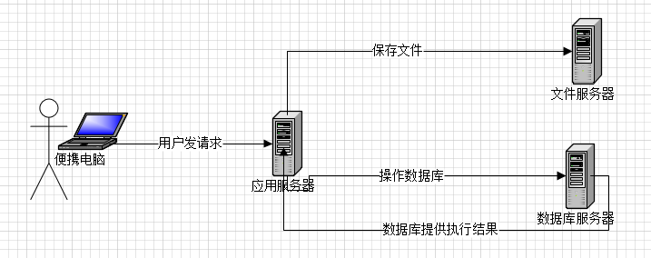
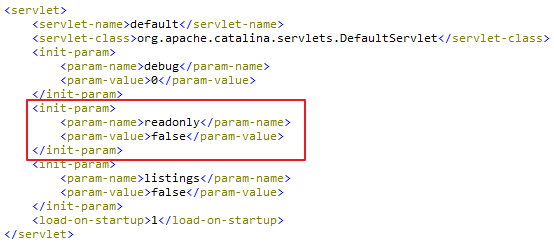

# day45_SpringMVC

# 学习目标

- [ ] 掌握常用的注解
- [ ] 掌握跳转页面
- [ ] 掌握给页面返回数据
- [ ] 掌握文件上传

# 第一章-常用注解

## 知识点-常用的注解

### 1. 目标

- [ ] 掌握常用注解的使用

### 2. 路径

1. @RequestParam 【重点】
2. @RequestBody  【重点】
3. @PathVariable  【重点】
4. @RequestHeader【重点】
5. @CookieValue【了解】

### 3. 讲解

#### 3.1 @RequestParam【重点】

##### 3.1.1 使用说明

+ 作用：

  把请求中指定名称的参数给控制器中的形参赋值。 

+ 属性

  value： 要求携带的参数名字
  required：请求参数中是否必须提供此参数。 默认值： true。表示必须提供，如果不提供将报错。 

  defaultValue:默认值

* 使用场景：
  * form提交，url参数使用的是?方式来提交请求
  * request.getParameter

##### 3.1.2 使用示例

+ UserController.java

```java
package com.itheima.controller;

import org.springframework.stereotype.Controller;
import org.springframework.web.bind.annotation.RequestMapping;
import org.springframework.web.bind.annotation.RequestParam;

@Controller
public class Controller01 {

    /*
        @RequestParam
            value :
                1. 要求一定要携带指定的额参数
                2. 如果携带了这个参数，那么就会把这个参数的值赋给方法形参 username
            required:
                表示是否一定要携带指定的参数，true: 一定要携带， false: 可以不携带。 默认是true
            defaultValue：
                表示默认值，如果没有携带指定的参数，那么就会把默认值赋给方法形参username

            如果只是写了@RequestParam ，然后没有给上任何的属性，那么即表示
                要求客户端来请求的的时候，一定要携带上参数 username
     */
    @RequestMapping("/requestParam")
    public String requestParam(@RequestParam String username ){

        System.out.println("username666666=" + username);

        return "success";
    }

}
```

@RequestParam 只能用于接收 url 的传参 ?name=xxx, form表单的提交。

无法接收提交的json数据(contentType=application/json)

#### 3.2 @RequestBody【重点】

##### 3.2.1 使用说明

+ 作用

  1. 用于获取请求体内容。 直接使用得到是 key=value&key=value...结构的字符串。

  2. 把获得json类型的数据转成pojo对象(后面再讲)【推荐】

  **注意: get 请求方式不适用。 **

+ 属性

  required：是否必须有请求体。默认值是:true。当取值为 true 时,get 请求方式会报错。如果取值为 false， get 请求得到是 null。 

* @RequestBody 不能使用get请求, 在Controller的方法参数里，方法的参数，有且只能有一个。
* 匹配json数据的获取，例如：Request.getInputStream()

##### 3.2.2 使用实例

+ 页面

```html
<h2>使用@RequestBody获取数据</h2>
<form action="requestBody01" method="post">
    <input type="text" name="_method" value="put" hidden>
    用户名: <input type="text" name="username"/><br/>
    密  码: <input type="text" name="password"/><br/>
    <input type="submit">
</form>

```

+ Controller01.java

```java
  /*
        @RequestBody
            1. 获取请求体，并且把请求的内容赋给方法的形参。 （但是一般不怎么用。）
     */
    @RequestMapping("/requestBody01")
    public String requestBody01(@RequestBody String data ) throws UnsupportedEncodingException {

        System.out.println("data=" + data);

        // 从页面上提交上来的中文，都会经过URLEncoder.encode(内容, utf-8); 编码
        // 如果希望看到正常的中文，那么再来一次解码即可
        String cc = URLDecoder.decode(data , "utf-8");
        System.out.println("cc=" + cc);

        return "success";
    }

```

##### 3.3.3 接收json数据

###### 需求描述

* 客户端发Ajax请求，提交json格式的数据
* 服务端接收json格式的数据，直接封装成User对象

###### 前提条件

* pom.xml中添加jackson的依赖：

```xml
<dependency>
    <groupId>com.fasterxml.jackson.core</groupId>
    <artifactId>jackson-databind</artifactId>
    <version>2.9.6</version>
</dependency>
```

* springmvc.xml中，增加配置静态资源的处理

```xml
<!--配置静态资源的处理-->
<mvc:default-servlet-handler/>
```

###### 需求实现

* jsp：使用axios发异步请求

```jsp
<h2>使用@RequestBody获取JSON数据</h2>
<input type="button" value="点我发送json数据" onclick="sendJson()"/>
<script>
    function sendJson(){
        //1. 创建json数据
        var json = {"username":"admin" , "password":"123456"}

        //2. 发请求
        // axios.post("请求地址" , {"a":"b", "c":"d"})
        //axios.post("requestBody02" , json);
        axios.post("requestBody03" , json);
    }
</script>
```

* Controller01

```java
  /*
        @RequestBody
            1、 接收页面提交上来的json数据 使用javaBean 对象来接收
            2. 要求：
                2.1 页面提交的必须是json格式的数据
                2.2 必须要添加Jackson依赖，否则无法解析json
                2.3 必须要在springmvc.xml中打开注解的开关
                    <mvc:annotation-driven/>
     */
    @RequestMapping("/requestBody02")
    public String requestBody02(@RequestBody User user )  {
        System.out.println("user=" + user);
        return "success";
    }


 /*
        @RequestBody
            接收页面提交上来的json数据 使用Map集合来接收。
    */
    @RequestMapping("/requestBody03")
    public String requestBody03(@RequestBody Map<String , String > map )  {
        System.out.println("map=" + map);
        return "success";
    }
```

#### 3.3 @PathVariable【重点】

##### 3.3.1 使用说明

+ 作用：

  用于绑定（截获） url 中的占位符。 例如：请求 url 中 /delete/{id}， 这个{id}就是 url 占位符。
  url 支持占位符是 spring3.0 之后加入的。是 springmvc 支持 rest 风格 URL 的一个重要标志。

  以前的api :  localhost:8080/项目映射名/delete?id=3 
  restful风格的api :  localhost:8080/项目映射名/delete/3

+ 属性：

  value： 用于指定 url 中占位符名称。
  required：是否必须提供占位符。 

* 场景：获取路径中的参数，与restful编程风格一起，通常微服架构中使用
* Request.getRequestURI，通过字符串截取

##### 3.3.2 使用实例

+ 页面

```html
<h2>使用@PathVariable截取url中的参数</h2>
<a href="delete/3">点我发请求</a>
```

+ Controller01.java

```java
  /*
        @PathVariable
            一般是配合RestFul 这种风格使用。

            以前删除的api : localhost:8080/项目映射名/delete?id=3
            现在的api :   localhost:8080/项目映射名/delete/3

            解释：
                1. 地址里面需要包含{变量名}这样的字符串存在，用于匹配的地址
                2. @PathVariable("变量名") ，里面的名字必须和上面的 {} 里面的一样
                3. 截取到数据之后，就把这个数据赋值给方法的形参，方法的形参叫什么名字都可以。随意
     */
    @RequestMapping("/delete/{id}")
    public String pathVariable(@PathVariable("id")  int a )  {
        System.out.println("a="+a);
        return "success";
    }

```

#### 3.4 @RequestHeader【重点】

##### 3.4.1 使用说明

+ 作用：
  用于获取请求消息头。
+ 属性：
  value：提供消息头名称
  required：是否必须有此消息头 
+ 从请求头中获取参数，鉴权(token 畅购open auth 2.0 jwt token) Authorization
+ Request.getHeader()

##### 3.4.2 使用实例

+ 页面

```html
<h2>使用@RequestHeader获取请求头</h2>
<a href="requestHeader">点我发请求</a>

```

+ Controller01.java

```java
  /*
        @RequestHeader
            获取指定的请求头，然后把 这个头的数值，赋值给方法形参
     */
    @RequestMapping("/requestHeader")
    public String requestHeader(@RequestHeader("User-Agent") String value )  {
        System.out.println("value="+value);
        return "success";
    }

```


#### 3.5 @CookieValue【了解】

##### 3.5.1 使用说明

+ 作用：

  用于把指定 cookie 名称的值传入控制器方法参数。

+ 属性：

  value：指定 cookie 的名称。
  required：是否必须有此 cookie。 

* 框架封闭才会用到，如：获取用户浏览记录

##### 3.5.2 使用实例

+ 页面

```html
<h2>使用@Cookie获取Cookie</h2>
<a href="cookieValue">点我发请求</a>

```

+ Controller01.java

```java
 /*
        @CookieValue
            1、获取请求头里面指定的cookie数据，然后赋值给方法的形参
            2. @CookieValue("JSESSIONID") 即表示获取Session的id值
            3. 答疑：
                3.1 整个方法里面并没有创建|获取session，为什么就有session的id了呢？
                3.2 其实是这样的，当我们的项目启动的时候，默认就访问了首页 index.jsp
                3.3 jsp文件最终是会被翻译 servlet, 它里面内置了session对象。
                3.4 所以再来访问这个方法，就会有session的id值。
     */

    @RequestMapping("/cookieValue")
    public String cookieValue(@CookieValue("JSESSIONID") String value )  {
        System.out.println("value="+value);
        return "success";
    }
```

### 4. 小结

1. 这几个注解都使用作用在方法的参数上，不是写在方法上。他们或多或少都是对客户端提交的数据有这样或者那样的要求
2. @RequestParam  : 要求客户端必须要携带指定的参数。
3. @RequestBody： 要求必须有请求体，一般它是作用于 页面提交上来的json数据，转化成 javabean对象
4. @PathVariable :  路径变量，配合RestFul风格使用，用于截取地址里面的数据
5. @RequestHeader： 用来获取的指定的请求头数据，赋值给方法形参
6. @CookieValue： 用来获取的cookie数据，赋值给方法的形参。


# 第二章-响应数据和视图【重点】

## 知识点-返回页面视图

### 1.目标

- [ ] 掌握Controller返回页面视图

### 2.路径

1. 请求转发
   * 返回页面文件名字符串  success 逻辑视图
   * 返回字符串关键字forward:物理视图
   * 返回ModelAndView 对象
2. 请求重定向
   * 返回字符串关键字redirect
3. 转发与重定向的区别

### 3.讲解

#### 3.1 返回页面文件名

> controller方法返回的字符串会被解析成页面视图（即：页面的地址路径）

##### 3.1.1. 返回逻辑视图名称（物理视图）

* 方法返回的字符串，和视图解析器里的前缀、后缀拼接得到真实路径，再进行跳转
* 不管是物理视图（完整的写法）还是逻辑视图（简写），默认采用的都是请求转发跳转


##### 3.1.2. 返回带前缀的物理视图

* 请求转发：`forward:/success.jsp`
* 重定向：`redirect:/success.jsp`
* **注意：如果带有`forward`或者`redirect`，那么路径必须是完整的真实路径**

**使用示例**

```java
package com.itheima.controller;

import org.springframework.stereotype.Controller;
import org.springframework.web.bind.annotation.RequestMapping;

/*
    跳转页面|返回视图
 */
@Controller
public class Controller02 {

    //逻辑视图返回
    @RequestMapping("/page01")
    public String page01(){
        System.out.println("page01...");
        return "success";
    }

    //物理视图返回 , 一旦配置了视图解析器，那么这种跳转会受影响
    @RequestMapping("/page02")
    public String page02(){
        System.out.println("page02...");
        return "/success.jsp";
    }

    /*
        1. 显式的告诉springmvc，采用请求转发跳转 带上前缀  forward:
        2. 不受视图解析器的影响
        3. 必须要写完整的地址路径
     */
    @RequestMapping("/page03")
    public String page03(){
        System.out.println("page03...");
        return "forward:/success.jsp";
    }

    /*
        1. 显式的告诉springmvc，采用重定向跳转  带上前缀  redirect:
        2. 不受视图解析器的影响
        3. 必须要写完整的地址路径
     */
    @RequestMapping("/page04")
    public String page04(){
        System.out.println("page04...");
        return "redirect:/success.jsp";
    }
}

```

#### 3.2 请求转发并传递数据

* `ModelAndView`是SpringMVC提供的组件之一，其中
  * `Model`，模型，用于封装数据（Springmvc会把数据放到了request域中）
  * `View`，视图，就是页面，用于展示数据
* 如果我们设置了视图名称，并且封装了数据模型，SpringMVC会：
  * 把Model的数据放到request域对象中，然后请求转发到指定的视图（页面）
  * 我们可以视图页面中获取数据显示出来

**使用示例 **

* Controller中

```java
 package com.itheima.controller;

import org.springframework.stereotype.Controller;
import org.springframework.ui.Model;
import org.springframework.web.bind.annotation.RequestMapping;
import org.springframework.web.servlet.ModelAndView;

import javax.servlet.http.HttpServletRequest;
import javax.servlet.http.HttpSession;

/*
    使用ModelAndView对象返回页面与数据
 */
@Controller
public class Controller03 {


    /*
        自己new ModelAndView对象，封装数据，然后返回
     */
    @RequestMapping("/page05")
    public  ModelAndView page05(){
        System.out.println("page05...");

        //1. 创建对象
        ModelAndView mv = new ModelAndView();

        //2. 设置数据： 模型
        mv.addObject("username" , "admin");

        //3. 设置页面：视图
        mv.setViewName("success");

        //4. 返回mv
        return mv;
    }


    /*
        使用ModelAndView对象，返回数据和页面， 但是不要自己new ModelAndView
     */
    @RequestMapping("/page06")
    public  ModelAndView page06(ModelAndView mv){
        System.out.println("page06...");

        //1. 设置数据： 模型
        mv.addObject("username" , "admin");

        //2. 设置页面：视图
        mv.setViewName("success");

        //3. 返回mv
        return mv;
    }


    /*
        使用Model来封装数据，然后方法返回页面的名字
     */
    @RequestMapping("/page07")
    public  String page07(Model model){
        System.out.println("page07...");

        //1. 设置数据： 模型
       model.addAttribute("username", "admin");

       //2. 直接返回页面： 视图
        return "success";
    }
    /*
        使用HttpServletRequest来封装数据，然后方法返回页面的名字
     */
    @RequestMapping("/page08")
    public  String page08(HttpServletRequest request){
        System.out.println("page08...");

        //1. 设置数据： 模型
        request.setAttribute("username", "admin");

       //2. 直接返回页面： 视图
        return "success";
    }

    /*
      使用HttpSession来封装数据，然后方法返回页面的名字
   */
    @RequestMapping("/page09")
    public  String page09(HttpSession session){
        System.out.println("page09...");

        //1. 设置数据： 模型
        session.setAttribute("username", "admin");

        //2. 直接返回页面： 视图
        return "redirect:/success.jsp";
    }
}

```

* 在视图页面中，取出数据显示出来

```jsp
<h2>这是成功的页面 ${username}</h2>
```

### 4.小结

* 返回页面文件名
  * 返回逻辑视图
    * 方法返回的字符串，和视图解析器里的前缀、后缀拼接得到真实路径，再进行跳转
    * 是请求转发跳转
  * 返回带前缀的物理视图 （不受视图解析器的影响）
    * 请求转发：`forward:/success.jsp`
    * 重定向：`redirect:/success.jsp`

* 方法返回`ModelAndView`

```java
public ModelAndView jump(){
    ModelAndView mav = new ModelAndView();
    mav.setViewName("视图名称");
    mav.addObject("数据名称", "值");
    return mav;
}

public ModelAndView jump(ModelAndView mav){
    mav.setViewName("视图名称");
    mav.addObject("数据名称", "值");
    return mav;
}
```

* 方法返回String：视图名称

```java
public String jump(Model model){
    model.addAttribute("数据名称", "值");
    return "视图名称";
}
```

## 知识点-返回数据

### 1.目标

- [ ] 掌握给客户端返回数据

### 2.路径

1. 直接返回字符串
2. 返回json数据

### 3. 讲解

#### 3.1 直接响应字符串【了解】

* 两种方式
  * 使用Servlet原生的`response`对象，返回响应数据
  * 方法上使用`@ResponseBody`注解，springmvc就会把方法的返回值当成字符串来看待，不会再识别成页面的地址路径

##### 3.1.1 使用示例

```java
 /*
        返回字符串： 使用response对象写出去
     */
    @RequestMapping("/returnStr01")
    public void returnStr01(HttpServletResponse resp) throws IOException {
        resp.getWriter().write("str01...");
    }


    /*
        返回字符串： 使用@ResponseBody，打注解，告诉springmvc，方法的返回值是字符串，不是页面
     */
    @ResponseBody
    @RequestMapping("/returnStr02")
    public String returnStr02()  {
       return  "str02...";
    }
```

##### 3.1.2 拓展

* 如果使用`@ResponseBody`响应的中文字符串，即使配置了`CharacterEncodingFilter`，也会有乱码

```java
    //返回中文 ： 打算采用springmvc配置转换器的写法
    @ResponseBody
    @RequestMapping("/returnStr03")
    public String returnStr03()  {
        return  "这是返回的中文: returnStr03";
    }

    //返回中文 ： 使用简单的写法， 使用 produces 属性来配置响应数据的编码。
    @ResponseBody
    @RequestMapping(value = "/returnStr04" , produces = "text/html;charset=utf-8")
    public String returnStr04()  {
        return  "这是返回的中文: returnStr04";
    }
```

* 解决方法：在`springmvc.xml`里配置如下：
  * 配置SpringMVC的`StringHttpMessageConverter`进行字符串处理转换，设置采用`utf-8`字符集

```xml
<mvc:annotation-driven>
        <!--
        配置消息转换器：
            1. 当我们的方法上打上了@ResponseBody，返回字符串的时候，里面有中文，就会出现乱码的问题
            2. 即便我们在web.xml中配置了中文乱码的过滤器，也不能解决。
            3. 需要配置下面的这段消息转换器 , 这段配置一旦写就，即对全局的项目产生影响。
        -->

        <mvc:message-converters>
            <bean class="org.springframework.http.converter.StringHttpMessageConverter">

                <!--指定默认的编码-->
                <property name="defaultCharset" value="utf-8"/>

                <!--指定支持的内容类型和编码-->
                <property name="supportedMediaTypes">
                    <list>
                        <value>text/html;cahrset=utf-8</value>
                        <value>application/json;cahrset=utf-8</value>
                        <value>text/plain;cahrset=utf-8</value>
                    </list>
                </property>
            </bean>
        </mvc:message-converters>
    </mvc:annotation-driven>
```

#### 3.2 返回json数据【重要】

* 两种方式介绍
  * 自己把JavaBean对象转换成json格式的字符串，响应给客户端
  * 方法返回JavaBean对象，使用`@ResponseBody`注解Springmvc帮我们转换成json格式

##### 3.2.1 前提条件

* 在pom.xml中导入依赖：`jackson-databind`

```xml
<dependency>
    <groupId>com.fasterxml.jackson.core</groupId>
    <artifactId>jackson-databind</artifactId>
    <version>2.9.6</version>
</dependency>
```

* springmvc.xml中开启mvc注解开关

```xml
 <mvc:annotation-driven/>
```

##### 3.2.2 使用示例

```java
package com.itheima.controller;

import com.fasterxml.jackson.core.JsonProcessingException;
import com.fasterxml.jackson.databind.ObjectMapper;
import com.itheima.bean.User;
import org.springframework.stereotype.Controller;
import org.springframework.web.bind.annotation.RequestMapping;
import org.springframework.web.bind.annotation.ResponseBody;

import javax.servlet.http.HttpServletResponse;
import java.io.IOException;

/*
    返回数据 ： json数据
 */
@Controller
public class Controller04 {

    /*
        返回json字符串
            1. 自己转化成json字符串，然后返回
     */
    @ResponseBody
    @RequestMapping("/returnJson01")
    public String returnJson01() throws JsonProcessingException {
        System.out.println("returnJson01...");

        //1. 创建对象
        User user = new User("admin" , "123456");

        //2. 转化成json
        ObjectMapper om = new ObjectMapper();
        String json = om.writeValueAsString(user);

        //3. 返回json
        return json;
    }


    /*
        返回json字符串
            1. 不需要我们自己转化对象成json字符串。
            2. 只需要返回对象即可。
     */
    @ResponseBody
    @RequestMapping("/returnJson02")
    public User returnJson02() throws JsonProcessingException {
        System.out.println("returnJson02...");

        //1. 创建对象
        User user = new User("管理员" , "123456");

        //2. 直接返回2
        return user;
    }
}
```

### 4.小结

* 如果要直接响应数据，使用response对象

```java
public void method1(HttpServletResponse response){
    //如果响应普通文本数据
	//response.setContentType("text/html;charset=utf-8");
    
    //如果响应json格式的字符串
    response.setContentType("application/json;charset=utf-8");
    
    response.getWriter().print("xxxx");
}
```

* 如果要bean对象 ， 使用注解@ResponseBody

```java
@RequestMapping("/method2")
@ResponseBody
public User method2(){
    return new User();
}
```

# 第三章-RestFul【了解】

## 知识点-介绍

### 1.目标

- [ ] 能够理解什么事RestFul

### 2.路径

1. RestFul 历史
2. 接口结构

### 3.讲解

#### 3.1 RestFul介绍

##### 3.1.1 概述

> REST这个词，是Roy Thomas Fielding在他2000年的博士论文中提出的。Fielding是一个非常重要的人，他是HTTP协议（1.0版和1.1版）的主要设计者、Apache服务器软件的作者之一、Apache基金会的第一任主席。所以，他的这篇论文一经发表，就引起了关注，并且立即对互联网开发产生了深远的影响。


他这样介绍论文的写作目的：

"本文研究计算机科学两大前沿----软件和网络----的交叉点。长期以来，软件研究主要关注软件设计的分类、设计方法的演化，很少客观地评估不同的设计选择对系统行为的影响。而相反地，网络研究主要关注系统之间通信行为的细节、如何改进特定通信机制的表现，常常忽视了一个事实，那就是改变应用程序的互动风格比改变互动协议，对整体表现有更大的影响。我这篇文章的写作目的，就是想在符合架构原理的前提下，理解和评估以网络为基础的应用软件的架构设计，**得到一个功能强、性能好、适宜通信的架构**。"

**RESTful 是一种设计风格。它不是一种标准，也不是一种软件，而是一种思想。**

##### 3.1.2 特点

* 每一个URI代表1种资源；
  * 以前我们认为url地址它是一个动作： 增删改查的动作
    * localhost:8080/项目名/findAllUser
    * lolcahost:8080/项目名/deleteUser?id=3
  * rest设计风格认为地址是一种资源，体现的只有名词，而没有动词。
    * localhost:8080/项目名/user/3
* 客户端使用GET、POST、PUT、DELETE4个表示操作方式的动词对服务端资源进行操作：GET用来获取资源，POST用来新建资源（也可以用于更新资源），PUT用来更新资源，DELETE用来删除资源；、
  * 由于地址不能体现出来动作，包含的都是名词，没有动词，那么服务端如何区分出来客户端想要执行的是什么操作呢？
  * 采用请求方式来区分
    * 新增 ----- post请求
    * 查询 ----- get请求
    * 删除 ----- delete请求
    * 更新 ----- put请求
* 客户端与服务端之间的交互在请求之间是无状态的，从客户端到服务端的每个请求都必须包含理解请求所必需的信息

#### 3.2 接口结构

##### 3.2.1 如何设计接口

* 域名

  应该尽量将API部署在专用域名之下。

  http://api.example.com 或者 http://www.example.com/api/

* 版本

  将API的版本号放在url中：http://www.example.com/api/v1.0

* 路径

  在RESTful架构中，每个地址代表一种资源（resource），所以地址中不能有动词，只能有名词，而且所用的名词往往与数据库的表名对应。

* 具体操作

  对于资源的具体操作类型，由HTTP动词表示。常用的HTTP动词有下面四个（括号里是对应的SQL命令）

  ```java
  GET（SELECT）：从服务器取出资源（一项或多项）。
  POST（CREATE）：在服务器新建一个资源。
  PUT（UPDATE）：在服务器更新资源（客户端提供改变后的完整资源）。
  DELETE（DELETE）：从服务器删除资源。
  
  还有三个不常用的HTTP动词。
   
  PATCH（UPDATE）：在服务器更新资源（客户端提供改变的属性）。
  HEAD：获取资源的元数据。
  OPTIONS：获取信息，关于资源的哪些属性是客户端可以改变的
  ```

##### 3.2.2 示例说明

* 示例

  GET /user：列出所有用户

  POST /user：新建一个用户

  GET /user/{id}：获取某个指定用户的信息

  PUT /user：更新某个指定用户的信息（提供该用户的全部信息）

  DELETE /user/{id}：删除某个用户

* 原来的方式

  http://127.0.0.1/user/queryUser?id=3			GET方法，根据用户id获取数据
  http://127.0.0.1/user/updateUser				POST方法，用户修改
  http://127.0.0.1/user/saveUser				POST方法，用户新增
  http://127.0.0.1/user/deleteUser?id=3			GET/POST方法，用户根据id删除

* RestFul方式

  http://127.0.0.1/user/{id}						GET方法，根据用户id获取数据
  http://127.0.0.1/user/{id}						DELETE方法，用户根据id删除
  
  http://127.0.0.1/user/	                           GET 方法 查询所有的用户
  
  http://127.0.0.1/user/						PUT方法，用户修改
  http://127.0.0.1/user/						POST方法，用户新增

### 4.小结

1. RESTful 是一种设计风格 ， 可以用，也可以不用！
2. 每一个URI代表1种资源，地址里面只能出现名词，不能出现动词。
3. 客户端使用GET、POST、PUT、DELETE4个表示操作方式的动词对服务端资源进行操作：GET用来获取资源，POST用来新建资源（也可以用于更新资源），PUT用来更新资源，DELETE用来删除资源；

## 案例-最佳实践

### 1. 需求

- [ ] 使用RestFul 设计增删改查用户接口

### 2. 分析

1. 创建Maven web工程
2. 创建Pojo 
3. 创建Controller ，定义增删改查方法
4. 分别使用 get | post | put | delete 来指定方法请求方式

### 3. 实现

#### 3.1 基本实现

> 在postman工具里面测试

* 添加

```java
    /*
        添加操作：
            以前： localhost:8080/项目映射名/addUser   GET|POST
            RestFul: localhost:8080/项目映射名/user    POST
     */
    //完整的写法： @RequestMapping(value = "/user" , method = RequestMethod.POST)
    @ResponseBody
    @PostMapping("/user")
    public String add(User user ){
        System.out.println("add: user=" + user);
        return "add success~!";
    }
```

* 删除

```java
    /*
        删除操作
            以前：localhost:8080/项目映射名/deleteUser?id=3  GET|POST
            RestFul: localhost:8080/项目映射名/user/3        DELETE
     */
    @ResponseBody
    @DeleteMapping("/user/{id}")
    public String delete(@PathVariable("id") int id ){
        System.out.println("delete: id=" + id);
        return "delete success~!";
    }
```

* 修改

```java
    /*
        修改：
            以前：localhost:8080/项目映射名/updateUser     GET|POST
            RestFul: localhost:8080/项目映射名/user       PUT
     */
    @ResponseBody
    @PutMapping("/user")
    public String update(User user){
        System.out.println("update: user=" + user);
        return "update success~!";
    }

```

* 查询

```java
 /*
        根据id查询用户：
             以前：localhost:8080/项目映射名/findUserById?id=3     GET|POST
             RestFul: localhost:8080/项目映射名/user/3            GET
     */
    @ResponseBody
    @GetMapping("/user/{id}")
    public String findById(@PathVariable("id") int id){
        System.out.println("findById: id=" + id);
        return "findById success~!";
    }

    /*
        查询所有
             以前：localhost:8080/项目映射名/findAllUser     GET|POST
             RestFul: localhost:8080/项目映射名/user         GET
     */
    @ResponseBody
    @GetMapping("/user")
    public String findAll(){
        System.out.println("findAll...");
        return "findAll success~!";
    }
```

#### 3.2 拓展

> delete 和  put 请求方式无法提交form表单, GET 和 POST请求可以，为了识别满足RestFul风格的接口设计，需要做两个工作：
>
> 1. 页面提交表单的方式还是post, 配置隐藏域，告知SpringMVC，最终处理的请求方式
>    1. 后台还是由 delete 和 put这两种请求方式的方法
>    2. 但是前端的页面提交数据的时候，不能直接把form表单的提交方式设计成的method="delete" | method="put"
> 2. 配置过滤器，使得SpringMVC背后会把post请求转化为 ，对应 `DELETE`或者`PUT`请求
>    1. spring它是以什么标准来转化的？ 它怎么知道要转化哪一个请求的请求方式呢？
>    2. 需要在form表单里面添加一个隐藏域

* 1. 页面配置隐藏域

> name="_method" 是固定写法 ， value 则是最终要使用的请求方式，如果是delete,则写delete 如果是put ，则写put.

```html
<form method="post">
    <hidden name="_method" value="put"/>
    ...
</form>
```

* 2. 添加 `HiddenHttpMethodFilter` 把`post`请求转化成`delete`或者` put` 请求 ， 它需要在form表单里面带上隐藏的域， name的名称为 _method , value为真正提交的方法，而提交的方式使用的post ， 过滤器会把这个post请求转化成delete请求或者put请求

```xml
<filter>
	<filter-name>HiddenHttpMethodFilter</filter-name>
	<filter-class>org.springframework.web.filter.HiddenHttpMethodFilter</filter-class>
</filter>
<filter-mapping>
	<filter-name>HiddenHttpMethodFilter</filter-name>
	<url-pattern>/*</url-pattern>
</filter-mapping>
```

### 4. 小结

1. 创建Maven web工程
2. 创建Pojo 
3. 创建Controller ，定义增删改查方法
4. 分别使用 get | post | put | delete 来指定方法请求方式


# 第四章-文件上传【重点】

## 知识点-文件上传

### 1.目标

- [ ] 掌握文件上传的要求

### 2.路径

1. 文件上传概述
2. 文件上传要求
3. 常见的文件上传jar包和框架

### 3.讲解

#### 3.1 文件上传概述

​	就是把客户端(浏览器)的文件保存一份到服务器 说白了就是文件的拷贝

#### 3.2 文件上传要求

##### 3.2.1 浏览器端要求(通用浏览器的要求)

- 表单提交方式 post      
- 提供文件上传框(组件)  input type="file"
- 表单的enctype属性必须为 `multipart/form-data`(没有这个属性值的话, 文件的内容是提交不过去的)

##### 3.2.2 服务器端要求

1. 要使用request.getInputStream()来获取数据. 

 	2. 如果前端页面的form表单提交的编码enctype="`multipart/form-data`" ,那么后端取值，getParameter受影响。

**注意:**

+ 若表单使用了 multipart/form-data ,使用原生request.getParameter()去获取参数的时候都为null

> 我们做文件上传一般会借助第三方组件(jar, 框架 SpringMVC)实现文件上传.

#### 3.3 常见的文件上传jar包和框架

​	1. serlvet3.0 

​	2. commons-fileupload :  apache出品的一款专门处理文件上传的工具包 

​	3. struts2(底层封装了:commons-fileupload)   

​	4. SpringMVC(底层封装了:commons-fileupload)

### 4.小结

1. 前端三要素 
   1. form表单提交方式为 post, 
   2. encpt=multipart/form-data, 
   3. input type=file
2. 使用commons-fileupload, 原生的api处理太复杂了，它帮我们简化了开发

## 案例-传统文件上传

### 1.需求

- [ ] 使用springmvc 完成传统方式文件上传 

### 2.分析

#### 2.1 原理介绍

* 如果表单form标签的`enctype="multipart/form-data"`时，`request.getParameter`方法将失效
  *  当`enctype="application/x-www-form-urlencoded"`时，提交的表单数据格式是：`name=value&name=value&...`
  *  当`enctype="multipart/form-data"`时，提交的表单数据格式就变成多部分形式
* 客户端提交多部分表单时，会把文件内容一并提交：
  * 服务端使用`request.getInputSteam()`可以获取到客户端提交数据，包含文件数据
    * 数据的格式：以指定分隔符隔开了，每一部分是一个表单项的数据
    * 分隔符以请求头中，提交到服务端为基准
  * 使用指定分隔符，把得到的数据进行分割，然后解析得到其中的每项数据
    * 把文件项的数据保存在服务器中


#### 2.2 工具包

* 使用第三方jar包`commons-fileupload`， 可以实现更简单的文件上传
* `commons-fileupload`的maven坐标如下：

```xml
<dependency>
    <groupId>commons-fileupload</groupId>
    <artifactId>commons-fileupload</artifactId>
    <version>1.4</version>
</dependency>
```

* SpringMVC又对`commons-fileupload`做了再封装，实现文件上传，更加简单了

#### 2.3 具体步骤

1. 导入依赖：增加commons-fileupload
2. 创建页面，在页面上提供表单：要符合文件上传的三要素
3. 编写控制器代码
4. 配置 文件解析器`CommonsMultipartResolver`

### 3.实现

1. 导入依赖

```xml
     <dependencies>
        <dependency>
            <groupId>javax.servlet</groupId>
            <artifactId>javax.servlet-api</artifactId>
            <version>3.1.0</version>
            <scope>provided</scope>
        </dependency>
        <dependency>
            <groupId>javax.servlet.jsp</groupId>
            <artifactId>javax.servlet.jsp-api</artifactId>
            <version>2.3.1</version>
            <scope>provided</scope>
        </dependency>
        <dependency>
            <groupId>org.springframework</groupId>
            <artifactId>spring-webmvc</artifactId>
            <version>5.1.8.RELEASE</version>
        </dependency>
        <dependency>
            <groupId>commons-fileupload</groupId>
            <artifactId>commons-fileupload</artifactId>
            <version>1.4</version>
        </dependency>
    </dependencies>
```

2. 创建页面，在页面上提供表单

```jsp

<h2>上传文件（传统）</h2>
<form action="fileUpload" method="post" enctype="multipart/form-data">
    文件： <input type="file" name="file"/><br/>
    <input type="submit"/>
</form>
```

3. 编写控制器代码

```java
package com.itheima.controller;

import com.sun.jersey.api.client.Client;
import com.sun.jersey.api.client.WebResource;
import org.springframework.stereotype.Controller;
import org.springframework.web.bind.annotation.RequestMapping;
import org.springframework.web.bind.annotation.ResponseBody;
import org.springframework.web.multipart.MultipartFile;

import javax.servlet.http.HttpServletRequest;
import java.io.File;
import java.io.IOException;

@Controller
public class Controller06 {

    /**
     *   传统的文件上传：
     * @param file 表示我们页面提交上来的文件，被SpringMVC 使用这个对象来包装了。
     * @return
     */
    @RequestMapping("/fileUpload")
    public String fileUpload(MultipartFile file  , HttpServletRequest request) throws IOException {

        //1. 获取到当前这个项目的目录，然后再它的下面创建一个目录，files
        String destPath = request.getServletContext().getRealPath("files");
        System.out.println("destPath=" + destPath);

        //2. 创建目录
        File destDir = new File(destPath);
        if (!destDir.exists()) {
            //如果这个files文件夹不存在，就创建这个文件夹
            destDir.mkdir();
        }


        //3. 得到上传的文件名字
        String filename = file.getOriginalFilename();


        //4. 构造一个新的文件名字， 使用当前的时间戳 + 文件的后缀，组成新的文件名..  （应该使用UUID来做）
        filename = System.currentTimeMillis() + filename.substring(filename.lastIndexOf("."));


        //5. 构建一个文件对象。 在具体的目录下，有这样的一个文件，这个文件没有内容
        File destFile = new File(destDir, filename);

        //6. 把springmvc收到的那个文件，保存对应的位置去。
        file.transferTo(destFile);

        //7. 上传成功了之后，跳转到成功的页面
        return "success";
    }

}
```

4. 配置 `文件解析器`

```xml
<!--配置文件解析器。注意：id必须是multipartResolver-->
<bean id="multipartResolver" 
      class="org.springframework.web.multipart.commons.CommonsMultipartResolver">
    <!--配置上传文件的最大尺寸，单位：字节； -1表示不限制-->
    <property name="maxUploadSize" value="5242880"/>
</bean>
```

### 4.小结

1. 在pom.xml里导入依赖：`commons-fileupload`
2. 在springmvc.xml里配置文件解析器，bean名称必须是`multipartResolver`

```xml
<bean id="multipartResolver" class="org.springframework.web.multipart.commons.CommonsMultipartResolver">
    <!--maxUploadSize：上传的文件最大尺寸，单位byte-->
    <property name="maxUploadSize" value="10240000"/>
    <!--maxUploadSizePerFile：每个文件最大的尺寸，单位byte-->
    <property name="maxUploadSizePerFile" value="1024000"/>
</bean>
```

3. 在Controller里写代码接收保存文件

```java
//注意：方法形参名称，必须和表单项名称相同
public String upload(MultipartFile file){
    file.transferTo(new File("目标文件存储位置"));
    return "success";
}
```

## 案例-跨服务器文件上传

### 1.需求

- [ ] 了解使用springmvc 跨服务器方式的文件上传 

### 2.分析

#### 2.1 开发中的服务器

* 在实际开发中，为了提高程序效率，我们可以提供多个服务器，每个服务器负责不同的工作。
* 常见的服务器有：
  * 应用服务器：部署web应用的服务器，我们安装了Tomcat的电脑
  * 数据库服务器：负责数据存取服务，我们安装了MySql的电脑
  * 缓存和消息服务器：负责处理高并发访问时的缓存和消息，我们安装了redis的电脑
  * 文件服务器：存储文件的服务器



#### 2.2 具体步骤

1. 准备一个文件服务器（准备一个Tomcat），允许文件的存取
2. 编写程序，提供文件上传功能；使用jersey把上传的文件保存到文件服务器上

### 3.实现

##### 1. 准备一个文件服务器

1. 拷贝一个Tomcat，在其`webspps`文件夹中创建项目，名称为：`files`

   

2. 打开`conf/web.xml`文件，搜索`DefaultServlet`，设置初始化参数`readonly`，值为`false`

   

3. 启动服务器（注意不要端口冲突了）

   1. 修改tomcat的端口，不要让它是默认的8080端口，否则我们的上传文件的项目无法部署到自己的tomcat
   
   2. Tomcat里files项目的访问地址是：`http://localhost:8888/files`

##### 2. 编写程序，提供文件上传功能

1. 在我们项目中导入`jersey`包的依赖

   ```xml
    <dependency>
         <groupId>commons-fileupload</groupId>
         <artifactId>commons-fileupload</artifactId>
         <version>1.4</version>
   </dependency>
   
   <dependency>
       <groupId>com.sun.jersey</groupId>
       <artifactId>jersey-client</artifactId>
       <version>1.9</version>
   </dependency>
   ```
   
2. 提供页面

   ```jsp
   
   <h2>上传文件（跨服务器）</h2>
   <form action="fileUpload02" method="post" enctype="multipart/form-data">
       文件： <input type="file" name="file"/><br/>
       <input type="submit"/>
   </form>
   ```

3. 编写控制器的方法，实现文件上传功能

   ```java
     
    
       /**
        * 跨服务器的文件上传
        * @param file
        * @return
        * @throws IOException
        */
       @RequestMapping("/fileUpload02")
       public String fileUpload02(MultipartFile file ) throws IOException {
   
           //1. 获取原始的文件名字
           String fileName = file.getOriginalFilename();  // aa.txt
   
           //2.组装成新的文件名  新文件名 =  时间戳 +  文件后缀
           fileName = System.currentTimeMillis() + fileName.substring(fileName.lastIndexOf('.'));
   
           //3. 构建一个客户端对象
           Client client = new Client();
   
           //4. 构建一个资源，其实就是定位我们的这个文件要保存到哪里去？
           WebResource resource = client.resource("http://localhost:38080/files/" + fileName);
   
           //5. 开始上传文件
           resource.put(file.getBytes());
           return "success";
       }
   ```

4. 配置文件解析器

   ```xml
   <!--配置文件解析器。注意：id必须是multipartResolver-->
   <bean id="multipartResolver" 
         class="org.springframework.web.multipart.commons.CommonsMultipartResolver">
         <!--配置上传文件的最大尺寸，单位：字节； -1表示不限制-->
       <property name="maxUploadSize" value="50000000"/>
   </bean>
   ```

### 4.总结

1. 在pom.xml里导入依赖：`commons-fileupload, jersey-client`

2. 在springmvc.xml里配置文件解析器

3. 在Controller里：使用jersey把文件推送保存到文件服务器上

   ```java
   
       /**
        * 跨服务器的文件上传
        * @param file
        * @return
        * @throws IOException
        */
       @RequestMapping("/fileUpload02")
       public String fileUpload02(MultipartFile file ) throws IOException {
   
           //1. 获取原始的文件名字
           String fileName = file.getOriginalFilename();  // aa.txt
   
           //2.组装成新的文件名  新文件名 =  时间戳 +  文件后缀
           fileName = System.currentTimeMillis() + fileName.substring(fileName.lastIndexOf('.'));
   
           //3. 构建一个客户端对象
           Client client = new Client();
   
           //4. 构建一个资源，其实就是定位我们的这个文件要保存到哪里去？
           WebResource resource = client.resource("http://localhost:38080/files/" + fileName);
   
           //5. 开始上传文件
           resource.put(file.getBytes());
           return "success";
       }
   ```
   

# 总结：

* 常用的注解
  * @RequestParam : 要求一定要携带指定的参数，把参数的值赋给方法的形参
  * @RequestBody ： 可以得到请求体内容，但是一般更多的是用来处理json数据转化成javaBean对象
  * @PathVariable : 配合RestFul使用 ，能从地址里面截取到数据 /delete/{id}  ===> /delete/3
  * @RequestHeader : 获取请求头内容
  * @CookieValue ： 获取Cookie数据
* 响应数据和视图
  * 响应视图
    * 逻辑视图 (需要配合视图解析器来用)
      * return "success"; 
    * 物理视图的写法
      * return "/success.jsp";
    * 带前缀的物理视图写法
      * return "redirect:/success.jsp"
      * return "forward:/success.jsp"
  * 响应数据和视图
    * 使用ModelAndView来封装 数据和视图
    * 使用Model来封装数据，然后方法的返回值写页面的名字
    * 还可以使用以前古老的request和session对象来存数据
  * 响应数据
    * 把字符串写出去  :  加上注解 @ResponseBody
    * 把json字符串写出去  :  加上注解 @ResponseBody ， 让方法的返回值写成对象类型即可。
* RestFul
  * 是一种接口设计的风格，可以用，也可以不用
  * 它认为请求（URL）地址 是一种资源，只能出现名词，不能出现动词
  * 需要配合请求方式，来表达我们想要做的具体操作
    * 新增 ==== POST
    * 删除 ==== DELETE
    * 修改 ==== PUT
    * 查询 ==== GET
* 文件上传
  * 传统的文件上传
  * 跨服务器文件上传