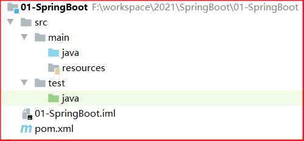
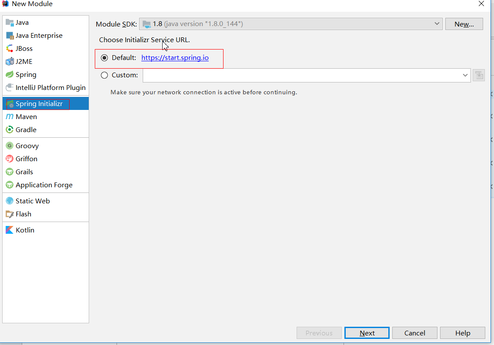
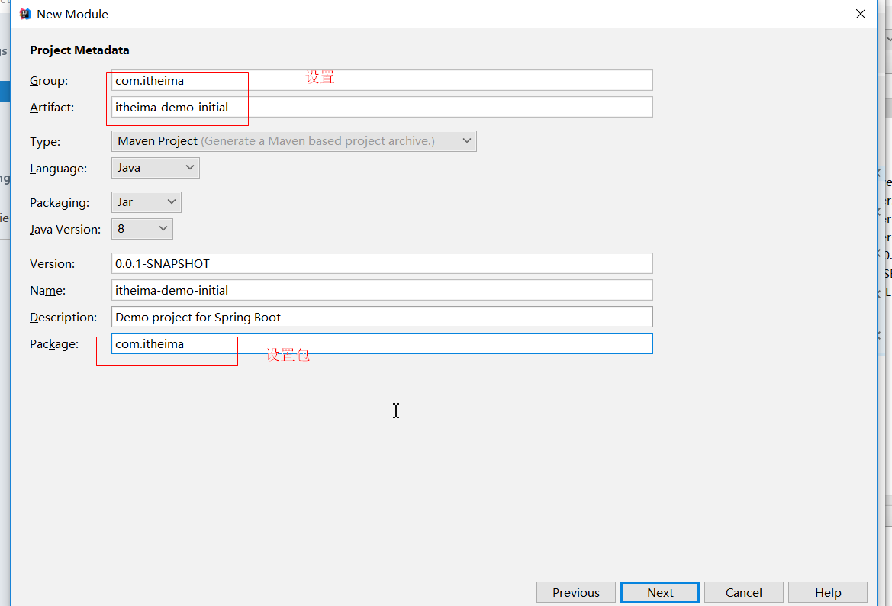
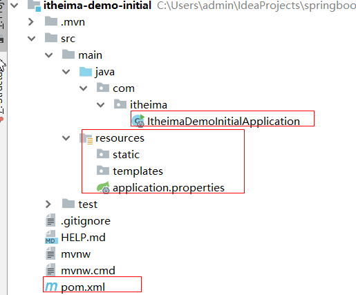
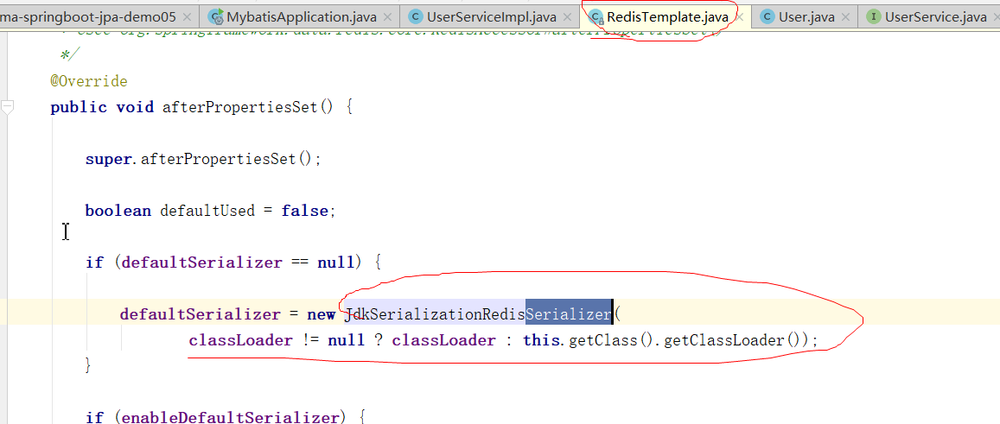
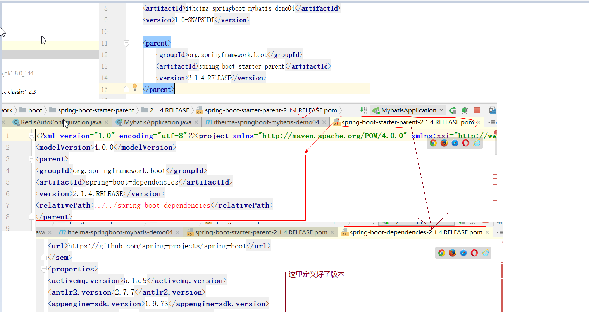

# day48-SpringBoot

# 学习目标

- [ ] 能够理解SpringBoot
- [ ] 能够使用idea工具构建SpringBoot项目
- [ ] 能够熟的应用SpringBoot配置文件
- [ ] 能够熟练的整合mybatis、redis
- [ ] 能够运用代码测试工具
- [ ] 理解版本控制的原理

# 第一章-SpringBoot介绍

## 知识点-SpringBoot介绍

### 1.目标

- [ ] 知道什么是SpringBoot

### 2.路径

1.  项目中开发的一些问题
2. SpringBoot解决的问题
3. 什么是SpringBoot

### 3.讲解

#### 3.1 项目中开发的一些问题

​	目前我们开发的过程当中，一般采用一个单体应用的开发采用SSM等框架进行开发，并在 开发的过程当中使用了大量的xml等配置文件，以及在开发过程中使用MAVEN的构建工具来进行构建项目，但是往往有时也会出现依赖的一些冲突，而且开发的时候测试还需要下载和使用tomcat等等这些servlet容器，所以开发的效率不高。

问题：

1. 配置文件多，复杂
2. 依赖版本号太多，容易冲突
3. 需要布署tomcat 

#### 3.2  SpringBoot解决的问题

​	那么在以上的问题中，我们就可以使用springBoot来解决这些问题，当然他不仅仅是解决这些问题，来提高我们的开发人员的开发效率。使用springBoot：可以不需要配置，可以不需要自己单独去获取tomcat,基本解决了包依赖冲突的问题，一键发布等等特性。

+ 农耕时代java开发(原生API阶段)


+  工业时代java开发(基本框架阶段 eg: SSH、SSM... 各种框架一顿搞)

 

+ 现代化java开发(各种组件：springboot、springcloud…)

 

#### 3.3 什么是SpringBoot

​	SpringBoot是一种Java开源框架,其设计目的是用来简化Spring应用的创建以及开发过程。该框架使用了特定的方式来进行配置，从而使开发人员不再需要定义样板化的配置。

官网:https://spring.io/projects/spring-boot#overview

特性：

* 创建独立的Spring应用程序

* 直接嵌入Tomcat，Jetty或Undertow（无需部署WAR文件）

* 提供“入门”依赖项(起步依赖)，以简化构建配置

* 尽可能自动配置Spring和第三方库

* 提供可用于生产的功能，例如指标，运行状况检查和外部化配置

* 不需要XML配置

### 4.小结

<details>
    <summary>什么是SpringBoot</summary>
    SpringBoot一种开源应用框架，简化了我们使用Spring开发项目的创建和开发，提升开发人员的开发效率，并解决了包依赖的问题。
</details>

# 第二章- SpringBoot快速入门


## 案例- SpringBoot快速入门

### 1.需求

- [ ] 使用SpringBoot开发Java工程, 浏览器访问http://localhost:8080/hello,则页面输出hello...

### 2.分析

1. 创建工程
2. 添加坐标(设置SpringBoot为父工程, 添加web起步依赖 )
3. 创建启动类
4. 创建Controller
5. 测试

### 3.实现

- 创建工程

   

- 在pom文件添加依赖(配置SpringBoot为父工程, 添加web起步依赖)

```xml
<?xml version="1.0" encoding="UTF-8"?>
<project xmlns="http://maven.apache.org/POM/4.0.0"
         xmlns:xsi="http://www.w3.org/2001/XMLSchema-instance"
         xsi:schemaLocation="http://maven.apache.org/POM/4.0.0 http://maven.apache.org/xsd/maven-4.0.0.xsd">
    <modelVersion>4.0.0</modelVersion>

    <groupId>com.itheima</groupId>
    <artifactId>01-SpringBoot</artifactId>
    <version>1.0-SNAPSHOT</version>

    <parent>
        <artifactId>spring-boot-starter-parent</artifactId>
        <groupId>org.springframework.boot</groupId>
        <version>2.1.0.RELEASE</version>
    </parent>

    <properties>
        <project.build.sourceEncoding>UTF-8</project.build.sourceEncoding>
        <maven.compiler.source>1.8</maven.compiler.source>
        <maven.compiler.target>1.8</maven.compiler.target>
    </properties>
    <dependencies>

        <dependency>
            <groupId>org.springframework.boot</groupId>
            <artifactId>spring-boot-starter-web</artifactId>
        </dependency>
    </dependencies>

</project>
```

- 创建启动类

```java
package com.itheima.quickstart;

import org.springframework.boot.SpringApplication;
import org.springframework.boot.autoconfigure.SpringBootApplication;

/**
 * @Description: 启动类
 * @author: yp
 */
@SpringBootApplication
public class QuickStartApplication {

    public static void main(String[] args) {
        SpringApplication.run(QuickStartApplication.class,args);
    }

}

```


- 创建Controller

```java
package com.itheima.quickstart.controller.HelloController;

import org.springframework.web.bind.annotation.RequestMapping;
import org.springframework.web.bind.annotation.RestController;

/**
 * @Description:
 * @author: yp
 */
@RestController
public class HelloController {

    @RequestMapping("/hello")
    public String hello(){
        System.out.println("HelloController...hello()");
        return "hello";
    }

}
```

### 4.小结

​	上边的入门程序 很快开发完成，没有任何的配置，只需要添加依赖,设置springboot的parent，创建引导类即可。springboot的设置parent用于管理springboot的依赖的版本，起步依赖快速的依赖了在web开发中的所需要的依赖项。 

### 5.Spring Initializr的方式创建【了解】

使用idea提供的方式来快速的创建springboot的项目，

但是要求**联网而且网络需要比较稳定**才行。如下步骤：

（1）选中spring initializr



如果以上步骤失败，可以尝试Custom中输入：http://start.aliyun.com

（2）设置包名和坐标名



（3）设置添加依赖


（4）生成成功，自动生成相关引导类，添加依赖了。不需要手动的进行添加。如下图：

 


解释：

+ ItheimaDemoInitalApplication类为引导类（启动类）
+ static 目录用于存储静态资源 js, css, html 一旦修改就要重启
+ templates 目录用于存储模板文件 Thymeleaf等
+ application.properties 用于配置相关的使用到的属性，所有的配置基本上都需要在这里配置，需要注意的是名字不能修改。


# 第三章-Springboot的配置文件

​	SpringBoot是**约定大于配置**的，所以很多配置都有默认值。如果想修改默认配置，可以`application.properties`或`application.yml(application.yaml)`自定义配置。SpringBoot默认从Resource目录加载自定义配置文件。

## 知识点-Springboot的配置文件语法

### 1.目标

- [ ] 掌握常用的properties和yaml的属性配置

### 2.路径

1. properties文件
2. yaml或者yml文件

### 3.讲解

#### 3.1 properties文件

​	properties文件的配置多以`key:value`的形式组成，那么springboot本身有默认的一些配置，如果要修改这些默认的配置，可以在application.properties中进行配置修改。

+ 在resources目录下新建application.properties

```
#服务端口
server.port=18081
#项目的路径
server.servlet.context-path=/demo
```

#### 3.2 yaml或者yml文件

​	yaml文件等价于properties文件，在使用过程中都是一样的效果。但是yml文件书写的方式和properties文件不一样。更加简洁，那么我们可以根据需要选择性的使用properties和yml文件。

​	如果同时存在两个文件，那么==优先级properties要高于yml==。

语法特点如下：

+ 大小写敏感
+ 数据值前必须有空格，作为分隔符
+ 缩进的空格数目不重要，只需要对齐即可
+ `#` 表示注释

##### 3.2.1语法

+ 普通数据

```yml
#语法：
key: value（注意：冒号有一个空格）

#示例：
name: tom
```

+ 对象数据

```yml
#语法：
key:
	key1: value1
	key2: value2

#示例：
user:
	name: tom
	age: 23
	addr: beijing
```

+ map类型

```yaml
#语法:
key: {}

#示例
maps: {"name":"zhangsan", "age": "15"}
```


+ 集合(数组)数据

  存储简单类型

```yml
#语法1
key:
	- value1
	- value2
	- value3
#语法2
key: value1,value2,value3

示例：
city:
	- beijing
	- anhui
	- jiangxi
	- shenzhen
或：
city: beijing,anhui,jiangxi,shenzhen
```

​	存储对象类型

```yml
#语法1
key:
	- filed: value
	  filed: value
	- filed: value
	  filed: value
	
示例：
students:
	- name: zhangsan
	  age: 23
	  addr: BJ
	- name: lisi
	  age: 25
	  addr: SZ
	
```

(2)案例

将springboot-demo1中的application.properties换成application.yml，代码如下：

书写格式如下要求如下：key和key之间需要换行以及空格两次。 简单key value之间需要冒号加空格。

```yaml
key1:
  key2:
    key3: value
key4: value4    
    
```

比如：

```yml
server:
  port: 8081
```

注意：yml语法中，相同缩进代表同一个级别

```yaml
# 基本格式 key: value
name: zhangsan
# 数组   - 用于区分
city:
  - beijing
  - tianjin
  - shanghai
  - chongqing
#集合中的元素是对象形式
students:
  - name: zhangsan
    age: 18
    score: 100
  - name: lisi
    age: 28
    score: 88
  - name: wangwu
    age: 38
    score: 90
#map集合形式
maps: {"name":"zhangsan", "age": "15"}
#参数引用
person:
  name: ${name} # 该值可以获取到上边的name定义的值	
```

### 4.小结

1. 优先级: properties>yml

2. 配置文件的名字必须叫 application.yml或者 application.properties

3. yml语法

   + 基本(简单)类型

   ```
   key: value
   ```

   + 对象类型

   ```
   key:
   	filed1: value1
   	filed2: value2
   ```

   + map类型

   ```
   key: {filed1:value1...}
   ```

   + 数组,集合类型(简单类型)

   ```
   key:
   	- value1
   	- value2
   	
   或者	
   key: value1,value2
   ```

   + 数组,集合类型(对象类型)

   ```
   key:
   	- filed1: value1
   		filed2: value2
   	- filed1: value1
   		filed2: value2
   ```

   


 


## 知识点-操作SpringBoot的配置文件

### 1.目标

- [ ] 掌握SpringBoot的配置文件的操作

### 2.路径

1. 掌握获取配置文件中的属性值的常用的方式
2. 掌握多配置文件切换

### 3.讲解

#### 3.1 获取配置文件中值

获取配置文件中的值我们一般有几种方式：

+ @value注解的方式 只能获取简单值
+ @ConfigurationProperties
+ Environment的方式【了解】

yml中配置：

```yaml
server:
  port: 8080

# 基本格式 key: value
name: zhangsan
# 数组   - 用于区分
city:
  - beijing
  - tianjin
  - shanghai
  - chongqing
#集合中的元素是对象形式
students:
  - name: zhangsan
    age: 18
    score: 100
  - name: lisi
    age: 28
    score: 88
  - name: wangwu
    age: 38
    score: 90
#map集合形式
maps: {"name":"zhangsan", "age": "15"}
#参数引用
person:
  name: ${name} # 该值可以获取到上边的name定义的值
  age: 12
```

+ controller

```java
package com.itheima.springboot.controller;

import com.itheima.springboot.pojo.Person;
import org.springframework.beans.factory.annotation.Autowired;
import org.springframework.beans.factory.annotation.Value;
import org.springframework.core.env.Environment;
import org.springframework.web.bind.annotation.RequestMapping;
import org.springframework.web.bind.annotation.RestController;

/**
 * @Description:
 * @author: yp
 */
@RestController
public class HelloController {

    @Value("${name}")
    private String name;

    @Value("${city[0]}")
    private String city;

    @Value("${students[0].age}")
    private int age;

    @Autowired
    private Person person;


    @Autowired
    private Environment environment; //环境对象

    @RequestMapping("/hello")
    public String sayHello(){
        System.out.println("name="+name);
        System.out.println("city="+city);
        System.out.println("age="+age);
        System.out.println("person="+person);

        System.out.println("name="+environment.getProperty("name"));
        return "hello...";
    }

}
```

pojo:

```java
package com.itheima.quickstart.bean;

import org.springframework.boot.context.properties.ConfigurationProperties;
import org.springframework.stereotype.Component;

/**
 * @Description:
 * @author: yp
 */
@Component
@ConfigurationProperties(prefix = "person")
public class Person {

    private String name;
    private int age;

    public String getName() {
        return name;
    }

    public void setName(String name) {
        this.name = name;
    }

    public int getAge() {
        return age;
    }

    public void setAge(int age) {
        this.age = age;
    }

    @Override
    public String toString() {
        return "Person{" +
                "name='" + name + '\'' +
                ", age=" + age +
                '}';
    }
}

```


#### 3.2 profile

​	在开发的过程中，需要配置不同的环境，所以即使我们在application.yml中配置了相关的配置项，当时在测试是，需要修改数据源等端口路径的配置，测试完成之后，又上生产环境，这时配置又需要修改，修改起来很麻烦。

##### 3.2.1properties

 

application.properties:

```properties
#通过active指定选用配置环境
spring.profiles.active=test
```

application-dev.properties:

```properties
#开发环境
server.port=8081
```

application-test.properties

```properties
server.port=8082
```

application-pro.properties

```properties
server.port=8083
```


##### 3.2.2yml配置方式

**方式一**

 

application.yml:

```yaml
#通过active指定选用配置环境
spring:
  profiles:
    active: pro
```


application-dev.yml:

```yaml
#开发环境
server:
  port: 8081
```


application-test.yml:

```yaml
#测试环境
server:
  port: 8082
```


applicatioin-pro.yml

```yaml
#生产环境
server:
  port: 8083
```

**方式二: 分隔符方式**

+ application.yml

```yml
spring:
  profiles:
    active: dev

---
#开发环境
server:
  port: 8081
spring:
  profiles: dev

---
#测试环境
server:
  port: 8082
spring:
  profiles: test

---
#生产环境
server:
  port: 8083
spring:
  profiles: pro
```


#### 3.3激活profile的方式

##### 3.1.1配置文件的方式

​	上边已经说过

##### 3.1.2启动时指定参数

+ 加入依赖：

```xml
<build>
	<plugins>
		<plugin>
			<groupId>org.springframework.boot</groupId>
             <artifactId>spring-boot-maven-plugin</artifactId>
		</plugin>
	</plugins>
</build>
```

+ 工程执行：clean package

+ 运行是指定参数 `java -jar xxx.jar --spring.profiles.active=test`

##### 3.1.3jvm参数配置

+ jvm虚拟机参数配置 -Dspring.profiles.active=dev

  编辑运行的选项

 

​	jvm虚拟机参数配置 -Dspring.profiles.active=dev

 

### 4.小结

1. @ConfigurationProperties

 


# 第四章-Springboot集成第三方框架【重点】

​	在springboot使用过程中，基本是是和第三方的框架整合使用的比较多，就是利用了springboot的简化配置，起步依赖的有效性。我们整合一些常见的第三方框架进行整合使用，后面会需要用到。

## 案例-使用SpringBoot整合junit

### 1.需求

- [ ] 使用SpringBoot整合junit

### 2.分析

1. 添加test起步依赖
2. 创建单元测试, 添加注解

### 3.实现

+ 添加依赖

```xml
<dependency>
    <groupId>org.springframework.boot</groupId>
    <artifactId>spring-boot-starter-test</artifactId>
    <scope>test</scope>
</dependency>
```

+ 在test/java/下创建测试类，类的包名和启动类的报名一致即可

```java
package com.itheima.test;

import com.itheima.quickstart.QuickStartApplication;
import com.itheima.quickstart.bean.Person;
import org.junit.Test;
import org.junit.runner.RunWith;
import org.springframework.beans.factory.annotation.Autowired;
import org.springframework.boot.test.context.SpringBootTest;
import org.springframework.test.context.junit4.SpringRunner;

/**
 * @Description:
 * @author: yp
 */
@SpringBootTest(classes = QuickStartApplication.class) //启用springboot测试
@RunWith(SpringRunner.class)  //使用springrunner运行器
public class TestDemo {

    @Autowired
    private Person person;

    @Test
    public void fun01(){
        System.out.println(person);
    }

}

```

### 4.小结

1. 添加单元测试的起步依赖
2. 在测试类上面添加注解

```java
@SpringBootTest(classes = {启动类.class}) 
@RunWith(SpringRunner.class) //指定运行环境
```


## 案例-使用SpringBoot整合mybatis

### 1.需求

- [ ] 使用SpringBoot整合mybatis, 查询出所有的用户打印在控制台

### 2.步骤

1. 创建数据库和表
2. 创建pojo
3. 添加坐标(mybatis的起步依赖, 驱动)
4. 在配置文件 配置连接数据库的信息
5. 创建启动类(开启扫描Mapper)
6. 创建Mapper接口
7. 创建Mapper映射文件
8. 测试

### 3.实现

- 准备数据库创建表

```sql
-- ----------------------------
-- Table structure for `user`
-- ----------------------------
DROP TABLE IF EXISTS `user`;
CREATE TABLE `user` (
`id` int(11) NOT NULL AUTO_INCREMENT,
`username` varchar(50) DEFAULT NULL,
`password` varchar(50) DEFAULT NULL,
`name` varchar(50) DEFAULT NULL,
PRIMARY KEY (`id`)
) ENGINE=InnoDB AUTO_INCREMENT=3 DEFAULT CHARSET=utf8;
-- ----------------------------
-- Records of user
-- ----------------------------
INSERT INTO `user` VALUES ('1', 'zhangsan', '123', '张三');
INSERT INTO `user` VALUES ('2', 'lisi', '123', '李四');

```

- 创建pojo

```java
public class User implements Serializable{
    private Integer id;
    private String username;//用户名
    private String password;//密码
    private String name;//姓名
    //getter setter...
    //toString
}
```


- 添加依赖(mybatis, mysql驱动)

```xml
        <!--驱动-->
        <dependency>
            <groupId>mysql</groupId>
            <artifactId>mysql-connector-java</artifactId>
            <scope>runtime</scope>
        </dependency>
        <!--mybatis的 起步依赖-->
        <dependency>
            <groupId>org.mybatis.spring.boot</groupId>
            <artifactId>mybatis-spring-boot-starter</artifactId>
            <version>2.0.1</version>
        </dependency>
```


- 创建mapper接口

```java
package com.itheima.quickstart.mapper;

import com.itheima.quickstart.bean.User;
import org.apache.ibatis.annotations.Select;

import java.util.List;

/**
 * @Description:
 * @author: yp
 */
public interface UserMapper {

    @Select("SELECT * from user")
    List<User> findAll();
}

```

- 创建映射文件

```xml
<?xml version="1.0" encoding="UTF-8" ?>
<!DOCTYPE mapper
        PUBLIC "-//mybatis.org//DTD Mapper 3.0//EN"
        "http://mybatis.org/dtd/mybatis-3-mapper.dtd">
<mapper namespace="com.itheima.quickstart.mapper.UserMapper">
    <select id="findAll" resultType="com.itheima.quickstart.bean.User">
        SELECT * from user
    </select>
</mapper>
```

- 配置yml (数据库连接信息,指定映射文件位置)

```yaml
spring:
  datasource:
    driver-class-name: com.mysql.jdbc.Driver
    url: jdbc:mysql://localhost:3306/mydb?useUnicode=true&characterEncoding=UTF-8&serverTimezone=UTC
    username: root
    password: 123456
mybatis:
  mapper-locations: classpath:mappers/*Mapper.xml
  type-aliases-package: com.itheima.quickstart.bean
```

- 创建启动类，加入注解扫描

```java
package com.itheima.quickstart;

import org.mybatis.spring.annotation.MapperScan;
import org.springframework.boot.SpringApplication;
import org.springframework.boot.autoconfigure.SpringBootApplication;

/**
 * @Description: 启动类
 * @author: yp
 */
@SpringBootApplication
@MapperScan("com.itheima.quickstart.mapper") //MapperScan 用于扫描指定包下的所有的接口，将接口产生代理对象交给spriing容器
public class QuickStartApplication {

    public static void main(String[] args) {
        SpringApplication.run(QuickStartApplication.class,args);
    }

}

```

- 进行测试

```java
package com.itheima.test;

import com.itheima.quickstart.QuickStartApplication;
import com.itheima.quickstart.bean.Person;
import com.itheima.quickstart.bean.User;
import com.itheima.quickstart.mapper.UserMapper;
import org.junit.Test;
import org.junit.runner.RunWith;
import org.springframework.beans.factory.annotation.Autowired;
import org.springframework.boot.test.context.SpringBootTest;
import org.springframework.test.context.junit4.SpringRunner;

import java.util.List;

/**
 * @Description:
 * @author: yp
 */
@SpringBootTest(classes = QuickStartApplication.class)
@RunWith(SpringRunner.class)
public class TestDemo {

    @Autowired
    private UserMapper userMapper;

    @Test
    public void fun02(){
        List<User> list = userMapper.findAll();
        System.out.println(list);
    }

}

```


### 4.小结

1. 添加依赖(MyBatis的起步依赖, 驱动)

```
       <!--驱动-->
        <dependency>
            <groupId>mysql</groupId>
            <artifactId>mysql-connector-java</artifactId>
            <scope>runtime</scope>
        </dependency>
        <!--mybatis的 起步依赖-->
        <dependency>
            <groupId>org.mybatis.spring.boot</groupId>
            <artifactId>mybatis-spring-boot-starter</artifactId>
            <version>2.0.1</version>
        </dependency>
```

2. 在启动类上面开启了Mapper的扫描


3. 在application.yml配置了连接数据库的信息

```yaml
spring:
  datasource:
    driver-class-name: com.mysql.jdbc.Driver
    url: jdbc:mysql://localhost:3306/mydb?useUnicode=true&characterEncoding=UTF-8&serverTimezone=UTC
    username: root
    password: 123456
mybatis:
  mapper-locations: classpath:mappers/*Mapper.xml #指定mapper映射文件的路径
  type-aliases-package: com.itheima.third.pojo #别名
```


## 案例-使用springboot整合redis

### 1.需求

- [ ] 掌握使用springboot整合redis

### 2.步骤

1. 准备Redis启动
2. 添加redis起步依赖
3. 配置redis的连接信息
4. 注入RedisTemplate, 测试 

### 3.实现

+ 添加起步依赖

```xml
<dependency>
    <groupId>org.springframework.boot</groupId>
    <artifactId>spring-boot-starter-data-redis</artifactId>
</dependency>
```

+ 配置redis链接信息

```yml
spring:
  datasource:
    driver-class-name: com.mysql.jdbc.Driver
    url: jdbc:mysql://localhost:3306/mydb?useUnicode=true&characterEncoding=UTF-8&serverTimezone=UTC
    username: root
    password: 123456
  redis:
    host: 127.0.0.1
    port: 6379
mybatis:
  mapper-locations: classpath:mappers/*Mapper.xml
  type-aliases-package: com.itheima.quickstart.bean
```

+ 注入redisTemplate, 操作Redis

```java
@SpringBootTest(classes = QuickStartApplication.class)
@RunWith(SpringRunner.class)
public class TestDemo {

    @Autowired
    private RedisTemplate redisTemplate;

    @Test
    public void fun03(){
        //redisTemplate.opsForValue().set("akey","aaa");
        System.out.println(redisTemplate.opsForValue().get("akey"));
    }

```


### 4. 补充-redis的序列化机制

 

​	如上图所示，出现了乱码，这个是由于redis的默认的序列化机制导致的。这里需要注意下：并不是错误，由于序列化机制，导致我们数据无法正常显示。如果有代码的方式获取则是可以获取到数据的。

​	redisTemplate操作key vlaue的时候 必须要求 key一定实现序列化 value 也需要实现序列化。默认的情况下redisTemplate使用JDK自带的序列化机制：JdkSerializationRedisSerializer。JDK自带的序列化机制中要求需要key 和value 都需要实现Serializable接口。

RedisTemplate支持默认以下几种序列化机制
+ OxmSerializer
+ GenericJackson2JsonRedisSerializer
+ GenericToStringSerializer
+ StringRedisSerializer
+ JdkSerializationRedisSerializer
+ Jackson2JsonRedisSerializer




我们可以进行自定义序列化机制：例如：我们定义key 为字符串序列化机制，value：为JDK自带的方式则，应当处理如下：

```java
    @Bean
    public RedisTemplate<Object, Object> redisTemplate(
            RedisConnectionFactory redisConnectionFactory) throws UnknownHostException {
        RedisTemplate<Object, Object> template = new RedisTemplate<>();
        template.setConnectionFactory(redisConnectionFactory);
        //设置key的值为字符串序列化方式 那么在使用过程中key 一定只能是字符串
        template.setKeySerializer(new StringRedisSerializer());
        //设置value的序列化机制为GenericJackson2JsonRedisSerializer
        template.setValueSerializer(new GenericJackson2JsonRedisSerializer());
        return template;
    }
```


在工作中，根据我们业务的需要进行设置和选择，如果没有合适的还可以自己定义。只要实现RedisSerializer接口即可。


# 第五章-Springboot版本控制的原理

## 知识点-Springboot版本控制的原理

### 1.目标

- [ ] 掌握pringboot版本控制的原理

### 2.讲解

 

- 我们的项目里面的pom文件,它的父工程是spring-boot-starter-parent

```xml
    <parent>
        <artifactId>spring-boot-starter-parent</artifactId>
        <groupId>org.springframework.boot</groupId>
        <version>2.1.0.RELEASE</version>
    </parent>
```

- spring-boot-starter-parent的pom文件, 它的父工程是org.springframework.boot

```xml
    <parent>
        <groupId>org.springframework.boot</groupId>
        <artifactId>spring-boot-dependencies</artifactId>
        <version>2.1.0.RELEASE</version>
        <relativePath>../../spring-boot-dependencies</relativePath>
    </parent>
```

- org.springframework.boot的pom文件

```xml
 <properties>
        <activemq.version>5.15.7</activemq.version>
        <antlr2.version>2.7.7</antlr2.version>
        <appengine-sdk.version>1.9.67</appengine-sdk.version>
        <artemis.version>2.6.3</artemis.version>
        <aspectj.version>1.9.2</aspectj.version>
        <assertj.version>3.11.1</assertj.version>
        <atomikos.version>4.0.6</atomikos.version>
        <bitronix.version>2.1.4</bitronix.version>
        <build-helper-maven-plugin.version>3.0.0</build-helper-maven-plugin.version>
  		...
</properties>
<dependencyManagement>
    <dependencies>
        <dependency>
            <groupId>org.springframework.boot</groupId>
            <artifactId>spring-boot</artifactId>
            <version>2.1.0.RELEASE</version>
        </dependency>
        <dependency>
            <groupId>org.springframework.boot</groupId>
            <artifactId>spring-boot-test</artifactId>
            <version>2.1.0.RELEASE</version>
        </dependency>
        <dependency>
            <groupId>org.springframework.boot</groupId>
            <artifactId>spring-boot-test-autoconfigure</artifactId>
            <version>2.1.0.RELEASE</version>
        </dependency>
        ...
 <dependencyManagement>
```

​	结论: org.springframework.boot是Spring Boot的版本仲裁中心；它来管理Spring Boot应用里面的所有依赖版本.也就意味着我们导入依赖默认是不需要写版本的,SpringBoot已经帮我们排除了常见的jar包冲突.（当然如果没有在dependencies里面管理的依赖,还是需要声明版本号的）

### 3.小结

​	如图所示：我们自己的springboot项目继承于spring-boot-starter-parent,而他又继承与spring-boot-dependencies ，dependencies中定义了各个版本。通过maven的依赖传递特性从而实现了版本的统一管理。

# 企业真题

## 一.SpringBoot

### 1.SpringBoot的理解

SpringBoot是一个框架, 简化了Spring开发项目。

+ 起步依赖（自动装配）

+ 版本管理（父工程）
+ 内置Tomcat

### 2.版本管理的原理

我们工程里面添加了SpringBoot作为父工程, 在父工程里面:

一些常用的框架的版本给固定了, 已经解决了版本冲突问题, 我们使用的时候就不需要提交版本了.

但是有的框架没有固定版本的,这个时候我们就需要自己手动添加了

## 二,MyBatis

### 1.Mapper里面的方法可以重载吗? 为什么?

​	不可以。因为MyBatis 通过 `namespace`+`id`作为唯一标识的

​	namespase 就是接口的全限定名

​	id就是方法名

### 2.MyBatis设计模式

+ 动态代理
+ 工厂模式
+ 构建者模式

## 三,redis

### 1.数据类型

+ String
+ Hash
+ Set
+ ZSet
+ List

### 2.Redis用在项目的哪些业务上

+ 缓存
+ 短信验证码 (过期时间)
+ 数据热备
+ 分布式锁
+ 分布式队列

### 3.Redis为什么这么快

+ 内存
+ 数据结构简单
+ 单线程, 不存在线程切换带来的开销
+ 多路复用  


