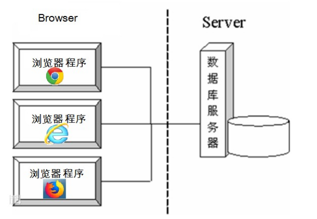
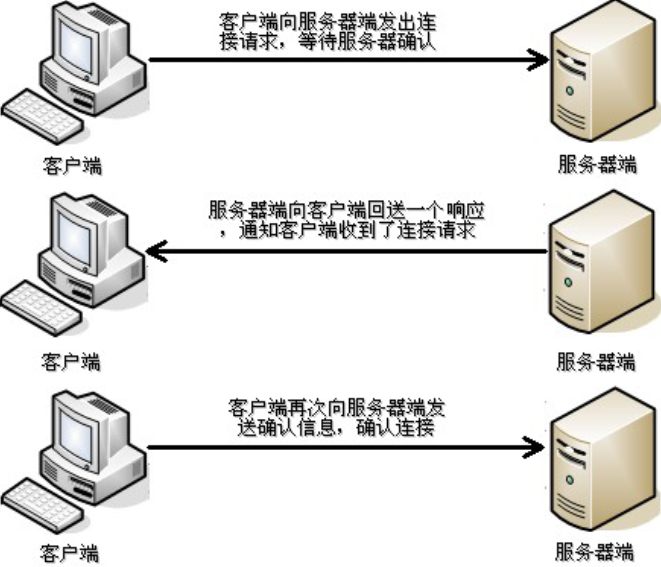
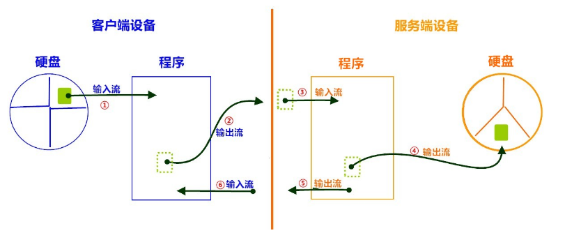
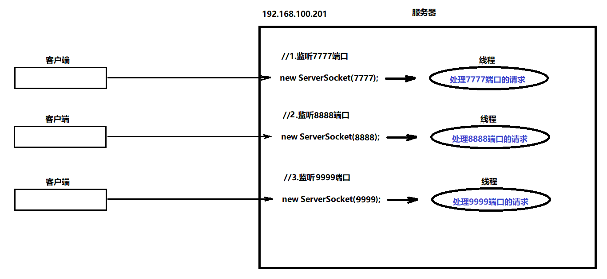
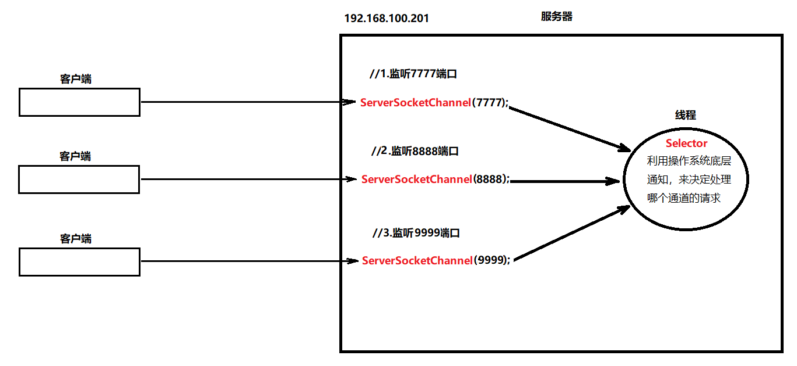

```
public class Client {
    public static void main(String[] args) throws Exception{
        // 1.打开客户端通道
        SocketChannel sc = SocketChannel.open();
        
        // 2.调用connect()连接方法
        sc.connect(new InetSocketAddress("127.0.0.1",6666));

        System.out.println("连接成功..");
    }
}
```

public 

# day12【网络编程和NIO】

## 今日内容

- 网络编程三要素------>了解
  - 协议(TCP,UDP)
  - IP
  - 端口号
- TCP通信----->重点掌握
  - 模拟两台电脑之间互发信息(聊天)
  - 模拟文件上传
  - 模拟B/S结构软件的服务器(了解)
- NIO------>理解
  - Buffer缓冲数组
  - Channel通道
  - Selector选择器------>难点
- NIO2(AIO)------>理解------>难点
  - 异步非阻塞

# 第一章 网络编程入门

## 1.1 软件结构

- **C/S结构** ：全称为Client/Server结构，是指客户端和服务器结构。常见程序有ＱＱ、迅雷等软件。
- 特点: 客户端和服务器是分开的,需要下载客户端
- 优点: 分解服务器压力
- 缺点: 用户需要下载客户端软件,服务器端更新,客户端也要跟着一起更新,开发和维护成本就高了


**B/S结构** ：全称为Browser/Server结构，是指浏览器和服务器结构。常见浏览器有谷歌、火狐等。

- 特点: 用户不需要下载客户端软件,只需要通过浏览器访问即可
- 优点: 用户不需要下载客户端软件，服务器端更新，用户访问的时候就跟着一起更新了
- 缺点: 增加服务器压力



两种架构各有优势，但是无论哪种架构，都离不开网络的支持。**网络编程**，就是在一定的协议下，编写代码实现两台计算机在网络中进行通信的程序。

## 1.2 网络编程三要素

#### 协议

**网络通信协议：**通信协议是计算机必须遵守的规则，只有遵守这些规则，计算机之间才能进行通信。这就好比在道路中行驶的汽车一定要遵守交通规则一样，协议中对数据的传输格式、传输速率、传输步骤等做了统一规定，通信双方必须同时遵守，最终完成数据交换。 

`java.net` 包中提供了两种常见的网络协议的支持：

- **TCP**：传输控制协议 (Transmission Control Protocol)。TCP协议是**面向连接**的通信协议，即传输数据之前，在发送端和接收端建立逻辑连接，然后再传输数据，它提供了两台计算机之间可靠无差错的数据传输。
- **TCP协议特点: 面向连接,传输数据安全,传输速度慢**
- TCP协议:  
  - 连接三次握手：TCP协议中，在发送数据的准备阶段，客户端与服务器之间的三次交互，以保证连接的可靠。
    - 第一次握手，客户端向服务器端发出连接请求，等待服务器确认。  你愁啥?
    - 第二次握手，服务器端向客户端回送一个响应，通知客户端收到了连接请求。我愁你咋地?
    - 第三次握手，客户端再次向服务器端发送确认信息，确认连接。整个交互过程如下图所示。你再愁试试



​    完成三次握手，连接建立后，客户端和服务器就可以开始进行数据传输了。由于这种面向连接的特性，TCP协议可以保证传输数据的安全，所以**应用十分广泛，例如下载文件、浏览网页等**。

- **UDP**：用户数据报协议(User Datagram Protocol)。UDP协议是一个**面向无连接**的协议。传输数据时，不需要建立连接，不管对方端服务是否启动，直接将数据、数据源和目的地都封装在数据包中，直接发送。每个数据包的大小限制在64k以内。它是不可靠协议，因为无连接，所以传输速度快，但是容易丢失数据。日常应用中**,例如视频会议、QQ聊天等。**
- **UDP特点: 面向无连接,传输数据不安全,传输速度快**

#### IP地址

- **IP地址：指互联网协议地址（Internet Protocol Address）**，俗称IP。**IP地址用来给一个网络中的计算机设备做唯一的编号**。相当于每个人的身份证号码。

**IP地址分类 **

- IPv4：是一个32位的二进制数，通常被分为4个字节，表示成`a.b.c.d` 的形式，例如`192.168.65.100` 。其中a、b、c、d都是0~255之间的十进制整数，那么最多可以表示42亿个。

- IPv6：由于互联网的蓬勃发展，IP地址的需求量愈来愈大，但是网络地址资源有限，使得IP的分配越发紧张。有资料显示，全球IPv4地址在2011年2月分配完毕。

  为了扩大地址空间，拟通过IPv6重新定义地址空间，采用128位地址长度，每16个字节一组，分成8组十六进制数，表示成`ABCD:EF01:2345:6789:ABCD:EF01:2345:6789`，号称可以为全世界的每一粒沙子编上一个网址，这样就解决了网络地址资源数量不够的问题。

**常用命令**

- 查看本机IP地址，在控制台输入：

```java
ipconfig
```

- 检查网络是否连通，在控制台输入：

```java
ping 空格 IP地址
ping 220.181.57.216
ping www.baidu.com
```

**特殊的IP地址**

- 本机IP地址：`127.0.0.1`、`localhost` 。

#### 端口号

网络的通信，本质上是两个进程（应用程序）的通信。每台计算机都有很多的进程，那么在网络通信时，如何区分这些进程呢？

如果说**IP地址**可以唯一标识网络中的设备，那么**端口号**就可以唯一标识设备中的进程（应用程序）了。

- **端口号：用两个字节表示的整数，它的取值范围是0~65535**。其中，0~1023之间的端口号用于一些知名的网络服务和应用，普通的应用程序需要使用1024以上的端口号。**如果端口号被另外一个服务或应用所占用，会导致当前程序启动失败。**

利用`协议`+`IP地址`+`端口号` 三元组合，就可以标识网络中的进程了，那么进程间的通信就可以利用这个标识与其它进程进行交互。

#### 总结

- 协议:
  - TCP: 面向连接,传输数据安全,传输速度慢
  - UDP:面向无连接,传输数据不安全,传输速度快
- IP地址
  - 概述: 网络中计算机设备的唯一标识
  - 分类;  IPV4,IPV6
  - 本机ip地址:  127.0.0.1, localhost
- 端口号: 
  - 概述: 计算机设备中应用程序的唯一标识

## 1.3 InetAddress类

#### InetAddress类的概述

- 表示一个IP地址对象。

#### InetAddress类的方法

* static InetAddress getLocalHost()   获得本地主机IP地址对象

* static InetAddress getByName(String host) 根据IP地址字符串或主机名获得对应的IP地址对象

* String getHostName();获得主机名

* String getHostAddress();获得IP地址字符串

  ```java
  public class Test {
      public static void main(String[] args) throws Exception {
          //- static InetAddress getLocalHost()   获得本地主机IP地址对象
          InetAddress ip1 = InetAddress.getLocalHost();
          System.out.println("ip1:" + ip1);// ESKTOP-U8Q5F96/10.254.4.56
  
          //- static InetAddress getByName(String host) 根据IP地址字符串或主机名获得对应的IP地址对象
          InetAddress ip2 = InetAddress.getByName("www.baidu.com");
          System.out.println("ip2:" + ip2);// www.baidu.com/14.215.177.38
  
          //- String getHostName();获得主机名
          System.out.println("主机名:"+ip1.getHostName());// ESKTOP-U8Q5F96
          System.out.println("主机名:"+ip2.getHostName());// www.baidu.com
  
          //- String getHostAddress();获得IP地址字符串
          System.out.println("ip地址字符串:"+ip1.getHostAddress());// 10.254.4.56
          System.out.println("ip地址字符串:"+ip2.getHostAddress());// 14.215.177.38
      }
  }
  
  ```
  
  

# 第二章 TCP通信程序

## 2.1 TCP通信流程和相关类

#### TCP通信的流程

- TCP协议是面向连接的通信协议，即在传输数据前先在发送端和接收器端**建立逻辑连接，然后再传输数据。**它提供了两台计算机之间可靠无差错的数据传输。TCP通信过程如下图所示：


#### TCP协议相关的类

- Socket: 
  - 概述: 一个该类的对象就代表一个客户端程序。
  - 构造方法:  `public Socket(String host,int port)根据ip地址字符串和端口号创建客户端Socket对象`
    - 参数:  传入的服务器的ip地址和端口号
    - 注意:
      - 只要调用构造方法创建Socket对象,那么客户端就会根据指定的ip地址和端口号去连接服务器
      - 如果连接成功,就会返回一个Socket对象,如果连接失败,就会报异常
  - 成员方法:
    - `public OutputStream  getOutputStream(); 获得字节输出流对象,关联了连接通道;`
    - `public InputStream  getInputStream(); 获得字节输入流对象,关联了连接通道;`
    - `public void close(); 关闭Socket对象` 
      - 关闭通过socket获得的流,会关闭socket,关闭socket,同时也会关闭通过socket获得的流
- ServerSocket:
  - 概述: 一个该类的对象就代表一个服务器端程序。
  - 构造方法: `public ServerSocket(int port); 根据指定的端口号开启服务器。`
  - 成员方法:
    - `public Socket accept(); 等待接收客户端请求,建立连接,返回Socket对象,如果没有客户端连接服务器,该方法就会一直阻塞;`
      - 注意: 
        - TCP通信程序,是客户端主动连接服务器,服务器不会主动连接客户端
        - TCP通信程序,应该先启动服务器
    - `public void close();关闭服务器对象,一般不操作`


## 2.2 TCP通信案例1

### 需求

- 客户端向服务器发送字符串数据

### 分析

客户端:
1.创建Socket对象,指定要连接的服务器的ip地址和端口号
2.使用Socket对象调用getOutputStream()方法获得字节输出流对象
3.写出数据到连接通道中
4.释放资源

服务器:
1.创建ServerSocket对象,指定服务器的端口号
2.调用accept()方法,等待接收客户端请求,建立连接,返回Socket对象
3.使用Socket对象调用getInputStream()方法获得字节输入流对象
4.从连接通道中读数据(客户端写过来的)
5.释放资源

### 实现

- 客户端代码实现

  ```java
  public class Client {
      public static void main(String[] args) throws Exception{
          //1.创建Socket对象,指定要连接的服务器的ip地址和端口号
          Socket socket = new Socket("127.0.0.1",6666);
  
          //2.使用Socket对象调用getOutputStream()方法获得字节输出流对象
          OutputStream os = socket.getOutputStream();
  
          //3.写出数据到连接通道中-->写了一个字节数组
          os.write("服务器你好,今晚约吗?".getBytes());
  
          //4.释放资源
          socket.close();
      }
  }
  
  ```
  
- 服务端代码实现

  ```java
  public class Server {
      public static void main(String[] args) throws Exception{
          //1.创建ServerSocket对象,指定服务器的端口号 6666
          ServerSocket ss = new ServerSocket(6666);
  
          //2.调用accept()方法,等待接收客户端请求,建立连接,返回Socket对象
          Socket socket = ss.accept();
  
          //3.使用Socket对象调用getInputStream()方法获得字节输入流对象
          InputStream is = socket.getInputStream();
  
          //4.从连接通道中读数据(客户端写过来的)
          byte[] bys = new byte[1024];
          int len = is.read(bys);
          System.out.println("服务器接收到的数据:"+new String(bys,0,len));
  
          //5.释放资源
          ss.close();
      }
  }
  
  ```


## 2.3 TCP通信案例2

### 需求

 - 客户端向服务器发送字符串数据,**服务器回写字符串数据给客户端**(模拟聊天)

### 分析

客户端:
1.创建Socket对象,指定要连接的服务器的ip地址和端口号
2.使用Socket对象调用getOutputStream()方法获得字节输出流对象
3.写出数据到连接通道中
4.使用Socket对象调用getInputStream()方法获得字节输入流对象
5.从连接通道中读数据(服务器写过来的)
6.释放资源

服务器:
1.创建ServerSocket对象,指定服务器的端口号
2.调用accept()方法,等待接收客户端请求,建立连接,返回Socket对象
3.使用Socket对象调用getInputStream()方法获得字节输入流对象
4.从连接通道中读数据(客户端写过来的)
5.使用Socket对象调用getOutPutStream()方法获得字节输出流对象
6.写出数据到连接通道中
7.释放资源

### 实现

- TCP客户端代码

```java
public class Client {
    public static void main(String[] args) throws Exception{
        //1.创建Socket对象,指定要连接的服务器的ip地址和端口号
        Socket socket = new Socket("127.0.0.1",6666);

        //2.使用Socket对象调用getOutputStream()方法获得字节输出流对象
        OutputStream os = socket.getOutputStream();

        //3.写出数据到连接通道中-->写了一个字节数组
        os.write("服务器你好,今晚约吗?".getBytes());

        //4.使用Socket对象调用getInputStream()方法获得字节输入流对象
        InputStream is = socket.getInputStream();

        //5.从连接通道中读数据(服务器写过来的)
        byte[] bys = new byte[1024];
        int len = is.read(bys);
        System.out.println("客户端接收到的数据:"+new String(bys,0,len));

        //6.释放资源
        socket.close();
    }
}

```

- 服务端代码实现

```java
public class Server {
    public static void main(String[] args) throws Exception{
        //1.创建ServerSocket对象,指定服务器的端口号 6666
        ServerSocket ss = new ServerSocket(6666);

        //2.调用accept()方法,等待接收客户端请求,建立连接,返回Socket对象
        Socket socket = ss.accept();

        //3.使用Socket对象调用getInputStream()方法获得字节输入流对象
        InputStream is = socket.getInputStream();

        //4.从连接通道中读数据(客户端写过来的)
        byte[] bys = new byte[1024];
        int len = is.read(bys);
        System.out.println("服务器接收到的数据:"+new String(bys,0,len));

        //5.使用Socket对象调用getOutPutStream()方法获得字节输出流对象
        OutputStream os = socket.getOutputStream();

        //6.写出数据到连接通道中-->写了一个字节数组
        os.write("客户端你好,今晚不约!".getBytes());

        //7.释放资源
        ss.close();
    }
}

```


## 2.4 扩展模拟循环聊天

- 服务器

  ```java
  public class Server {
      public static void main(String[] args) throws Exception{
          //1.创建ServerSocket对象,指定服务器的端口号 6666
          ServerSocket ss = new ServerSocket(6666);
  
          //2.调用accept()方法,等待接收客户端请求,建立连接,返回Socket对象
          Socket socket = ss.accept();
  
          // 循环聊天
          while (true) {
  
              //3.使用Socket对象调用getInputStream()方法获得字节输入流对象
              InputStream is = socket.getInputStream();
  
              //4.从连接通道中读数据(客户端写过来的)
              byte[] bys = new byte[1024];
              int len = is.read(bys);
              System.out.println("服务器接收到的数据:"+new String(bys,0,len));
  
              //5.使用Socket对象调用getOutPutStream()方法获得字节输出流对象
              OutputStream os = socket.getOutputStream();
  
              // 服务器输入要发送的字符串数据
              Scanner sc = new Scanner(System.in);
              System.out.println("请输入给客户端发送的字符串数据:");
              String msg = sc.nextLine();
  
              //6.写出数据到连接通道中-->写了一个字节数组
              os.write(msg.getBytes());
  
              //7.释放资源
              //ss.close();
          }
      }
  }
  
  ```
  
  
  
- 客户端

  ```java
  public class Client {
      public static void main(String[] args) throws Exception{
          //1.创建Socket对象,指定要连接的服务器的ip地址和端口号
          Socket socket = new Socket("127.0.0.1",6666);
  
          // 循环聊天
          while (true) {
              //2.使用Socket对象调用getOutputStream()方法获得字节输出流对象
              OutputStream os = socket.getOutputStream();
  
              // 客户端输入要发送的字符串数据
              Scanner sc = new Scanner(System.in);
              System.out.println("请输入给服务器发送的字符串数据:");
              String msg = sc.nextLine();
  
              //3.写出数据到连接通道中-->写了一个字节数组
              os.write(msg.getBytes());
  
              //4.使用Socket对象调用getInputStream()方法获得字节输入流对象
              InputStream is = socket.getInputStream();
  
              //5.从连接通道中读数据(服务器写过来的)
              byte[] bys = new byte[1024];
              int len = is.read(bys);
              System.out.println("客户端接收到的数据:"+new String(bys,0,len));
  
              //6.释放资源
              //socket.close();
          }
      }
  }
  
  ```
  
  

# 第三章 综合案例

## 3.1 文件上传案例

### 需求

- 使用TCP协议, 通过客户端向服务器上传一个文件

### 分析




客户端:
1.创建Socket对象,指定要连接的服务器的ip地址和端口号
2.创建字节输入流对象,关联数据源文件路径
3.通过Socket获得字节输出流对象,关联连接通道
4.定义一个byte数组,用来存储读取到的字节数据
5.定义一个int变量,用来存储读取到的字节个数
6.循环读取数据
7.在循环中,写出数据到连接通道
8.通过Socket对象获得字节输入流对象,关联连接通道
9.读服务器回写的数据
10.释放资源
服务器:
1.创建ServerSocket对象,指定服务器的端口号
2.调用accept方法等待接收客户端请求,建立连接,得到Socket对象
3.通过Socket对象获得字节输入流对象,关联连接通道
4.创建字节输出流对象,关联目的地文件路径
5.定义一个byte数组,用来存储读取到的字节数据
6.定义一个int变量,用来存储读取到的字节个数
7.循环读取数据
8.在循环中,写出数据到连接通道
9.通过Socket对象获得字节输出流对象,关联连接通道
10.回写数据给客户端
11.释放资源

### 实现

#### 文件上传

- 服务器

  ```java
  public class Server {
      public static void main(String[] args) throws Exception{
          //服务器:
          //1.创建ServerSocket对象,指定服务器的端口号 7777
          ServerSocket ss = new ServerSocket(7777);
  
          //2.调用accept方法等待接收客户端请求,建立连接,得到Socket对象
          Socket socket = ss.accept();
  
          //3.通过Socket对象获得字节输入流对象,关联连接通道
          InputStream is = socket.getInputStream();
  
          //4.创建字节输出流对象,关联目的地文件路径
          FileOutputStream fos = new FileOutputStream("day12\\bbb\\hbCopy1.jpg");
  
          //5.定义一个byte数组,用来存储读取到的字节数据
          byte[] bys = new byte[8192];
  
          //6.定义一个int变量,用来存储读取到的字节个数
          int len;
  
          //7.循环读取数据
          while ((len = is.read(bys)) != -1) {
              //8.在循环中,写出数据到连接通道
              fos.write(bys, 0,len);
          }
          //9.释放资源
          fos.close();
          is.close();
          ss.close();// 一般不关闭
      }
  }
  
  ```
  
  
  
- 客户端

  ```java
  public class Client {
      public static void main(String[] args) throws Exception{
          //客户端:
          //1.创建Socket对象,指定要连接的服务器的ip地址和端口号
          Socket socket = new Socket("127.0.0.1",7777);
  
          //2.创建字节输入流对象,关联数据源文件路径
          FileInputStream fis = new FileInputStream("day12\\aaa\\hb.jpg");
  
          //3.通过Socket获得字节输出流对象,关联连接通道
          OutputStream os = socket.getOutputStream();
  
          //4.定义一个byte数组,用来存储读取到的字节数据
          byte[] bys = new byte[8192];
  
          //5.定义一个int变量,用来存储读取到的字节个数
          int len;
  
          //6.循环读取数据
          while ((len = fis.read(bys)) != -1) {
              //7.在循环中,写出数据到连接通道
              os.write(bys,0,len);
          }
          //8.释放资源
          os.close();
          fis.close();
  
  
      }
  }
  
  ```
  
  

#### 文件上传成功后服务器回写字符串数据

- 服务器

  ```java
  
  public class Server {
      public static void main(String[] args) throws Exception{
          //服务器:
          //1.创建ServerSocket对象,指定服务器的端口号 7777
          ServerSocket ss = new ServerSocket(7777);
  
          //2.调用accept方法等待接收客户端请求,建立连接,得到Socket对象
          Socket socket = ss.accept();
  
          //3.通过Socket对象获得字节输入流对象,关联连接通道
          InputStream is = socket.getInputStream();
  
          //4.创建字节输出流对象,关联目的地文件路径
          FileOutputStream fos = new FileOutputStream("day12\\bbb\\hbCopy4.jpg");
  
          //5.定义一个byte数组,用来存储读取到的字节数据
          byte[] bys = new byte[8192];
  
          //6.定义一个int变量,用来存储读取到的字节个数
          int len;
  
          //7.循环读取连接通道中的数据
          System.out.println("服务器依然还在等待连接通道的数据来读取...");
          while ((len = is.read(bys)) != -1) {// 卡
              //8.在循环中,写出数据到连接通道
              fos.write(bys, 0,len);
          }
          System.out.println("服务器读完了连接通道中的数据...");
  
          // 原因: 服务器一直在读连接通道中的数据,不知道客户端不会再往通道中写数据了
          // 解决办法: 客户端告诉服务器,不再往通道中写数据了,那么服务器才会结束读取通道中的数据
          // Socket类的方法: socket.shutdownOutput();
  
          //9.通过Socket对象获得字节输出流对象,关联连接通道
          OutputStream os = socket.getOutputStream();
  
          //10.回写数据给客户端--->写一个一个字节数组
          os.write("文件上传成功!".getBytes());
  
          //11.释放资源
          fos.close();
          is.close();
          ss.close();// 一般不关闭
      }
  }
  
  ```
  
  
  
- 客户端

  ```java
  
  public class Client {
      public static void main(String[] args) throws Exception{
          //客户端:
          //1.创建Socket对象,指定要连接的服务器的ip地址和端口号
          Socket socket = new Socket("127.0.0.1",7777);
  
          //2.创建字节输入流对象,关联数据源文件路径
          FileInputStream fis = new FileInputStream("day12\\aaa\\hb.jpg");
  
          //3.通过Socket获得字节输出流对象,关联连接通道
          OutputStream os = socket.getOutputStream();
  
          //4.定义一个byte数组,用来存储读取到的字节数据
          byte[] bys = new byte[8192];
  
          //5.定义一个int变量,用来存储读取到的字节个数
          int len;
  
          //6.循环读取数据
          while ((len = fis.read(bys)) != -1) {
              //7.在循环中,写出数据到连接通道
              os.write(bys,0,len);// 写到连接通道中的数据一定是hb.jpg的字节数据
          }
  
          // 告诉服务器,不会再往连接通道中写数据了
          socket.shutdownOutput();
  
          //8.通过Socket对象获得字节输入流对象,关联连接通道
          InputStream is = socket.getInputStream();
  
          System.out.println("客户端已经上传完毕,等待接收服务器回写的数据...");
          //9.读服务器回写的数据
          int lens = is.read(bys);// 卡
          System.out.println("服务器回写的数据:"+new String(bys,0,lens));
  
          //10.释放资源
          os.close();
          fis.close();
  
  
      }
  }
  
  ```
  
  

#### 优化文件上传案例

- 需要优化的问题

  - 文件名固定写死了----->动态的生成一个唯一的文件名
  - 服务器只能接收上传一次文件---->循环接收上传的文件
  - 单线程:
    - zs上传一个2GB的文件
    - ls上传一个2kb的文件
    - 假设zs先和服务建立连接,那么ls要和服务器建立连接,必须等zs上传完毕才能建立连接
  - 多线程:  
    - 可以抢

- 优化f服务器实现

  ```java
  public class Server {
      public static void main(String[] args) throws Exception {
          //服务器:
          //1.创建ServerSocket对象,指定服务器的端口号 7777
          ServerSocket ss = new ServerSocket(7777);
  
          // 循环建立连接,上传文件
          while (true) {
  
              //2.调用accept方法等待接收客户端请求,建立连接,得到Socket对象
              Socket socket = ss.accept();
  
              // 开启线程,接收上传的文件
              new Thread(new Runnable() {
                  @Override
                  public void run() {
                     try{
                         //3.通过Socket对象获得字节输入流对象,关联连接通道
                         InputStream is = socket.getInputStream();
  
                         //4.创建字节输出流对象,关联目的地文件路径
                         FileOutputStream fos = new FileOutputStream("day12\\bbb\\" + System.currentTimeMillis() + ".jpg");
  
                         //5.定义一个byte数组,用来存储读取到的字节数据
                         byte[] bys = new byte[8192];
  
                         //6.定义一个int变量,用来存储读取到的字节个数
                         int len;
  
                         //7.循环读取连接通道中的数据
                         System.out.println("服务器依然还在等待连接通道的数据来读取...");
                         while ((len = is.read(bys)) != -1) {// 卡
                             //8.在循环中,写出数据到连接通道
                             fos.write(bys, 0, len);
                         }
                         System.out.println("服务器读完了连接通道中的数据...");
  
                         // 原因: 服务器一直在读连接通道中的数据,不知道客户端不会再往通道中写数据了
                         // 解决办法: 客户端告诉服务器,不再往通道中写数据了,那么服务器才会结束读取通道中的数据
                         // Socket类的方法: socket.shutdownOutput();
  
                         //9.通过Socket对象获得字节输出流对象,关联连接通道
                         OutputStream os = socket.getOutputStream();
  
                         //10.回写数据给客户端--->写一个一个字节数组
                         os.write("文件上传成功!".getBytes());
  
                         //11.释放资源
                         fos.close();
                         is.close();
                         //ss.close();// 不关闭
                     }catch (Exception e){
  
                     }
                  }
              }).start();
  
          }
      }
  }
  
  ```
  
  


## 3.2 模拟B\S服务器  扩展

### 需求

- 模拟网站服务器，使用浏览器访问自己编写的服务端程序，查看网页效果。

### 分析

1. 准备页面数据，web文件夹。

2. 我们模拟服务器端，ServerSocket类监听端口，使用浏览器访问，查看网页效果

3. 注意:

   ```java
   // 1.浏览器工作原理是遇到图片会开启一个线程进行单独的访问,因此在服务器端加入线程技术。
   // 2. 响应页面的时候需要同时把以下信息响应过去给浏览器
   os.write("HTTP/1.1 200 OK\r\n".getBytes());
   os.write("Content-Type:text/html\r\n".getBytes());
   os.write("\r\n".getBytes());
   ```

### 实现

```java
public class Server {
    public static void main(String[] args) throws Exception {
        // 思路:
        //1.创建ServerSocket对象,指定服务器的端口号8888
        ServerSocket ss = new ServerSocket(8888);

        // 循环接收请求--->请求html页面,还会请求该页面上的图片
        while (true) {
            //2.调用accept()方法接收请求,建立连接,返回Socket对象
            Socket socket = ss.accept();

            // 浏览器工作原理是遇到图片会开启一个线程进行单独的访问,因此在服务器端加入线程技术。
            new Thread(new Runnable() {
                @Override
                public void run() {
                    try {
                        //3.通过Socket获得字节输入流对象,关联连接通道
                        InputStream is = socket.getInputStream();

                        //4.使用字节输入流对象读取连接通道中的数据
                        //byte[] bys = new byte[8192];
                        //int len = is.read(bys);
                        //System.out.println(new String(bys,0,len));
                        // 把is字节输入流转换为字符输入流
                        InputStreamReader isr = new InputStreamReader(is);
                        BufferedReader br = new BufferedReader(isr);
                        String line = br.readLine();
                        System.out.println("line:" + line);

                        //5.筛选数据,得到要请求的页面的路径
                        String path = line.split(" ")[1].substring(1);
                        System.out.println("path:" + path);//   day12/web/index.html

                        //6.创建字节输入流对象,关联页面路径
                        FileInputStream fis = new FileInputStream(path);

                        //7.通过Socket对象获得字节输出流对象,关联连接通道
                        OutputStream os = socket.getOutputStream();

                        //8.定义一个byte数组,用来存储读取到的字节数据
                        byte[] bys = new byte[8192];

                        //9.定义一个int变量,用来存储读取到的字节个数
                        int len;

                        os.write("HTTP/1.1 200 OK\r\n".getBytes());
                        os.write("Content-Type:text/html\r\n".getBytes());
                        os.write("\r\n".getBytes());

                        //10.循环读取字节数据
                        while ((len = fis.read(bys)) != -1) {
                            //11.在循环中,写出字节数据
                            os.write(bys, 0, len);
                        }
                        //12.释放资源
                        os.close();
                        fis.close();
                        //ss.close();
                    } catch (Exception e) {

                    }
                }
            }).start();

        }
    }
}

```


**访问效果：**


# 第四章 NIO

## 4.1 NIO概述

在我们学习Java的NIO流之前，我们都要了解几个关键词

- 同步与异步（synchronous/asynchronous）：**同步**是一种可靠的有序运行机制，当我们进行同步操作时，后续的任务是等待当前调用返回，才会进行下一步；而**异步**则相反，其他任务不需要等待当前调用返回，通常依靠事件、回调等机制来实现任务间次序关系
  - **同步**: 调用方法之后,必须要得到一个返回值       例如: 买火车票,一定要买到票,才能继续下一步    
  - **异步**: 调用方法之后,没有返回值,但是会有回调函数,回调函数指的是满足条件之后会自动执行的方法   例如: 买火车票, 不一定要买到票,我可以交代售票员,当有票的话,你就帮我出张票
- 阻塞与非阻塞：在进行**阻塞**操作时，当前线程会处于阻塞状态，无法从事其他任务，只有当条件就绪才能继续，比如ServerSocket新连接建立完毕，或者数据读取、写入操作完成；而**非阻塞**则是不管IO操作是否结束，直接返回，相应操作在后台继续处理
  - 阻塞:如果没有达到方法的目的,就会一直停在那里(等待) ,  例如: ServerSocket的accept()方法
  - 非阻塞: 不管方法有没有达到目的,都直接往下执行(不等待)

**在Java1.4之前的I/O系统中**，提供的都是**面向流的I/O系统**，系统一次一个字节地处理数据，一个输入流产生一个字节的数据，一个输出流消费一个字节的数据，**面向流的I/O速度非常慢**，而在**Java 1.4中推出了NIO**，这是一个**面向块的I/O系统，系统以块的方式处理数据**，每一个操作在一步中产生或者消费一个数据，按块处理要比按字节处理数据快的多。

**在 Java 7 中，NIO 有了进一步的改进，也就是 NIO 2，引入了异步非阻塞 IO 方式，也有很多人叫它 AIO（Asynchronous IO）**。异步 IO 操作基于事件和回调机制，可以简单理解为，应用操作直接返回，而不会阻塞在那里，当后台处理完成，操作系统会通知相应线程进行后续工作。

NIO之所以是同步，是因为它的accept/read/write方法的内核I/O操作都会阻塞当前线程

首先，我们要先了解一下NIO的三个主要组成部分：**Buffer（缓冲区）、Channel（通道）、Selector（选择器）**

**IO: 同步阻塞**

**NIO: 同步阻塞,同步非阻塞**

**NIO2: 异步非阻塞**


# 第五章 Buffer类（缓冲区）

## 5.1 Buffer的概述和分类

 概述:Buffer是一个抽象类，是对某种基本类型的数组进行封装。  

作用: 在NIO中，就是通过 Buffer 来读写数据的。所有的数据都是用Buffer来处理的，它**是NIO读写数据的中转池,** 通常使用字节数组。

Buffer主要有如下几种：

- **ByteBuffer**--->byte[]
- CharBuffer
- DoubleBuffer
- FloatBuffer
- IntBuffer
- LongBuffer
- ShortBuffer


## 5.2 创建ByteBuffer

- public  static ByteBuffer allocate(int capacity)   分配一个新的缓冲区（堆内存，创建快，访问慢）。 

- public static ByteBuffer allocateDirect(int capacity)   分配一个新的直接缓冲区（系统内存，创建慢，访问快）。 

- public static ByteBuffer wrap(byte[] array)    将 byte 数组包装到缓冲区中（间接缓冲区）。

- public byte[] array(); 获取封装的字节数组

  ```java
  public class Test1_创建ByteBuffer {
      public static void main(String[] args) {
          //- static ByteBuffer allocate(int capacity)   分配一个新的缓冲区（堆内存，创建快，访问慢）。--->常用
          // 创建一个ByteBuffer字节缓冲数组,封装了一个长度为10的byte数组,数组中的元素为:0
          ByteBuffer b1 = ByteBuffer.allocate(10);
  
          //- static ByteBuffer allocateDirect(int capacity)   分配一个新的直接缓冲区（系统内存，创建慢，访问快）。
          // 创建一个ByteBuffer字节缓冲数组,封装了一个长度为10的byte数组,数组中的元素为:0
          ByteBuffer b2 = ByteBuffer.allocateDirect(10);
  
          //- static ByteBuffer wrap(byte[] array)    将 byte 数组包装到缓冲区中（堆区）。--->常用
          // 创建一个ByteBuffer字节缓冲数组,封装了一个长度为4的byte数组,数组中的元素为:97,98,99,100
          byte[] bys = {97, 98, 99, 100};
          ByteBuffer b3 = ByteBuffer.wrap(bys);
  
          //System.out.println("b1:" + Arrays.toString(b1.array()));// [0, 0, 0, 0, 0, 0, 0, 0, 0, 0]
          //System.out.println("b3:" + Arrays.toString(b3.array()));// [97, 98, 99, 100]
  
      }
  }
  
  ```

  


## 5.3 添加数据-put

- public ByteBuffer put(byte b)：向当前可用位置添加数据。

- public ByteBuffer put(byte[] byteArray)：向当前可用位置添加一个byte[]数组

- public ByteBuffer put(byte[] byteArray,int offset,int len)：添加一个byte[]数组的一部分

  ```java
  public class Test2_put {
      public static void main(String[] args) {
          // 创建ByteBuffer字节缓冲数组,指定容量为10
          ByteBuffer b1 = ByteBuffer.allocate(10);
  
          //- public ByteBuffer put(byte b)：向当前可用位置添加数据。
          b1.put((byte) 10);
          b1.put((byte) 20);
          b1.put((byte) 30);
  
          //- public ByteBuffer put(byte[] byteArray)：向当前可用位置添加一个byte[]数组
          byte[] bys = {97, 98, 99, 100};
          b1.put(bys);
  
          //- public ByteBuffer put(byte[] byteArray,int offset,int len)：添加一个byte[]数组的一部分
          b1.put(bys, 0, 2);
  
          // b1:[10, 20, 30, 97, 98, 99, 100, 97, 98, 0]
          System.out.println("b1:" + Arrays.toString(b1.array()));
      }
  }
  
  ```

  


## 5.4 容量-capacity

- Buffer的容量(capacity)是指：Buffer所能够包含的元素的最大数量。定义了Buffer后，容量是不可变的。

  - `public final int capacity();获取缓冲数组的容量`

- 示例代码：

  ```java
  public class Test2_capacity {
      public static void main(String[] args) {
          // 创建ByteBuffer字节缓冲数组,指定容量为10
          ByteBuffer b1 = ByteBuffer.allocate(10);
  
          //b1的容量: 10
          System.out.println("b1的容量: "+b1.capacity());
  
          // 添加数据
          b1.put((byte) 10);
          b1.put((byte) 20);
          b1.put((byte) 30);
          
          //b1的容量: 10
          System.out.println("b1的容量: "+b1.capacity());
      }
  }
  ```
  
  
  


## 5.5 限制-limit

- 限制limit是指：第一个不能读或写入元素的index索引。缓冲区的限制(limit)不能为负，并且不能大于容量。

- 有两个相关方法：

  - public int limit()：获取此缓冲区的限制。
  - public Buffer limit(int newLimit)：设置此缓冲区的限制。

- 示例代码：

  ```java
  public class Test2_limit {
      public static void main(String[] args) {
          // 创建ByteBuffer字节缓冲数组,指定容量为10
          ByteBuffer b1 = ByteBuffer.allocate(10);
  
          //b1的限制: 10
          System.out.println("b1的限制: "+b1.limit());
  
          // 添加数据
          b1.put((byte) 10);
          b1.put((byte) 20);
          b1.put((byte) 30);
  
          // 修改b1的限制为3
          b1.limit(3);
  
          //b1的限制: 3
          System.out.println("b1的限制: "+b1.limit());
  
      }
  }
  
  ```
  
  图示：
  
  

## 5.6 位置-position

- 位置position是指：当前可读,写入元素的index索引。位置不能小于0，并且不能大于"限制"。

- **结论: 操作缓冲数组,其实就是操作position到limit之间位置上的元素**

- 有两个相关方法：

  - public int position()：获取当前可写入位置索引。
  - public Buffer position(int pos)：更改当前可写入位置索引。

- 示例代码：

  ```java
  public class Test2_position {
      public static void main(String[] args) {
          // 创建ByteBuffer字节缓冲数组,指定容量为10
          ByteBuffer b1 = ByteBuffer.allocate(10);
  
          // b1的limit: 10,b1的postion:0,能使用的位置: [0,10)
          System.out.println("b1的limit: "+b1.limit()+",b1的postion:"+b1.position());
  
          // 添加数据
          b1.put((byte) 10);
          b1.put((byte) 20);
          b1.put((byte) 30);
  
          // b1的limit: 10,b1的postion:3,能使用的位置: [3,10)
          System.out.println("b1的limit: "+b1.limit()+",b1的postion:"+b1.position());
      }
  }
  
  ```


## 5.7 标记-mark

- 标记mark是指：当调用缓冲区的reset()方法时，会将缓冲区的position位置重置为该标记的索引。

- 相关方法：

  - public Buffer mark()：设置此缓冲区的**标记为当前的position位置**。
  - public Buffer reset() : 将此缓冲区的位置**重置为以前标记的位置**。

- 示例代码：

  ```java
  public class Test2_mark {
      public static void main(String[] args) {
          // 创建ByteBuffer字节缓冲数组,指定容量为10
          ByteBuffer b1 = ByteBuffer.allocate(10);
  
          // 添加数据
          b1.put((byte) 10);
          b1.put((byte) 20);
          b1.put((byte) 30);
  
          // mark一下
          b1.mark();// 标记当前的position位置: 3
  
          // 添加数据
          b1.put((byte) 40);
          b1.put((byte) 50);
          b1.put((byte) 60);
  
  
          // b1的position:6
          System.out.println("b1的position:"+b1.position());
          // b1:[10, 20, 30, 40, 50, 60, 0, 0, 0, 0]
          System.out.println("b1:"+ Arrays.toString(b1.array()));
  
  
          // 修改postion位置为3
          /*b1.position(3);
          b1.put((byte)70);
          // b1:[10, 20, 30, 70, 50, 60, 0, 0, 0, 0]
          System.out.println("b1:"+ Arrays.toString(b1.array()));*/
  
          // reset一下
          b1.reset();
  
          // b1的position:3
          System.out.println("b1的position:"+b1.position());
          b1.put((byte)70);
          // b1:[10, 20, 30, 70, 50, 60, 0, 0, 0, 0]
          System.out.println("b1:"+ Arrays.toString(b1.array()));
  
  
      }
  }
  
  ```
  
  


## 5.8 clear和flip

```java
- public Buffer clear()：还原缓冲区的状态。
  - 将position设置为：0
  - 将限制limit设置为容量capacity；
  - 丢弃标记mark。
- public Buffer flip()：缩小limit的范围。
  - 将当前position位置设置为0；
  - 将limit设置为当前position位置；
  - 丢弃标记。
```

- clear方法演示

  ```java
  public class Test2_clear {
      public static void main(String[] args) {
          /*
              - public Buffer clear()：还原缓冲区的状态。
                - 将position设置为：0
                - 将限制limit设置为容量capacity；
                - 丢弃标记mark。
           */
          // 创建ByteBuffer字节缓冲数组,指定容量为10
          ByteBuffer b1 = ByteBuffer.allocate(10);
  
          // postion:0,limit:10,capacity:10
          System.out.println("postion:" + b1.position() + ",limit:" + b1.limit() + ",capacity:" + b1.capacity());
  
          // 添加数据
          b1.put((byte) 10);
          b1.put((byte) 20);
          b1.put((byte) 30);
  
          // postion:3,limit:10,capacity:10
          System.out.println("postion:" + b1.position() + ",limit:" + b1.limit() + ",capacity:" + b1.capacity());
  
          // 修改limit为5
          b1.limit(5);
  
          // postion:3,limit:5,capacity:10
          System.out.println("postion:" + b1.position() + ",limit:" + b1.limit() + ",capacity:" + b1.capacity());
  
          // 还原一下
          b1.clear();
  
          //  postion:0,limit:10,capacity:10
          System.out.println("postion:" + b1.position() + ",limit:" + b1.limit() + ",capacity:" + b1.capacity());
  
      }
  }
  
  ```
  
- flip方法演示

  ```java
  public class Test2_flip {
      public static void main(String[] args) {
          /*
              - public Buffer flip()：缩小limit的范围。
                - 将当前position位置设置为0；
                - 将limit设置为当前position位置；
                - 丢弃标记。
           */
          // 创建ByteBuffer字节缓冲数组,指定容量为10
          ByteBuffer b1 = ByteBuffer.allocate(10);
  
          // postion:0,limit:10,capacity:10
          System.out.println("postion:" + b1.position() + ",limit:" + b1.limit() + ",capacity:" + b1.capacity());
  
          // 添加数据
          b1.put((byte) 10);
          b1.put((byte) 20);
          b1.put((byte) 30);
  
          // postion:3,limit:10,capacity:10
          System.out.println("postion:" + b1.position() + ",limit:" + b1.limit() + ",capacity:" + b1.capacity());
  
          // flip一下
          b1.flip();
  
          // postion:0,limit:3,capacity:10
          System.out.println("postion:" + b1.position() + ",limit:" + b1.limit() + ",capacity:" + b1.capacity());
  
      }
  }
  
  ```
  
  - 结论: 读完之后,flip一下,写完之后,clear一下

# 第六章 Channel（通道）

## 6.1 Channel概述

#### Channel 的概述

- Channel是一个接口，可以通过它读取和写入数据。可以把它看做是IO中的流，不同的是：
  Channel 是双向的，既可以读又可以写，而流是单向的。
  Channel 可以进行异步的读写。
  对 Channel 的读写必须通过 buffer 对象。

#### Channel 的分类

在Java NIO中的Channel主要有如下几种类型：

- FileChannel：从文件读数据的      输入流和输出流
- DatagramChannel：读写UDP网络协议数据     UPD   Datagram
- SocketChannel：读写TCP网络协议数据      TCP   Socket
- ServerSocketChannel：可以监听TCP连接    TCP ServerSocket


## 6.2 FileChannel类的基本使用

#### FileChannel的介绍

- 概述: java.nio.channels.FileChannel是用于读,写文件的通道
- 如何获取:  通过FileInputStream和FileOutputStream流的getChannel()方法获取
- 常用方法:
  - `public abstract int read(ByteBuffer dst)读数据,读到文件的末尾返回-1`
  - `public abstract int write(ByteBuffer src)写数据,写的就是postion到limit之间的数据`

#### 使用FileChannel类完成文件的复制

```java
public class Test1_结合ByteBuffer复制文件 {
    public static void main(String[] args) throws Exception{
        // 1.创建字节输入流对象,关联数据源文件路径
        FileInputStream fis = new FileInputStream("day12\\aaa\\hb.jpg");
        // 2.创建字节输出流对象,关联目的地文件路径
        FileOutputStream fos = new FileOutputStream("day12\\ccc\\hbCopy1.jpg");

        // 3.通过输入流和输出流分别获取对应的FileChannel对象
        FileChannel c1 = fis.getChannel();
        FileChannel c2 = fos.getChannel();

        // 4.创建字节缓冲数组,指定容量
        ByteBuffer b = ByteBuffer.allocate(8192);

        // 4.循环读数据
        while (c1.read(b) != -1) {
            // flip一下,切换为写的模式
            b.flip();// position:0, limit: position

            // 5.在循环中,写数据
            c2.write(b);

            // clear一下,供下一次循环使用
            b.clear();// position:0, limit: capacity
        }
        // 6.释放资源
        c2.close();
        c1.close();
        fos.close();
        fis.close();
    }
}

```


## 6.3 FileChannel结合MappedByteBuffer实现高效读写

#### MappedByteBuffer类的概述

- 上例直接使用FileChannel结合ByteBuffer实现的管道读写，但并不能提高文件的读写效率。

- ByteBuffer有个抽象子类：MappedByteBuffer，它**可以将文件直接映射至内存**，**把硬盘中的读写变成内存中的读写,** 所以可以提高大文件的读写效率。

- 可以调用FileChannel的map()方法获取一个MappedByteBuffer，map()方法的原型：

  ​		**MappedByteBuffer map(MapMode mode, long position, long size);** 

  ​		**说明：将节点中从position开始的size个字节映射到返回的MappedByteBuffer中。**
  
- 代码说明：

  - map()方法的第一个参数mode：映射的三种模式，在这三种模式下得到的将是三种不同的MappedByteBuffer：三种模式都是Channel的内部类MapMode中定义的静态常量，这里以FileChannel举例：
    1). **FileChannel.MapMode.READ_ONLY**：得到的镜像只能读不能写（只能使用get之类的读取Buffer中的内容）；

    2). **FileChannel.MapMode.READ_WRITE**：得到的镜像可读可写（既然可写了必然可读），对其写会直接更改到存储节点；

    3). **FileChannel.MapMode.PRIVATE**：得到一个私有的镜像，其实就是一个(position, size)区域的副本罢了，也是可读可写，只不过写不会影响到存储节点，就是一个普通的ByteBuffer了！！

  - 为什么使用RandomAccessFile？

    1). 使用InputStream获得的Channel可以映射，使用map时只能指定为READ_ONLY模式，不能指定为READ_WRITE和PRIVATE，否则会抛出运行时异常！

    2). 使用OutputStream得到的Channel不可以映射！并且OutputStream的Channel也只能write不能read！

    3). **只有RandomAccessFile获取的Channel才能开启任意的这三种模式！**

#### 复制2GB以下的文件

```java
public class Test2_结合MappedByteBuffer复制2GB以下的文件 {
    public static void main(String[] args) throws Exception{
        // 1.创建RandomAccessFile对象,指定模式: r:表示读,  rw:表示读写
        RandomAccessFile r1 = new RandomAccessFile("day12\\aaa\\hb.jpg","r");
        RandomAccessFile r2 = new RandomAccessFile("day12\\ccc\\hbCopy2.jpg","rw");

        // 2.获取FileChannel
        FileChannel c1 = r1.getChannel();
        FileChannel c2 = r2.getChannel();

        // 3.获取文件的字节大小
        long size = c1.size();

        // 4.映射
        MappedByteBuffer m1 = c1.map(FileChannel.MapMode.READ_ONLY, 0, size);
        MappedByteBuffer m2 = c2.map(FileChannel.MapMode.READ_WRITE, 0, size);

        // 5.把m1中的字节数据拷贝到m2中
        for (long i = 0; i < size; i++) {
            // 获取m1映射数组中的字节数据
            byte b = m1.get();
            // 存储到m2映射数组中
            m2.put(b);
        }

        // 6.释放资源
        c2.close();
        c1.close();
        r2.close();
        r1.close();
    }
}

```

#### 复制2GB以上的文件

- 下例使用循环，将文件分块，可以高效的复制大于2G的文件

```java
public class Test2_结合MappedByteBuffer复制2GB以下的文件 {
    public static void main(String[] args) throws Exception{
        // 1.创建RandomAccessFile对象,指定模式: r:表示读,  rw:表示读写
        RandomAccessFile r1 = new RandomAccessFile("day12\\aaa\\hb.jpg","r");
        RandomAccessFile r2 = new RandomAccessFile("day12\\ccc\\hbCopy2.jpg","rw");

        // 2.获取FileChannel
        FileChannel c1 = r1.getChannel();
        FileChannel c2 = r2.getChannel();

        // 3.获取文件的字节大小
        long size = c1.size();

        // 假设每次复制的字节大小:  everySize
        long everySize = 500*1024*1024;

        //复制的总次数: count = size%everySize==0 ?  size / everySize :  (size / everySize) + 1;
        long count = size%everySize==0 ?  size / everySize :  (size / everySize) + 1;

        // 循环映射
        for (long i = 0; i < count; i++) {

            //每次复制的开始位置:  start =  i*everySize
            long  start =  i*everySize;

            //每次真正复制的字节大小:  (size - start) > everySize  ? everySize :  size-start
            long trueSize = (size - start) > everySize  ? everySize :  size-start;

            // 4.映射
            MappedByteBuffer m1 = c1.map(FileChannel.MapMode.READ_ONLY, start, trueSize);
            MappedByteBuffer m2 = c2.map(FileChannel.MapMode.READ_WRITE, start, trueSize);

            // 5.把m1中的字节数据拷贝到m2中
            for (long j = 0; j < trueSize; j++) {
                // 获取m1映射数组中的字节数据
                byte b = m1.get();
                // 存储到m2映射数组中
                m2.put(b);
            }
        }

        // 6.释放资源
        c2.close();
        c1.close();
        r2.close();
        r1.close();

    }
}

```


## 6.4 ServerSocketChannel和SocketChannel创建连接

#### SocketChannel创建连接

- 客户端：SocketChannel类用于连接的客户端，它相当于：Socket。

  1). 先调用SocketChannel的open()方法打开通道：

  ```java
  SocketChannel socket = SocketChannel.open()
  ```

    2). 调用SocketChannel的实例方法connect(SocketAddress add)连接服务器：

  ```java
   socket.connect(new InetSocketAddress("127.0.0.1", 8888));
  ```

  示例：客户端连接服务器：

  ```java
  public class Client {
      public static void main(String[] args) throws Exception{
          // 1.打开客户端通道
          SocketChannel sc = SocketChannel.open();
          
          // 2.调用connect()连接方法
          sc.connect(new InetSocketAddress("127.0.0.1",6666));
  
          System.out.println("连接成功..");
      }
  }
  
  ```

#### ServerSocketChanne创建连接

- **服务器端：ServerSocketChannel**类用于连接的服务器端，它相当于：ServerSocket。

- 调用ServerSocketChannel的静态方法open()就可以获得ServerSocketChannel对象, 但并没有指定端口号, 必须通过其套接字的bind方法将其绑定到特定地址，才能接受连接。

  ```java
  ServerSocketChannel serverChannel = ServerSocketChannel.open()
  ```

- 调用ServerSocketChannel的实例方法bind(SocketAddress add)：绑定本机监听端口，准备接受连接。

  ​      注：java.net.SocketAddress(抽象类)：代表一个Socket地址。

  ​              我们可以使用它的子类：java.net.InetSocketAddress(类)

  ​			  构造方法：InetSocketAddress(int port)：指定本机监听端口。

  ```java
  serverChannel.bind(new InetSocketAddress(8888));
  ```

- 调用ServerSocketChannel的实例方法accept()：等待连接。

  ```java
  SocketChannel accept = serverChannel.accept();
  System.out.println("后续代码...");
  ```

  示例：服务器端等待连接(默认-阻塞模式)

  ```java
  public class Server {
      public static void main(String[] args) throws Exception{
          // 1.打开服务器通道
          ServerSocketChannel ssc = ServerSocketChannel.open();
  
          // 2.绑定端口号
          ssc.bind(new InetSocketAddress(6666));
  
          // 3.等待客户端连接,接收请求,建立连接
          SocketChannel sc = ssc.accept();
          System.out.println("服务器:连接成功...");
      }
  }
  
  ```

  运行后结果：

  ```java
  【服务器】等待客户端连接...
  ```

- **我们可以通过ServerSocketChannel的configureBlocking(boolean b)方法设置accept()是否阻塞**

  ```java
  public class Server {
      public static void main(String[] args) throws Exception {
          // 1.打开服务器通道
          ServerSocketChannel ssc = ServerSocketChannel.open();
  
          // 2.绑定端口号
          ssc.bind(new InetSocketAddress(6666));
  
          // 3.设置服务器通道非阻塞
          ssc.configureBlocking(false);
  
          while (true) {
              // 3.等待客户端连接,接收请求,建立连接
              SocketChannel sc = ssc.accept();
  
              if (sc == null) {
                  System.out.println("没有人连接,玩会游戏...");
              } else {
                  System.out.println("服务器:连接成功...");
                  break;
              }
          }
      }
  }
  
  ```

  

## 6.5 NIO网络编程收发信息

#### 书写服务器代码

```java
public class Server {
    public static void main(String[] args) throws Exception{
        // 1.打开服务器通道
        ServerSocketChannel ssc = ServerSocketChannel.open();

        // 2.绑定端口号
        ssc.bind(new InetSocketAddress(6666));

        // 3.建立连接
        SocketChannel sc = ssc.accept();

        // 4.读客户端写过来的数据
        ByteBuffer b = ByteBuffer.allocate(1024);
        int len = sc.read(b);
        System.out.println(new String(b.array(),0,len));

        // 5.释放资源
        ssc.close();
    }
}

```

#### 书写客户端代码

```java
public class Client {
    public static void main(String[] args) throws Exception{
        // 1.打开客户端通道
        SocketChannel sc = SocketChannel.open();

        // 2.调用connect()连接方法
        sc.connect(new InetSocketAddress("127.0.0.1",6666));

        // 3.写数据
        byte[] bytes = "服务器你好,今晚约吗?".getBytes();
        //ByteBuffer b = ByteBuffer.wrap(bytes);
        ByteBuffer b = ByteBuffer.allocate(1024);
        b.put(bytes);
        b.flip();// position:0,limit:position

        sc.write(b);

        // 4.释放资源
        sc.close();

    }
}

```


# 第七章 Selector(选择器)

## 7.1 多路复用的概念

选择器Selector是NIO中的重要技术之一。它与SelectableChannel联合使用实现了**非阻塞的多路复用**。使用它可**以节省CPU资源，提高程序的运行效率。**

**"多路"是指：服务器端同时监听多个“端口”的情况。每个端口都要监听多个客户端的连接。**

- 服务器端的**非多路复用效果**

  

  **如果不使用“多路复用”，服务器端需要开很多线程处理每个端口的请求。如果在高并发环境下，造成系统性能下降。**

- 服务器端的**多路复用效果**

  

  **使用了多路复用，只需要一个线程就可以处理多个通道，降低内存占用率，减少CPU切换时间，在高并发、高频段业务环境下有非常重要的优势**


## 7.2 选择器Selector的获取和注册

#### Selector选择器的概述和作用

**概述:** Selector被称为：选择器，也被称为：多路复用器，可以把多个Channel注册到一个Selector选择器上, 那么就可以实现利用一个线程来处理这多个Channel上发生的事件，并且能够根据事件情况决定Channel读写。这样，通过一个线程管理多个Channel，就可以处理大量网络连接了, 减少系统负担, 提高效率。因为线程之间的切换对操作系统来说代价是很高的，并且每个线程也会占用一定的系统资源。所以，对系统来说使用的线程越少越好。

**作用:** 一个Selector可以监听多个Channel发生的事件, 减少系统负担 , 提高程序执行效率 . 

#### Selector选择器的获取

```java
Selector selector = Selector.open();
```

#### 注册Channel到Selector

通过调用 channel.register(Selector sel, int ops)方法来实现注册：

```java
channel.configureBlocking(false);// 一定要设置非阻塞
SelectionKey key =channel.register(selector,SelectionKey.OP_READ);
```

**register()方法的第二个参数：**是一个int值，意思是在**通过Selector监听Channel时对什么事件感兴趣**。可以监听四种不同类型的事件，而且可以使用SelectionKey的四个常量表示：

 1. 连接就绪--常量：SelectionKey.OP_CONNECT

 2. 接收就绪--常量：SelectionKey.OP_ACCEPT      (ServerSocketChannel在注册时只能使用此项)

 3. 读就绪--常量：SelectionKey.OP_READ

 4. 写就绪--常量：SelectionKey.OP_WRITE

    **注意：对于ServerSocketChannel在注册时，只能使用OP_ACCEPT，否则抛出异常。**

- 案例演示; 监听一个通道

  ```java
  public class Test1_监听一个通道 {
      public static void main(String[] args) throws Exception{
          // 1.打开服务器通道
          ServerSocketChannel ssc1 = ServerSocketChannel.open();
  
          // 2.绑定端口号
          ssc1.bind(new InetSocketAddress(7777));
  
          // 3.设置非阻塞
          ssc1.configureBlocking(false);
  
          // 4.获取选择器
          Selector selector = Selector.open();
  
          // 5.把Channel注册到选择器上
          ssc1.register(selector, SelectionKey.OP_ACCEPT);
  
      }
  }
  
  ```
  
- 示例：服务器创建3个通道，同时监听3个端口，并将3个通道注册到一个选择器中

~~~java
public class Test2_监听三个通道 {
    public static void main(String[] args) throws Exception{
        // 1.打开服务器通道
        ServerSocketChannel ssc1 = ServerSocketChannel.open();
        ServerSocketChannel ssc2 = ServerSocketChannel.open();
        ServerSocketChannel ssc3 = ServerSocketChannel.open();

        // 2.绑定端口号
        ssc1.bind(new InetSocketAddress(7777));
        ssc2.bind(new InetSocketAddress(8888));
        ssc3.bind(new InetSocketAddress(9999));

        // 3.设置非阻塞
        ssc1.configureBlocking(false);
        ssc2.configureBlocking(false);
        ssc3.configureBlocking(false);

        // 4.获取选择器
        Selector selector = Selector.open();

        // 5.把Channel注册到选择器上
        ssc1.register(selector, SelectionKey.OP_ACCEPT);
        ssc2.register(selector, SelectionKey.OP_ACCEPT);
        ssc3.register(selector, SelectionKey.OP_ACCEPT);

    }
}

~~~


## 7.3 Selector的常用方法

#### Selector的select()方法:---->面试

- 作用:  服务器等待客户端连接的方法

- 阻塞问题:

  - 在连接到第一个客户端之前,会一直阻塞
  - 当连接到客户端后,如果客户端没有被处理,该方法会计入不阻塞状态
  - 当连接到客户端后,如果客户端有被处理,该方法又会进入阻塞状态

  ```java
  
  import java.net.InetSocketAddress;
  import java.nio.channels.SelectionKey;
  import java.nio.channels.Selector;
  import java.nio.channels.ServerSocketChannel;
  import java.util.Set;
  
  /**
   * @Author：pengzhilin
   * @Date: 2021/4/17 17:52
   */
  public class Test2_select {
      public static void main(String[] args) throws Exception{
          // 1.打开服务器通道
          ServerSocketChannel ssc1 = ServerSocketChannel.open();
          ServerSocketChannel ssc2 = ServerSocketChannel.open();
          ServerSocketChannel ssc3 = ServerSocketChannel.open();
  
          // 2.绑定端口号
          ssc1.bind(new InetSocketAddress(7777));
          ssc2.bind(new InetSocketAddress(8888));
          ssc3.bind(new InetSocketAddress(9999));
  
          // 3.设置非阻塞
          ssc1.configureBlocking(false);
          ssc2.configureBlocking(false);
          ssc3.configureBlocking(false);
  
          // 4.获取选择器
          Selector selector = Selector.open();
  
          // 5.把Channel注册到选择器上
          ssc1.register(selector, SelectionKey.OP_ACCEPT);
          ssc2.register(selector, SelectionKey.OP_ACCEPT);
          ssc3.register(selector, SelectionKey.OP_ACCEPT);
  
          // 6.获取所有已注册的连接通道
          Set<SelectionKey> set = selector.keys();
          System.out.println("已注册的通道:"+set.size());// 已注册的通道:3
  
          while (true) {
              System.out.println(1);
              selector.select();// 等待客户端连接
              System.out.println(2);
          }
  
      }
  }
  
  ```

#### Selector的selectedKeys()方法

- 获取已连接的所有通道集合

  ```java
  
  /**
   * @Author：pengzhilin
   * @Date: 2021/4/17 17:52
   */
  public class Test3_selectedKeys {
      public static void main(String[] args) throws Exception {
          // 1.打开服务器通道
          ServerSocketChannel ssc1 = ServerSocketChannel.open();
          ServerSocketChannel ssc2 = ServerSocketChannel.open();
          ServerSocketChannel ssc3 = ServerSocketChannel.open();
  
          // 2.绑定端口号
          ssc1.bind(new InetSocketAddress(7777));
          ssc2.bind(new InetSocketAddress(8888));
          ssc3.bind(new InetSocketAddress(9999));
  
          // 3.设置非阻塞
          ssc1.configureBlocking(false);
          ssc2.configureBlocking(false);
          ssc3.configureBlocking(false);
  
          // 4.获取选择器
          Selector selector = Selector.open();
  
          // 5.把Channel注册到选择器上
          ssc1.register(selector, SelectionKey.OP_ACCEPT);
          ssc2.register(selector, SelectionKey.OP_ACCEPT);
          ssc3.register(selector, SelectionKey.OP_ACCEPT);
  
          // 6.获取所有已注册的连接通道
          Set<SelectionKey> set = selector.keys();
          System.out.println("已注册的通道:" + set.size());// 已注册的通道:3
  
          while (true) {
              System.out.println(1);
              selector.select();// 等待客户端连接
  
              // 7.处理客户端的请求
              // 7.1 获取已连接的所有通道集合
              Set<SelectionKey> channels = selector.selectedKeys();
  
              // 7.2 循环遍历已连接的所有通道
              Iterator<SelectionKey> it = channels.iterator();
              while (it.hasNext()){
                  SelectionKey channel = it.next();
  
                  // ServerSocketChannel会封装成SelectionKey对象
                  // 如果要获取ServerSocketChannel需要使用SelectionKey对象调用channel方法
                  // SelectableChannel是ServerSocketChannel的父类
  
                  // 7.3 在循环中,拿遍历出来的连接通道处理客户端的请求
                  ServerSocketChannel ssc = (ServerSocketChannel)channel.channel();
  
                  // 7.4 处理客户端的请求
                  // 7.4.1 接收客户端请求,建立连接
                  SocketChannel sc = ssc.accept();
                  // 7.4.2 读客户端传过来的数据
                  ByteBuffer b = ByteBuffer.allocate(1024);
                  int len = sc.read(b);
                  System.out.println(new String(b.array(),0,len));
  
                  // 7.4.3 释放资源
                  sc.close();
  
                  // 7.4.4 处理完了,就需要把当前已连接的服务器通道从集合中删除,下一次遍历的时候就没有之前的连接
                  it.remove();
              }
  
  
              System.out.println(2);
          }
  
      }
  }
  
  ```
  
  


#### Selector的keys()方法

- 获取已注册的所有通道集合

  ```java
  public class Test1_keys {
      public static void main(String[] args) throws Exception{
          // 1.打开服务器通道
          ServerSocketChannel ssc1 = ServerSocketChannel.open();
          ServerSocketChannel ssc2 = ServerSocketChannel.open();
          ServerSocketChannel ssc3 = ServerSocketChannel.open();
  
          // 2.绑定端口号
          ssc1.bind(new InetSocketAddress(7777));
          ssc2.bind(new InetSocketAddress(8888));
          ssc3.bind(new InetSocketAddress(9999));
  
          // 3.设置非阻塞
          ssc1.configureBlocking(false);
          ssc2.configureBlocking(false);
          ssc3.configureBlocking(false);
  
          // 4.获取选择器
          Selector selector = Selector.open();
  
          // 5.把Channel注册到选择器上
          ssc1.register(selector, SelectionKey.OP_ACCEPT);
          ssc2.register(selector, SelectionKey.OP_ACCEPT);
          ssc3.register(selector, SelectionKey.OP_ACCEPT);
  
          // 6.获取所有已注册的连接通道
          Set<SelectionKey> set = selector.keys();
          System.out.println("已注册的通道:"+set.size());// 已注册的通道:3
  
      }
  }
  
  ```
  
  


## 7.4 实现Selector多路复用

### 需求

- 使用Selector进行多路复用,监听3个服务器端口

### 分析

- 

### 实现

- 案例:

  ```java
  
  /**
   * @Author：pengzhilin
   * @Date: 2021/4/17 17:52
   */
  public class Test3_selectedKeys {
      public static void main(String[] args) throws Exception {
          // 1.打开服务器通道
          ServerSocketChannel ssc1 = ServerSocketChannel.open();
          ServerSocketChannel ssc2 = ServerSocketChannel.open();
          ServerSocketChannel ssc3 = ServerSocketChannel.open();
  
          // 2.绑定端口号
          ssc1.bind(new InetSocketAddress(7777));
          ssc2.bind(new InetSocketAddress(8888));
          ssc3.bind(new InetSocketAddress(9999));
  
          // 3.设置非阻塞
          ssc1.configureBlocking(false);
          ssc2.configureBlocking(false);
          ssc3.configureBlocking(false);
  
          // 4.获取选择器
          Selector selector = Selector.open();
  
          // 5.把Channel注册到选择器上
          ssc1.register(selector, SelectionKey.OP_ACCEPT);
          ssc2.register(selector, SelectionKey.OP_ACCEPT);
          ssc3.register(selector, SelectionKey.OP_ACCEPT);
  
          // 6.获取所有已注册的连接通道
          Set<SelectionKey> set = selector.keys();
          System.out.println("已注册的通道:" + set.size());// 已注册的通道:3
  
          while (true) {
              System.out.println(1);
              selector.select();// 等待客户端连接
  
              // 7.处理客户端的请求
              // 7.1 获取已连接的所有通道集合
              Set<SelectionKey> channels = selector.selectedKeys();
  
              // 7.2 循环遍历已连接的所有通道
              Iterator<SelectionKey> it = channels.iterator();
              while (it.hasNext()){
                  SelectionKey channel = it.next();
  
                  // ServerSocketChannel会封装成SelectionKey对象
                  // 如果要获取ServerSocketChannel需要使用SelectionKey对象调用channel方法
                  // SelectableChannel是ServerSocketChannel的父类
  
                  // 7.3 在循环中,拿遍历出来的连接通道处理客户端的请求
                  ServerSocketChannel ssc = (ServerSocketChannel)channel.channel();
  
                  // 7.4 处理客户端的请求
                  // 7.4.1 接收客户端请求,建立连接
                  SocketChannel sc = ssc.accept();
                  // 7.4.2 读客户端传过来的数据
                  ByteBuffer b = ByteBuffer.allocate(1024);
                  int len = sc.read(b);
                  System.out.println(new String(b.array(),0,len));
  
                  // 7.4.3 释放资源
                  sc.close();
  
                  // 7.4.4 处理完了,就需要把当前已连接的服务器通道从集合中删除,下一次遍历的时候就没有之前的连接
                  it.remove();
              }
  
  
              System.out.println(2);
          }
  
      }
  }
  
  ```
  


# 第八章 NIO2-AIO(异步、非阻塞)

## 8.1 AIO概述

#### 同步,异步,阻塞,非阻塞概念回顾

	- 同步：调用方法之后，必须要得到一个返回值。
	
	- 异步：调用方法之后，没有返回值，但是会有回调函数。回调函数指的是满足条件之后会自动执行的方法
	
	- 阻塞：如果没有达到方法的目的，就一直停在这里【等待】。  
	
	- 非阻塞：不管有没有达到目的，都直接【往下执行】。  
	IO: 同步阻塞
	NIO:同步阻塞,同步非阻塞
	NIO2:异步非阻塞
	服


#### AIO相关类和方法介绍

AIO是异步IO的缩写，虽然NIO在网络操作中，提供了非阻塞的方法，但是NIO的IO行为还是同步的。对于NIO来说，我们的业务线程是在IO操作准备好时，得到通知，接着就由这个线程自行进行IO操作，IO操作本身是同步的。

但是对AIO来说，则更加进了一步，它不是在IO准备好时再通知线程，而是在IO操作已经完成后，再给线程发出通知。因此AIO是不会阻塞的，此时我们的业务逻辑将变成一个回调函数，等待IO操作完成后，由系统自动触发。

与NIO不同，当进行读写操作时，只须直接调用API的read或write方法即可。这两种方法均为异步的，对于读操作而言，当有流可读取时，操作系统会将可读的流传入read方法的缓冲区，并通知应用程序；对于写操作而言，当操作系统将write方法传递的流写入完毕时，操作系统主动通知应用程序。 即可以理解为，read/write方法都是异步的，完成后会主动调用回调函数。 **在JDK1.7中，这部分内容被称作NIO.2---->AIO**，主要在Java.nio.channels包下增加了下面四个异步通道：

* AsynchronousSocketChannel
* AsynchronousServerSocketChannel
* AsynchronousFileChannel
* AsynchronousDatagramChannel

在AIO socket编程中，服务端通道是AsynchronousServerSocketChannel，这个类提供了一个open()静态工厂，一个bind()方法用于绑定服务端IP地址（还有端口号），另外还提供了accept()用于接收用户连接请求。在客户端使用的通道是AsynchronousSocketChannel,这个通道处理提供open静态工厂方法外，还提供了read和write方法。

在AIO编程中，发出一个事件（accept read write等）之后要指定事件处理类（回调函数），AIO中的事件处理类是CompletionHandler<V,A>，这个接口定义了如下两个方法，分别在异步操作成功和失败时被回调。

void completed(V result, A attachment);

void failed(Throwable exc, A attachment);


## 8.2 AIO 异步非阻塞连接

### 需求

- AIO异步非阻塞的连接方法

### 分析

- 获取AsynchronousServerSocketChannel对象,绑定端口
- 异步接收客户端请求
  - void accept(A attachment, CompletionHandler<AsynchronousSocketChannel,? super A> handler)
  - 第一个参数: 附件,没啥用,传入null即可
  - 第二个参数: CompletionHandler接口 ，AIO中的事件处理接口
    - void completed(V result, A attachment);异步连接成功,就会自动调用这个方法
    - void failed(Throwable exc, A attachment);异步连接失败,就会自动调用这个方法

### 实现

- 服务器端：

~~~java
public class Server {
    public static void main(String[] args) throws Exception{
        // 1.打开通道
        AsynchronousServerSocketChannel assc = AsynchronousServerSocketChannel.open();

        // 2.绑定端口号
        assc.bind(new InetSocketAddress(7777));

        // 3.接收请求,建立连接 --->异步
        System.out.println(1);
        assc.accept(null, new CompletionHandler<AsynchronousSocketChannel, Object>() {
            @Override
            public void completed(AsynchronousSocketChannel result, Object attachment) {
                System.out.println(3);
            }

            @Override
            public void failed(Throwable exc, Object attachment) {
                System.out.println(4);
            }
        });

        System.out.println(2);

        // 为了保证程序不结束
        while (true){

        }
    }
}

~~~


## 8.4 AIO 异步非阻塞连接和异步读

### 需求

- 实现异步连接,异步读

### 分析

- 获取AsynchronousServerSocketChannel对象,绑定端口
- 异步接收客户端请求
- 在CompletionHandler的completed方法中异步读数据

### 实现

- 服务器端代码：

~~~java
public class Server {
    public static void main(String[] args) throws Exception{
        // 1.打开通道
        AsynchronousServerSocketChannel assc = AsynchronousServerSocketChannel.open();

        // 2.绑定端口号
        assc.bind(new InetSocketAddress(7777));

        // 3.接收请求,建立连接 --->异步
        System.out.println(1);
        assc.accept(null, new CompletionHandler<AsynchronousSocketChannel, Object>() {
            @Override
            public void completed(AsynchronousSocketChannel asc, Object attachment) {
                System.out.println(3);

                // 创建ByteBuffer字节缓冲数组
                ByteBuffer b = ByteBuffer.allocate(1024);
                // 异步读
                asc.read(b, null, new CompletionHandler<Integer, Object>() {
                    @Override
                    public void completed(Integer len, Object attachment) {
                        System.out.println(5);
                        System.out.println("接收到的数据:"+ new String(b.array(),0,len));
                    }

                    @Override
                    public void failed(Throwable exc, Object attachment) {
                        System.out.println(6);
                    }
                });
                System.out.println(7);
            }

            @Override
            public void failed(Throwable exc, Object attachment) {
                System.out.println(4);
            }
        });

        System.out.println(2);

        // 为了保证程序不结束
        while (true){

        }
    }
}

~~~


## 8.5 扩展--连接后多次读取数据

- 服务器

  ```java
  public class Test {
      public static void main(String[] args) throws Exception {
          // 获得异步的服务器通道
          AsynchronousServerSocketChannel assc = AsynchronousServerSocketChannel.open();
  
          // 绑定端口号
          assc.bind(new InetSocketAddress(6666));
  
          // 异步:接收客户端请求
          System.out.println(1);
          assc.accept(null, new CompletionHandler<AsynchronousSocketChannel, Object>() {
              @Override
              public void completed(AsynchronousSocketChannel asc, Object attachment) {
                  // 参数1:连接成功之后返回的异步客户端通道
                  // 参数2:可以忽略,null
                  // 回调方法---成功
                  System.out.println(3);
                  // 读数据
                  ByteBuffer b = ByteBuffer.allocate(1024);
                  asc.read(b, null, new CompletionHandler<Integer, Object>() {
                      @Override
                      public void completed(Integer len, Object attachment) {
                          // 参数1:read方法读取到的字节个数
                          // 读取成功
                          System.out.println(5);
  
                          // 如果读完了,就结束读
                          if (len == -1) {
                              try {
                                  asc.close();
                              } catch (IOException e) {
                                  e.printStackTrace();
                              }
                              return;
                          }
  
                          System.out.println(new String(b.array(), 0, len));
  
                          // 还原缓冲数组,供下一次使用
                          b.clear();
                          // 递归调用 继续读
                          asc.read(b, null, this);
                      }
  
                      @Override
                      public void failed(Throwable exc, Object attachment) {
                          // 读取失败
                          System.out.println(6);
                      }
  
                  });
                  System.out.println(7);
              }
  
              @Override
              public void failed(Throwable exc, Object attachment) {
                  // 回调方法---失败
                  System.out.println(4);
              }
          });
  
          System.out.println(2);
  
          while (true) {
  
          }
  
          // 1,2,3,7,5,---数据
      }
  }
  
  ```

  

- 客户端

  ```java
  public class Client1 {
      public static void main(String[] args) throws Exception{
          // 1.打开通道
          SocketChannel sc = SocketChannel.open();
  
          // 2.发送连接
          sc.connect(new InetSocketAddress("127.0.0.1",6666));
  
          Thread.sleep(1000);
  
          // 3.发送数据
          // 创建ByteBuffer缓冲数组
          ByteBuffer b = ByteBuffer.allocate(1024);
          // 添加数据到缓冲数组
          b.put("服务器你好,今晚约吗??".getBytes());
          // 重置
          b.flip();
          sc.write(b);// 注意:写的是position到limit之间的数据
          b.clear();
  
          b.put("哈哈哈哈".getBytes());
          b.flip();
          sc.write(b);
  
          // 4.释放资源
           sc.close();
      }
  }
  
  ```

  

# 总结

```java
练习:
	1.TCP模拟聊天程序(客户端和服务器互发字符串数据)---->必须
    2.TCP模拟文件上传---->必须
    
    3.使用FileChannel拷贝文件---->理解
    4.使用MappedByteBuffer拷贝2GB以上的文件---->理解
    5.Selector多路复用---->理解
    6.NIO实现网络编程-->客户端和服务器发信息
    6.服务器异步连接异步读,实现服务器接收客户端的信息---->理解
        
- 能够辨别UDP和TCP协议特点
   - TCP: 面向连接,传输数据安全,传输速度慢
   - UDP: 面向无连接,传输不数据安全,传输速度快
 
- 能够说出TCP协议下两个常用类名称
   - Socket : 一个该类的对象就代表一个客户端程序。
  - Socket(String host, int port)   根据ip地址字符串和端口号创建客户端Socket对象
    - 注意事项：只要执行该方法，就会立即连接指定的服务器程序，如果连接不成功，则会抛出异常。
如果连接成功，则表示三次握手通过。
  - OutputStream getOutputStream(); 获得字节输出流对象
  - InputStream getInputStream();获得字节输入流对象
  - void close();关闭Socket, 会自动关闭相关的流
    socket.shutdownOutput();关闭连接通道的输出
  - 补充:关闭通过socket获得的流,会关闭socket,关闭socket,同时也会关闭通过socket获得的流
      
- ServerSocket : 一个该类的对象就代表一个服务器端程序。 
  - ServerSocket(int port); 根据指定的端口号开启服务器。
  - Socket accept(); 等待客户端连接并获得与客户端关联的Socket对象  如果没有客户端连接,该方法会一直阻塞
  - void close();关闭ServerSocket
  
- 能够编写TCP协议下字符串数据传输程序
- 能够理解TCP协议下文件上传案例
- 能够理解TCP协议下BS案例
- 能够说出NIO的优点
    解决高并发,提高cpu执行效率   

```


