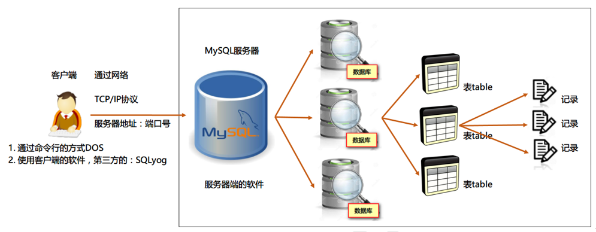
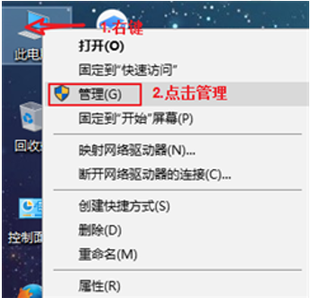
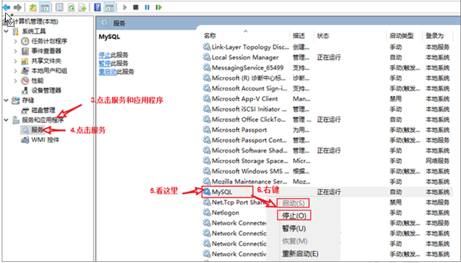
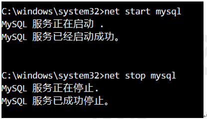
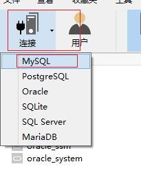
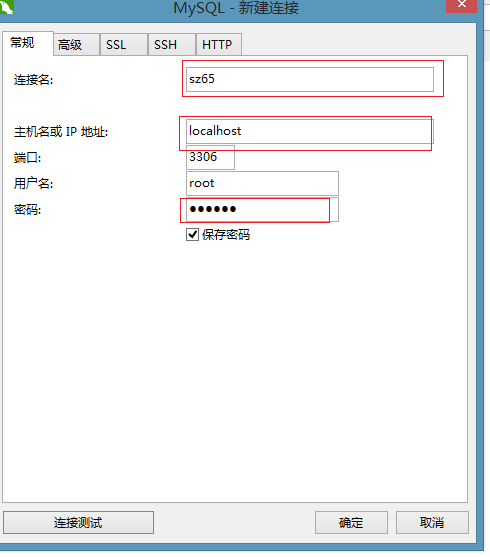
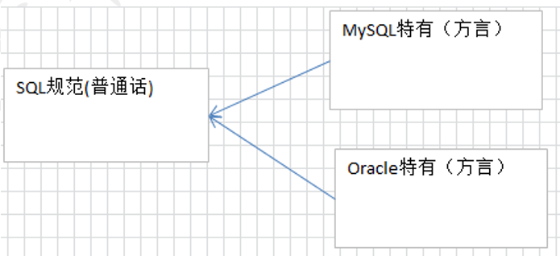
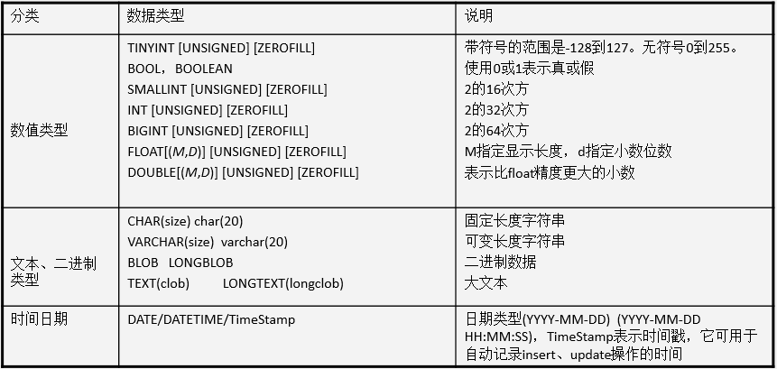

# day17-MySql基础   #

# 今日内容

- 数据库介绍
- 数据库安装\卸载--------难点
- DDL-----对数据库的增删查改,对表的增删查改    理解
- DML----对记录的增删改    重点\掌握
- DQL----对记录的查询        重点\掌握

# 第一章-数据库概述  

## 1.1 数据库的介绍 

目前来说如果我们要进行数据存储，有几种方式:

1. 我们可以使用集合等方式将数据保存在内存中，但是数据不能持久化保存，断电/程序退出，数据就清除了

2. 我们还可以将数据保存在普通文件中，可以持久化保存，但是查找，增加，修改，删除数据比较麻烦，效率低

所以我们需要一个既可以持久化保存数据又可以方便操作的地方来存储数据，这就是我们接下来要给大家介绍的数据库

#### 什么是数据库   

​	数据库（DataBase，DB）：指长期保存在计算机的存储设备(硬盘)上，按照一定规则组织起来，可以被各种用户或应用共享的数据集合. 还是以文件的方式存在服务器的电脑上的。

​	**说白了就是存储数据的仓库, 可以持久化保存数据,并通过sql语句快速的对数据进行增删改查操作.**

#### 常见的关系型数据库

- MySql	：**开源免费**的数据库，中小型的数据库，已经被Oracle收购了。MySql6.x版本也开始收费。后来Sun公司收购了MySql，而Sun公司又被Oracle收购
- Oracle：收费的大型数据库.Oracle公司的产品.Oracle收购SUN公司，收购MySql.
- DB2：IBM公司的数据库产品,收费的.银行系统中.    
- SQLServer：MS公司.收费的中型的数据库.
- SyBase：已经淡出历史舞台.提供了一个非常专业数据建模的工具PowerDesigner.
- SQLite: 嵌入式的小型数据库,应用在手机端.

 


## 1.2 数据库结构【重点】

​	数据库管理程序(DBMS)可以管理多个数据库，一般开发人员会针对每一个应用创建一个数据库。为保存应用中实体的数据，一般会在数据库创建多个表，以保存程序中实体的数据。

​	数据库管理系统、数据库和表的关系如图所示：



- 一个数据库服务器软件可以创建多个数据库
- 一个数据库可以创建多张表
- 一张表可以存储多条记录
- 客户端连接数据库服务器软件


# 第二章-数据库的安装,卸载,启动,登录   #

## 2.1 MySql的安装,卸载

#### MySql的安装

具体参考文档: `资料\01_MySql安装与卸载\MySql安装图解.docx`

 

#### MySql的卸载  

具体参考文档: `资料\01_MySql安装与卸载\MySql卸载手册.doc`

 

### 注意

+ 安装需要注意的地方: 安装路径不要有==空格和中文==,对着文档装

+ 卸载需要注意的地方

  + 去360/软件管家或者控制面板卸载(删除之前先找到两个文件夹)
  + 一定要删除两个文件夹（数据库安装路径和数据存放路径，这两个文件夹在配置文件里面my.ini）

  


## 2.2 数据库服务的启动和登录,退出

#### 数据库服务的启动

##### 方式一通过界面启动

 



##### 方式二通过DOS命令方式启动

 


 


​	MySql是一个需要账户名密码登录的数据库，登陆后使用，它提供了一个默认的root账号，使用安装时设置的密码即可登录.

#### 登录

##### 命令行

```sql
方式一:mysql -u 用户名 -p       #然后回车再输入密码. 
方式二:mysql -u用户名 -p密码
```

#####  图形化工具

- 安装

 

 

- 连接

   

   

#### 退出

##### 命令行

```
输入: quit或exit
```

##### 图形化工具

- 右键关闭


# 第三章-SQL概述 #

## 3.1 Sql介绍

#### 什么是sql

- SQL：Structure Query Language。（结构化查询语言）,通过sql操作数据库(**操作数据库,操作表,操作数据**)
- SQL被美国国家标准局（ANSI）确定为关系型数据库语言的美国标准，后来被国际化标准组织（ISO）采纳为关系数据库语言的国际标准    
- 各数据库厂商(MySql,oracle,sql server)都支持ISO的SQL标准。
- 各数据库厂商在标准的基础上做了自己的扩展。   各个数据库自己特定的语法 




#### sql的语法

+ 每条语句以分号结尾(命令行里面需要)，如果在navicat,java代码中不是必须加的。 
+ SQL在window中不区分大小写，关键字中认为大写和小写是一样的 

#### sql的分类

- Data Definition Language (DDL数据定义语言) 如：操作数据库，操作表
- **Data  Manipulation Language(DML数据操纵语言)，如：对表中的记录操作增删改**
- **Data Query Language(DQL 数据查询语言)，如：对表中的记录查询操作**
- Data Control Language(DCL 数据控制语言)，如：对用户权限的设置


# 第四章-DDL操作数据库 #

## 4.1 DDL操作数据库

- 语法:

  ```sql
  创建数据库:create database 数据库名 [character set 字符集][collate  校对规则]   注: []表示可选
  查看数据库:
  	查看所有数据库:show databases; 
  	查看数据库结构:show create database 数据库名;
  删除数据库:drop database 数据库名;
  修改数据库:alter database 数据库名 character set 字符集; 注意:1.不能修改数据库名,2.是utf8不是utf-8
  其他操作:
  	切换数据库:use 数据库名;   
  	查看正在使用的数据库:select database();
  ```

- 案例:

  ```sql
  -- 练习:创建一个数据库,名字为day17_1,编码为utf8
  create database day17_1;
  
  -- 练习:创建一个数据库,名字为day17_2,编码为gbk
  create database day17_2 character set gbk;
  
  -- 练习:查询所有的校对规则
  show collation;
  
  -- 练习:查询所有的数据库
  show databases;
  
  -- 练习:查询day17_1数据库的定义结构
  show create database day17_1;
  
  -- 练习:查询day17_2数据库的定义结构
  show create database day17_2;
  
  -- 练习:修改day17_2数据库的编码为utf8
  alter database day17_2 character set utf8;
  
  -- 练习:删除day17_2这个数据库
  drop database day17_2;
  
  -- 练习: 选中day17_1数据库
  use day17_1;
  
  -- 练习: 查询目前选中的数据库
   select database();
  
  ```
  
  


# 第五章-DDL操作表

## 5.1 创建表【重点】

#### 3.1语法

```sql
create table 表名(
   字段名 字段类型 [约束],
   字段名 字段类型 [约束],
   ........
   字段名 字段类型 [约束]
);
-- 注意: 小括号中最后定义的字段后面不要加逗号
```

#### 3.2 类型 



1. **整型  一般使用int 或者bigint**

2. 浮点/双精度型  

   + **默认的范围  float或者double**
   + 指定范围     float(M,D)  eg: float(4,2)  表达的范围:  -99.99~99.99

3. 字符串

   + 固定长度  char(n)  	eg: char(20), 最大能存放20个字符.  ‘aaa      ’, 还是占20个字符的空间
   + **可变长度  varchar(n) eg:varchar(20), 最大能存放20个字符.  ‘aaa’, 占3个字符的空间**

   > 一般使用varchar(n) 节省空间;  如果长度(eg:身份证)是固定的话 可以使用char(n) 性能高一点 

4. 关于大文件

   + 一般在数据库里面很少存文件的内容, 一般存文件的路径
   + 一般不使用二进制存, 使用varchar(n)存文件的路径

5. 日期

   + **DATE         只有日期**
   + **DATETIME 日期和时间**

#### 3.3 约束  

- 即规则,规矩 限制;  
- 作用：保证用户插入的数据保存到数据库中是符合规范的

| 约束 | 约束关键字  |
| ---- | ----------- |
| 主键 | primary key |
| 唯一 | unique      |
| 非空 | not null    |

**约束种类:** 

- **not null: 非空** ;  eg:  username varchar(40)  not null    username这个字段不能为空,必须要有数据
- **unique:唯一约束**, 后面的数据不能和前面重复;  eg: cardNo varchar(18) unique;    cardNo字段不能出现重复的数据


- **primary key；主键约束(非空+唯一)**;    一般用在表的id列上面.  每一张表基本上都有id列的, id列作为记录的唯一标识的 
- **auto_increment: ==自动增长**,必须是设置了primary key之后,才可以使用auto_increment==
- `id int  primary key   auto_increment` id不需要我们自己维护了, 插入数据的时候直接插入null, 自动的增长进行填充进去, 避免重复了.  

注意:

1. 先设置了primary key 再能设置auto_increment
2. 只有当设置了auto_increment 才可以插入null 自己维护 否则插入null,会报错
3. 一般开发中id主键会设置为自动增长

#### 3.4练习

- 创建一张学生表(含有id字段,姓名字段,性别字段. id为主键自动增长)

  ```sql
  -- 语法: 
  -- 	create table 表名(
  				字段名 字段类型 约束,
  				字段名 字段类型 约束,
  				....
  				字段名 字段类型 约束
  -- );
  -- 字段类型: int,bigint,float,double,varchar(size),date,datetime
  -- 字段约束: not null, unique,primary key auto_increment
  -- 练习:创建一张学生表(含有id字段,姓名字段,性别字段. id为主键自动增长)
  create table student(
  	id int primary key auto_increment,
      name varchar(40),
      sex varchar(25)
  );
  
  ```
  
  


## 5.2 查看表【了解】

- 语法:

  ```java
  查看所有的表:show tables;
  查看表的定义结构:desc  表名；
  ```

  

- 案例:

  ```sql
  -- 练习: 查询day17_1数据库中所有表
  show tables;
  
  -- 练习: 查询student表的定义结构
  desc student;
  ```
  
  

## 5.3 修改表【掌握】

#### 语法

- 增加一列；`alter table 表名 add 字段 类型 约束；`
- 修改列的类型约束； `alter table 表名 modify 字段 类型 约束 ；`
- 修改列的名称，类型，约束；`alter table 表名 change 旧列名 新列名 类型 约束;`
- 删除一列； `alter table 表名 drop 列名；`
- 修改表名 ; `rename table 旧表名 to 新表名； `

#### 练习

- 给学生表增加一个grade字段
- 给学生表的sex字段改成字符串类型 
- 给学生表的grade字段修改成class字段
- 把class字段删除
- 把学生表修改成老师表(了解)

```sql
-- 练习: 给学生表增加一个grade字段
alter table student add grade varchar(40) not null;

-- 练习: 给学生表的sex字段改成字符串类型 
alter table student modify sex varchar(20) not null;

-- 练习: 给学生表的grade字段修改成class字段
alter table student change grade class varchar(40) ;

-- 练习: 把class字段删除
alter table student drop class;

-- 练习: 把学生表修改成老师表(了解)
rename table student to teacher;

```


## 5.4 删除表【掌握】

- 语法: `drop table 表名；`

- 案例:

  ```sql
  -- 练习: 删除teacher表
  drop table teacher;
  
  ```
  
  

# 第六章-DML操作表记录-增删改【重点】 #

+ 准备工作: 创建一张商品表(商品id,商品名称,商品价格,商品数量.) 


```sql
create table product(
	pid int primary key auto_increment,  -- 只有设置了auto_increment id列才可以赋值为null
	pname varchar(40) not null,
	price double,
	num int
);
```

## 6.1 插入记录

- 语法:

  ```java
  插入指定列: insert into 表(列，列..) values(值，值..)；
  插入所有列: insert into 表 values(值，值....);    
  -- 注意:
  -- - 插入特定的列:没有赋值的列,系统自动赋为null(前提是当前列没有设置not null 约束)
  -- - 字段名与值的类型、个数、顺序要一一对应。
  -- - 值不要超出列定义的长度。
  -- - 插入的日期和字符串，使用引号括起来。 
  -- - 默认所有列插入,values里面必须给表中每一个字段赋值,一般主键给一个null
  ```

  

- 案例:

  ```java
  -- 练习: 指定pname,price列插入记录
  insert into product(pname,price) values("Mac",8888.9);
  
  -- 练习: 指定price列插入记录
  insert into product(price) values(8888.9);-- 报错,因为pname字段设置了非空约束,不能赋值为null
  
  -- 练习: 指定所有列插入记录
  insert into product values(null,'Macbook',9999.9,5);
  
  
  ```

- 数据准备:  **批量插入记录**

  ```sql
  方式一:
  insert into product values(null,'苹果电脑',18000.0,10);
  insert into product values(null,'华为5G手机',30000,20);
  insert into product values(null,'小米手机',1800,30);
  insert into product values(null,'iPhonex',8000,10);
  insert into product values(null,'苹果电脑',8000,100);
  insert into product values(null,'iPhone7',6000,200);
  insert into product values(null,'iPhone6s',4000,1000);
  insert into product values(null,'iPhone6',3500,100);
  insert into product values(null,'iPhone5s',3000,100);
  insert into product values(null,'方便面',4.5,1000);
  insert into product values(null,'咖啡',11,200); 
  insert into product values(null,'矿泉水',3,500);
  
  方式二:
  insert into product values(null,'苹果电脑',18000.0,10),
  (null,'华为5G手机',30000,20),
  (null,'小米手机',1800,30),
  (null,'iPhonex',8000,10),
  (null,'苹果电脑',8000,100),
  (null,'iPhone7',6000,200),
  (null,'iPhone6s',4000,1000),
  (null,'iPhone6',3500,100),
  (null,'iPhone5s',3000,100),
  (null,'方便面',4.5,1000),
  (null,'咖啡',11,200),
  (null,'矿泉水',3,500);
  ```

  
+ 命令行插入中文数据报错:-----了解

 

- 关闭服务,  net stop MySql
- 在数据库软件的安装目录下面, 修改配置文件 my.ini中客户端的编码为gbk


- 重新打开命令行,开启服务, net start MySql


## 6.2 更新记录

- 语法: `update 表名 set 列名 = 值, 列名 =值,... [where 条件];`

- 练习
  - 将所有商品的价格修改为5000元
  
  - 将商品名是Mac的价格修改为18000元
  
  - 将商品名是Mac的价格修改为17000,数量修改为5
  
  - 将商品名是方便面的商品的价格在原有基础上增加2元
  
    ```sql
    -- - 将所有商品的价格修改为5000元
    update product set price = 5000;
    
    -- - 将商品名是Mac的价格修改为18000元
    update product set price = 18000 where pname='Mac';
    
    -- - 将商品名是Mac的价格修改为17000,数量修改为5
    update product set price = 17000,num=5 where pname='Mac';
    
    -- - 将商品名是方便面的商品的价格在原有基础上增加2元
    update product set price = price + 2  where pname="方便面";
    
    ```
    
    


## 6.3 删除记录

+ 语法

  ```sql
  -- 方式一: delete from 表 【where 条件】;--可以删除表中所有记录,也可以指定记录删除
  -- 方式二: truncate table 表;----->删除表中所有记录
  ```

  

- 练习

  - 删除表中名称为’Mac’的记录

  - 删除价格小于5001的商品记录

  - 删除表中的所有记录

    ```sql
    -- - 删除表中名称为’Mac’的记录
    delete from product where pname='Mac';
    
    -- - 删除价格小于5001的商品记录
    delete from product where price < 5001;
    
    -- - 删除表中的所有记录
    delete from product;-- 一条一条记录的删除
    truncate table product;-- 直接删除表,然后创建一张和之前结构一样的空表
    ```
    
    
  
- 注意:

  delete  和truncate区别【面试题】  

  - DELETE 删除表中的数据，表结构还在;   删除的记录可以找回
  - TRUNCATE 删除是把表直接DROP掉，然后再创建一个同样的新表(空)。删除的记录不可以找回

  工作里面的删除 

  - 物理删除: 真正的删除了, 数据不在, 使用delete就属于物理删除
  - 逻辑删除: 没有真正的删除, 数据还在. 搞一个标记, 其实逻辑删除是更新  eg: state字段   1 启用   0禁用
  - 工作里面一般使用逻辑删除用的多 


# 第七章-DQL操作表记录-查询【重点】

## 7.1 基本查询

- 语法:
  - 查询所有的列: `select * from 表名;`
  
  - 查询某张表特定列: `select 列名,列名,... from 表名`
  
  - 去重查询: `select distinct 列名 from 表名;`
  
  - 别名查询:  `select 列名 as 别名  from 表名 as 别名; -- as可以省略不写`
  
  - 运算查询(+,-,*,/等): `select 列运算 from 表名;`
  
  - 基本条件查询:  `select ... from 表名 where 条件;` 
    + 比较运算符: `>   >=   <    <=    =  <>`
    + between...and...
    + in(值,值,...)
    + like
      + _  :  匹配一个字符
      + %:   匹配0个到多个字符(大于等于0个)
    + 逻辑运算符
      + and
      + or
      + not
  
- 案例:

  ```sql
  - 练习:查询product表中所有的数据
  select * from product;
  -- 练习:查询pid,pname,price列中的数据
  select pid,pname,price from product;
  -- 练习:去重查询商品价格
  select distinct price from product;
  select pname,distinct price from product;-- 报错,distinct前面不能有字段名
  -- 练习:查询pid,pname,price列中的数据并对列取别名
  select pid as 编号,pname as 商品名称,price as 商品价格 from product as p;
  select pid  编号,pname  商品名称,price  商品价格 from product  p;
  -- 练习:查询价格大于5000的商品信息
  select * from product where price > 5000;
  -- 练习:查询价格大于5000的商品并且数量大于10的商品信息
  select * from product where price > 5000 and num > 10;
  select * from product where not(price > 5000);
  -- 练习: 查询商品名称含有'iPh'的商品信息
  select * from product where pname like '%iPh%';
  -- 练习:查询商品价格在3000到8000之间的商品信息,包含3000,8000
  select * from product where price between 3000 and 8000;
  select * from product where price >= 3000 and price <= 8000;
  -- 练习:查询pid为1,3,5,7,9,19的商品信息
  select * from product where pid = 1 or pid = 3 or pid = 5 or pid = 7 or pid = 9 or pid = 19;
  select * from product where pid in(1,3,5,7,9,19);
  -- 练习: 查询每种商品需要的总价
  select pname 商品名称,price*num 总价 from product;
  
  ```

  

- 练习
  - 查询商品价格>3000的商品
  
  - 查询id=1的商品
  
  - 查询id<>1的商品
  
  - 查询价格在3000到6000之间的商品
  
  - 查询id在1，5，7，15范围内的商品
  
  - 查询商品名以iPho开头的商品(iPhone系列) 
  
  - 查询商品价格大于3000并且数量大于20的商品   (条件 and 条件 and...)
  
  - 查询id=1或者价格小于3000的商品 
  
    ```sql
    -- - 查询商品价格>3000的商品
    select * from product where price > 3000;
    
    -- - 查询id=1的商品
    select * from product where pid = 1;
    
    -- - 查询id<>1的商品
    select * from product where pid <> 1;
    
    -- - 查询价格在3000到6000之间的商品
    select * from product where price between 3000 and 6000;
    
    -- - 查询id在1，5，7，15范围内的商品
    select * from product where pid in(1,5,7,15);
    
    -- - 查询商品名以iPho开头的商品(iPhone系列) 
    select * from product where pname like 'iPho%';
    
    -- - 查询商品价格大于3000并且数量大于20的商品   (条件 and 条件 and...)
    select * from product where price > 3000 and num > 20;
    
    -- - 查询id=1或者价格小于3000的商品 
    select * from product where pid = 1 or price < 3000;
    ```
    
    
  

## 7.2 排序查询

- 环境的准备

  ```sql
  # 创建学生表(有sid,学生姓名,学生性别,学生年龄,分数列,其中sid为主键自动增长)
  CREATE TABLE student(
  	sid INT PRIMARY KEY auto_increment,
  	sname VARCHAR(40),
  	sex VARCHAR(10),
  	age INT,
    score DOUBLE
  );
  
  INSERT INTO student VALUES(null,'zs','男',18,98.5);
  INSERT INTO student VALUES(null,'ls','女',18,96.5);
  INSERT INTO student VALUES(null,'ww','男',15,50.5);
  INSERT INTO student VALUES(null,'zl','女',20,98.5);
  INSERT INTO student VALUES(null,'tq','男',18,60.5);
  INSERT INTO student VALUES(null,'wb','男',38,98.5);
  INSERT INTO student VALUES(null,'小丽','男',18,100);
  INSERT INTO student VALUES(null,'小红','女',28,28);
  INSERT INTO student VALUES(null,'小强','男',21,95);
  ```

  

- 语法:

  ```sql
  方式一:select ... from 表名 [where 条件] order by 字段名 [asc|desc];
  方式二:select ... from 表名 [where 条件] order by 字段名 [asc|desc], 字段名 [asc|desc],...; 
  注意:asc:升序,desc:降序,不指定默认是升序
  ```

  

- 练习
  1. 练习: 以分数降序查询所有的学生
  
  2. 练习: 以分数降序查询所有的学生, 如果分数一致,再以age降序
  
     ```sql
     -- 1. 练习: 以分数降序查询所有的学生
     select * from student order by score desc;
     
     -- 2. 练习: 以分数降序查询所有的学生, 如果分数一致,再以age降序
     select * from student order by score desc,age desc;
     ```
  
     


## 7.3 聚合函数   

| 聚合函数        | 作用                   |
| --------------- | ---------------------- |
| max(列名)       | 求这一列的最大值       |
| min(列名)       | 求这一列的最小值       |
| avg(列名)       | 求这一列的平均值       |
| **count(列名)** | 统计这一列有多少条记录 |
| sum(列名)       | 对这一列求总和         |

1. 语法

```sql
SELECT 聚合函数(列名) FROM 表名 [where 条件];
```

2. 练习

```sql
-- 练习:求出学生表里面的最高分数
select max(score) from student;

-- 练习:求出学生表里面的最低分数
select min(score) from student;

-- 练习:求出学生表里面的分数的总和
select sum(score) from student;-- 726

-- 练习:求出学生表里面的平均分
select avg(score) from student;-- 726/9 = 80.666...7

-- 练习:统计学生的总人数 
select count(*) from student; -- 9

-- 如果把小红的分数改为null
update student set score = null where sname = '小红';
-- 练习:统计学生的总人数 
select count(score) from student; -- 8
-- 结论: 聚合函数会忽略null值
-- 解决: 使用ifnull(参数1,参数2)函数,如果参数1的值为null,就取参数2的值作为结果,如果参数1的值不为null,那就取参数1的值作为结果
-- 练习:求出学生表里面的分数的总和
select sum(score) from student;-- 698
-- 练习:求出学生表里面的平均分
select avg(score) from student;-- 698/8 = 87.25 -----有问题的, 真实的应该是: 698/9=77.555....6
select avg(ifnull(score,0)) from student;-- 698/9=77.555....6

```

> 注意:  聚合函数会忽略空值NULL
>
> 如果不想忽略空值null,就使用ifnull(参数1,参数2)函数,进行判断
>
> 如果参数1为null,就取参数2的值,如果参数1不为null,就取参数1的值


 

## 7.4 分组查询

1. 分组语法

```sql
SELECT ... FROM 表名  [where 条件] group by 列名 [having 条件];
```

2. 练习

   1. 练习:根据性别分组,统计男生的总人数和女生的总人数
   
   2. 练习根据性别分组, 统计每一组学生的总人数> 5的(分组后筛选)
   
      ```sql
      -- 1. 练习:根据性别分组,统计男生的总人数和女生的总人数
      select * from student group by sex; 
      -- 如果仅仅只是分组查询,没有任何意义,因为只会返回每一组的第一条记录
      -- 分组的目的是为了统计计算,所以分组一般会和聚合函数一起使用
      select count(*) from student group by sex; -- 得到的结果无法识别是哪一组的结果
      -- 分组查询一般都会查询出分组字段的值,否则无法识别结果是属于哪一组的
      select sex,count(*) from student group by sex;
      
      
      -- 2. 练习根据性别分组, 统计每一组学生的总人数> 5的(分组后筛选)
      select sex,count(*) from student group by sex having count(*) > 5;
      ```
      
      
   
3. 注意事项

   **单独分组 没有意义,因为 返回每一组的第一条记录**

   **分组的目的一般为了做统计使用, 所以经常和聚合函数一起使用**

   **分组查询如果不查询出分组字段的值,就无法得知结果属于那组**

4. where和having的区别【面试】

| 子名       | 作用                                                         |
| ---------- | ------------------------------------------------------------ |
| where 子句 | 1) 对查询结果进行分组前，将不符合where条件的行去掉，即在分组之前过滤数据，即**先过滤再分组**。2) **where后面不可以使用聚合函数** |
| having字句 | 1) having 子句的作用是筛选满足条件的组，即在分组之后过滤数据，即**先分组再过滤**。2) **having后面可以使用聚合函数** |


## 7.5 分页查询  

1. 语法

```sql
select ... from 表名 limit a,b; 
a:从哪里开始查询, 从0开始计数 ,省略a不写,默认就是从0开始
b:查询的数量【固定的,自定义的】
分页查询: limit (页码-1)*每页显示的条数,每页显示的条数;
```

2. 练习:

   -- 练习: 查询sid为1到4--->第1页
   -- 练习: 查询sid为5到8--->第2页
   -- 练习: 查询sid为9到12--->第3页
   
   ```sql
   
   -- 练习: 查询sid为1到4--->第1页
   select * from student limit 0,4;
   
   -- 练习: 查询sid为5到8--->第2页
   select * from student limit 4,4;
   
   -- 练习: 查询sid为9到12--->第3页
   select * from student limit 8,4;
   select * from student limit 12,4;-- 第4页
   select * from student limit 16,4;-- 第5页
   select * from student limit 20,4;-- 第6页
   -- ...
   -- 分页查询的规律: limit (页码-1)*每页显示的总条数,每页显示的总条数
   
   ```
   
   
   
3. 应用场景

   如果数据库里面的数据量特别大, 我们不建议一次查询出来. 为了提升性能和用户体验, 使用分页


## 查询的语法小结

```sql
select ... from 表名 [where...][group by...having...][order by...][limit...]

select ... from ...
select ... from ... where ...
select ... from ... group by ...having...
select ... from ... order by ...
select ... from ... limit ...
....
```

# 总结

```java
必须练习:
	数据库的安装---->今天必须装好
	对记录的增删查改------------>先把所有语法默写出来,再做课后作业  
    
- 能够理解数据库的概念
   存储数据的仓库,可以持久化保存数据,并可以通过sql语句快速对数据的增删查改操作
        
- 能够安装MySql数据库
   见文档
        
- 能够使用SQL语句操作数据库
增: create database 数据库名;
删: drop database 数据库名;
改: alter database 数据库名 character set 字符集;
查: show databases; show create database 数据库名;
切换数据库: use 数据库名;

- 能够使用SQL语句操作表结构
增:
	create table 表名(
    	字段名 字段类型 [字段约束],
        字段名 字段类型 [字段约束],
        ...
        字段名 字段类型 [字段约束]
    );
	字段类型: int,bigint,float,double,bool,varchar(size),date,datetime
    字段约束:
		primary key auto_increment: 主键自增
        not null: 非空
        unique: 唯一
删: drop table 表名;
改: 
	alter table 表名 add 字段名 字段类型 字段约束;
	alter table 表名 modify 字段名 字段类型 字段约束;
	alter table 表名 change 旧字段名 新字段名 字段类型 字段约束;
	alter table 表名 drop 字段名 ;
	rename table 旧表名 to 新表名;
查: show tables, desc 表名
	
      
- 能够使用SQL语句进行条件查询数据
增:  
	insert into 表名(列名1,列名2,...) values(值1,值2,...);
	insert into 表名  values(值1,值2,...);
删: 
	delete from 表名 [where 条件];
	truncate table 表名
改: 
	update 表名 set 列名=值,列名=值,... [where 条件]
查:
select ... from 表名 [where 条件][group by 字段名][having 条件][order by 字段 asc|desc][limit (页码-1)*每页显示的条数,每页显示的条数]
    
条件:
1.比较运算符: >  >=  <  <= =  <>
2.逻辑运算符: not ,and , or
3.in()
4.like()
5.between ... and ...
            
- 能够使用SQL语句进行排序
    order by 字段 asc|desc
    
- 能够使用聚合函数
	max(),min(),sum(),avg(),count(),ifnull()
    
- 能够使用SQL语句进行分组查询 
    group by 字段名 having 条件
                  
- 能够使用SQL语句进行分页查询 
	limit (页码-1)*每页显示的条数,每页显示的条数
      
```

