# 第3章 我的主页

# 学习目标

- 更新用户头像-作业
- 统一token处理
- 实现通用信息查询
- 实现陌生人管理
- 实现黑名单管理
- 实现通知设置
- 实现修改手机号码-作业

# 1. 更新用户头像(作业）

### 【目标】

掌握更新用户头像

### 【路径】

1：更新用户头像分析

2：更新用户头像实现

### 【讲解】

## 1.1. 服务消费者-更新用户头像


### 1.1.1. 接口说明

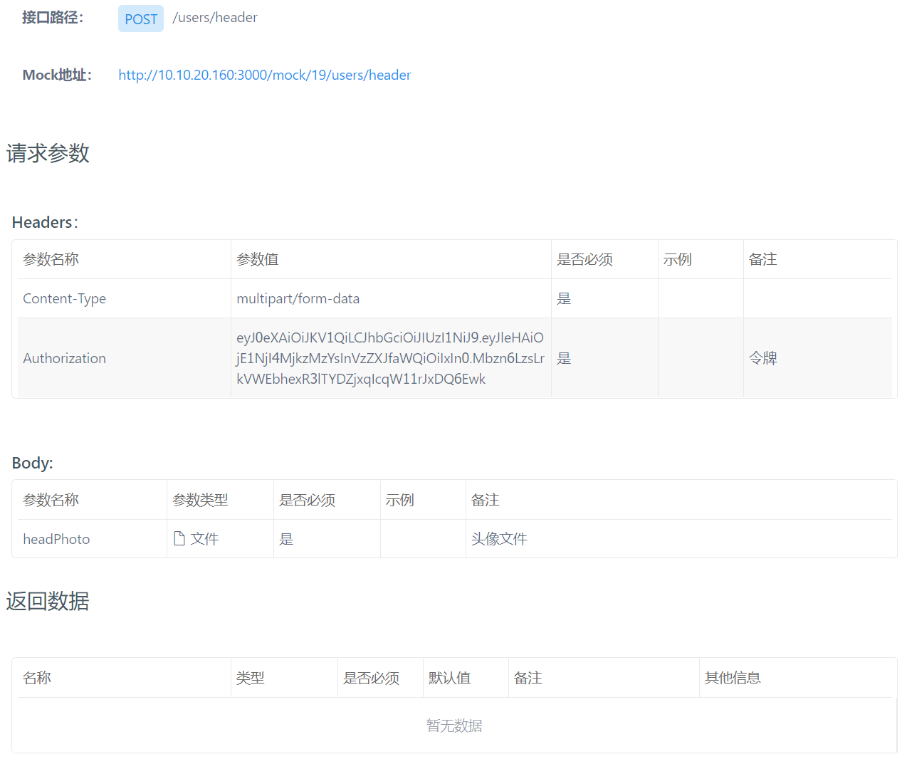

### 1.1.2. UserInfoController

tanhua-server模块新增更新头像请求

```java
@Autowired
private UserService userService;
/**
  * 更新用户头像
  */
@RequestMapping(value = "/header",method = RequestMethod.POST)
public ResponseEntity header(@RequestHeader("Authorization") String token, MultipartFile headPhoto) {
    userService.header(token,headPhoto);
    return ResponseEntity.ok(null);
}
```

### 1.1.3. UserService

tanhua-server模块新增更新头像业务处理

```java
/**
  * 更新用户头像
  */
public void header(String token, MultipartFile headPhoto) {
    log.info("更新用户头像{},token{}",headPhoto.getOriginalFilename(),token);
    try {
        //1.基于token获取用户信息
        String userStr = redisTemplate.opsForValue().get("TOKEN_" + token);
        if(StringUtils.isEmpty(userStr)){
            throw new TanHuaException("登陆超时，请重新登陆");
        }
        User user = JSON.parseObject(userStr, User.class);
        Long userId = user.getId();
        //2.查询用户信息（后续用于删除头像）
        UserInfo userInfo = userInfoApi.findByUserId(userId);
        //更新头像之前的头像
        String oldAvatar = userInfo.getAvatar();
        //3.人脸识别
        boolean detect = faceTemplate.detect(headPhoto.getBytes());
        if(!detect){
            throw new TanHuaException("没有检测到人脸，请重新上传");
        }
        log.info("人脸识别成功了....");

        //4.上传头像
        String filename = headPhoto.getOriginalFilename();
        String avatar = ossTemplate.upload(filename, headPhoto.getInputStream());
        log.info("图片上传成功了....");

        //5.更新用户头像
        userInfo  = new UserInfo();//更新头像
        userInfo.setAvatar(avatar);//头像
        userInfo.setId(userId);
        userInfoApi.update(userInfo);
        log.info("更新用户头像成功了....");
        //6.删除头像
        ossTemplate.deleteFile(oldAvatar);
        log.info("删除阿里云头像成功了....");
    } catch (IOException e) {
        e.printStackTrace();
        throw new TanHuaException("更新头像失败，请稍后重试");
    }
}
```

### 1.1.4. OssTemplate

tanhua-commons模块修改OssTemplate，添加删除头像方法

```java
/**
  * 删除头像
  */
public void deleteFile(String objectName) {
    // Endpoint以杭州为例，其它Region请按实际情况填写。
    String endpoint = ossProperties.getEndpoint();
    // 阿里云主账号AccessKey拥有所有API的访问权限，风险很高。强烈建议您创建并使用RAM账号进行API访问或日常运维，请登录 https://ram.console.aliyun.com 创建RAM账号。
    String accessKeyId = ossProperties.getAccessKeyId();
    String accessKeySecret = ossProperties.getAccessKeySecret();
    String bucketName = ossProperties.getBucketName();
    // 创建OSSClient实例。
    OSS ossClient = new OSSClientBuilder().build(endpoint, accessKeyId, accessKeySecret);
    // 删除文件。如需删除文件夹，请将ObjectName设置为对应的文件夹名称。如果文件夹非空，则需要将文件夹下的所有object删除后才能删除该文件夹。
    ossClient.deleteObject(bucketName, objectName.replace(ossProperties.getUrl()+ "/",""));
    // 关闭OSSClient。
    ossClient.shutdown();
}
```

## 1.2. 服务提供者-更新用户头像

### 1.2.1. UserInfoApi

tanhua-dubbo-interface模块创建findByUserId方法

```java
/**
  * 根据用户id查询用户信息对象
  */
UserInfo findByUserId(Long userId);
```

### 1.2.2. UserInfoApiImpl

tanhua-dubbo-service模块创建findByUserId方法

```java
@Override
public UserInfo findByUserId(Long userId) {
	return userInfoMapper.selectById(userId);
}
```

### 1.2.3. 测试

 

### 【小结】

掌握更新用户头像

# 2. 统一处理token（重点）

### 【目标】

掌握ThreadLocal结合SpringMvc拦截器实现统一token处理

### 【路径】

1：token解析存在问题分析

2：技术方案实现分析

3：统一token处理实现

### 【讲解】

在之前的开发代码中，我们会在每一个Service中对token做解析获取用户，这是一项繁琐且重复度比较高的工作。有什么好的解决方法吗？本节内容我通过ThreadLocal结合SpringMVC拦截器来实现统一token处理

## 2.1. 拦截器简介

拦截器是Spring提供的一种技术, 它的功能似于过滤器Filter，它会在进入controller之前,离开controller之后以及页面渲染完毕之后进行拦截。

拦截器对比过滤器：

* 二者规范不同：Filter是在servlet规范中定义，用于servlet容器中。而拦截器是spring框架提供的，用于spring容器内。
*  使用范围不同：Filter是servlet规定的，只能用于web工程中。而拦截器没有此限制。

拦截器的使用步骤：

* 自定义一个类实现HandleInterceptor接口。 

* 实现HandlerInterceptor接口的三个方法: 
  * preHandle() : 在目标方法之前执行，一般用于预处理 
  * postHandle()：在目标方法执行之后执行，一般用于后处理 
  * afterCompletion()：整个请求处理完毕，在视图渲染完毕时回调，一般用于资源的清理或性能的统计
* 在SpringBoot中注册拦截器并使用

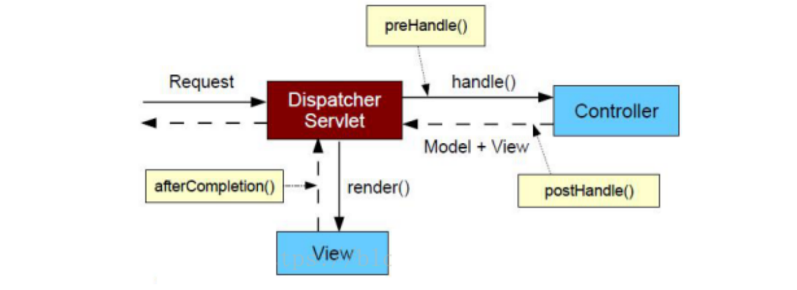

### 2.1.1. TokenInterceptor

tanhua-server模块新增自定义拦截器

```java
package com.tanhua.server.interceptor;

import org.springframework.stereotype.Component;
import org.springframework.web.servlet.HandlerInterceptor;

import javax.servlet.http.HttpServletRequest;
import javax.servlet.http.HttpServletResponse;

@Component
public class TokenInterceptor implements HandlerInterceptor {
    @Override
    public boolean preHandle(HttpServletRequest request, HttpServletResponse response, Object handler) throws Exception {
        System.out.println("进入前置处理器");
        return false;
    }
}
```

### 2.1.2. WebConfig

tanhua-server模块新增注册拦截器

```java
package com.tanhua.server.config;

import com.tanhua.server.interceptor.TokenInterceptor;
import org.springframework.beans.factory.annotation.Autowired;
import org.springframework.context.annotation.Configuration;
import org.springframework.web.servlet.config.annotation.InterceptorRegistry;
import org.springframework.web.servlet.config.annotation.WebMvcConfigurer;

@Configuration
public class WebConfig implements WebMvcConfigurer {

    @Autowired
    private TokenInterceptor tokenInterceptor;

    @Override
    public void addInterceptors(InterceptorRegistry registry) {
        registry.addInterceptor(tokenInterceptor)
            .addPathPatterns("/**") // 拦截所有的请求
            // 过滤的请求
            .excludePathPatterns("/user/login","/user/loginVerification");
    }
}

```

## 2.2. ThreadLocal简介

ThreadLocal提供线程本地变量，每个线程拥有本地变量的副本，各个线程之间的变量互不干扰。ThreadLocal实现在多线程环境下去保证变量的安全。

**ThreadLocal的作用是提供线程内的局部变量，这种变量在线程的生命周期内起作用。**

**作用：提供一个线程内公共变量（比如本次请求的用户信息），减少同一个线程内多个函数或者组件之间一些公共变量的传递的复杂度，或者为线程提供一个私有的变量副本，这样每一个线程都可以随意修改自己的变量副本，而不会对其他线程产生影响。**

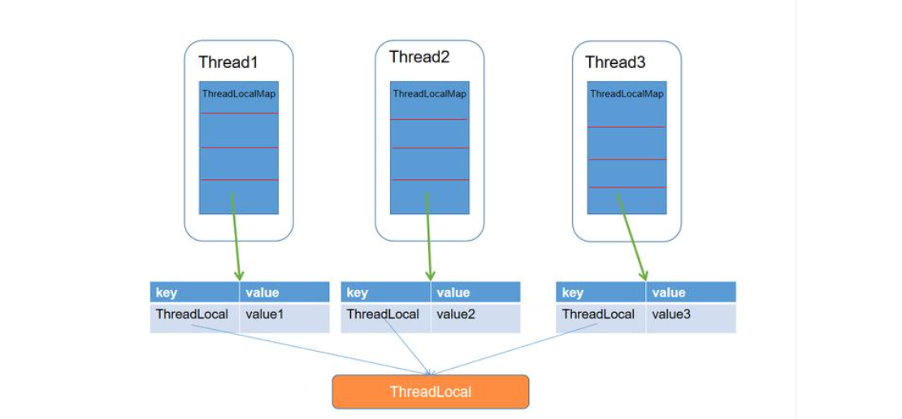

Threadlocal使用方法很简单

```java
ThreadLocal<T> threadLocal = new ThreadLocal<T>();
threadLocal.set() //将数据绑定到当前线程
threadLocal.get() //从当前线程中获取数据
```

## 2.3. 统一处理token实现


### 2.3.1. UserThreadLocal

tanhua-server模块新增UserHolder

```java
package com.tanhua.server.interceptor;

import com.tanhua.domain.db.User;

/**
 * 登陆用户信息持有者
 * 通过ThreadLocal的形式，存储登陆用户的数据
 */
public class UserHolder {

    private static ThreadLocal<User> userThreadLocal = new ThreadLocal<User>();

    /**
     * 向当前线程中存入用户数据
     * @param user
     */
    public static void setUser(User user){
        userThreadLocal.set(user);
    }

    /**
     * 从当前线程中获取用户数据
     * @return
     */
    public static User getUser(){
        return userThreadLocal.get();
    }

    /**
     * 获取登陆用户的id
     * @return
     */
    public static Long getUserId(){
        return userThreadLocal.get().getId();
    }
}
```

### 2.3.2. TokenInterceptor

tanhua-server模块新增UserHolder

```java
package com.tanhua.server.interceptor;

import com.tanhua.domain.db.User;
import com.tanhua.server.service.UserService;
import lombok.extern.slf4j.Slf4j;
import org.apache.commons.lang3.StringUtils;
import org.springframework.beans.factory.annotation.Autowired;
import org.springframework.stereotype.Component;
import org.springframework.web.servlet.HandlerInterceptor;

import javax.servlet.http.HttpServletRequest;
import javax.servlet.http.HttpServletResponse;

/**
 * 自定义拦截器
 */
@Component
@Slf4j
public class TokenInterceptor implements HandlerInterceptor {
    @Autowired
    private UserService userService;

    public boolean preHandle(HttpServletRequest request, HttpServletResponse response, Object handler) throws Exception {
       log.info("进入前置拦截器。。。");
        String token = request.getHeader("Authorization");
        if(StringUtils.isNotEmpty(token)){
            User user = userService.getUserByToken(token);
            if (user == null){
                response.setStatus(401);
                return false;
            }
            UserHolder.setUser(user);
            return true;
        }
        response.setStatus(401);
        return false;
    }
}
```

### 2.3.3. UserInfoService

tanhua-server模块修改getUserInfo、updateUserInfo方法

```java
*******************删除以下代码****************************
String userStr = redisTemplate.opsForValue().get("TOKEN_" + token);
if (StringUtils.isEmpty(userStr)) {
    throw new TanHuaException("登陆超时，请重新登陆");
}
User user = JSON.parseObject(userStr, User.class);
Long userId = user.getId();

*******************改为以下代码****************************
Long userId = UserHolder.getUserId();
```

### 2.3.4. UserService 

tanhua-server模块修改loginReginfo、loginReginfoHead、header方法

```java
*******************删除以下代码****************************
Long userId = UserHolder.getUserId();
```

### 【小结】

掌握统一处理token

# 3. 通用设置

### 【目标】

完成通用设置功能

### 【路径】

1：通用设置查询分析与实现

2：黑名单管理分析与实现

3：陌生人管理分析与实现

4：通知管理分析与实现

### 【讲解】

## 3.1. 功能介绍

通用设置，包含探花交友APP基本的软件设置功能。包含：

设置陌生人问题：当平台其他用户想进行在线交流时需要回答陌生人问题。

通知设置：包含一些APP通知设置

黑名单：对于不感兴趣的用户设置黑名单屏蔽骚扰


  

## 3.2. 数据库表分析

### 3.2.1. 数据库表

#### **① 通知设置**

```sql
CREATE TABLE `tb_settings` (
  `id` bigint(20) NOT NULL AUTO_INCREMENT,
  `user_id` bigint(20) DEFAULT NULL,
  `like_notification` tinyint(4) DEFAULT '1' COMMENT '推送喜欢通知',
  `pinglun_notification` tinyint(4) DEFAULT '1' COMMENT '推送评论通知',
  `gonggao_notification` tinyint(4) DEFAULT '1' COMMENT '推送公告通知',
  `created` datetime DEFAULT NULL,
  `updated` datetime DEFAULT NULL,
  PRIMARY KEY (`id`)
) ENGINE=InnoDB DEFAULT CHARSET=utf8 COMMENT='设置表';
```

#### **② 问题表**

```SQL
CREATE TABLE `tb_question` (
  `id` bigint(20) NOT NULL AUTO_INCREMENT,
  `user_id` bigint(20) DEFAULT NULL COMMENT '用户id',
  `txt` varchar(200) DEFAULT NULL COMMENT '问题内容',
  `created` datetime DEFAULT NULL,
  `updated` datetime DEFAULT NULL,
  PRIMARY KEY (`id`),
  KEY `user_id` (`user_id`)
) ENGINE=InnoDB AUTO_INCREMENT=6 DEFAULT CHARSET=utf8
```

#### **③ 黑名单**

```sql
CREATE TABLE `tb_black_list` (
  `id` bigint(20) NOT NULL AUTO_INCREMENT,
  `user_id` bigint(20) DEFAULT NULL,
  `black_user_id` bigint(20) DEFAULT NULL,
  `created` datetime DEFAULT NULL,
  `updated` datetime DEFAULT NULL,
  PRIMARY KEY (`id`),
  KEY `user_id` (`user_id`)
) ENGINE=InnoDB DEFAULT CHARSET=utf8 COMMENT='黑名单';
```

### 3.2.2. 实体类与VO

在tanhua-domain中创建以下实体类

#### ① Settings

```java
package com.tanhua.domain.db;
import lombok.Data;

@Data
public class Settings extends BasePojo {
    private Long id;
    private Long userId;
    private Boolean likeNotification;
    private Boolean pinglunNotification;
    private Boolean gonggaoNotification;
}
```

#### ②  Question

```java
package com.tanhua.domain.db;
import lombok.Data;

@Data
public class Question extends BasePojo {
    private Long id;
    private Long userId;
    //问题内容
    private String txt;
}
```

#### ③ BlackList

```java
package com.tanhua.domain.db;
import lombok.Data;

@Data
public class BlackList extends BasePojo {
    private Long id;
    private Long userId;
    private Long blackUserId;
}
```

在tanhua-domain中创建以下VO

#### ④  SettingsVo

```java
package com.tanhua.domain.vo;

import lombok.Data;

@Data
public class SettingsVo {
    private Long id;
    private String strangerQuestion;
    private String phone;
    private Boolean likeNotification;
    private Boolean pinglunNotification;
    private Boolean gonggaoNotification;
}
```

#### ⑤  PageResult

```java
package com.tanhua.domain.vo;
import lombok.AllArgsConstructor;
import lombok.Data;
import lombok.NoArgsConstructor;
import java.io.Serializable;
import java.util.Collections;
import java.util.List;
@Data
@AllArgsConstructor
@NoArgsConstructor
public class PageResult<T> implements Serializable {
    private Long counts; // 总记录数
    private Long pagesize;// 每页大小
    private Long pages;// 总页数
    private Long page;// 页码
    private List<T> items = Collections.emptyList();
}
```

### 3.2.3. 分页插件

在tanhua-dubbo-service模块中创建 mybatis-plus 分页插件

```java
package com.tanhua.dubbo.config;

import com.baomidou.mybatisplus.extension.plugins.PaginationInterceptor;
import org.springframework.context.annotation.Bean;
import org.springframework.context.annotation.Configuration;

@Configuration
public class MybatisPlusConfig {
    /**
     * 启用分页插件
     * @return
     */
    @Bean
    public PaginationInterceptor paginationInterceptor(){
        return new PaginationInterceptor();
    }
}
```

使用mybatis-plus的分页：

* 创建分页对象：Page，指定当前页和每页查询条数
* 基础查询：mapper.selectPage(page,查询条件)
* 自定义查询：Ipage 方法名称（Page对象，xxx查询条件）

## 3.3. 服务消费者-通用设置查询

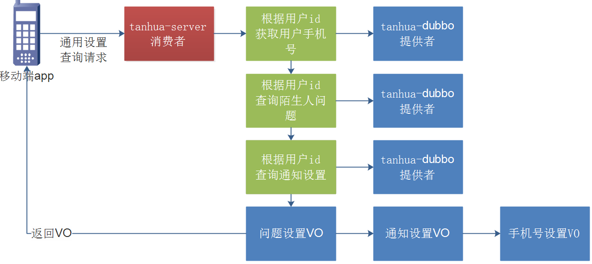

### 3.3.1. 接口说明

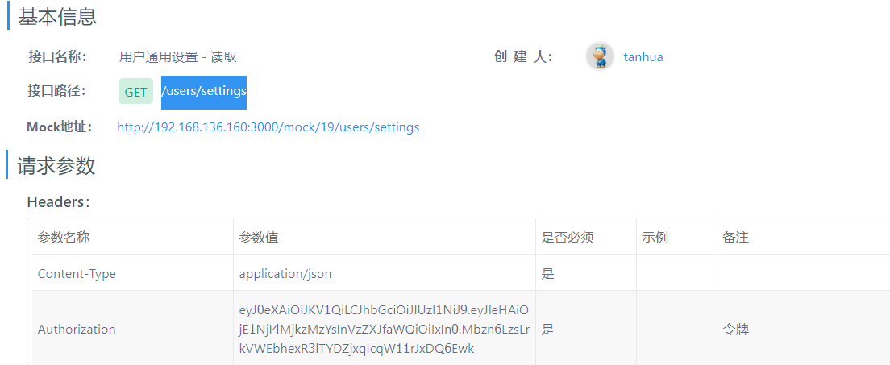


### 3.3.2. SettingController

在tanhua-server模块下创建SettingsController

```java
package com.tanhua.server.controller;

import com.tanhua.server.service.SettingsService;
import org.springframework.beans.factory.annotation.Autowired;
import org.springframework.http.ResponseEntity;
import org.springframework.web.bind.annotation.GetMapping;
import org.springframework.web.bind.annotation.RequestMapping;
import org.springframework.web.bind.annotation.RestController;

@RestController
@RequestMapping("/users")
public class SettingsController {

    @Autowired
    private SettingsService settingsService;

    /**
     * 读取用户的通用设置
     * 请求连接：
     *  GET  /settings
     */
    @GetMapping("/settings")
    public ResponseEntity querySettings() {
        return settingsService.querySettings();
    }
}
```

### 3.3.3. SettingService

在tanhua-server模块下创建SettingsService

```java
@Service
public class SettingsService {

    @Reference
    private SettingsApi settingsApi;

    @Reference
    private QuestionApi questionApi;

    /**
     * 查询用户的通用设置
     */
    public ResponseEntity querySettings() {
        //1、获取当前用户
        User user = UserHolder.getUser();
        SettingsVo vo = new SettingsVo();
        //2、查询陌生人问题
        Question question = questionApi.findByUserId(user.getId());
        if(question != null) {
            vo.setStrangerQuestion(question.getTxt());
        }
        //3、查询用户的通知设置
        Settings settings = settingsApi.findByUserId(user.getId());
        if(settings != null) {
            BeanUtils.copyProperties(settings, vo);
        }
        //4、构造返回值
        vo.setPhone(user.getMobile());
        return ResponseEntity.ok(vo);
    }
}
```

## 3.4. 服务提供者-通用设置查询

### 3.4.1. SettingsMapper

在tanhua-dubbo-service模块下创建SettingsMapper

```java
package com.tanhua.dubbo.mapper;
import com.baomidou.mybatisplus.core.mapper.BaseMapper;
import com.tanhua.domain.db.Settings;

public interface SettingsMapper extends BaseMapper<Settings> {
}
```

### 3.4.2. SettingsApi

在tanhua-dubbo-interface模块中创建SettingsApi

```java
package com.tanhua.dubbo.api;

import com.tanhua.domain.db.Settings;

public interface SettingsApi {
    //根据用户id查询通知配置
    Settings findByUserId(Long userId);
}
```

### 3.4.3. SettingsApiImpl

在tanhua-dubbo-service模块中创建SettingsApiImpl

```java
package com.tanhua.dubbo.api;

import com.baomidou.mybatisplus.core.conditions.query.QueryWrapper;
import com.tanhua.domain.db.Settings;
import com.tanhua.dubbo.mapper.SettingsMapper;
import org.apache.dubbo.config.annotation.Service;
import org.springframework.beans.factory.annotation.Autowired;

@Service
public class SettingsApiImpl implements SettingsApi {

    @Autowired
    private SettingsMapper settingsMapper;

    //根据userId查询
    public Settings findByUserId(Long userId) {
        QueryWrapper<Settings> queryWrapper = new QueryWrapper<>();
        queryWrapper.eq("user_id", userId);
        return settingsMapper.selectOne(queryWrapper);
    }
}
```

### 3.4.4. QuestionMapper

在tanhua-dubbo-service模块下创建QuestionMapper

```java
package com.tanhua.dubbo.mapper;
import com.baomidou.mybatisplus.core.mapper.BaseMapper;
import com.tanhua.domain.db.Question;

public interface QuestionMapper extends BaseMapper<Question> {

}
```

### 3.4.5. QuestionApi

在tanhua-dubbo-service模块中创建QuestionApi

```java
package com.tanhua.dubbo.api;
import com.tanhua.domain.db.Question;

public interface QuestionApi {
    //根据用户id查询通知配置
    Question findByUserId(Long userId);
}
```

### 3.4.6. QuestionApiImpl

在tanhua-dubbo-service模块中创建QuestionApiImpl

```java
package com.tanhua.dubbo.api;

import com.baomidou.mybatisplus.core.conditions.query.QueryWrapper;
import com.tanhua.domain.db.Question;
import com.tanhua.dubbo.mapper.QuestionMapper;
import org.apache.dubbo.config.annotation.Service;
import org.springframework.beans.factory.annotation.Autowired;

@Service
public class QuestionApiImpl implements QuestionApi {

    @Autowired
    private QuestionMapper questionMapper;

    @Override
    public Question findByUserId(Long userId) {
        QueryWrapper<Question> queryWrapper = new QueryWrapper<>();
        queryWrapper.eq("user_id", userId);
        return questionMapper.selectOne(queryWrapper);
    }
}
```

### 3.4.7. 测试

查看手机号码

 

查看陌生人问题

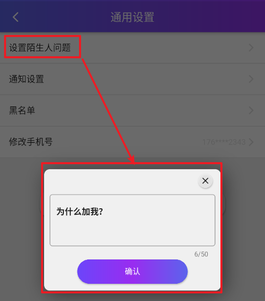 

查看消息通知

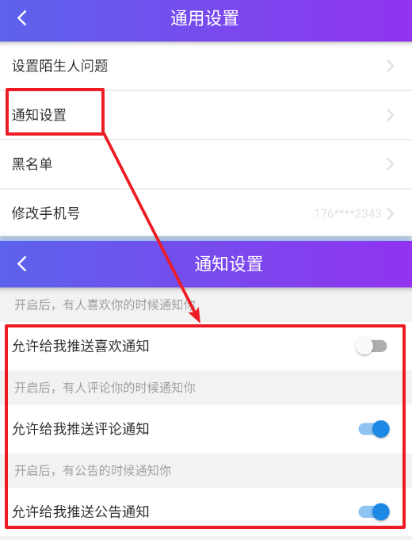 

## 3.5. 服务消费者-通知管理

 

### 3.5.1. 接口说明

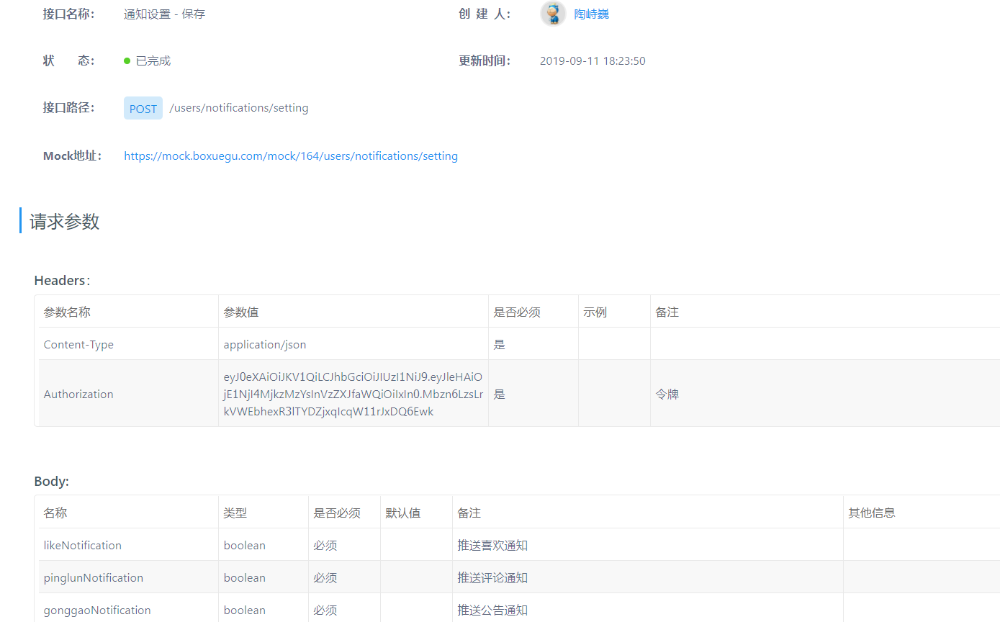


### 3.5.2. SettingController

在tanhua-server模块下创建SettingController

```java
    /**
     * 通知设置
     *   POST /notifications/setting
     */
    @PostMapping("/notifications/setting")
    public ResponseEntity updateNotification(@RequestBody Map map) {
        //1、获取输入内容
        boolean like = (Boolean) map.get("likeNotification");
        boolean pinglun = (Boolean) map.get("pinglunNotification");
        boolean gonggao = (Boolean) map.get("gonggaoNotification");
        //2、调用service保存或者更新
        return settingsService.updateNotification(like,pinglun,gonggao);
    }
```

### 3.5.3. SettingService

在tanhua-server模块下创建SettingService

```java
    /**
     * 保存或者更新 通知
     */
    public ResponseEntity updateNotification(boolean like, boolean pinglun, boolean gonggao) {
        Settings settings = settingsApi.findByUserId(UserHolder.getUserId());
        if(settings == null) {
            settings = new Settings();
            settings.setUserId(UserHolder.getUserId());
            settings.setLikeNotification(like);
            settings.setGonggaoNotification(gonggao);
            settings.setPinglunNotification(pinglun);
            settingsApi.save(settings);
        }else {
            settings.setLikeNotification(like);
            settings.setGonggaoNotification(gonggao);
            settings.setPinglunNotification(pinglun);
            settingsApi.update(settings);
        }
        return ResponseEntity.ok(null);
    }
```

## 3.6. 服务提供者-通知管理

### 3.4.2. SettingsApi

在tanhua-dubbo-interface模块中创建SettingsApi

```java
package com.tanhua.dubbo.api;

import com.tanhua.domain.db.Settings;

public interface SettingsApi {

    void save(Settings settings);

    void update(Settings settings);
}
```

### 3.4.3. SettingsApiImpl

在tanhua-dubbo-service模块中创建SettingsApiImpl

```java
package com.tanhua.dubbo.api;

import com.baomidou.mybatisplus.core.conditions.query.QueryWrapper;
import com.tanhua.domain.db.Settings;
import com.tanhua.dubbo.mapper.SettingsMapper;
import org.apache.dubbo.config.annotation.Service;
import org.springframework.beans.factory.annotation.Autowired;

@Service
public class SettingsApiImpl implements SettingsApi {

    @Autowired
    private SettingsMapper settingsMapper;

    @Override
    public void save(Settings settings) {
        settingsMapper.insert(settings);
    }

    @Override
    public void update(Settings settings) {
        settingsMapper.updateById(settings);
    }
}
```

### 3.4.4. 测试

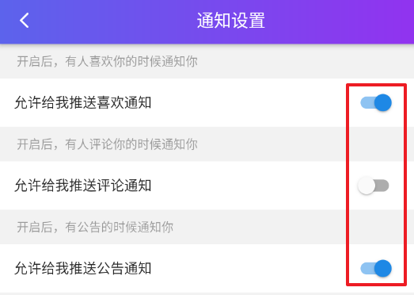 

## 


## 3.5. 服务消费者-黑名单管理

黑名单管理，这里只完成黑名单列表查询和移除黑名单。

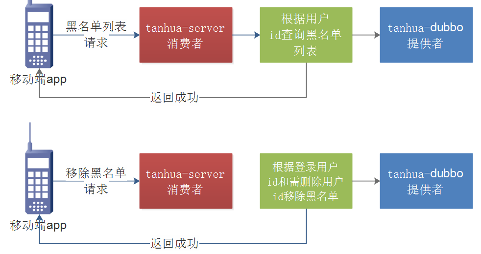

### 3.5.1. 接口说明


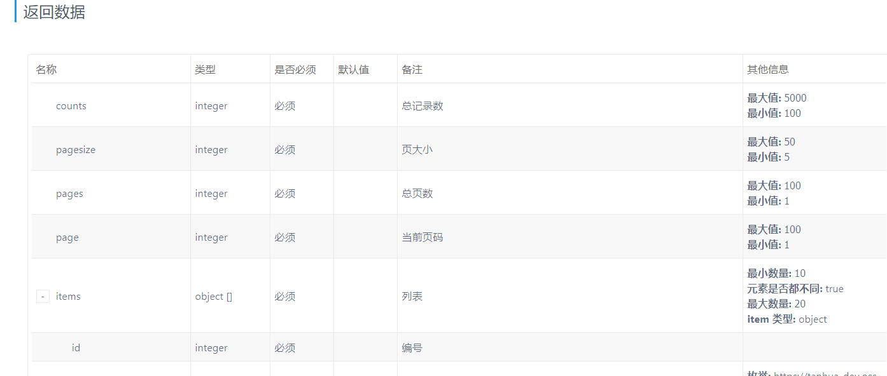

- 移除黑名单

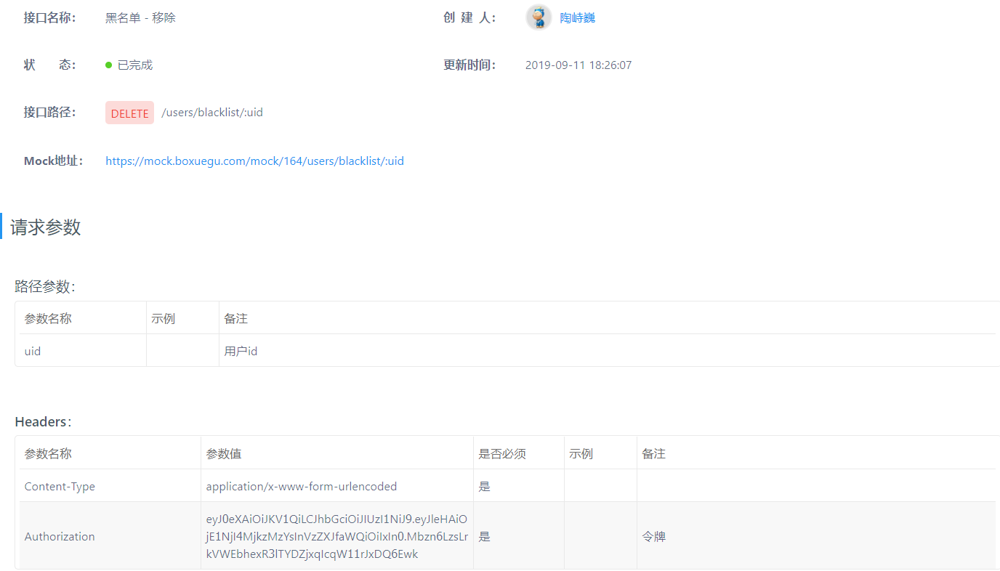

### 3.5.1. SettingController

在tanhua-server模块下修改SettingsController

```java
    /**
     * 分页查询黑名单列表
     *  请求连接：
     *      GET /blacklist
     *  请求参数：
     *      Query参数：
     *          page：当前页
     *          pagesize：每页查询条数
     */
    @GetMapping("/blacklist")
    public ResponseEntity findBlackList(@RequestParam(defaultValue = "1") int page,
                                    @RequestParam(defaultValue = "10")  int pagesize) {
        return settingsService.findBlackList(page,pagesize);
    }

    /**
     * 移除黑名单
     *  请求连接：
     *      DELETE  /blacklist/{uid}
     */
    @DeleteMapping("/blacklist/{uid}")
    public ResponseEntity delBlacklist(@PathVariable("uid") long deleteUserId) {
        return settingsService.delBlacklist(deleteUserId);
    }
```

### 3.5.2. SettingService

在tanhua-server模块下修改SettingsService

```java
   @Reference
   private BlackListApi blackListApi; 
   /**
     * 分页查询当前用户的黑名单列表
     */
    public ResponseEntity findBlackList(int page, int pagesize) {
        Long userId = UserHolder.getUserId();
        PageResult<UserInfo> pageResult = blackListApi.findBlackList(page,pagesize,userId);
        return ResponseEntity.ok(pageResult);
    }

    //移除黑名单
    public ResponseEntity delBlacklist(Long deleteUserId) {
        //1、获取当前用户的userid
        Long userId = UserHolder.getUserId();
        //2、调用api删除黑名单数据
        blackListApi.delete(userId,deleteUserId);
        return ResponseEntity.ok(null);
    }
```

## 3.6. 服务提供者-黑名单管理

### 3.6.1. BlackListMapper

在tanhua-dubbo-service模块下创建BlackListMapper

```java
package com.tanhua.dubbo.mapper;
import com.baomidou.mybatisplus.core.mapper.BaseMapper;
import com.baomidou.mybatisplus.core.metadata.IPage;
import com.baomidou.mybatisplus.extension.plugins.pagination.Page;
import com.tanhua.domain.db.BlackList;
import com.tanhua.domain.db.UserInfo;
import org.apache.ibatis.annotations.Param;
import org.apache.ibatis.annotations.Select;

public interface BlackListMapper extends BaseMapper<BlackList> {
    /**
     * 查询 黑名单用户信息
     * 需要 tb_user_info 和 tb_black_list两张变联合查询
     * 分页查询
     */
    @Select(value = "select tui.id,tui.avatar,tui.nickname,tui.gender,tui.age from  tb_user_info tui,tb_black_list tbl where tui.id = tbl.black_user_id and tbl.user_id=#{userId}")
    IPage<UserInfo> findBlackList(Page<UserInfo> page, @Param("userId") Long userId);
}
```

### 3.6.2. BlackListApi

在tanhua-dubbo-interface模块中创建BlackListApi

```java
package com.tanhua.dubbo.api;

import com.baomidou.mybatisplus.core.metadata.IPage;
import com.tanhua.domain.db.UserInfo;

public interface  BlackListApi{

    /**
     * 黑名单列表分页查询
     */
    PageResult<UserInfo> findBlackList(int page, int pagesize, Long id);

    //根据用户id和黑名单用户id，删除
    void delete(Long userId,Long blackUserId);
}
```

### 3.6.3. BlackListApiImpl

在tanhua-dubbo-service模块中创建BlackListApiImpl

```java
package com.tanhua.dubbo.api;
import com.baomidou.mybatisplus.core.conditions.query.QueryWrapper;
import com.baomidou.mybatisplus.core.metadata.IPage;
import com.baomidou.mybatisplus.extension.plugins.pagination.Page;
import com.tanhua.domain.db.BlackList;
import com.tanhua.domain.db.UserInfo;
import com.tanhua.domain.vo.PageResult;
import com.tanhua.dubbo.mapper.BlackListMapper;
import org.springframework.beans.factory.annotation.Autowired;
import org.springframework.stereotype.Service;

@Service
public class BlackListApiImpl implements BlackListApi {
    @Autowired
    private BlackListMapper blackListMapper;

    @Override
    public PageResult<UserInfo> findBlackList(int page, int pagesize, Long id) {
        Page pageRequest = new Page(page, pagesize);
        IPage<UserInfo> pageInfo = blackListMapper.findBlackList(pageRequest, id);
        PageResult<UserInfo> pageResult = new PageResult<UserInfo>(pageInfo.getTotal(), pageInfo.getSize(),pageInfo.getPages(),pageInfo.getCurrent(),pageInfo.getRecords());
        return pageResult;
    }
    public void delete(Long userId, Long blackUserId) {
        QueryWrapper<BlackList> queryWrapper = new QueryWrapper<>();
        queryWrapper.eq("user_id", userId)
                .eq("black_user_id", blackUserId);
        blackListMapper.delete(queryWrapper);
    }
}
```

### 3.6.4. 测试

 

## 3.7. 服务消费者-陌生人问题

 

### 3.7.1. 接口说明


### 3.7.2. SettingController

在tanhua-server模块下修改SettingsController

```java
    /**
     * 设置陌生人问题
     *  请求连接
     *      POST  /questions
     *      参数： body ：content
     */
    @PostMapping("/questions")
    public ResponseEntity saveQuestions(@RequestBody Map map) {
        //1、获取输入内容
        String content = (String) map.get("content");
        //2、调用service保存或者更新
        return settingsService.saveQuestions(content);
    }
```

### 3.7.3. SettingService

在tanhua-server模块下修改SettingsService

```java
    /**
     * 保存或者更新陌生问问题
     */
    public ResponseEntity saveQuestions(String content) {
        //1、根据当前登录用户查询问题
        Question question = questionApi.findByUserId(UserHolder.getUserId());
        //2、如果未设置，保存
        if(question == null) {
            question = new Question();
            question.setUserId(UserHolder.getUserId());
            question.setTxt(content);
            questionApi.save(question);
        }else {
            //3、如果以设置，更新
            question.setTxt(content);
            questionApi.update(question);
        }
        return ResponseEntity.ok(null);
    }
```

## 3.8. 服务提供者-陌生人问题

### 3.8.1. QuestionApi

在tanhua-dubbo-interface模块中创建QuestionApi

```java
package com.tanhua.dubbo.api;
import com.tanhua.domain.db.Question;

public interface QuestionApi {

    void save(Question question);

    void update(Question question);
}
```

### 3.8.2. QuestionApiImpl

在tanhua-dubbo-service模块中创建QuestionApiImpl

```java
package com.tanhua.dubbo.api;

import com.baomidou.mybatisplus.core.conditions.query.QueryWrapper;
import com.tanhua.domain.db.Question;
import com.tanhua.dubbo.mapper.QuestionMapper;
import org.apache.dubbo.config.annotation.Service;
import org.springframework.beans.factory.annotation.Autowired;

@Service
public class QuestionApiImpl implements QuestionApi {

    @Autowired
    private QuestionMapper questionMapper;

    @Override
    public void save(Question question) {
        questionMapper.insert(question);
    }

    @Override
    public void update(Question question) {
        questionMapper.updateById(question);
    }
}
```

### 3.8.3. 测试

 

### 

### 【小结】

1：掌握通用设置查询

2：掌握黑名单管理

3：掌握陌生人问题

4：掌握通知管理

# 4. 修改手机号码（作业）

### 【目标】

完成修改手机号码功能

### 【路径】

1：修改手机号码分析

2：修改手机号码实现

### 【讲解】

## 4.1. 功能介绍

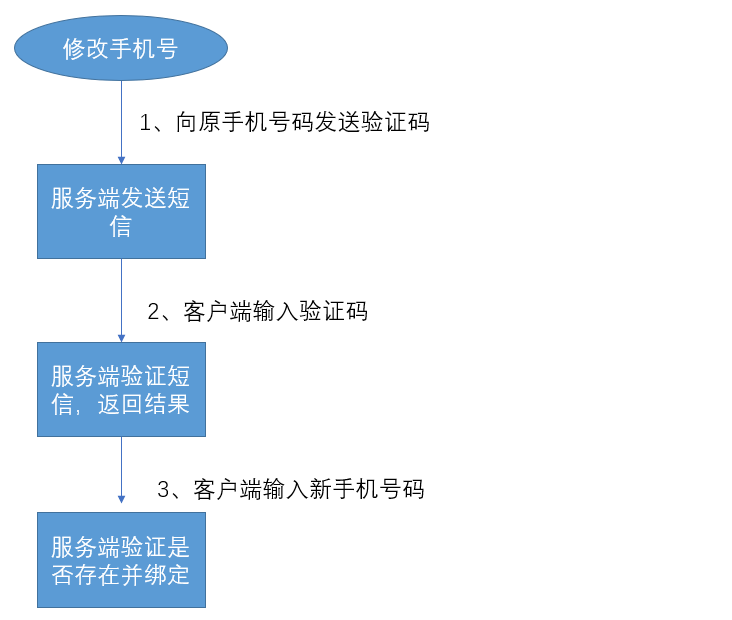

## 4.2. 接口说明

### 4.2.1. 发送验证码

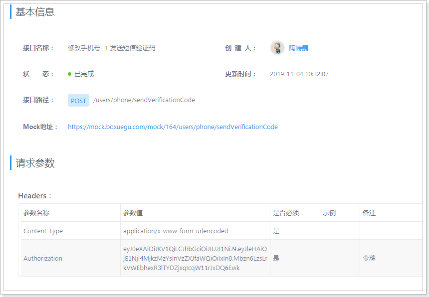

### 4.2.2. 检验验证码


## 4.3. 服务消费者-发送验证码

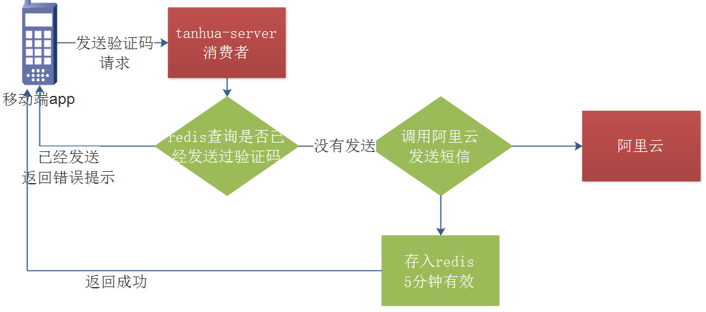

### 4.3.1. SettingsController

在tanhua-server模块下修改SettingsController

```java
/**
  * 修改手机号码：1.发送验证码
  */
@PostMapping("/phone/sendVerificationCode")
public ResponseEntity sendValidateCode(){
    settingsService.sendValidateCode();
    return ResponseEntity.ok(null);
}
```

## 4.4. 服务消费者-检验验证码

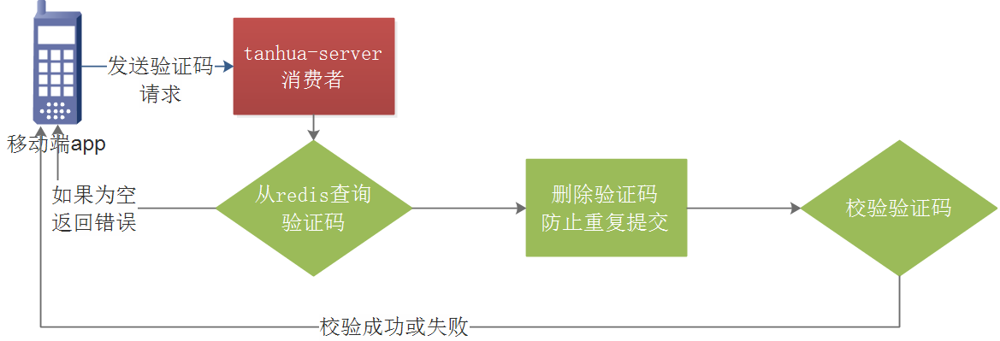

### 4.4.1. SettingsController

在tanhua-server模块下修改SettingsController

```java
/**
  * 修改手机号 - 2 校验验证码
  */
@PostMapping("/phone/checkVerificationCode")
public ResponseEntity checkValidateCode(@RequestBody Map<String,String> param){
    boolean flag = settingsService.checkValidateCode(param.get("verificationCode"));
    Map<String,Boolean> result = new HashMap<String,Boolean>();
    result.put("verification",flag);
    return ResponseEntity.ok(result);
}
```

### 4.4.2. SettingsService

在tanhua-server模块下修改SettingsService

```java
@Autowired
private RedisTemplate<String,String> redisTemplate;

@Autowired
private SmsTemplate smsTemplate;

@Reference
private UserApi userApi;
/**
  * 修改手机号码：1.发送验证码
  */
public void sendValidateCode() {
    String mobile = UserHolder.getUser().getMobile();
    // redis中存入验证码的key
    String key = RedisKeyConst.CHANGE_MOBILE_VALIDATE_CODE + mobile;
    // redis中的验证码
    String codeInRedis = redisTemplate.opsForValue().get(key);
    log.debug("========== redis中的验证码 修改手机号码:{},{}",mobile,codeInRedis);
    if(StringUtils.isNotEmpty(codeInRedis)){
        // 已经发送过了
        //return ErrorResult.duplicate();
        throw new TanHuaException(ErrorResult.duplicate());
    }
    // 生成验证码
    String validateCode = RandomStringUtils.randomNumeric(6);
    // 发送验证码
    log.debug("========== 发送验证码 修改手机号码:{},{}",mobile,validateCode);
    Map<String, String> smsResult = smsTemplate.sendValidateCode(mobile, validateCode);
    if(null != smsResult){
        // 发送失败
        throw new TanHuaException(ErrorResult.fail());
    }
    // 存入redis，有效期5分钟
    log.info("========== 验证码存入redis");
    redisTemplate.opsForValue().set(key,validateCode, 5, TimeUnit.MINUTES);
}

/**
     * 修改手机号 - 2 校验验证码
     * @param verificationCode
     * @return
     */
public boolean checkValidateCode(String verificationCode) {
    User user = UserHolder.getUser();
    String phone = user.getMobile();
    // redis中存入验证码的key
    String key = RedisKeyConst.CHANGE_MOBILE_VALIDATE_CODE + phone;
    // redis中的验证码
    String codeInRedis = redisTemplate.opsForValue().get(key);
    redisTemplate.delete(key);// 防止重复提交
    log.debug("==========修改手机号 校验 验证码:{},{},{}",phone,codeInRedis,verificationCode);
    if(StringUtils.isEmpty(codeInRedis)){
        throw new TanHuaException(ErrorResult.loginError());
    }
    if(!codeInRedis.equals(verificationCode)){
        return false;
    }
    return true;
}
```

### 4.4.3. RedisKeyConst

在tanhua-commons模块下修改RedisKeyConst

```java
package com.tanhua.commons;
/**
 * Redis Key 常量
 */
public interface RedisKeyConst {

    /** 登陆与注册时使用的验证码 */
    static final String LOGIN_VALIDATE_CODE="VALIDATE_CODE_LOGIN:";

    /** 修改手机号码时使用的验证码 */
    static final String CHANGE_MOBILE_VALIDATE_CODE="VALIDATE_CODE_CHANGE_MOBILE:";

    /** 登陆用户Token */
    static final String TOKEN = "TOKEN_";
}
```

## 4.5. 服务消费者-更新手机号


### 4.5.1. SettingsController

在tanhua-server模块下修改SettingsController

```java
/**
  * 修改手机号 - 3 保存
  */
@PostMapping("/phone")
public ResponseEntity changeMobile(@RequestBody Map<String,String> param, @RequestHeader("Authorization") String token){
    settingsService.changeMobile(param.get("phone"),token);
    return ResponseEntity.ok(null);
}
```

### 4.5.2. SettingsService

在tanhua-server模块下修改SettingsService

```java
/**
  * 修改手机号 - 3 保存
  * @param phone
  * @param token
  */
public void changeMobile(String phone,String token) {
    Long userId = UserHolder.getUserId();
    userApi.updateMobile(userId, phone);
    log.debug("修改手机号码成功(old:{})=>(new:{})",UserHolder.getUser().getMobile(),phone);
    // 删除token,让用户重新登陆
    String key = RedisKeyConst.TOKEN + token;
    redisTemplate.delete(key);
}
```

## 4.6. 服务提供者-更新手机号

### 4.6.1. UserApi

在tanhua-dubbo-interface模块中修改UserApi

```java
/**
  * 修改手机号码
  * @param userId
  * @param phone
  */
void updateMobile(Long userId, String phone);
```

### 4.6.2. UserApiImpl

在tanhua-dubbo-service模块中修改UserApiImpl

```java
/**
  * 修改手机号码
  * @param userId
  * @param phone
  */
@Override
public void updateMobile(Long userId, String phone) {
    User user = new User();
    user.setMobile(phone);
    user.setId(userId);
    userMapper.updateById(user);
}
```

### 【小结】

1：掌握修改手机号码

# 总结

* 统一处理token
  * 拦截器（拦截所有的请求，获取头信息中的token，调用service查询登录用户对象）
  * Threalocal工具类（拦截器向线程中存入用户数据，后续controller或者serivce直接从线程获取即可）
  * 拦截需要经过注册（排除登录的两个URL）
* 通用设置
  * 数据库表
  * 创建实体类对象
  * 创建Mapper接口
  * 创建API接口
  * 创建API接口的实现类
  * 模拟器查看功能效果
  * 查看接口，根据接口构造vo对象
  * 创建controller
  * 创建service
* 分页查询
  * 返回值：Ipage
  * 参数：Page<泛型> page = new Page(当前页，每页条数);
  * 自定义分页查询    ： Ipage  findPage(page, xxxxxx条件);


