# 第6章 圈子功能实现-2

# 学习目标

- 我的动态实现
- 圈子实现点赞、喜欢功能
- 圈子实现评论
- 圈子实现评论的点赞

# 1. 我的动态

### 【目标】

我的动态需求介绍

我的动态功能分析

我的动态功能实现

### 【路径】

1：了解我的动态需求

2：我的动态功能分析

3：我的动态功能实现

### 【讲解】

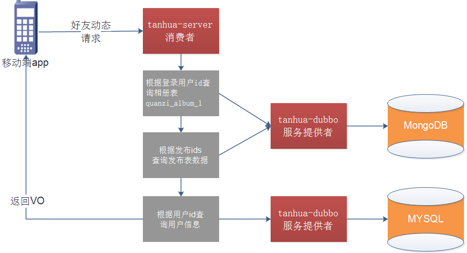

## 1.1. 服务消费者-我的动态

### 1.1.1. 接口说明

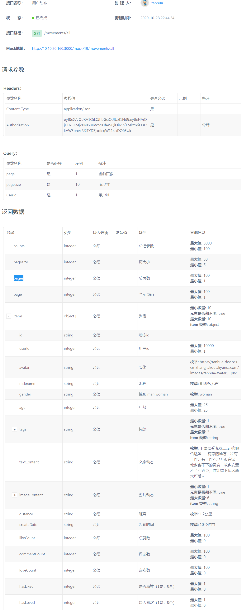

### 1.1.2. MomentController

```java
/**
 * 查询我的相册，即我的动态
 * @param page
 * @param pagesize
 * @return
 */
@GetMapping("/all")
public ResponseEntity queryMyAlbum(@RequestParam(defaultValue = "1") int page,
                                   @RequestParam(defaultValue = "10") int pagesize,Long userId){
    page=page<1?1:page;
    PageResult<MomentVo> pageResult = momentService.queryMyAlbum(page,pagesize,userId);
    return ResponseEntity.ok(pageResult);
}
```

### 1.1.3. MomentService

```java
public PageResult<MomentVo> queryMyAlbum(int page, int pagesize, Long userId) {
    //1、调用API查询
    PageResult result = publishApi.findMyAlbum(page, pagesize, userId);
    //2、获取到所有的动态明细列表 List<Publish>
    List<Publish> items = (List<Publish>) result.getItems();
    //3、循环所有的动态明细
    List<MomentVo> list = new ArrayList<>();
    for (Publish item : items) {
        //4、一个publish创建一个movenments对象（a.用户信息，b.动态明细）
        MomentVo vo = new MomentVo();
        //5、查询用户明细
        UserInfo userInfo = userInfoApi.findByUserId(item.getUserId());
        //6、组装数据
        if (userInfo != null) {
            BeanUtils.copyProperties(userInfo, vo);
            if (userInfo.getTags() != null) {
                vo.setTags(userInfo.getTags().split(","));
            }
        }
        BeanUtils.copyProperties(item, vo);
        vo.setId(item.getId().toHexString());
        vo.setCreateDate(RelativeDateFormat.format(new Date(item.getCreated())));
        vo.setHasLiked(0);  //是否点赞  0：未点 1:点赞
        vo.setHasLoved(0);  //是否喜欢  0：未点 1:点赞
        vo.setImageContent(item.getMedias().toArray(new String[]{}));
        vo.setDistance("50米");
        list.add(vo);
    }
    result.setItems(list);
    return result;
}
```

## 1.2. 服务提供者-我的动态

### 1.2.1. PublishApi

```java
/**
 * 查询登陆用户自已的动态
 * @param page
 * @param size
 * @param userId
 * @return
 */
PageResult findMyAlbum(int page, int size, long userId);
```

### 1.2.2. PublishApiImpl

```java
/**
 * 查询我的相册
 * @param page
 * @param size
 * @param userId
 * @return
 */
@Override
public PageResult findMyAlbum(int page, int pagesize, long userId) {
    //1、拼接数据库表明
    String collectioName = "quanzi_album_"+userId;
    //2、分页查询（设置排序）   List<Album> list
    Query query = new Query().limit(pagesize).skip((page-1) * pagesize)
        .with(Sort.by(Sort.Order.desc("created")));
    List<Album> albums = mongoTemplate.find(query, Album.class, collectioName);
    long total = mongoTemplate.count(query, Album.class, collectioName);
    //3、循环自己的所有时间线数据，查询动态明细publish
    List<Publish> list = new ArrayList<>();
    for (Album album : albums) {
        Publish publish = mongoTemplate.findById(album.getPublishId(), Publish.class);
        list.add(publish);
    }
    //4、构造返回
    long pages = total / pagesize;
    pages += total % pagesize > 0 ? 1 : 0;
    return new PageResult((long) total, (long) pagesize, (long) pages, (long) page, list);
}
```

### 1.2.3. 测试

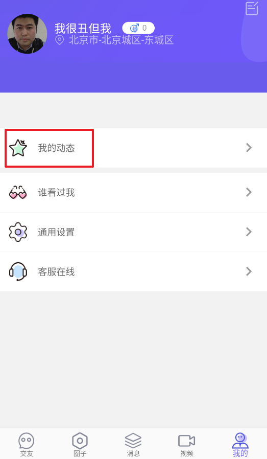 

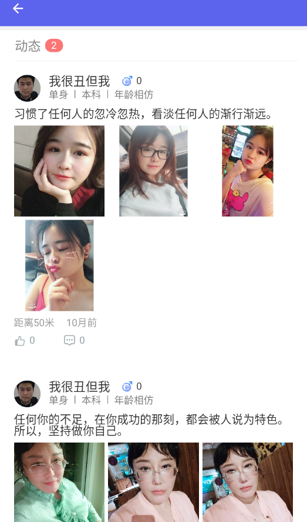 

### 【小结】

掌握我的动态实现

# 2. 动态点赞、喜欢、评论

### 【目标】

点赞、喜欢、评论需求介绍

点赞、喜欢、评论功能分析

点赞、喜欢、评论功能实现

### 【路径】

1：了解我的动态需求

2：点赞、喜欢、评论功能分析

3：点赞、喜欢、评论功能实现

### 【讲解】

点赞、喜欢、评论等均可理解为用户对动态的评论。

评论数据：

* 读多写少
* 价值低
* 是否点赞，点赞数量等

数据存储

* 点赞数量，评论数量，喜欢数量：
  * 在动态表中添加字段
  * 当点赞，喜欢，评论：需要修改动态表中的对应字段（+1）
* 是否点赞
  * 存入到redis
* mongo的集合（数据库）

## 2.1. 服务消费者-动态点赞


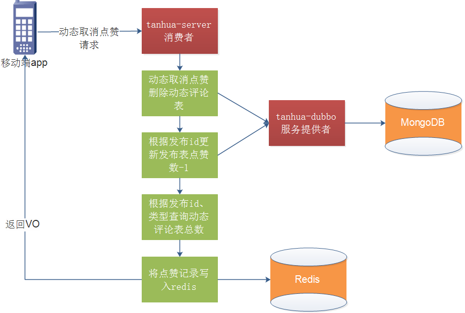

### 2.1.1. 接口说明

点赞：

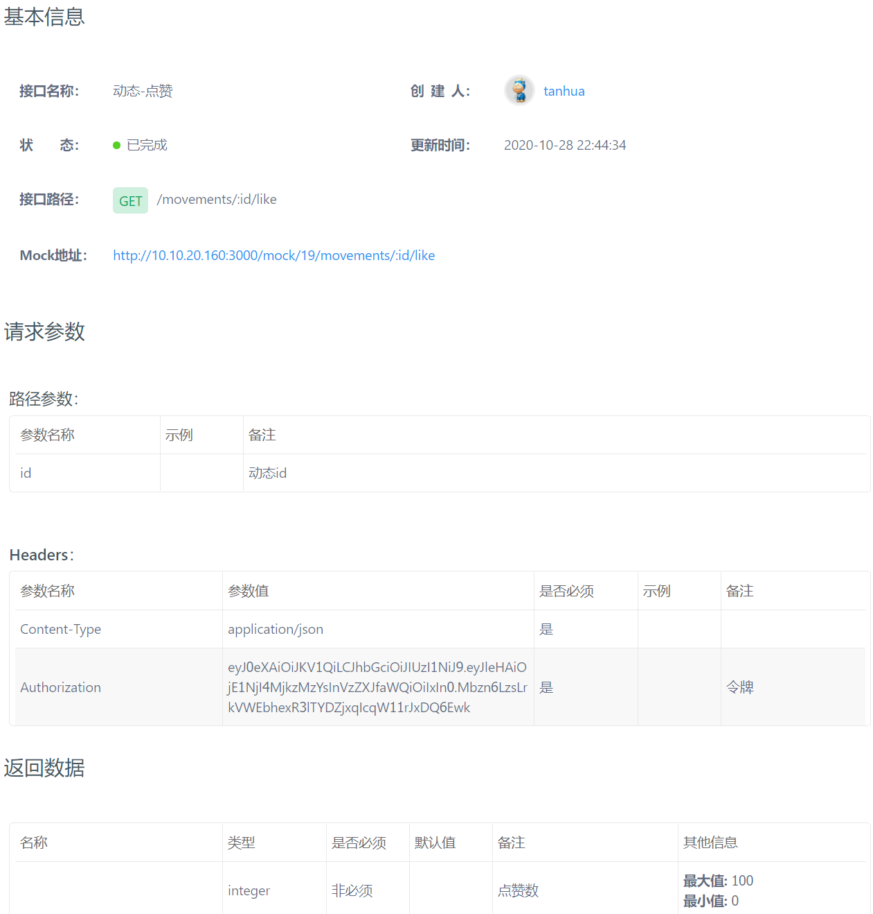

取消点赞：


### 2.1.2. MomentController

添加点赞与取消点赞方法

```java
@Autowired
private CommentService commentService;

/**
 * 点赞
 * @param publishId
 * @return
 */
@GetMapping("/{id}/like")
public ResponseEntity<Long> like(@PathVariable("id") String publishId){
    Long total = commentService.like(publishId);
    return ResponseEntity.ok(total);
}

/**
 * 取消点赞
 * @param publishId
 * @return
 */
@GetMapping("/{id}/dislike")
public ResponseEntity<Long> unlike(@PathVariable("id") String publishId){
    Long total = commentService.unlike(publishId);
    return ResponseEntity.ok(total);
}
```

### 2.1.3. CommentService

创建CommentService，添加点赞与取消的方法

```java
package com.tanhua.server.service;

import com.tanhua.domain.mongo.Comment;
import com.tanhua.dubbo.api.mongo.CommentApi;
import com.tanhua.server.interceptor.UserHolder;
import org.apache.dubbo.config.annotation.Reference;
import org.bson.types.ObjectId;
import org.springframework.beans.factory.annotation.Autowired;
import org.springframework.data.redis.core.RedisTemplate;
import org.springframework.stereotype.Service;
 
@Service
public class CommentService {

    @Reference
    private CommentApi commentApi;

    @Autowired
    private RedisTemplate redisTemplate;

    /**
     * 点赞
     * @param publishId
     */
    public Long like(String publishId) {
        Long userId = UserHolder.getUserId();
        // 创建Comment
        Comment comment = new Comment();
        // 设置点赞属性
        comment.setUserId(userId);
        comment.setCommentType(1); // 点赞
        comment.setPubType(1); // 对动态操作
        comment.setPublishId(new ObjectId(publishId));
        // 调用api添加评论信息，且获得最新点赞数
        Long total = commentApi.save(comment);
        String key = "publish_like_" + userId+"_" + publishId;
        // 记录下点了赞了
        redisTemplate.opsForValue().set(key,"1");
        return total;
    }

    /**
     * 取消点赞
     * @param publishId
     */
    public Long unlike(String publishId) {
        Long userId = UserHolder.getUserId();
        // 创建Comment对象
        Comment comment = new Comment();
        // 设置删除条件
        comment.setPublishId(new ObjectId(publishId));
        comment.setUserId(UserHolder.getUserId());
        comment.setCommentType(1);
        comment.setPubType(1);
        // 调用api删除
        long total = commentApi.remove(comment);
        String key = "publish_like_" + userId+"_" + publishId;
        // 移除redis中记录
        redisTemplate.delete(key);
        return total;
    }
}
```

### 2.1.4. MomentService

修改queryFriendPublishList、queryRecommendPublishList、queryMyAlbum方法

```java
String key1 = "publish_like_" + userId+"_" + item.getId().toHexString();
if(redisTemplate.hasKey(key1)){
    vo.setHasLiked(1);  //是否点赞  0：未点 1:点赞
}
else
{
    vo.setHasLiked(0);  //是否点赞  0：未点 1:点赞
}
```

## 2.2. 服务提供者-动态点赞

### 2.2.1. 实体类与VO

在tanhua-domain模板mongo包下创建实体对象

```java
package com.tanhua.domain.mongo;

import lombok.Data;
import org.bson.types.ObjectId;
import org.springframework.data.mongodb.core.mapping.Document;

import java.io.Serializable;

@Data
@Document(collection = "quanzi_comment")
public class Comment implements Serializable {

    private ObjectId id;

    private ObjectId publishId;    //发布id
    private Integer commentType;   //评论类型，1-点赞，2-评论，3-喜欢
    private Integer pubType;       //评论内容类型： 1-对动态操作 2-对视频操作 3-对评论操作
    private String content;        //评论内容
    private Long userId;           //评论人
    private Integer likeCount = 0; //点赞数
    private Long created; //发表时间

    //动态选择更新的字段
    public String getCol() {
        return this.commentType == 1 ? "likeCount" : commentType==2? "commentCount"
            : "loveCount";
    }
}
```


在tanhua-domain模板vo包下创建实体对象

```java
package com.tanhua.domain.vo;

import lombok.Data;

@Data
public class CommentVo {
    private String id; //评论id
    private String avatar; //头像
    private String nickname; //昵称
    private String content; //评论
    private String createDate; //评论时间: 08:27
    private Integer likeCount; //点赞数
    private Integer hasLiked; //是否点赞（1是，0否）
}
```

### 2.2.2. CommentApi

在tanhua-dubbo-interface模板mongo包下创建接口

```java
package com.tanhua.dubbo.api.mongo;

import com.tanhua.domain.mongo.Comment;
import com.tanhua.domain.vo.PageResult;
public interface CommentApi {

    /**
     * 保存
     * @param comment
     * @return
     */
    long save(Comment comment);

    /**
     * 删除
     * @param comment
     * @return
     */
    long remove(Comment comment);

}

```

### 2.2.3.  CommentApiImpl

在tanhua-dubbo-service模板mongo包下创建实现类

```java
package com.tanhua.dubbo.api.mongo;

import com.tanhua.domain.mongo.Comment;
import com.tanhua.domain.mongo.Publish;
import com.tanhua.domain.vo.PageResult;
import org.apache.dubbo.config.annotation.Service;
import org.bson.types.ObjectId;
import org.springframework.beans.factory.annotation.Autowired;
import org.springframework.data.domain.PageRequest;
import org.springframework.data.domain.Sort;
import org.springframework.data.mongodb.core.MongoTemplate;
import org.springframework.data.mongodb.core.query.Criteria;
import org.springframework.data.mongodb.core.query.Query;
import org.springframework.data.mongodb.core.query.Update;

import java.util.List;


/**
 * <p>
 * 评论处理
 * </p>
 */
@Service
public class CommentApiImpl implements CommentApi {
    
    @Autowired
    private MongoTemplate mongoTemplate;
    
    /**
     * 保存
     * @param comment
     * @return
     */
    @Override
    public long save(Comment comment) {
        // 添加comment
        comment.setId(new ObjectId());
        comment.setCreated(System.currentTimeMillis());
        mongoTemplate.save(comment);
        // 更新数量
        updateCount(comment,1);
        // 统计数量
        Long count = getCount(comment);
        return count;
    }

    /**
     * 删除
     *
     * @param comment
     * @return
     */
    @Override
    public long remove(Comment comment) {
        // 删除comment
        Query removeQuery = new Query();
        removeQuery.addCriteria(Criteria.where("publishId").is(comment.getPublishId())
                .and("commentType").is(comment.getCommentType())
                .and("userId").is(comment.getUserId()));
        mongoTemplate.remove(removeQuery,Comment.class);
        // 计数减去1
        updateCount(comment,-1);
        // 统计数量
        Long count = getCount(comment);
        return count;
    }
    /**
     * 更新动态表中对应列的计数值
     * @param comment
     * @param value
     */
    private void updateCount(Comment comment,int value){
        Query updateQuery = new Query();
        updateQuery.addCriteria(Criteria.where("id").is(comment.getPublishId()));
        Update update = new Update();
        update.inc(comment.getCol(),value);
        // 动态统计
        Class<?> cls = Publish.class;
        if(comment.getPubType() == 3){
            // 对动态中的评论的点赞数
            cls = Comment.class;
        }
        mongoTemplate.updateFirst(updateQuery,update,cls);
    }

    /**
     * 根据类型统计评论数量
     * @param comment
     * @return
     */
   private long getCount(Comment comment) {
        Query query = new Query(Criteria.where("id").is(comment.getPublishId()));
        if(comment.getPubType() == 1){
            Publish publish = mongoTemplate.findOne(query, Publish.class);
            if(comment.getCommentType() == 1){// //评论类型，1-点赞，2-评论，3-喜欢
                return (long)publish.getLikeCount();
            }
            if(comment.getCommentType() == 2){// //评论类型，1-点赞，2-评论，3-喜欢
                return (long)publish.getCommentCount();
            }
            if(comment.getCommentType() == 3){// //评论类型，1-点赞，2-评论，3-喜欢
                return (long)publish.getLoveCount();
            }
        }
        if(comment.getPubType() == 3){
            Comment cm = mongoTemplate.findOne(query, Comment.class);
            return (long)cm.getLikeCount();
        }
        return 99l;
    }
}
```

### 2.2.4. 测试

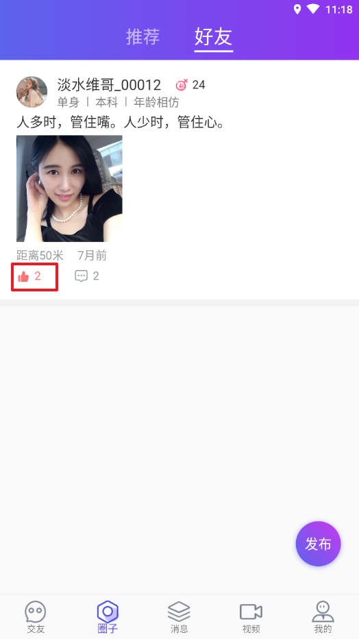 

## 2.3. 服务消费者-动态喜欢

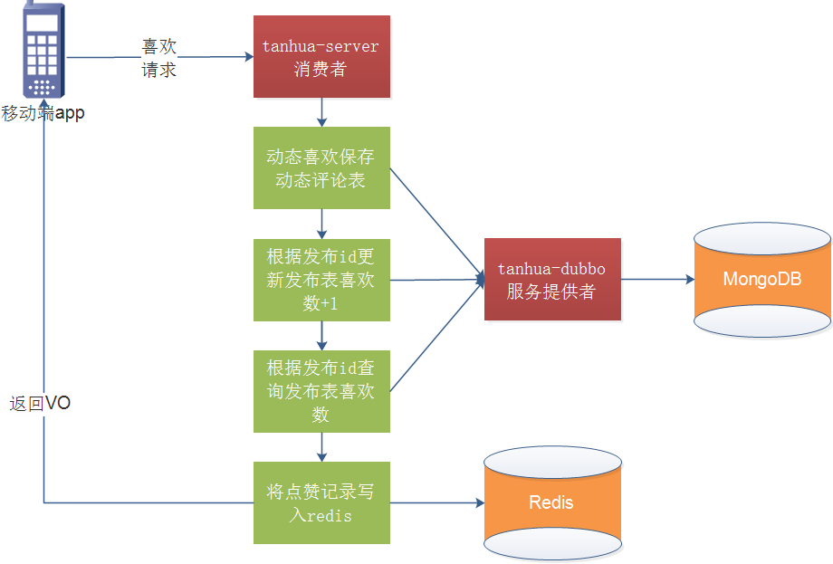

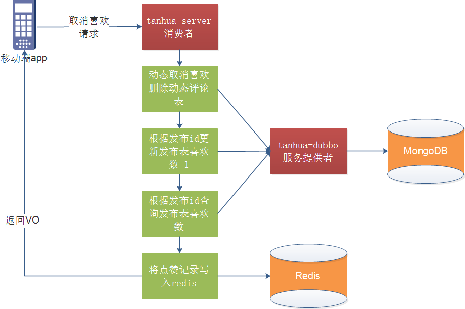

### 2.3.1. 接口说明

喜欢：

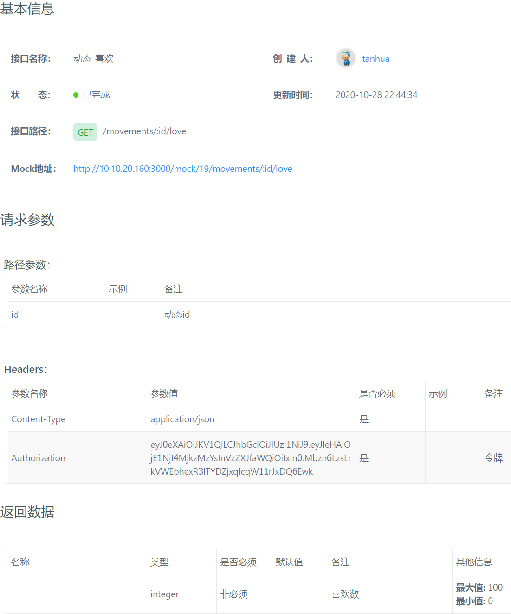

取消喜欢：

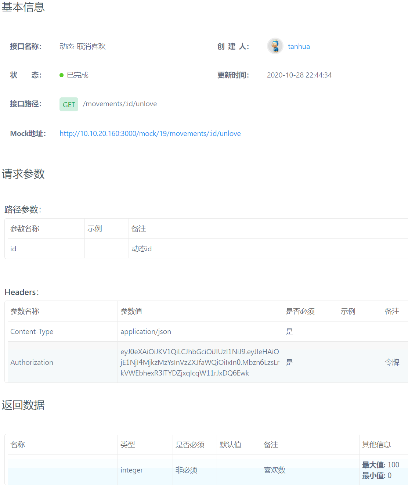

### 2.3.2. MomentController

修改MomentController代码，添加喜欢与不喜欢的方法

~~~java
/**
 * 喜欢
 * @param publishId
 * @return
 */
@GetMapping("/{id}/love")
public ResponseEntity<Long> love(@PathVariable("id") String publishId){
    Long total = commentService.love(publishId);
    return ResponseEntity.ok(total);
}

/**
 * 取消喜欢
 * @param publishId
 * @return
 */
@GetMapping("/{id}/unlove")
public ResponseEntity<Long> unlove(@PathVariable("id") String publishId){
    Long total = commentService.unlove(publishId);
    return ResponseEntity.ok(total);
}

~~~

### 2.3.3. CommentService

修改`CommentService`，添加喜欢与取消喜欢方法

~~~java
/**
 * 喜欢
 * @param publishId
 * @return
 */
public Long love(String publishId) {
    Long userId = UserHolder.getUserId();
    // 创建Comment
    Comment comment = new Comment();
    // 设置点赞属性
    comment.setUserId(userId);
    comment.setCommentType(3); // 点赞
    comment.setPubType(1); // 对动态操作
    comment.setPublishId(new ObjectId(publishId));
    // 调用api添加评论信息，且获得最新点赞数
    Long total = commentApi.save(comment);
    String key = "publish_love_" + userId+"_" + publishId;
    // 记录下点了赞了
    redisTemplate.opsForValue().set(key,"1");
    return total;
}

/**
 * 取消喜欢
 * @param publishId
 * @return
 */
public Long unlove(String publishId) {
    Long userId = UserHolder.getUserId();
    // 创建Comment对象
    Comment comment = new Comment();
    // 设置删除条件
    comment.setPublishId(new ObjectId(publishId));
    comment.setUserId(UserHolder.getUserId());
    comment.setCommentType(3);
    comment.setPubType(1);
    // 调用api删除
    long total = commentApi.remove(comment);
    String key = "publish_love_" + userId+"_" + publishId;
    // 移除redis中记录
    redisTemplate.delete(key);
    return total;
}
~~~

### 2.3.4. MomentService

修改queryRecommendPublishList方法

```java
String key2 = "publish_love_" + userId+"_" + item.getId().toHexString();
if(redisTemplate.hasKey(key2)){
    vo.setHasLoved(1);  //是否喜欢  0：未点 1:点赞
}
else
{
    vo.setHasLoved(0);  //是否喜欢  0：未点 1:点赞
}
```

### 2.3.5. 测试

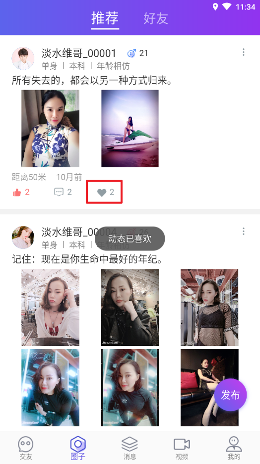 

 

## 2.4. 服务消费者-查询单条动态


### 2.4.1. 接口说明


### 2.4.2. MomentController

~~~java
/**
 * 动态详情
 * @param publishId
 * @return
 */
@GetMapping("/{id}")
public ResponseEntity<MomentVo> queryById(@PathVariable("id") String publishId){
    MomentVo momentVo = momentService.queryById(publishId);
    return ResponseEntity.ok(momentVo);
}
~~~

### 2.4.3. MomentService

```java
/**
  * 动态详情
  * @param publishId
  * @return
  */
public MomentVo queryById(String publishId) {
    //1、调用api查询动态详情 ： publish
    Publish publish = publishApi.findById(publishId);
    //2、创建vo对象
    MomentVo vo = new MomentVo();
    //3、查询用户详情（发布人）
    UserInfo userInfo = userInfoApi.findByUserId(publish.getUserId());
    Long userId = publish.getUserId();
    //4、构造数据
    if(userInfo != null) {
        BeanUtils.copyProperties(userInfo,vo);
        if(userInfo.getTags() != null) {
            vo.setTags(userInfo.getTags().split(","));
        }
    }
    BeanUtils.copyProperties(publish, vo);
    vo.setId(publish.getId().toHexString());
    vo.setCreateDate(RelativeDateFormat.format(new Date(publish.getCreated())));
    vo.setHasLiked(0);  //是否点赞  0：未点 1:点赞
    vo.setHasLoved(0);  //是否喜欢  0：未点 1:点赞
    vo.setImageContent(publish.getMedias().toArray(new String[]{}));
    vo.setDistance("50米");
    return vo;
}
```

### 2.4.4. PublishApi

```java
/**
 * 通过id查询动态信息
 * @param publishId
 * @return
 */
Publish findById(String publishId);
```

### 2.4.5 PublishApiImpl

```java
/**
  * 通过id查询动态信息
  * @param publishId
  * @return
  */
@Override
public Publish findById(String publishId) {
    Publish publish = mongoTemplate.findById(new ObjectId(publishId),Publish.class);
    return publish;
}
```

### 2.4.6. 测试

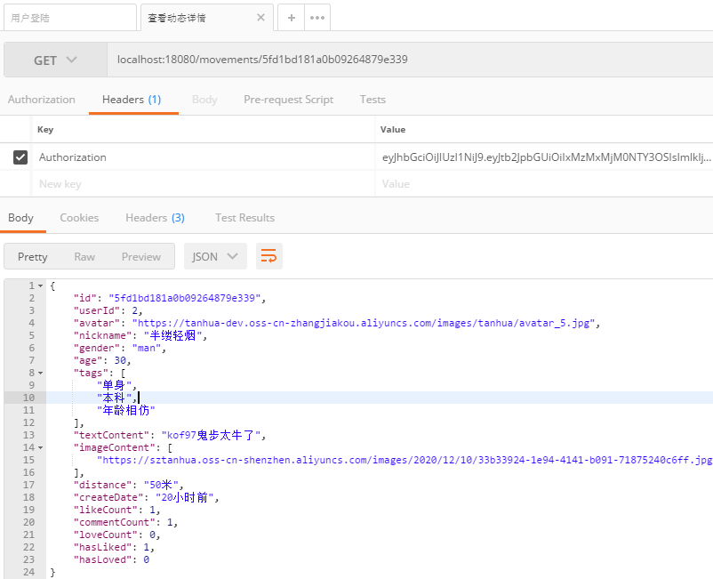

## 2.5. 服务消费者-评论列表

功能包括：查询评论列表，评论点赞、取消点赞。


### 2.5.1. 接口说明

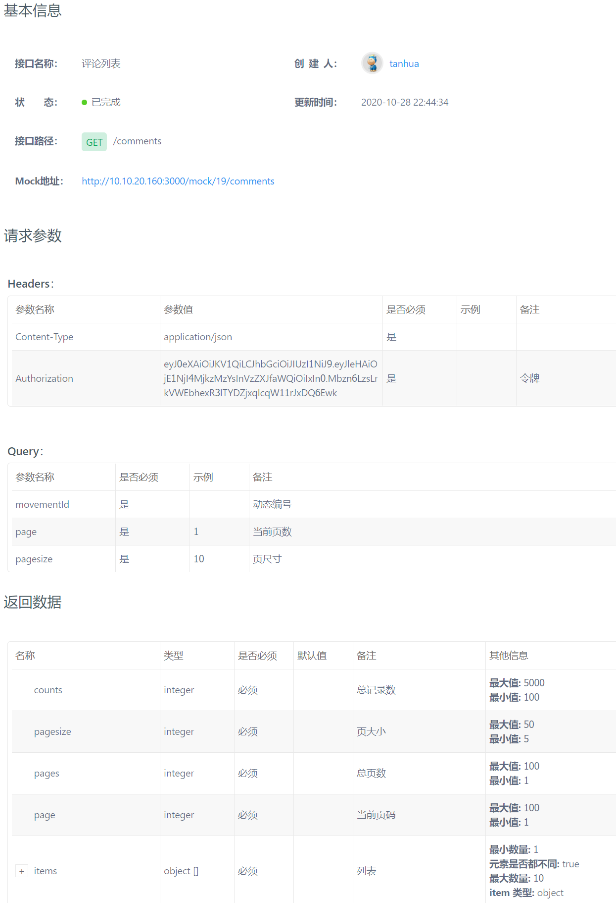  

### 2.5.2. CommentController

```java
package com.tanhua.server.controller;

import com.tanhua.domain.vo.CommentVo;
import com.tanhua.domain.vo.PageResult;
import com.tanhua.server.service.CommentService;
import org.springframework.beans.factory.annotation.Autowired;
import org.springframework.http.ResponseEntity;
import org.springframework.web.bind.annotation.GetMapping;
import org.springframework.web.bind.annotation.RequestMapping;
import org.springframework.web.bind.annotation.RequestParam;
import org.springframework.web.bind.annotation.RestController;
 
@RestController
@RequestMapping("/comments")
public class CommentController {
    
    @Autowired
    private CommentService commentService;

    /**
     * 评论列表
     * @param movementId
     * @param page
     * @param pagesize
     * @return
     */
    @GetMapping
    public ResponseEntity findPage(String movementId, @RequestParam(defaultValue = "1") int page, @RequestParam(defaultValue = "10") int pagesize) {
        page = page > 0 ? page : 1;
        PageResult<CommentVo> result = commentService.findPage(movementId, page, pagesize);
        return ResponseEntity.ok(result);
    }
}
```

### 2.5.3. CommentService

```java
@Reference
private UserInfoApi userInfoApi;

/**
  * 动态评论列表分页查询
  * @param movementId
  * @param page
  * @param pagesize
  * @return
  */
public PageResult<CommentVo> findPage(String movementId, int page, int pagesize) {
    //1、调用API查询： PageResult中封装的都是Comment对象
    PageResult<Comment>  pageResult = commentApi.findPage(page,pagesize,movementId);
    //2、获取page对象中的数据列表  list<Comment>
    List<Comment> commentList = pageResult.getItems();
    //3、一个Comment对象转化为一个VO对象
    List<CommentVo> commentListVo = new ArrayList<>();
    if(commentList != null &&commentList.size()>0){
        for (Comment comment : commentList) {
            CommentVo commentVo = new CommentVo();
            BeanUtils.copyProperties(comment,commentVo);
            //4、查询发送评论用户详情
            UserInfo userInfo = userInfoApi.findByUserId(comment.getUserId());
            BeanUtils.copyProperties(userInfo,commentVo);
            //设置评论id
            commentVo.setId(comment.getId().toHexString());
            commentVo.setCreateDate(new DateTime(comment.getCreated()).toString("yyyy年MM月dd日 HH:mm"));
            commentVo.setHasLiked(0);//是否点赞
            commentListVo.add(commentVo);
        }
    }
    //5、构造返回值
    PageResult<CommentVo> voPageResult = new PageResult<>();
    BeanUtils.copyProperties(pageResult,voPageResult);
    voPageResult.setItems(commentListVo);
    return voPageResult;
}
```

## 2.6. 服务提供者-评论列表

### 2.6.1. CommentApi

在tanhua-dubbo-interface模板mongo包下创建接口

```java
package com.tanhua.dubbo.api.mongo;

import com.tanhua.domain.mongo.Comment;
import com.tanhua.domain.vo.PageResult;
public interface CommentApi {
    /**
     * 分页查询
     * @param page
     * @param pageSize
     * @param publishId
     * @return
     */
    PageResult findPage(Integer page, Integer pageSize, String publishId);
}
```

### 2.6.2.  CommentApiImpl

在tanhua-dubbo-service模板mongo包下创建实现类

```java
package com.tanhua.dubbo.api.mongo;

import com.tanhua.domain.mongo.Comment;
import com.tanhua.domain.mongo.Publish;
import com.tanhua.domain.vo.PageResult;
import org.apache.dubbo.config.annotation.Service;
import org.bson.types.ObjectId;
import org.springframework.beans.factory.annotation.Autowired;
import org.springframework.data.domain.PageRequest;
import org.springframework.data.domain.Sort;
import org.springframework.data.mongodb.core.MongoTemplate;
import org.springframework.data.mongodb.core.query.Criteria;
import org.springframework.data.mongodb.core.query.Query;
import org.springframework.data.mongodb.core.query.Update;
import java.util.List;

/**
 * <p>
 * 评论处理
 * </p>
 */
@Service
public class CommentApiImpl implements CommentApi {
    
    @Autowired
    private MongoTemplate mongoTemplate;

    /**
     * 分页查询
     *
     * @param page
     * @param pageSize
     * @param publishId
     * @return
     */
    @Override
    public PageResult findPage(Integer page, Integer pageSize, String publishId) {
        //构建分页结果
        PageResult pageResult = new PageResult();
        pageResult.setPage((long)page);
        pageResult.setPagesize((long)pageSize);

        Query query = new Query();
        // 查询条件，属于某个动态，且评论类型为2 即评论信息
        query.addCriteria(Criteria.where("publishId").is(new ObjectId(publishId))
                .and("commentType").is(2));
        // 统计总数
        long count = mongoTemplate.count(query, Comment.class);
        pageResult.setCounts(count);
        // 查询分页结果集，按创建时间降序
        query.with(PageRequest.of(page-1,pageSize)).with(Sort.by(Sort.Order.desc("created")));
        List<Comment> comments = mongoTemplate.find(query, Comment.class);
        pageResult.setItems(comments);
        return pageResult;
    } 
}
```

### 2.6.3. 测试

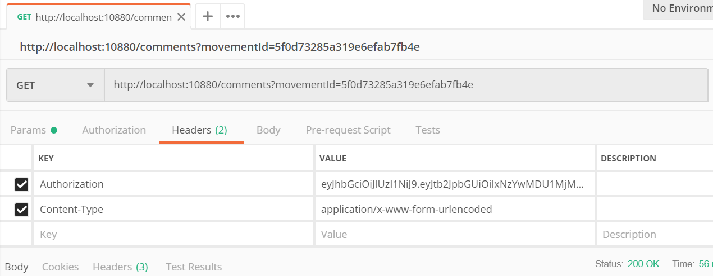

 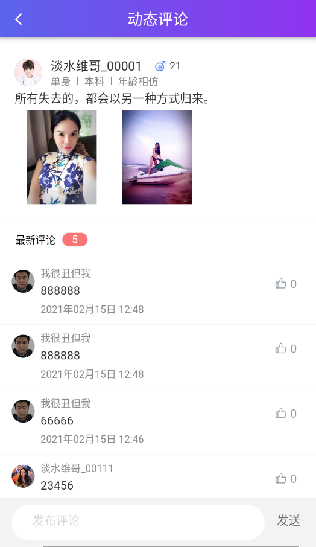

## 2.7. 服务消费者-发表评论

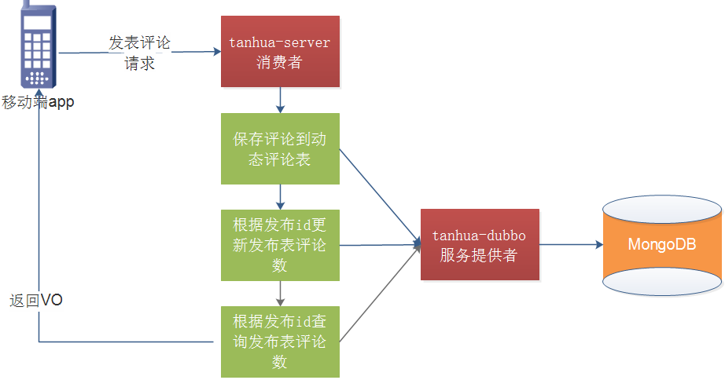

### 2.7.1. 接口说明

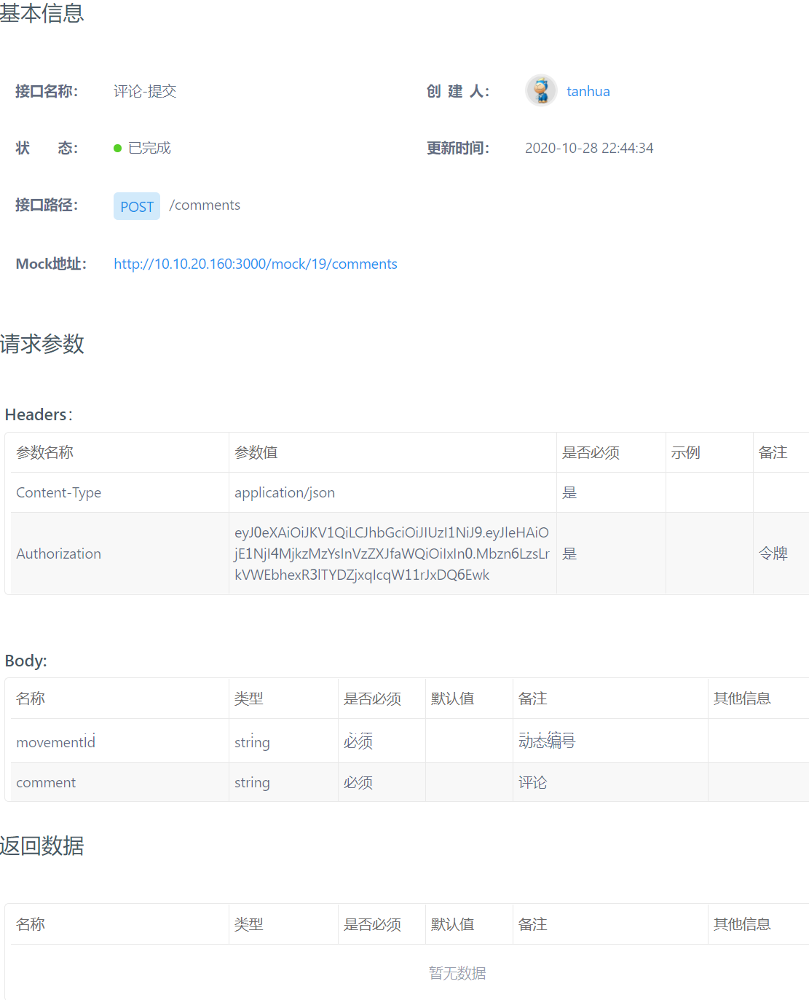 

### 2.7.2. CommentController

```java
/**
 * 发表评论
 * @param paramMap
 * @return
 */
@PostMapping
public ResponseEntity add(@RequestBody Map<String,String> paramMap){
    commentService.add(paramMap);
    return ResponseEntity.ok(null);
}
```

### 2.7.3. CommentService

```java
/**
 * 发表评论
 * @param paramMap
 *  movementId: 动态编号
 *  comment: 评论内容
 */
public void add(Map<String, String> paramMap) {
    String content = paramMap.get("comment"); // 评论内容
    String publishId = paramMap.get("movementId");
    Comment comment = new Comment();
    comment.setPublishId(new ObjectId(publishId));
    comment.setCommentType(2);
    comment.setPubType(1);
    comment.setContent(content);
    comment.setUserId(UserHolder.getUserId());
    commentApi.save(comment);
}
```

### 2.7.4. 测试

 

## 2.8. 评论点赞与取消点赞

评论点赞包含对评论的点赞我与取消点赞

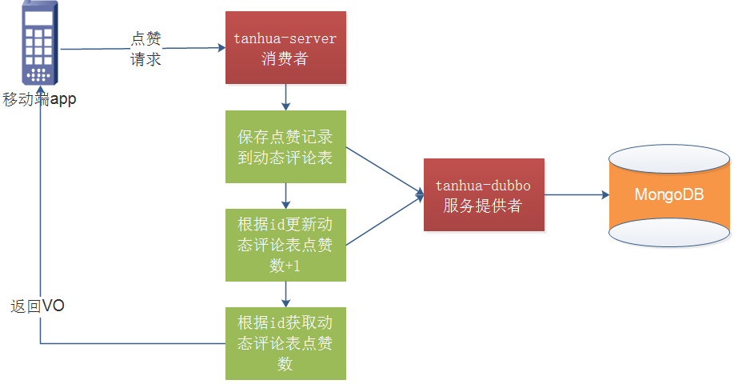

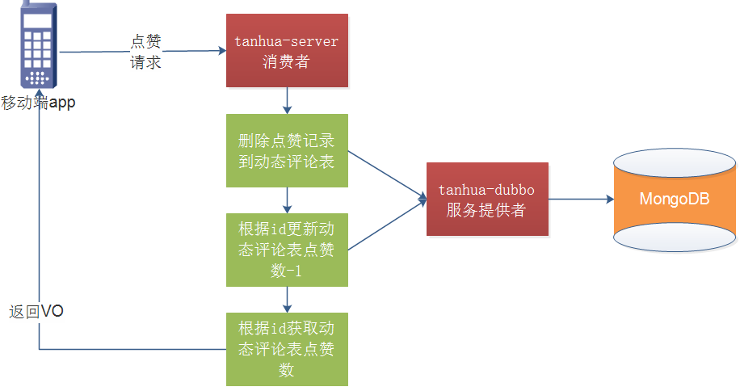

### 2.8.1. 接口说明

评论点赞：


取消点赞：


### 2.8.2. CommentController

```java
/**
 * 点赞
 * @param commentId
 * @return
 */
@GetMapping("/{id}/like")
public ResponseEntity<Long> like(@PathVariable("id") String commentId){
    Long total = commentService.likeComment(commentId);
    return ResponseEntity.ok(total);
}

/**
 * 取消点赞
 * @param commentId
 * @return
 */
@GetMapping("/{id}/dislike")
public ResponseEntity<Long> unlike(@PathVariable("id") String commentId){
    Long total = commentService.unlikeComment(commentId);
    return ResponseEntity.ok(total);
}
```

### 2.8.3. CommentService

```java
/**
 * 评论点赞
 * @param commentId
 * @return
 */
public Long likeComment(String commentId) {
    Long userId = UserHolder.getUserId();
    // 创建Comment
    Comment comment = new Comment();
    // 设置点赞属性
    comment.setUserId(userId);
    comment.setCommentType(1); // 点赞
    comment.setPubType(3); // 对评论操作
    comment.setPublishId(new ObjectId(commentId));
    // 调用api添加评论信息，且获得最新点赞数
    Long total = commentApi.save(comment);
    String key = "comment_like_" + userId+"_" + commentId;
    // 记录下点了赞了
    redisTemplate.opsForValue().set(key,"1");
    return total;
}

/**
 * 取消对评论的点赞
 * @param commentId
 * @return
 */
public Long unlikeComment(String commentId) {
    Long userId = UserHolder.getUserId();
    // 创建Comment对象
    Comment comment = new Comment();
    // 设置删除条件
    comment.setPublishId(new ObjectId(commentId));
    comment.setUserId(UserHolder.getUserId());
    comment.setCommentType(1);
    comment.setPubType(3);
    // 调用api删除
    long total = commentApi.remove(comment);
    String key = "comment_like_" + userId+"_" + commentId;
    // 移除redis中记录
    redisTemplate.delete(key);
    return total;
}
```

### 2.8.4. CommentService

修改CommentService中findPage方法

```java
将
commentVo.setHasLiked(0);//是否点赞

改为
String key = "comment_like_" + comment.getUserId()+"_" + comment.getPublishId().toHexString();
// 记录下点了赞了
if(redisTemplate.hasKey(key)){
	commentVo.setHasLiked(1);//是否点赞
}
else {
	commentVo.setHasLiked(0);//是否点赞
}
```

### 2.8.5. 测试

 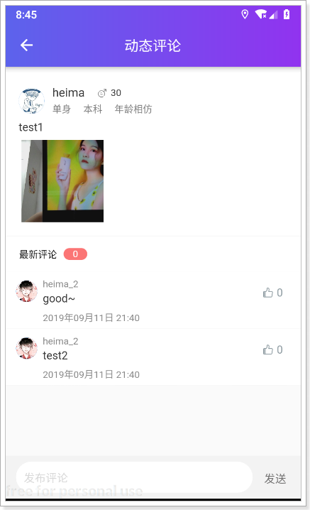

 

### 【小结】

掌握动态点赞、喜欢、评论实现

# 总结

* 查询自己的动态列表
* 评论点赞和取消点赞
  * 点赞
    * serivce：
      * 构建Comment对象，赋值
      * 调用API保存
      * 将个人对动态的点赞记录到Redis中
      * 修改之前的代码：判断redis中是否有点赞内容
    * API层
      * 设置id保存到mongodb
      * 修改动态表中对应的字段 +1
      * 查询操作之后的，总赞数
  * 取消点赞
    * serivce：
      * 构建Comment对象，赋值
      * 调用API删除
      * 将个人对动态的点赞从Redis中删除
    * API层
      * 根据动态id , 用户id，操作类型从mongdb中删除
      * 修改动态表中对应的字段 -1
      * 查询操作之后的，总赞数
* 喜欢和取消喜欢
* 评论
  * 根据id查询动态详情
  * 查询动态评论的分页列表
  * 发送评论