# 第五章 自媒体文章发布

## 目标

- 完成自媒体文章列表查询功能
- 完成自媒体文章的发布功能
- 完成自媒体文章的查询
- 完成自媒体文章的删除功能
- 完成自媒体文章的上下架功能功能

## 1 自媒体文章列表查询

### 1.1 需求分析


如图所示：

```properties
需要展示自媒体发布的文章列表，并实现分页查询展示，而且需要根据关键字（文章的标题）、频道列表 和发布日期范围来进行分页查询
```


### 1.2 表结构

wm_news  自媒体文章表


频道表：


### 1.3 功能实现

#### 1.3.1 自媒体文章分页查询

##### 1.3.1.1 思路分析

```properties
页面点击搜索按钮之后 将选中的条件作为请求体传递给后台，后台根据条件进行分页查询即可
请求路径：/search
参数：分页条件封装对象
返回值：分页结果返回对象
```

##### 1.3.1.2 功能实现

（1）创建dto来接收页面传递的数值

```java
@Data
@Getter
@Setter
public class WmNewsDto extends WmNews {
    private LocalDateTime startTime;
    private LocalDateTime endTime;

}
```


(2)修改controller进行分页查询

```java
@PostMapping("/searchPage")
    public Result<PageInfo<WmNews>> findByPageDto(@RequestBody PageRequestDto<WmNewsDto> pageRequestDto) {
        Page page = new Page(pageRequestDto.getPage(), pageRequestDto.getSize());
        //条件查询
        QueryWrapper<WmNews> queryWrapper = new QueryWrapper<WmNews>();
        //如果不为空才需要进行获取属性进行条件查询
        WmNewsDto body = pageRequestDto.getBody();

        if(body!=null){
            //状态 查询
            if(!StringUtils.isEmpty(body.getStatus())){
                queryWrapper.eq("status",body.getStatus());
            }
            //关键字 也就是标题来搜索
            if(!StringUtils.isEmpty(body.getTitle())){
                queryWrapper.like("title",body.getTitle());
            }
            //频道
            if(!StringUtils.isEmpty(body.getChannelId())){
                queryWrapper.eq("channel_id",body.getChannelId());
            }
            //发布日期的范围进行查询
            if(!StringUtils.isEmpty(body.getStartTime()) && !StringUtils.isEmpty(body.getEndTime())){
                queryWrapper.between("publish_time",body.getStartTime(),body.getEndTime());
            }
        }
        //执行分页查询
        IPage<WmNews> iPage = wmNewsService.page(page, queryWrapper);

        //获取分页对象返回
        PageInfo<WmNews> pageInfo = getPageInfo(iPage);

        return Result.ok(pageInfo);
    }
```


##### 1.3.2.3 测试


#### 1.3.2 频道列表查询

##### 1.3.2.1 思路分析

​	实际上频道列表 需要在页面展示下拉框我们可以直接使用现有的admin微服务中的查询所有的频道列表即可，因为数据量不大，可以直接列出来即可，然后通过自媒体网关路由转发到admin微服务即可。

##### 1.3.2.2 功能实现

目前已经实现了在抽象类中，所以直接关联网关即可。


 


网关配置：

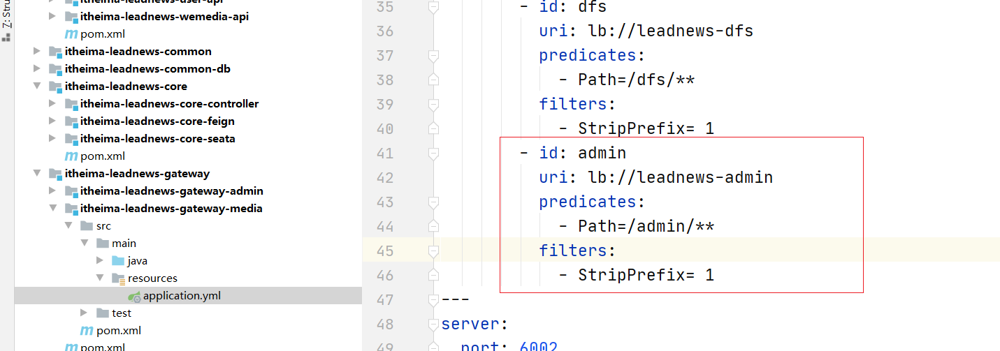


##### 1.3.2.3 测试

为了测试方便直接在本地访问路径，（当然也可以结合网关进行测试）

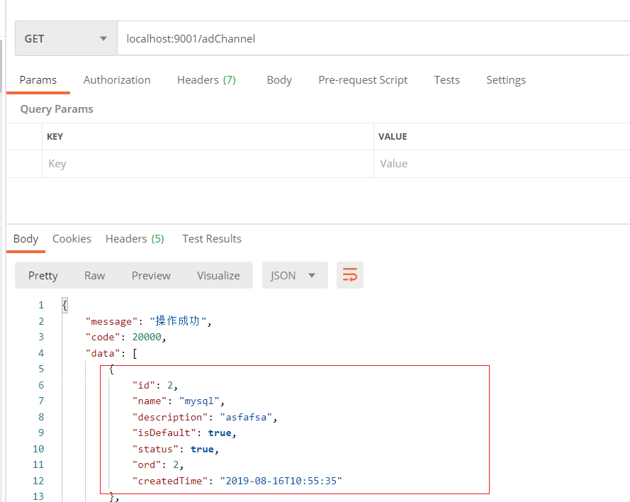


#### 1.3.3 网关路由规则配置

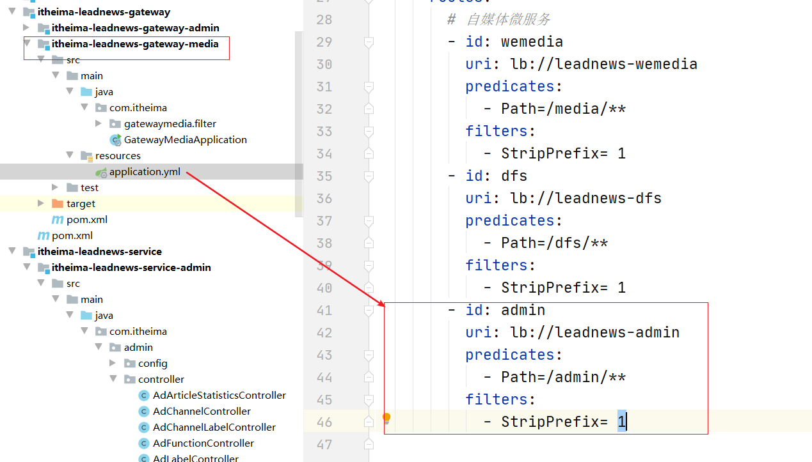

结合网关测试：

（1）先启动微服务 和网关 （自媒体微服务 admin微服务 自媒体网关）登录

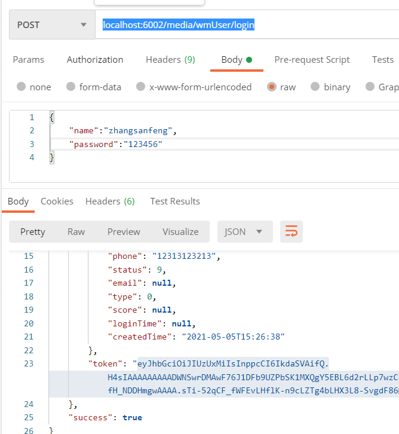


（2）测试获取频道列表： token从上一节登录之后获取

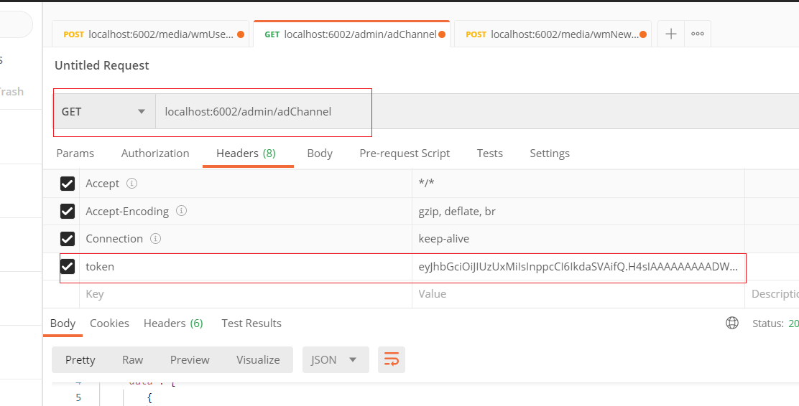


（3）测试文章分页列表查询：

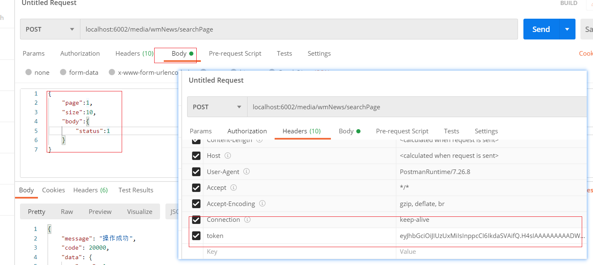


## 3 自媒体文章-发布、修改，保存草稿

### 3.1 需求分析

总体上的需求：


原型：需求可以参考原型，但是会有稍微的变化

```
项目原型-HTML(使用火狐浏览器打开)/[原型图]_前台_黑马头条_V1.0/index.html#g=1
```


弹出窗口的图如下：有两种：1 选择现有素材作为  2 重新上传图片

（图3）

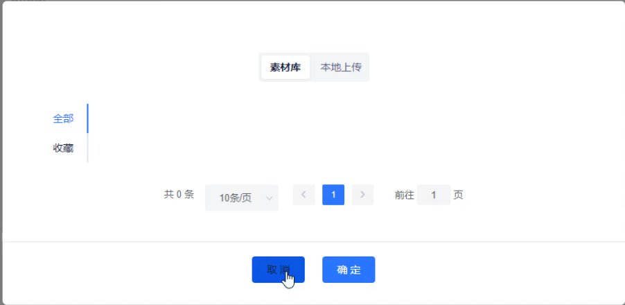

流程说明如下：

```properties
1.点击发布文章，添加标题 添加内容
2.添加内容有两种 一种是 纯文本  一种是是图片
3.点击文本的时候 弹出窗口直接添加文本 点击确定即可
4.点击图片的时候 弹出窗口 如上图片 图三表示 可以从素材库里面选择一张图，或者自己直接上传一张图 作为内容的一张图片
5.选择标签 频道 和发布定时时间
6.选择封面 选择单图 或者 多图 或者无图或者自动   需要弹出窗口图三那里进行 选择或者上传 多图需要上传3张
7.点击保存草稿或者直接提交
```

### 3.2 思路分析

涉及到的表如下：


思路分析：

```properties
这个其实也很简单。
发布文章的本质就是像wm_news文章表进行插入一条记录而已。
这里比较特殊的点在于 可以选择素材 所以需要弹出窗口查询素材 并选中之后将素材对应的图片的路径作为参数请求 传递给后台保存到mw_news文章表中存储起来
还有就是封面的无图 单图 自动 需要进行判断，自动的时候，需要判断当前的内容中是否有图片，如图有图片，则判断有几张，如果小于2 则作为单图 如果小于1 则作为无图，如果大于2 则作为多图即可。
```

实现步骤:

```properties
实现弹窗 获取素材列表--》 【已经实现】 直接调用分页搜索的请求路径即可
实现上传图片---》【已经实现】 直接调用dfs的请求路径即可
封面的单图 多图 选择图片上传--》就是弹窗功能已经实现
```

实现发表文章功能：

```properties
请求：/wmNews/save/{isSubmit}     POST
参数：2个  
	是否为提交  isSubitm    值为 1 或者 0  1标识为提交 0 标识为保存草稿 
    请求体对象  
返回值：result 成功与否即可    
```

前端应当传递的请求体对象数据为如下案例：

```json
{
    "title": "黑马头条项目背景",
    "type": "1",
    "labels": "黑马头条",
    "publishTime": "2020-03-14T11:35:49.000Z",
    "channelId": 1,    
    "images": [
        "http://192.168.200.130/group1/M00/00/00/wKjIgl5swbGATaSAAAEPfZfx6Iw790.png"
    ],
    "status": 1,
    "content": [
        {
            "type": "text",
            "value": "随着智能手机的普及，人们更加习惯于通过手机来看新闻。由于生活节奏的加快，很多人只能利用碎片时间来获取信息，因此，对于移动资讯客户端的需求也越来越高。黑马头条项目正是在这样背景下开发出来。黑马头条项目采用当下火热的微服务+大数据技术架构实现。本项目主要着手于获取最新最热新闻资讯，通过大数据分析用户喜好精确推送咨询新闻"
        },
        {
            "type": "image",
            "value": "http://192.168.200.130/group1/M00/00/00/wKjIgl5swbGATaSAAAEPfZfx6Iw790.png"
        }
    ]
}
```


解释 ：

```properties
type  : 指定为封面类型  0 是无图  1 是单图  3 是多图  -1 是自动
images: 指定为封面图片  以逗号分隔的图片路径
status: 自媒体文章的状态 0 保存草稿  1 提交（待审核）.....  这个字段前端不必传递
```

### 3.3 功能实现

（1）创建dto 用来接收页面传递过来的请求体

```java

@Data
@Getter
@Setter
public class ContentNode {
    //type 指定类型  text 标识文本   image 标识 图片
    private String type;
    //value 指定内容
    private String value;

}

```

```java
@Data
@Getter
@Setter
public class WmNewsDtoSave {
    //主键ID
    private Integer id;

    //文章标题
    private String title;

    //图文内容
    private List<ContentNode> content;

    //指定为封面类型  0 是无图  1 是单图  3 是多图  -1 是自动
    private Integer type;

    //指定选中的频道ID
    private Integer channelId;

    //指定标签
    private String labels;

    //状态 0 草稿  1 提交 待审核 （该字段可以不用设置,前端不必传递）
    private Integer status;

    //定时发布时间
    private LocalDateTime publishTime;

    //封面图片
    private List<String> images;
}
```

 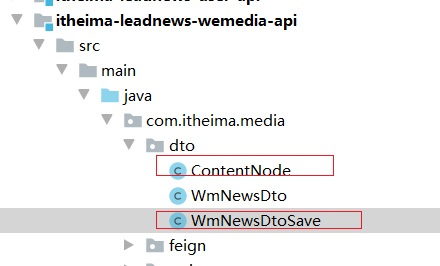

（2）编写controller

```java
//保存自媒体文章 保存草稿 和 添加 或者修改
@PostMapping("/save/{isSubmit}")
public Result save(@PathVariable(name="isSubmit") Integer isSubmit,@RequestBody WmNewsDtoSave wmNewsDtoSave){
    if(StringUtils.isEmpty(isSubmit) || wmNewsDtoSave==null){
        return Result.errorMessage("数据不能为空");
    }
    if(isSubmit>1 || isSubmit<0){
        return Result.errorMessage("isSubmit的值有误");
    }
    wmNewsService.save(wmNewsDtoSave,isSubmit);
    return Result.ok();
}
```

 


(3)编写service 实现类

```java
@Autowired
    private WmNewsMapper wmNewsMapper;

    //保存自媒体文章信息
    @Override
    public void save(WmNewsDtoSave wmNewsDtoSave, Integer isSubmit) {
        WmNews wmNews = new WmNews();
        //copy数据
        BeanUtils.copyProperties(wmNewsDtoSave, wmNews);
        //补充设置数据
        //设置登录的用户ID
        wmNews.setUserId(Integer.valueOf(RequestContextUtil.getUserInfo()));
        //设置成JSON 字符串到数据库中
        wmNews.setContent(JSON.toJSONString(wmNewsDtoSave.getContent()));

        //设置封面图片 将list 转成一个以逗号分隔的字符串
        if (wmNewsDtoSave.getImages() != null && wmNewsDtoSave.getImages().size() > 0) {
            wmNews.setImages(String.join(",", wmNewsDtoSave.getImages()));
        }

        //如果是自动图  则判断 图文内容中的图片有多少张，如果是>2 则为多图 如果是1 则为单图 如果是小于1 则为 无图
        if (wmNewsDtoSave.getType() == -1) {
            List<String> imagesFromContent = getImagesFromContent(wmNewsDtoSave);
            //说明是多图
            if (imagesFromContent.size() > 2) {
                //设置为多图
                wmNews.setType(3);
                //并设置图片 因为页面没有传递了
                wmNews.setImages(String.join(",", imagesFromContent));
            } else if (imagesFromContent.size() > 0 && imagesFromContent.size() <= 2) {
                //设置为单图
                wmNews.setType(1);
                //设置图片为一张
                wmNews.setImages(imagesFromContent.get(0));
            } else {
                //无图
                wmNews.setType(0);
                //空字符串
                wmNews.setImages("");
            }

        }
        //保存草稿或者提交审核
        wmNews.setStatus(isSubmit);
        if (isSubmit == 1) {
            wmNews.setSubmitedTime(LocalDateTime.now());
        }
        //修改数据
        if (wmNewsDtoSave.getId() != null) {
            wmNewsMapper.updateById(wmNews);
        } else {
            //添加数据
            wmNews.setCreatedTime(LocalDateTime.now());
            wmNewsMapper.insert(wmNews);
        }
    }

    //获取图片路径列表
    private List<String> getImagesFromContent(WmNewsDtoSave wmNewsDtoSave) {
        List<ContentNode> content = wmNewsDtoSave.getContent();
        List<String> images = new ArrayList<String>();
        for (ContentNode contentNode : content) {
            //图片
            if (contentNode.getType().equals("image")) {
                String value = contentNode.getValue();
                images.add(value);
            }
        }
        return images;
    }
```

(4)测试：

先启动网关和自媒体微服务 并先登录


登录好了之后进行添加保存的操作：

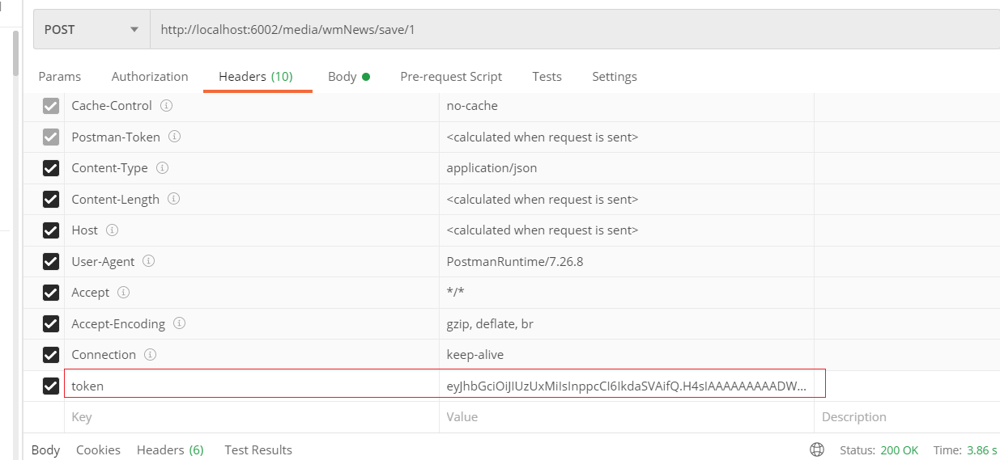


测试数据参考思路分析里面的请求体数据。


### 3.4 优化

当保存之后需要将生成的主键返回

操作如下：

实现类中 修改如下：


接口修改：


controller修改如下：


## 4 自媒体文章-根据id查询

### 4.1 需求分析


点击修改的时候，就是根据文章id查询，跳转至编辑页面进行展示


### 4.2 思路分析

```properties
点击编辑 先根据文章的ID 获取到文章的数据，要注意的是，需要返回的数据不是数据库对应的实体对象，而是刚才我们定义的dto的对象。因为编辑的时候需要用到该数据
```

### 4.3 功能实现

（1）修改controller

```java
@GetMapping("/one/{id}")
public Result<WmNewsDtoSave> getById(@PathVariable(name="id")Integer id){
    WmNewsDtoSave wmNewsDtoSave = wmNewsService.getDtoById(id);
    return Result.ok(wmNewsDtoSave);
}
```


（2）service实现类

```java
@Override
public WmNewsDtoSave getDtoById(Integer id) {
    WmNews wmNews = wmNewsMapper.selectById(id);

    if(wmNews!=null){
        WmNewsDtoSave wmNewsDtoSave = new WmNewsDtoSave();
        BeanUtils.copyProperties(wmNews,wmNewsDtoSave);
        //设置内容
        String content = wmNews.getContent();
        List<ContentNode> contentNodes = JSON.parseArray(content, ContentNode.class);
        wmNewsDtoSave.setContent(contentNodes);
        //设置图片
        String images = wmNews.getImages();
        if(!StringUtils.isEmpty(images)){
            //设置图片列表
            wmNewsDtoSave.setImages(Arrays.asList(images.split(",")));
        }
        return wmNewsDtoSave;
    }
    return null;
}
```

（3）测试 通过网关测试（注意：测试也可以不用通过网关）

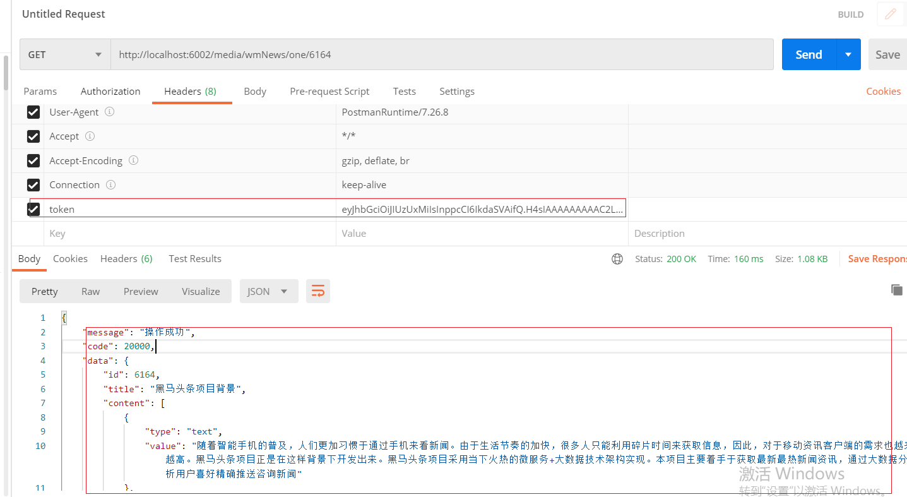


## 5 自媒体文章-删除

### 5.1 需求分析


### 5.2 思路分析

```properties
当文章状态为9 并且已上架的数据 不能删除。 如果是其他的状态可以删除。
删除之后需要同步数据到 APP文章中，该状态待做。
前端发送请求到后台 后台做逻辑判断处理即可
```


### 5.3 功能实现

controller 实现即可：

```java
@Override
@DeleteMapping("/{id}")
public Result deleteById(@PathVariable(name = "id") Serializable id) {
    WmNews wmNews = wmNewsService.getById(id);
    if (wmNews == null) {
        return Result.errorMessage("不存在的文章");
    }
    Integer enable = wmNews.getEnable();
    Integer status = wmNews.getStatus();
    //已发布 且上架
    if (status == 9 && enable == 1) {
        return Result.errorMessage("已发布 且上架 不能删除");
    }
    wmNewsService.removeById(id);
    return Result.ok();
}
```

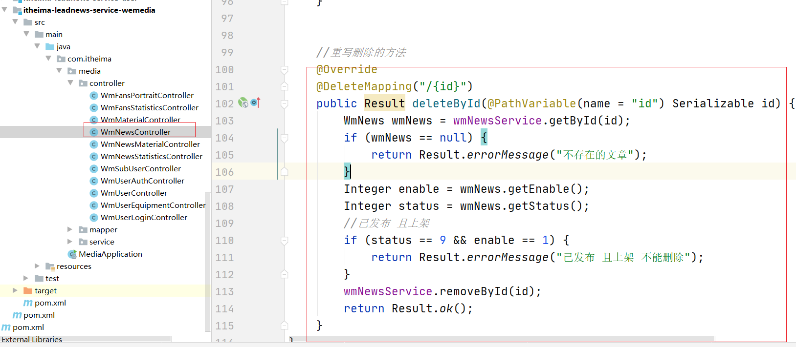


## 6 自媒体文章-上架、下架

### 6.1 需求分析


### 6.2 思路分析

```properties
当前已经发布（状态为9）的文章可以上架（enable = 1），也可以下架（enable = 0）
在上架和下架操作的同时，需要同步app端的文章配置信息，暂时不做，后期讲到审核文章的时候再优化
```


### 6.3 功能实现

修改controller 添加一个方法进行上架和下架。

```java
@PutMapping("/upOrDown/{id}/{enable}")
public Result updateUpDown(@PathVariable(name = "id") Serializable id,@PathVariable(name="enable")Integer enable) {
    WmNews wmNews = wmNewsService.getById(id);
    if (wmNews == null) {
        return Result.errorMessage("不存在的文章");
    }

    Integer status = wmNews.getStatus();
    //已发布 且上架
    if (status != 9) {
        return Result.errorMessage("文章没发布，不能上下架");
    }
    if(enable>1 || enable<0){
        return Result.errorMessage("错误的数字范围 只能是0,1");
    }
    wmNews.setEnable(enable);
    wmNewsService.updateById(wmNews);
    return Result.ok();
}
```


## 7 权限校验优化和Token续约

### 7.1 分析问题

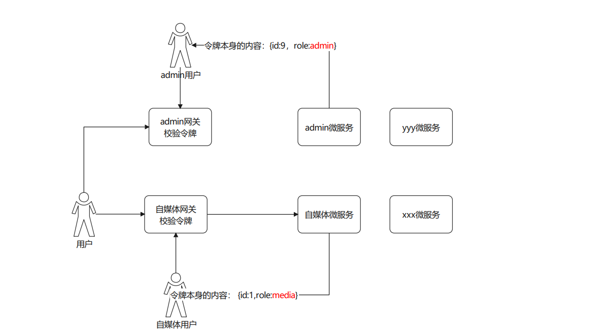


解决办法：

```
1.使用角色设置，当生成令牌的时候设置值角色 用来标记该令牌为某一个角色
2.使用令牌在redis中存储
3.使用时间判断再进行重新生成 并续约
```

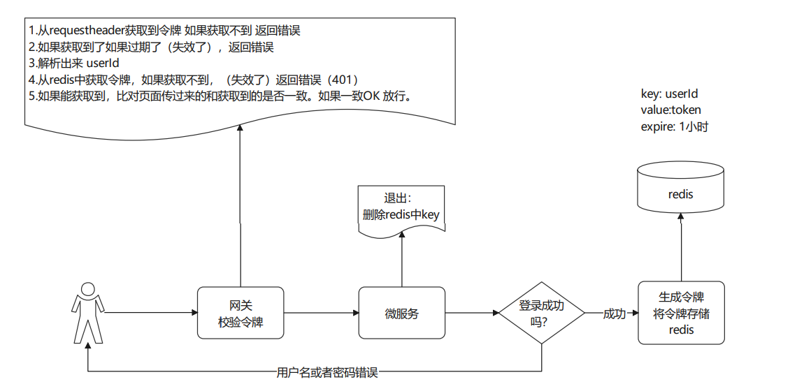


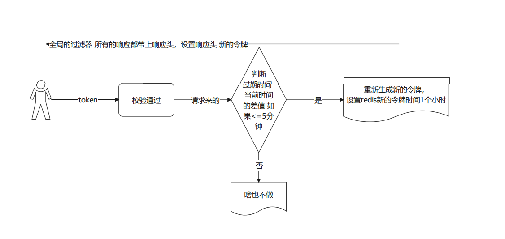

### 7.2 实现功能

（1）在common工程中定义POJO 角色和令牌信息POJO

```java
/**
 * @author ljh
 * @version 1.0
 * @date 2021/7/11 18:13
 * @description 标题
 * @package com.itheima.common.pojo
 */
public enum TokenRole {
    ROLE_ADMIN,
    ROLE_MEDIA,
    ROLE_APP
}
```


```java
@Data
@AllArgsConstructor
@NoArgsConstructor
public class UserToken implements Serializable {

    //用户ID
    private Long userId;

    //用户头像
    private String head;

    //用户昵称
    private String nickName;

    //用户名称
    private String name;

    //当前用户的角色
    private TokenRole role;

    //过期时间
    private Long expiration;

    public UserToken(Long userId, String head, String nickName, String name, TokenRole role) {
        this.userId = userId;
        this.head = head;
        this.nickName = nickName;
        this.name = name;
        this.role = role;
    }
}
```


（2）在admin微服务中登录成功之后则颁发令牌


修改工具类,添加如下代码

```java
/**
     * 令牌中用户信息的key
     */
public static final String USER_TOKEN_KEY = "usertoken";

/**
     * 3600 秒 表示一个小时
     */
public static final int TOKEN_TIME_OUT = 3600;

public static String createTokenUserToken(UserToken userToken) {
    Map<String, Object> claimMaps = new HashMap<>();
    //当前时间
    long currentTime = System.currentTimeMillis();
    //过期时间
    long expiration= currentTime + TOKEN_TIME_OUT * 1000;
    //设置过期时间到usertoken中
    userToken.setExpiration(expiration);
    //用户信息
    claimMaps.put(AppJwtUtil.USER_TOKEN_KEY, JSON.toJSONString(userToken));
    return Jwts.builder()
        .setId(UUID.randomUUID().toString())//令牌的唯一标识 uuid生成
        .setIssuedAt(new Date(currentTime))  //签发时间
        .compressWith(CompressionCodecs.GZIP)  //数据压缩方式
        //设置秘钥
        .signWith(SignatureAlgorithm.HS256, generalKey()) //加密方式
        //过期一个小时
        .setExpiration(new Date(expiration))
        .addClaims(claimMaps) //cla信息
        //生成
        .compact();
}

 /**
     * 解析用户信息 获取过期时间
     * @param token
     * @return
     */
    public static UserToken getUserToken(String token) {
        UserToken userToken=null;
        try {
            userToken= JSON.parseObject(getJws(token).getBody().get(AppJwtUtil.USER_TOKEN_KEY).toString(), UserToken.class);
        } catch (Exception e) {
            e.printStackTrace();
        }
        return userToken;
    }

```

修改常量类，添加如下：

```java
    public static final String REDIS_TOKEN_ADMIN_PREFIX = "token:userId:" + TokenRole.ROLE_ADMIN.name() + ":";
    public static final String REDIS_TOKEN_APP_PREFIX = "token:userId:" + TokenRole.ROLE_APP.name() + ":";
    public static final String REDIS_TOKEN_MEDIA_PREFIX = "token:userId:" + TokenRole.ROLE_MEDIA.name() + ":";

```

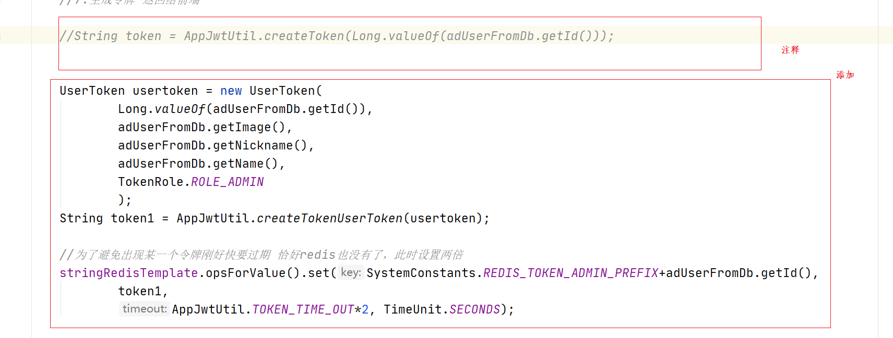


```java
 
 @Autowired
 private StringRedisTemplate stringRedisTemplate;
    
    
 
 UserToken usertoken = new UserToken(
                Long.valueOf(adUserFromDb.getId()),
                adUserFromDb.getImage(),
                adUserFromDb.getNickname(),
                adUserFromDb.getName(),
                TokenRole.ROLE_ADMIN
                );
        String token1 = AppJwtUtil.createTokenUserToken(usertoken);

        //为了避免出现某一个令牌刚好快要过期 恰好redis也没有了，此时设置两倍
        stringRedisTemplate.opsForValue().set(SystemConstants.REDIS_TOKEN_ADMIN_PREFIX+adUserFromDb.getId(),
                token1,
                AppJwtUtil.TOKEN_TIME_OUT*2, TimeUnit.SECONDS);
```


(3)在网关中进行设置：

```
redis:
  host: 192.168.211.136
  port: 6379
```

（4）修改过滤器代码：

```java
@Component
public class AuthorizeFilter implements GlobalFilter, Ordered {

    @Autowired
    private StringRedisTemplate stringRedisTemplate;

    @Override
    public Mono<Void> filter(ServerWebExchange exchange, GatewayFilterChain chain) {
        //1.获取请求对象 和响应对象
        ServerHttpRequest request = exchange.getRequest();
        ServerHttpResponse response = exchange.getResponse();
        //2.判断当前请求是否是登录请求等【白名单的清单中的路径】 如果是 则放行
        // http://loalhost:6001/admin/admin/login
        // /admin/admin/login
        String path = request.getURI().getPath();//
        if (path.startsWith("/admin/admin/login") || path.endsWith("v2/api-docs")) {
            //放行
            return chain.filter(exchange);
        }

        //3.获取请求头中的令牌  判断 如果没有 直接返回错误
        String token = request.getHeaders().getFirst("token");
        if (StringUtils.isEmpty(token)) {
            response.setStatusCode(HttpStatus.UNAUTHORIZED);
            return response.setComplete();//完成请求 直接返回
        }

        //4.校验令牌是否正确 如果不正确  直接返回错误
        Integer code = AppJwtUtil.verifyToken(token);
        if (code != SystemConstants.JWT_OK) {
            response.setStatusCode(HttpStatus.UNAUTHORIZED);
            return response.setComplete();//完成请求 直接返回
        }
        //5.如果是正确的 那么就放行（将token中的数据解析出来，获取到登录的用户的ID 作为请求头 转发给下游微服务）
        UserToken userToken = AppJwtUtil.getUserToken(token);

        //说明解析有问题
        if(userToken==null){
            response.setStatusCode(HttpStatus.UNAUTHORIZED);
            return response.setComplete();//完成请求 直接返回
        }

        if (userToken.getRole() != TokenRole.ROLE_ADMIN) {
            response.setStatusCode(HttpStatus.UNAUTHORIZED);
            return response.setComplete();//完成请求 直接返回
        }

        String tokenfromRedis = stringRedisTemplate
                .opsForValue()
                .get(SystemConstants.REDIS_TOKEN_ADMIN_PREFIX + userToken.getUserId());

        if (tokenfromRedis == null) {
            //已经过期
            response.setStatusCode(HttpStatus.UNAUTHORIZED);
            return response.setComplete();//完成请求 直接返回
        }

        //校验令牌是否和redis中一致
        if (!token.equals(tokenfromRedis)) {
            //已经过期
            response.setStatusCode(HttpStatus.UNAUTHORIZED);
            return response.setComplete();//完成请求 直接返回
        }


        //如果当前时间少于1分钟的时候刷新
        if ((userToken.getExpiration() - System.currentTimeMillis()) <= 1000 * 60) {

            String tokenNew = AppJwtUtil.createTokenUserToken(userToken);
            //重新设置超时时间
            stringRedisTemplate.opsForValue().set(SystemConstants.REDIS_TOKEN_ADMIN_PREFIX + userToken.getUserId(),
                    tokenNew,
                    AppJwtUtil.TOKEN_TIME_OUT*2, TimeUnit.SECONDS);
            //设置到响应头中
            response.getHeaders().add("tokenNew",tokenNew);
        }

        //头名 USER_HEADER_NAME
        //头值 ： 就是当前登录的用户的ID
        request.mutate().header(SystemConstants.USER_HEADER_NAME, userToken.getUserId().toString());

        return chain.filter(exchange);
    }

    //过滤器链 的优先级的数字  数字越小 说明优先级越高 越优先被执行
    @Override
    public int getOrder() {
        return 0;
    }
}
```

