# 第十三章 新热文章计算

## 今日目标

- 能够理解什么是实时流式计算
- 能够理解kafkaStream处理实时流式计算的流程
- 能够完成kafkaStream实时流式计算的入门案例
- 能够完成app端热点文章计算的功能
- 能够完成app端文章列表接口的优化改造

## 1 实时流式计算

### 1.1 概念

一般流式计算会与批量计算相比较。在流式计算模型中，输入是持续的，可以认为在时间上是无界的，也就意味着，永远拿不到全量数据去做计算。同时，计算结果是持续输出的，也即计算结果在时间上也是无界的。流式计算一般对实时性要求较高，同时一般是先定义目标计算，然后数据到来之后将计算逻辑应用于数据。同时为了提高计算效率，往往尽可能采用增量计算代替全量计算。


流式计算就相当于上图的右侧扶梯，是可以源源不断的产生数据，源源不断的接收数据，没有边界。

### 1.2 应用场景

- 日志分析

  网站的用户访问日志进行实时的分析，计算访问量，用户画像，留存率等等，实时的进行数据分析，帮助企业进行决策

- 大屏看板统计

  可以实时的查看网站注册数量，订单数量，购买数量，金额等。

- 公交实时数据

  可以随时更新公交车方位，计算多久到达站牌等

- 实时文章分值计算

  头条类文章的分值计算，通过用户的行为实时文章的分值，分值越高就越被推荐。

### 1.3 技术方案选型

- Hadoop 

  

- Apche Storm

  Storm 是一个分布式实时大数据处理系统，可以帮助我们方便地处理海量数据，具有高可靠、高容错、高扩展的特点。是流式框架，有很高的数据吞吐能力。

- Kafka Stream 

  可以轻松地将其嵌入任何Java应用程序中，并与用户为其流应用程序所拥有的任何现有打包，部署和操作工具集成。

## 2 Kafka Stream 

### 2.1 概述

Kafka Stream是Apache Kafka从0.10版本引入的一个新Feature。它是提供了对存储于Kafka内的数据进行流式处理和分析的功能。

Kafka Stream的特点如下：

- Kafka Stream提供了一个非常简单而轻量的Library，它可以非常方便地嵌入任意Java应用中，也可以任意方式打包和部署
- 除了Kafka外，无任何外部依赖
- 充分利用Kafka分区机制实现水平扩展和顺序性保证
- 通过可容错的state store实现高效的状态操作（如windowed join和aggregation）
- 支持正好一次处理语义
- 提供记录级的处理能力，从而实现毫秒级的低延迟
- 支持基于事件时间的窗口操作，并且可处理晚到的数据（late arrival of records）
- 同时提供底层的处理原语Processor（类似于Storm的spout和bolt），以及高层抽象的DSL（类似于Spark的map/group/reduce）

### 2.2 Kafka Streams的关键概念

（1）Stream处理拓扑

- **流**是Kafka Stream提出的最重要的抽象概念：它表示一个无限的，不断更新的数据集。流是一个有序的，可重放（反复的使用），不可变的容错序列，数据记录的格式是键值对（key-value）。
- 通过Kafka Streams编写一个或多个的计算逻辑的处理器拓扑。其中处理器拓扑是一个由流（边缘）连接的流处理（节点）的图。
- **流处理器**是`处理器拓扑`中的一个节点；它表示一个处理的步骤，用来转换流中的数据（从拓扑中的上游处理器一次接受一个输入消息，并且随后产生一个或多个输出消息到其下游处理器中）。 

（2）在拓扑中有两个特别的处理器：

- **源处理器（Source Processor）**：源处理器是一个没有任何上游处理器的特殊类型的流处理器。它从一个或多个kafka主题生成输入流。通过消费这些主题的消息并将它们转发到下游处理器。
- **Sink处理器**：sink处理器是一个没有下游流处理器的特殊类型的流处理器。它接收上游流处理器的消息发送到一个指定的**Kafka主题**。


### 2.3 KStream&KTable

（1）数据结构类似于map,如下图，key-value键值对


（2）KStream

**KStream**数据流（data stream），即是一段顺序的，可以无限长，不断更新的数据集。
数据流中比较常记录的是事件，这些事件可以是一次鼠标点击（click），一次交易，或是传感器记录的位置数据。

KStream负责抽象的，就是数据流。与Kafka自身topic中的数据一样，类似日志，每一次操作都是**向其中插入（insert）新数据。**

为了说明这一点，让我们想象一下以下两个数据记录正在发送到流中：

（“ alice”，1）->（“” alice“，3）

如果您的流处理应用是要总结每个用户的价值，它将返回`4`了`alice`。为什么？因为第二条数据记录将不被视为先前记录的更新。（insert）新数据

（3）KTable

**KTable**传统数据库，包含了各种存储了大量状态（state）的表格。KTable负责抽象的，就是表状数据。每一次操作，都是**更新插入（update）**

为了说明这一点，让我们想象一下以下两个数据记录正在发送到流中：

（“ alice”，1）->（“” alice“，3）

如果您的流处理应用是要总结每个用户的价值，它将返回`3`了`alice`。为什么？因为第二条数据记录将被视为先前记录的更新。

**KStream - 每个新数据都包含了部分信息。**

**KTable - 每次更新都合并到原记录上。**

### 2.4 Kafka Stream入门案例编写

 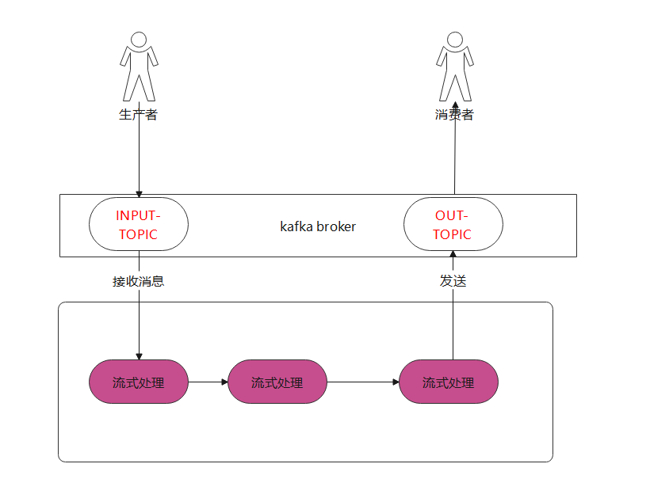

如图：

```properties
1.生产者发送消息到        kafka 输入主题中
2.kafka streams流式处理接收消息 在某一个时间窗口中 进行聚合处理 （例如：统计 相同字符出现的次数）
3.streams再次发送消息到   kafka 输出出题中
4.消费者进行接收消息 进行业务处理即可
```

由此我们需要三个角色：

```properties
1.生产者
2.流式业务处理
3.消费者
```

需求：

```properties
统计 消息中 的单词 出现的次数 
```

（1）引入依赖

在之前的toutiao-kafka-test工程的pom文件中引入

```xml
<dependency>
    <groupId>org.apache.kafka</groupId>
    <artifactId>kafka-streams</artifactId>
    <version>2.5.1</version>
</dependency>
```

(2)创建生产者类

```java
package com.itheima.stream;

import org.apache.kafka.clients.producer.KafkaProducer;
import org.apache.kafka.clients.producer.ProducerConfig;
import org.apache.kafka.clients.producer.ProducerRecord;

import java.util.Properties;

/**
 * @author ljh
 * @version 1.0
 * @date 2021/3/22 11:29
 * @description 标题
 * @package com.itheima.stream
 */
public class SampleStreamProducer {
    //发送消息到这
    private static final String INPUT_TOPIC = "article_behavior_input";

    private static final String OUT_TOPIC = "article_behavior_out";

    public static void main(String[] args) {
        Properties props = new Properties();
        props.put(ProducerConfig.BOOTSTRAP_SERVERS_CONFIG, "192.168.211.136:9092");
        //字符串
        props.put(ProducerConfig.KEY_SERIALIZER_CLASS_CONFIG,"org.apache.kafka.common.serialization.StringSerializer");
        //字符串
        props.put(ProducerConfig.VALUE_SERIALIZER_CLASS_CONFIG,"org.apache.kafka.common.serialization.StringSerializer");

        //设置10次重试
        props.put(ProducerConfig.RETRIES_CONFIG,10);

        //生产者对象
        KafkaProducer<String,String> producer = new KafkaProducer<String, String>(props);

        //封装消息 进行发送 消息的内容为字符串并设置为逗号分隔
        for (int i = 0; i < 10; i++) {
            ProducerRecord<String,String> record = new ProducerRecord<String, String>(INPUT_TOPIC,"00001","hello,kafka,hello,hello");
            //发送消息
            try {
                producer.send(record);
            }catch (Exception e){
                e.printStackTrace();
            }
        }
        //关闭消息通道
        producer.close();

    }
}

```

(3)创建SampleStream 处理流式处理业务

```java
package com.itheima.stream;

import org.apache.kafka.common.serialization.Serdes;
import org.apache.kafka.common.utils.Bytes;
import org.apache.kafka.streams.*;
import org.apache.kafka.streams.kstream.*;
import org.apache.kafka.streams.kstream.internals.TimeWindow;
import org.apache.kafka.streams.state.KeyValueStore;
import org.springframework.util.StringUtils;

import java.time.Duration;
import java.time.LocalDateTime;
import java.util.Arrays;
import java.util.List;
import java.util.Properties;

/**
 * @author ljh
 * @version 1.0
 * @date 2021/3/21 18:16
 * @description 标题
 * @package com.itheima.stream
 */
public class SampleStream {
    private static final String INPUT_TOPIC = "article_behavior_input";
    private static final String OUT_TOPIC = "article_behavior_out";

    /**
     * heima,hello
     * heima,hello
     * heima,hello,hello ,hello
     *
     * @param args
     */
    public static void main(String[] args) {
        Properties props = new Properties();
        props.put(StreamsConfig.BOOTSTRAP_SERVERS_CONFIG, "192.168.211.136:9092");
        props.put(StreamsConfig.APPLICATION_ID_CONFIG, "article_behavior_count");
        // 设置key为字符串KafkaStreamsDefaultConfiguration
        props.put(StreamsConfig.DEFAULT_KEY_SERDE_CLASS_CONFIG, Serdes.String().getClass());
        // 设置value为字符串
        props.put(StreamsConfig.DEFAULT_VALUE_SERDE_CLASS_CONFIG, Serdes.String().getClass());

        //构建流式构建对象
        StreamsBuilder builder = new StreamsBuilder();
        KStream<String, String> textLines = builder.stream(INPUT_TOPIC);

        KTable<Windowed<String>, Long> wordCounts = textLines
                .flatMapValues(textLine -> Arrays.asList(textLine.toLowerCase().split(",")))
                //设置根据word来进行统计 而不是根据key来进行分组
                .groupBy((key, word) -> word)
                //设置5秒窗口时间
                .windowedBy(TimeWindows.of(Duration.ofSeconds(5)))
                //进行count统计
                .count(Materialized.as("counts-store"));
        //将统计后的数据再次发送到消息主题中
        //变成流 发送给  发送的状态设置为 将数据转成字符串？为什么呢。因为我们的数据kafka接收都是字符串了
       /* wordCounts
                .toStream()
                .map((key,value)->{ return new KeyValue<>(key.key().toString(),value.toString());})
                .to(OUT_TOPIC, Produced.with(Serdes.String(), Serdes.String()));
                */
        wordCounts.toStream().map((key,value)->{
            String s = key.key().toString();
            System.out.println(LocalDateTime.now()+":哈哈哈=="+s);
            return new KeyValue<>(s,value.toString());
        })
        .print(Printed.toSysOut());

        KafkaStreams streams = new KafkaStreams(builder.build(), props);

        streams.start();

    }
}

```

(4)消费者 用于接收流式处理之后的消息 并处理业务（这里我们进行打印）

```java
package com.itheima.stream;

import org.apache.kafka.clients.consumer.ConsumerConfig;
import org.apache.kafka.clients.consumer.ConsumerRecord;
import org.apache.kafka.clients.consumer.ConsumerRecords;
import org.apache.kafka.clients.consumer.KafkaConsumer;

import java.time.Duration;
import java.util.Collections;
import java.util.Properties;

public class SampleStreamConsumer {

    private static final String INPUT_TOPIC = "article_behavior_input";
    private static final String OUT_TOPIC = "article_behavior_out";
    public static void main(String[] args) {

        //添加配置信息
        Properties properties = new Properties();
        properties.put(ConsumerConfig.BOOTSTRAP_SERVERS_CONFIG,"192.168.211.136:9092");
        properties.put(ConsumerConfig.KEY_DESERIALIZER_CLASS_CONFIG,"org.apache.kafka.common.serialization.StringDeserializer");
        properties.put(ConsumerConfig.VALUE_DESERIALIZER_CLASS_CONFIG,"org.apache.kafka.common.serialization.StringDeserializer");
        //设置分组
        properties.put(ConsumerConfig.GROUP_ID_CONFIG,"group2");
        properties.put(ConsumerConfig.METRICS_RECORDING_LEVEL_CONFIG,"INFO");

        //创建消费者
        KafkaConsumer<String, String> consumer = new KafkaConsumer<String, String>(properties);
        //订阅主题
        consumer.subscribe(Collections.singletonList(OUT_TOPIC));

        while (true){
            ConsumerRecords<String, String> records = consumer.poll(Duration.ofMillis(1000));
            for (ConsumerRecord<String, String> record : records) {
                System.out.println(record.value());
                System.out.println(record.key());
            }
        }
    }
}
```


 

（5）测试：启动zookeeper和kafka server，

如图 打印数据。


我们测试只打印：


我们测试消费者接收：（启动stream 启动 消费者  启动stream类）

如图 需修改stream类的处理方式


 


### 2.5 SpringBoot集成Kafka Stream

从资料中copy 类到 工程中

 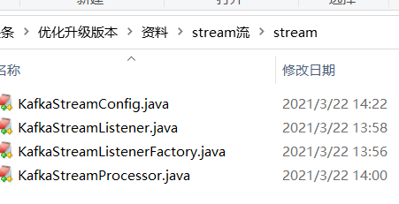


copy到：

 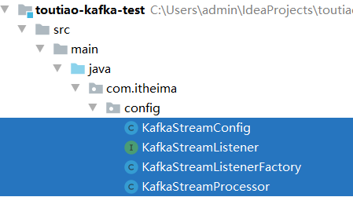


修改application.yml文件，在最下方添加自定义配置

```yaml
kafka:
  hosts: 192.168.211.136:9092
  group: ${spring.application.name}
```


(5)手动创建监听器

> 1,该类需要实现KafkaStreamListener接口
>
> 2,listenerTopic方法返回需要监听的topic
>
> 3,sendTopic方法返回需要处理完后发送的topic
>
> 4,getService方法，主要处理流数据

```java
package com.itheima.streamboot;

import com.itheima.config.KafkaStreamListener;
import org.apache.kafka.common.serialization.Serdes;
import org.apache.kafka.streams.KeyValue;
import org.apache.kafka.streams.kstream.*;
import org.springframework.stereotype.Component;

import java.time.Duration;
import java.util.Arrays;

/**
 *
 *
 * @author ljh
 * @version 1.0
 * @date 2021/3/22 14:28
 * @description 标题
 * @package com.itheima.streamboot
 */
@Component
//注意 泛型 目前只支持 KStream 和KTable
public class MyStreamListener implements KafkaStreamListener<KStream<String, String>> {

    private static final String INPUT_TOPIC = "article_behavior_input";
    private static final String OUT_TOPIC = "article_behavior_out";

    //设置监听的主题地址
    @Override
    public String listenerTopic() {
        return INPUT_TOPIC;
    }

    //设置发送的主题地址
    @Override
    public String sendTopic() {
        return OUT_TOPIC;
    }

    //处理业务逻辑 返回流即可
    @Override
    public KStream<String, String> getService(KStream<String, String> stream) {
        //接口中的stream 为spring容器创建 并传递过来
        KTable<Windowed<String>, Long> wordCounts = stream
                .flatMapValues(textLine -> Arrays.asList(textLine.toLowerCase().split(",")))
                //设置根据word来进行统计 而不是根据key来进行分组
                .groupBy((key, word) -> word)
                //设置5秒窗口时间
                .windowedBy(TimeWindows.of(Duration.ofSeconds(5L)))
                //进行count统计
                .count(Materialized.as("counts-store"));
        //将统计后的数据再次发送到消息主题中
        //变成流 发送给  发送的状态设置为 将数据转成字符串？为什么呢。因为我们的数据kafka接收都是字符串了
        return wordCounts
                .toStream()
                .map((key, value) -> {
                    return new KeyValue(key.key().toString(), value.toString());
                });
    }

}

```


添加prouder:

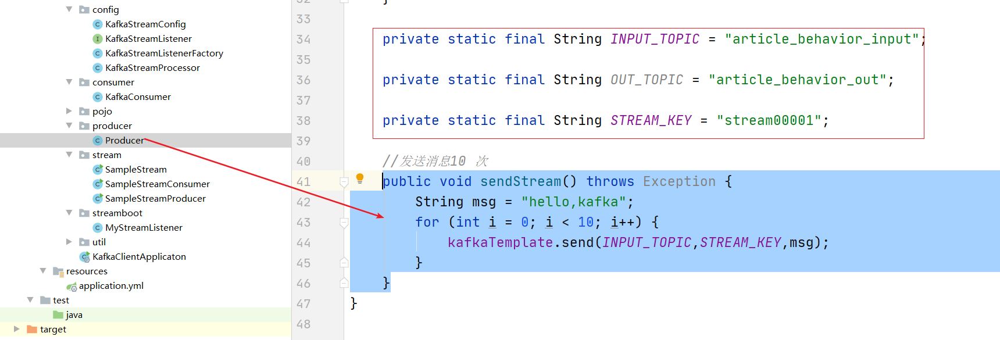

```java
private static final String INPUT_TOPIC = "article_behavior_input";

private static final String OUT_TOPIC = "article_behavior_out";

private static final String STREAM_KEY = "stream00001";

//发送消息10 次
public void sendStream() throws Exception {
    String msg = "hello,kafka";
    for (int i = 0; i < 10; i++) {
        kafkaTemplate.send(INPUT_TOPIC,STREAM_KEY,msg);
    }
}
```


编写controller 实现测试：


```java
        @GetMapping("/sendstream")
        public String sendM2() throws Exception {
            producer.sendStream();
            return "ok";
        }
```

编写监听器来接收：

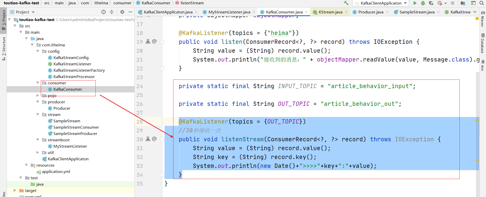

```java
private static final String INPUT_TOPIC = "article_behavior_input";

private static final String OUT_TOPIC = "article_behavior_out";

@KafkaListener(topics = {OUT_TOPIC})
//30秒接收一次
public void listenStream(ConsumerRecord<?, ?> record) throws IOException {
    String value = (String) record.value();
    String key = (String) record.key();
    System.out.println(new Date()+">>>>"+key+":"+value);
}
```


## 3 app端热点文章计算

### 3.1 需求分析

- 筛选出文章列表中最近5天热度较高的文章在每个频道的首页展示
- 根据用户的行为（阅读、点赞、评论、收藏）实时计算热点文章

 

### 3.2 思路分析

如下图：（如果看不清楚则可以开发资料中的pdf） 

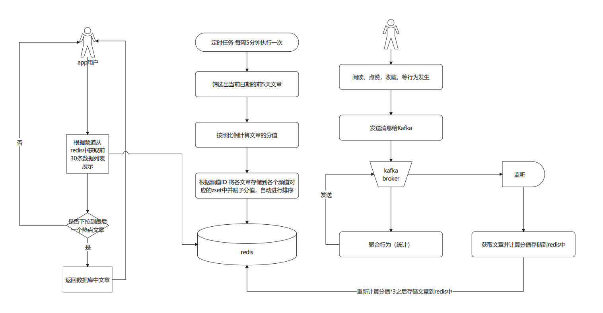


整体实现思路共分为3步（总的思路就是利用redis的 Zset进行排序即可很简单）

- 定时计算热点文章

  - 定时任务每5分钟点，查询前5天的文章

  - 计算每个文章的分值，其中不同的行为设置不同的权重（阅读：1，点赞：3，评论：5，收藏：8）

  - 根据频道ID存储数据到zset中并 设置没个元素的分值就是 该文章的分数

- 实时计算热点文章

  - 行为微服务，用户阅读或点赞了某一篇文章（目前实现这两个功能），发送消息给kafka
  - 文章微服务，接收行为消息，使用kafkastream流式处理进行聚合，发消息给kafka
  - 文章微服务，接收聚合之后的消息，计算文章分值（当日分值计算方式，在原有权重的基础上再*3）
  - 根据当前文章的频道id查询缓存中的数据
  - 当前文章分值与缓存中的数据比较，如果当前分值大于某一条缓存中的数据，则直接替换
  - 新数据重新设置到缓存中
  - 更新数据库文章的行为数量

- 查询热点数据

  - 判断是否是首页
  - 是首页，选择是推荐，频道Id值为0，从所有缓存中筛选出分值最高的30条数据返回
  - 是首页，选择是具体的频道 ,根据频道ID从缓存中获取对应的频道中的数据返回
  - 不是，则分页查询数据库中的数据

### 3.3 功能实现

#### 3.3.1 文章新数据分值计算（定时任务）

思路：

```properties
1. 查询出当前往前移动5天的发布时间的 数据

2. 计算分数值

3. 根据频道ID 存储到 Zset中
```

##### （1）在**article微服务中** 定义service 实现业务逻辑

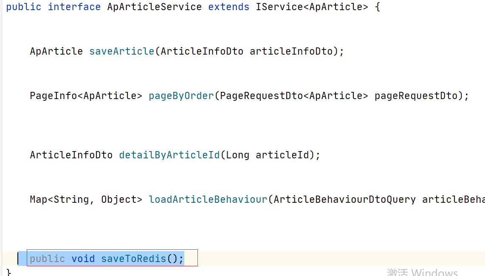

##### （2）实现类中编写步骤如下

```java
@Override
public void saveToRedis() {
    //1. 查询出当前往前移动5天的发布时间的 数据

    //2. 计算分数值

    //3. 根据频道ID 设置到 REDIS 中zset中
   
}

```

##### （3）查询文章数据


上图代码如下：

```java
// 查询发布时间为出前 5天的热门文章数据 计算分值
QueryWrapper<ApArticle> queryWrapper = new QueryWrapper<ApArticle>();
//now>=push>=now-5
LocalDateTime end = LocalDateTime.now();
LocalDateTime start = end.minusDays(5);
queryWrapper.between("publish_time", start, end);
List<ApArticle> apArticleList = apArticleMapper.selectList(queryWrapper);
```


##### （4）计算分值


计算分值的私有方法：

```java
private Integer computeScore(ApArticle apArticle) {
    Integer score = 0;
    if (apArticle.getLikes() != null) {
        //点赞
        score += apArticle.getLikes() * BusinessConstants.ArticleConstants.HOT_ARTICLE_LIKE_WEIGHT;
    }
    if (apArticle.getViews() != null) {
        score += apArticle.getViews();
    }
    if (apArticle.getComment() != null) {
        score += apArticle.getComment() * BusinessConstants.ArticleConstants.HOT_ARTICLE_COMMENT_WEIGHT;
    }
    if (apArticle.getCollection() != null) {
        score += apArticle.getCollection() * BusinessConstants.ArticleConstants.HOT_ARTICLE_COLLECTION_WEIGHT;
    }

    return score;

}
```

常量类：

```java
public static class ArticleConstants{
    public static final Short LOADTYPE_LOAD_MORE = 1;
    public static final Short LOADTYPE_LOAD_NEW = 2;
    /**
         * 默认频道
         */
    public static final String DEFAULT_TAG = "0";

    public static final Integer HOT_ARTICLE_LIKE_WEIGHT = 3;

    public static final Integer HOT_ARTICLE_COMMENT_WEIGHT = 5;
    
    public static final Integer HOT_ARTICLE_COLLECTION_WEIGHT = 8;
    /**
         * 热点文章的前缀
         */
    public static final String HOT_ARTICLE_FIRST_PAGE = "hot_article_first_page_";

}
```

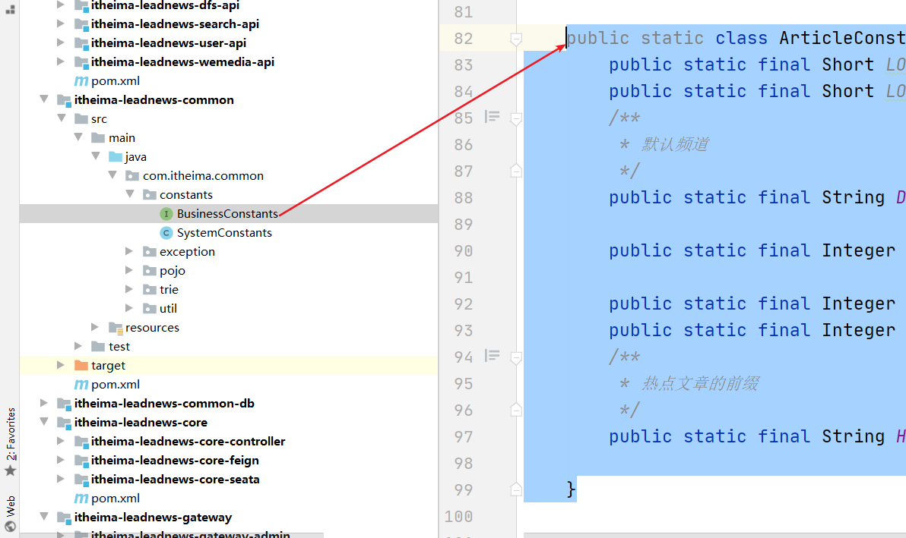


##### （5）配置redis:


##### （6）添加数据到zset中


```java
if(apArticleList!=null ){
    for (ApArticle apArticle : apArticleList) {
        // 排名所有频道的
        stringRedisTemplate.boundZSetOps(
            BusinessConstants.ArticleConstants.HOT_ARTICLE_FIRST_PAGE
            +BusinessConstants.ArticleConstants.DEFAULT_TAG)
            .add(JSON.toJSONString(apArticle),Double.valueOf(computeScore(apArticle)));
        // 根据频道进行排名 key: 就是频道ID
        stringRedisTemplate.boundZSetOps(
            BusinessConstants.ArticleConstants.HOT_ARTICLE_FIRST_PAGE
            +apArticle.getChannelId()).add(JSON.toJSONString(apArticle),
                                           Double.valueOf(computeScore(apArticle)));
    }
}
```

##### （7）整体代码

```java
@Autowired
private StringRedisTemplate stringRedisTemplate;
@Override
public void saveToRedis() {
    /**
         *
         * SELECT
         * 	*
         * FROM
         * 	ap_article
         * WHERE
         * 	publish_time >= NOW() - 5
         *  AND publish_time <= NOW()
         */
    //1. 查询出 最近5天 数据 最多30条
    QueryWrapper<ApArticle> queryWrapper = new QueryWrapper<ApArticle>();
    LocalDateTime end = LocalDateTime.now();
    LocalDateTime start = end.minusDays(5);
    queryWrapper.between("publish_time",start,end);

    List<ApArticle> apArticleList = apArticleMapper.selectList(queryWrapper);
    //2. 计算分数值(公式)
    if(apArticleList!=null ){
        Set<Integer> channels = new HashSet<Integer>();
        for (ApArticle apArticle : apArticleList) {
            // 排名所有频道的
            stringRedisTemplate.boundZSetOps(
                BusinessConstants.ArticleConstants.HOT_ARTICLE_FIRST_PAGE
                +BusinessConstants.ArticleConstants.DEFAULT_TAG)
                .add(JSON.toJSONString(apArticle),Double.valueOf(computeScore(apArticle)));
            // 根据频道进行排名 key: 就是频道ID
            stringRedisTemplate.boundZSetOps(
                BusinessConstants.ArticleConstants.HOT_ARTICLE_FIRST_PAGE
                +apArticle.getChannelId()).add(JSON.toJSONString(apArticle),
                                               Double.valueOf(computeScore(apArticle)));
        }
          //循环遍历
            for (Integer channelId : channels) {
                //删除掉最后一个到第30个只保留30个即可
                stringRedisTemplate.boundZSetOps(
                        BusinessConstants.ArticleConstants.HOT_ARTICLE_FIRST_PAGE+channelId).removeRange(30,-1);
            }
    }
}

//计算分值
@Override
public Integer computeScore(ApArticle apArticle) {
    Integer score=0;
    if(apArticle!=null){
        //点赞
        if(apArticle.getLikes()!=null){
            score+=apArticle.getLikes()*BusinessConstants.ArticleConstants.HOT_ARTICLE_LIKE_WEIGHT;
        }

        //收藏
        if(apArticle.getCollection()!=null){
            score+=apArticle.getCollection()*BusinessConstants.ArticleConstants.HOT_ARTICLE_COLLECTION_WEIGHT;
        }

        //评论
        if(apArticle.getComment()!=null){
            score+=apArticle.getComment()*BusinessConstants.ArticleConstants.HOT_ARTICLE_COMMENT_WEIGHT;
        }
        //阅读数  1分
        if(apArticle.getViews()!=null){
            score+=apArticle.getViews()*1;//youhua
        }

    }
    return score;
}
```


##### （8）集成xxl-job

(8.1)添加依赖：

```xml
<!--定时任务xxl-job-->
<dependency>
    <groupId>com.xuxueli</groupId>
    <artifactId>xxl-job-core</artifactId>
    <version>2.1.2</version>
</dependency>
```


(8.2)配置yml


(8.3)创建任务类

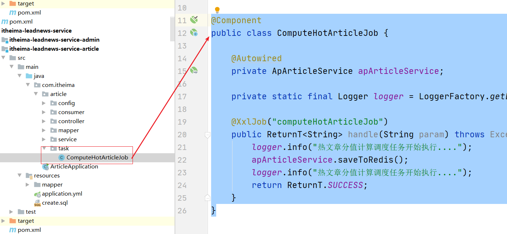

```java
@Component
public class ComputeHotArticleJob {

    @Autowired
    private ApArticleService apArticleService;

    private static final Logger logger = LoggerFactory.getLogger(ComputeHotArticleJob.class);

    @XxlJob("computeHotArticleJob")
    public ReturnT<String> handle(String param) throws Exception {
        logger.info("热文章分值计算调度任务开始执行....");
        apArticleService.saveToRedis();
        logger.info("热文章分值计算调度任务开始执行....");
        return ReturnT.SUCCESS;
    }
}
```

(8.4)启动xxl-job-admin

 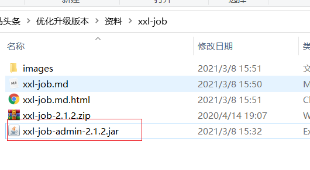

cd到当前所示的目录 并执行命令：

```
java -jar xxl-job-admin-2.1.2.jar
```

如图：


（8.4）访问xxl-job-admin 并设置任务

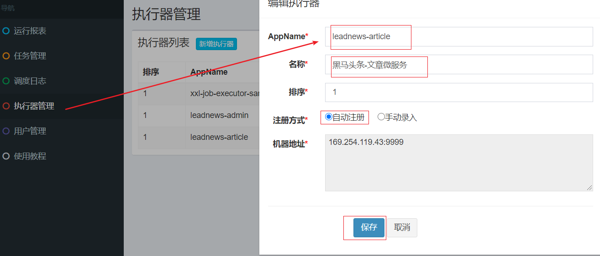


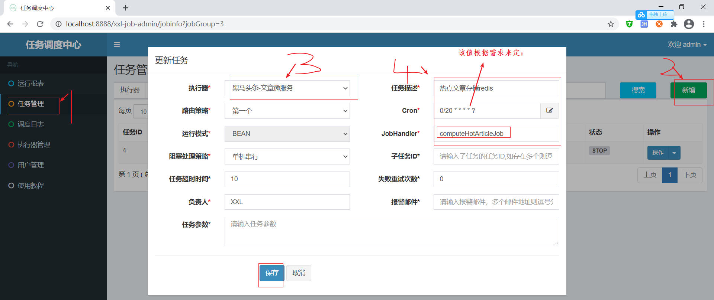


##### （9）yaml配置整体代码

```yaml
spring:
  profiles:
    active: dev
---
server:
  port: 9003
spring:
  application:
    name: leadnews-article
  profiles: dev
  datasource:
    driver-class-name: com.mysql.jdbc.Driver
    url: jdbc:mysql://192.168.211.136:3306/leadnews_article?useSSL=false&useUnicode=true&characterEncoding=UTF-8&serverTimezone=&serverTimezone=Asia/Shanghai
    username: root
    password: 123456
  cloud:
    nacos:
      server-addr: 192.168.211.136:8848
      discovery:
        server-addr: ${spring.cloud.nacos.server-addr}
  kafka:
    # 配置连接到服务端集群的配置项 ip:port,ip:port
    bootstrap-servers: 192.168.211.136:9092
    consumer:
      auto-offset-reset: earliest
      group-id: article-consumer-group
      # 默认值即为字符串
      key-deserializer: org.apache.kafka.common.serialization.StringDeserializer
      # 默认值即为字符串
      value-deserializer: org.apache.kafka.common.serialization.StringDeserializer
  redis:
    host: 192.168.211.136
    port: 6379
# 设置Mapper接口所对应的XML文件位置，如果你在Mapper接口中有自定义方法，需要进行该配置
mybatis-plus:
  mapper-locations: classpath*:mapper/*.xml
  # 设置别名包扫描路径，通过该属性可以给包中的类注册别名
  type-aliases-package: com.itheima.article.pojo
  global-config:
    worker-id: 1 #机器ID
    datacenter-id: 1 # 数据中心ID

logging:
  level.com: debug
xxl:
  job:
    accessToken: ''
    admin:
      addresses: http://127.0.0.1:8888/xxl-job-admin
    executor:
      appname: leadnews-article
      ip: ''
      logretentiondays: 30
      port: -1
---
server:
  port: 9003
spring:
  application:
    name: leadnews-article
  profiles: test
  datasource:
    driver-class-name: com.mysql.jdbc.Driver
    url: jdbc:mysql://192.168.211.136:3306/leadnews_article?useSSL=false&useUnicode=true&characterEncoding=UTF-8&serverTimezone=&serverTimezone=Asia/Shanghai
    username: root
    password: 123456
  cloud:
    nacos:
      server-addr: 192.168.211.136:8848
      discovery:
        server-addr: ${spring.cloud.nacos.server-addr}
  kafka:
    # 配置连接到服务端集群的配置项 ip:port,ip:port
    bootstrap-servers: 192.168.211.136:9092
    consumer:
      auto-offset-reset: earliest
      group-id: article-consumer-group
      # 默认值即为字符串
      key-deserializer: org.apache.kafka.common.serialization.StringDeserializer
      # 默认值即为字符串
      value-deserializer: org.apache.kafka.common.serialization.StringDeserializer
  redis:
    host: 192.168.211.136
    port: 6379
# 设置Mapper接口所对应的XML文件位置，如果你在Mapper接口中有自定义方法，需要进行该配置
mybatis-plus:
  mapper-locations: classpath*:mapper/*.xml
  # 设置别名包扫描路径，通过该属性可以给包中的类注册别名
  type-aliases-package: com.itheima.article.pojo
  global-config:
    worker-id: 1 #机器ID
    datacenter-id: 1 # 数据中心ID

logging:
  level.com: debug
xxl:
  job:
    accessToken: ''
    admin:
      addresses: http://127.0.0.1:8888/xxl-job-admin
    executor:
      appname: leadnews-article
      ip: ''
      logretentiondays: 30
      port: -1
---
server:
  port: 9003
spring:
  application:
    name: leadnews-article
  profiles: pro
  datasource:
    driver-class-name: com.mysql.jdbc.Driver
    url: jdbc:mysql://192.168.211.136:3306/leadnews_article?useSSL=false&useUnicode=true&characterEncoding=UTF-8&serverTimezone=&serverTimezone=Asia/Shanghai
    username: root
    password: 123456
  cloud:
    nacos:
      server-addr: 192.168.211.136:8848
      discovery:
        server-addr: ${spring.cloud.nacos.server-addr}
  kafka:
    # 配置连接到服务端集群的配置项 ip:port,ip:port
    bootstrap-servers: 192.168.211.136:9092
    consumer:
      auto-offset-reset: earliest
      group-id: article-consumer-group
      # 默认值即为字符串
      key-deserializer: org.apache.kafka.common.serialization.StringDeserializer
      # 默认值即为字符串
      value-deserializer: org.apache.kafka.common.serialization.StringDeserializer
  redis:
    host: 192.168.211.136
    port: 6379
# 设置Mapper接口所对应的XML文件位置，如果你在Mapper接口中有自定义方法，需要进行该配置
mybatis-plus:
  mapper-locations: classpath*:mapper/*.xml
  # 设置别名包扫描路径，通过该属性可以给包中的类注册别名
  type-aliases-package: com.itheima.article.pojo
  global-config:
    worker-id: 1 #机器ID
    datacenter-id: 1 # 数据中心ID

logging:
  level.com: debug
xxl:
  job:
    accessToken: ''
    admin:
      addresses: http://127.0.0.1:8888/xxl-job-admin
    executor:
      appname: leadnews-article
      ip: ''
      logretentiondays: 30
      port: -1
```

##### （10）测试

造数据：

如图，将sql执行一遍，在执行之前 先改造下时间，改造成距离当前时间往前移动5天内的时间即可。

(1)先执行如下图所示的SQL

 


(2)再更新时间的SQL

```
update ap_article set publish_time= STR_TO_DATE('19,5,2021','%d,%m,%Y')
```


启动微服务（文章微服务，admin微服务）


在XXL-job界面上 执行任务即可：


#### 3.3.2 文章分值实时计算

分析：

用户行为（阅读量，评论，点赞，收藏）发送消息，目前课程中完成的有阅读。当有点赞的时候，直接发送消息即可，流式处理聚合之后再发送消息出去。

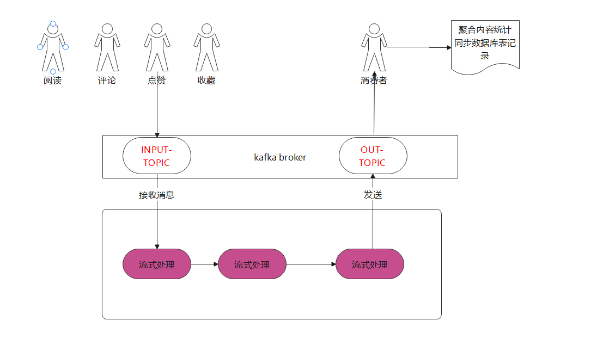


如上图，我们分析出如下步骤：

```properties
1.集成kafka流
	添加依赖
	添加配置类
	配置yml
2.生产者发送消息
	点赞 发送消息
3.流处理
	统计数据
	聚合发送
4.消费者接收流式处理后的消息
	更新文章数据
	更新redis数据	
```


##### （1）集成kafka流

添加依赖：


```xml
<dependency>
    <groupId>org.apache.kafka</groupId>
    <artifactId>kafka-streams</artifactId>
    <version>2.5.1</version>
</dependency>
```

copy配置类相关类到如下目录：（java文件参考测试入门案例）

 

配置yaml:

 

```yaml
kafka:
  hosts: 192.168.211.136:9092
  group: ${spring.application.name}
```


##### （2）生成者发送消息

定义DTO:


```java
@Data
public class UpdateArticleMess {

    /**
     * 修改文章的字段类型
      */
    private UpdateArticleType type;
    /**
     * 文章ID
     */
    private Long articleId;

    public enum UpdateArticleType{
        COLLECTION,COMMENT,LIKES,VIEWS;
    }
}
```


行为微服务添加yaml配置：

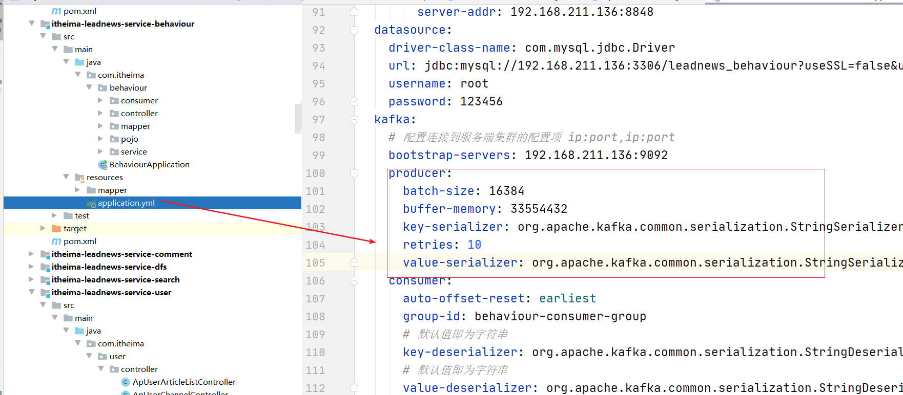

```yaml
    producer:
      batch-size: 16384
      buffer-memory: 33554432
      key-serializer: org.apache.kafka.common.serialization.StringSerializer
      retries: 10
      value-serializer: org.apache.kafka.common.serialization.StringSerializer
```


发送消息：

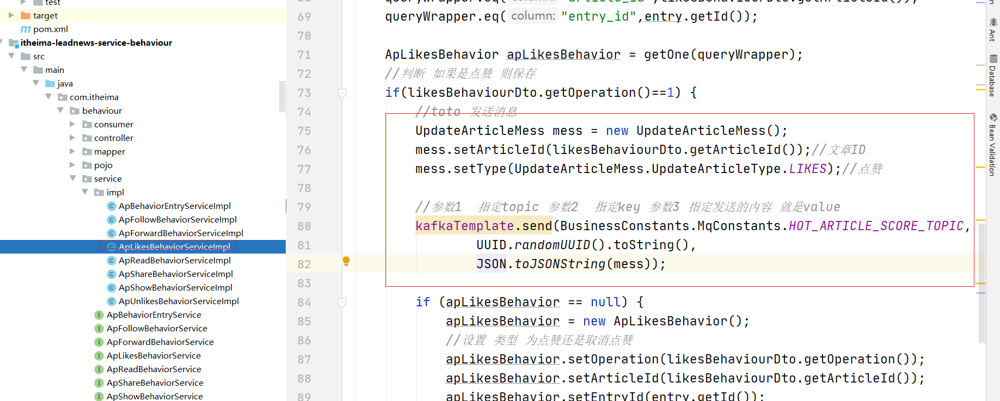

```java
//toto 发送消息
UpdateArticleMess mess = new UpdateArticleMess();
mess.setArticleId(likesBehaviourDto.getArticleId());//文章ID
mess.setType(UpdateArticleMess.UpdateArticleType.LIKES);//点赞

//参数1  指定topic 参数2  指定key 参数3 指定发送的内容 就是value
kafkaTemplate.send(BusinessConstants.MqConstants.HOT_ARTICLE_SCORE_TOPIC,
                   UUID.randomUUID().toString(),
                   JSON.toJSONString(mess));
```


##### （3）流式处理业务逻辑

（1）定义POJO

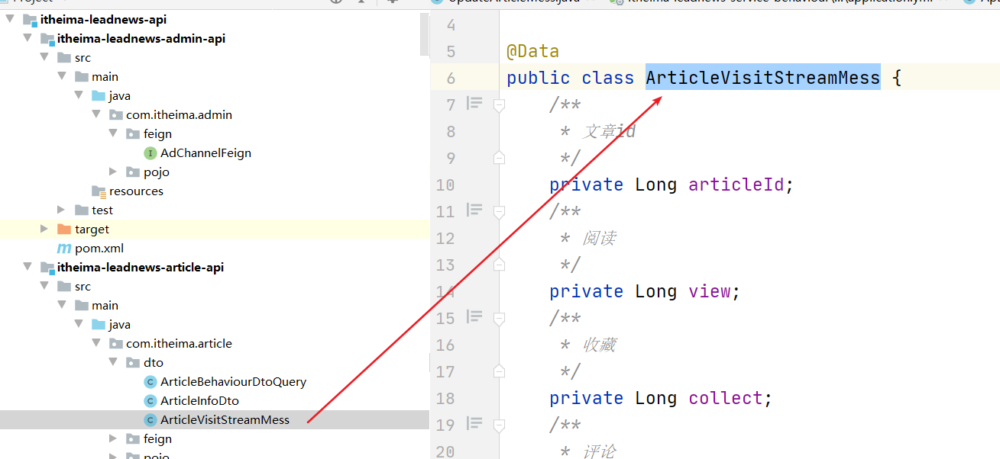

```java
@Data
public class ArticleVisitStreamMess {
    /**
     * 文章id
     */
    private Long articleId;
    /**
     * 阅读
     */
    private Long view=0L;
    /**
     * 收藏
     */
    private Long collect=0L;
    /**
     * 评论
     */
    private Long comment=0L;
    /**
     * 点赞
     */
    private Long like=0L;
}
```


在文章微服务中编写：streamHandler:


```java
@Component
public class HotArticleStreamHandler implements KafkaStreamListener<KStream<String, String>> {

    //接收来自生产者发送的消息的主题
    @Override
    public String listenerTopic() {
        return BusinessConstants.MqConstants.HOT_ARTICLE_SCORE_TOPIC;
    }

    //聚合了结果之后进行发送出去的主题
    @Override
    public String sendTopic() {
        return BusinessConstants.MqConstants.HOT_ARTICLE_INCR_HANDLE_TOPIC;
    }

    //处理的业务
    @Override
    public KStream<String, String> getService(KStream<String, String> stream) {
        //核心的逻辑 就是获取到当前的发送过来的哪一篇文章的 点赞数 和 评论数 等
        //先获取到value的值

        //将其转换成POJO
        //获取到里面的文章的ID 和操作类型 进行聚合 要聚合 就先构建key : articleId:type--->1
        //再进行发送，再发送之前先进行设置发送出去的数据 再发送
        //textLine -> Arrays.asList(textLine.toLowerCase().split(","))

        KTable<Windowed<String>, Long> wordCounts = stream
                .flatMapValues(value -> {
                    //获取到JSON的数据
                    UpdateArticleMess mess = JSON.parseObject(value, UpdateArticleMess.class);
                    //进行聚合 按照 articleId:type 进行统计
                    String s = mess.getArticleId() + ":" + mess.getType().name();
                    return Arrays.asList(s);
                })
                //设置根据word来进行统计 而不是根据key来进行分组
                .groupBy((key, value) -> value)
                //设置5秒窗口时间
                .windowedBy(TimeWindows.of(Duration.ofSeconds(5L)))
                //进行count统计
                .count(Materialized.as("counts-store"));
        //将统计后的数据再次发送到消息主题中
        //变成流 发送给  发送的状态设置为 将数据转成字符串？为什么呢。因为我们的数据kafka接收都是字符串了
        return wordCounts
                .toStream()
                .map((key, value) -> {
                    //value 是数值
                    //key: 123:LIKES
                    System.out.println(key.key().toString() + ":::::" + value);

                    //注意 需要发送到输出的topic的时候需要进行设置 进行封装
                    String str = key.key().toString();

                    String[] split = str.split(":");
                    ArticleVisitStreamMess articleVisitStreamMess = new ArticleVisitStreamMess();
                    articleVisitStreamMess.setArticleId(Long.valueOf(split[0]));
                    switch (UpdateArticleMess.UpdateArticleType.valueOf(split[1])) {

                        case LIKES: {
                            articleVisitStreamMess.setLike(Long.valueOf(value));
                            break;
                        }
                        case COLLECTION: {
                            articleVisitStreamMess.setCollect(Long.valueOf(value));
                            break;
                        }
                        case COMMENT: {
                            articleVisitStreamMess.setComment(Long.valueOf(value));
                            break;
                        }

                        case VIEWS: {
                            articleVisitStreamMess.setView(Long.valueOf(value));
                            break;
                        }
                        default: {
                            System.out.println("啥也没有");
                            break;
                        }
                    }

                    //发送出去  消息本身的内容就是一个JSON的字符串
                    return new KeyValue(key.key().toString(), JSON.toJSONString(articleVisitStreamMess));
                });
    }
}
```


##### （4）消费者消费消息

创建消费者监听类：

 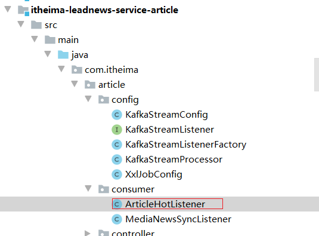

```java
@Component
public class ArticleHotListener {

    @Autowired
    private ApArticleService apArticleService;

    @Autowired
    private StringRedisTemplate stringRedisTemplate;


    //接收streams流发送过来的消息
    @KafkaListener(topics = BusinessConstants.MqConstants.HOT_ARTICLE_INCR_HANDLE_TOPIC)
    public void receiveMessage(ConsumerRecord<String,String> record) {
        try {
            if(record!=null){
                //1.获取到消息内容本身 JSON.toJSONString(articleVisitStreamMess)
                String value = record.value();

                //2.转成对象
                ArticleVisitStreamMess articleVisitStreamMess = JSON.parseObject(value, ArticleVisitStreamMess.class);
                //3.更新文章表的数据（点赞数，评论数,,,,,）
                ApArticle apArticle = apArticleService.getById(articleVisitStreamMess.getArticleId());
                if(apArticle!=null) {
                   //从消息端过来 进行判断
            Integer collect = articleVisitStreamMess.getCollect() == null ? 0 : articleVisitStreamMess.getCollect().intValue();
            Integer comment = articleVisitStreamMess.getComment() == null ? 0 : articleVisitStreamMess.getComment().intValue();
            Integer like = articleVisitStreamMess.getLike() == null ? 0 : articleVisitStreamMess.getLike().intValue();
            Integer view = articleVisitStreamMess.getView() == null ? 0 : articleVisitStreamMess.getView().intValue();
            apArticle.setId(articleId);
            apArticle.setLikes(apArticle.getLikes() + like);
            apArticle.setViews(apArticle.getViews() + view);
            apArticle.setComment(apArticle.getComment() + comment);
            apArticle.setCollection(apArticle.getCollection() + collect);
            //update xxx set like = ? where id=?
            apArticleMapper.updateById(apArticle);
                }
                //4.重新计算文章的分值
                Integer score = apArticleService.computeScore(apArticle)*3;
                // 呵呵开始排名所有的
                stringRedisTemplate.boundZSetOps("HOT_ARTICLE_"+BusinessConstants.ArticleConstants.DEFAULT_TAG).add(JSON.toJSONString(apArticle),Double.valueOf(score));
                // 根据频道进行排名 key: 就是频道ID
                stringRedisTemplate.boundZSetOps("HOT_ARTICLE_"+apArticle.getChannelId()).add(JSON.toJSONString(apArticle),Double.valueOf(score));

            }
        } catch (BeansException e) {
            e.printStackTrace();
        }
    }
}
```


修改原来的私有方法 ：如图定义一个接口：


并修改私有方法实现上边的接口的方法

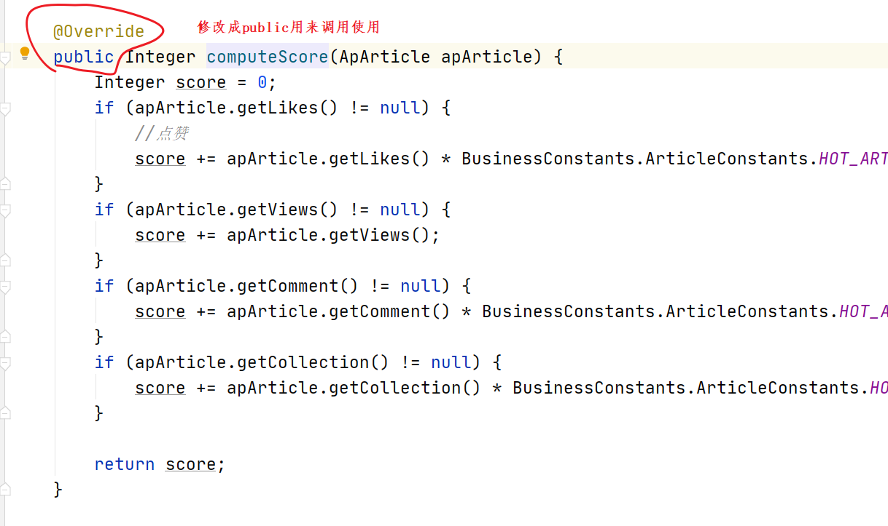


##### （5）测试

登录：


点赞：


查看redis中：数据：

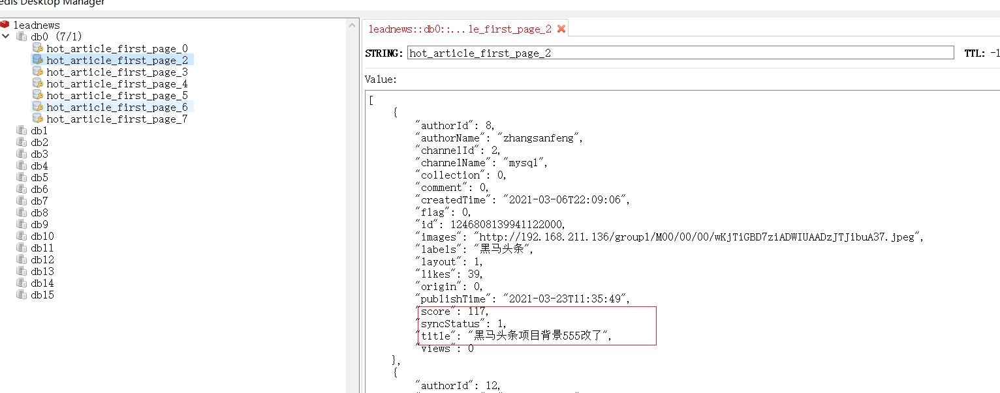


当不停的单机另外一个数据的时候，查看是否该数据 已经在顶点 进行展示。如果是则测试OK.


#### 3.3.3 controller 添加根据频道获取热门数据

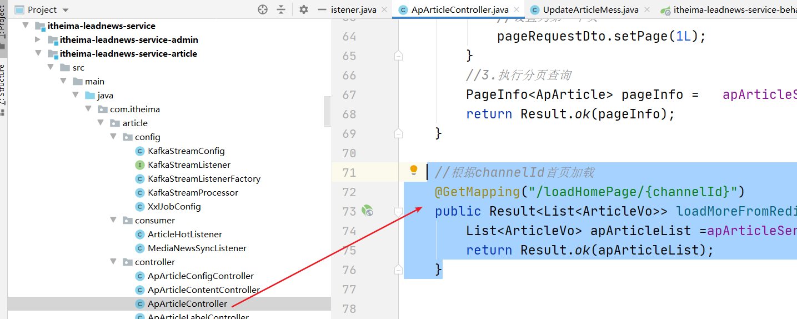


controller:

```java
//根据channelId首页加载
@GetMapping("/loadHomePage/{channelId}")
public Result<List<ApArticle>> loadMoreFromRedis(@PathVariable(name="channelId")Integer channelId){
    List<ApArticle> list = apArticleService.loadMoreFromRedis(channelId);
    return Result.ok(list);
}
```


service:

```java
@Override
public List<ApArticle> loadMoreFromRedis(Integer channelId) {

    //只获取30个
    Set<String> range = stringRedisTemplate
        .boundZSetOps(BusinessConstants.ArticleConstants.HOT_ARTICLE_FIRST_PAGE + channelId)
        .reverseRange(0, 30);
    if(range!=null && range.size()>0) {
        List<ApArticle> collect = range.stream().map(s -> JSON.parseObject(s, ApArticle.class)).collect(Collectors.toList());
        return collect;
    }
    return null;
}
```


这样，当页面需要展示热门数据的时候，前端直接调用该接口即可，返回一个列表，前端自己通过数据展示判断，

当数据展示完毕以后，需要加载更多，则调用另外一个接口进行分页查询，此时数据从数据库获取即可。

