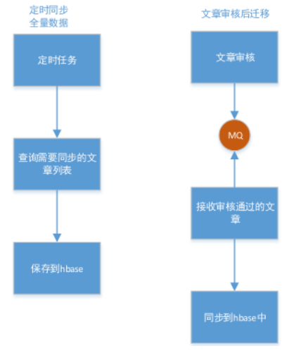
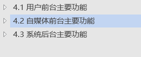
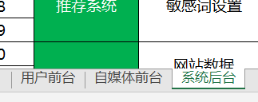
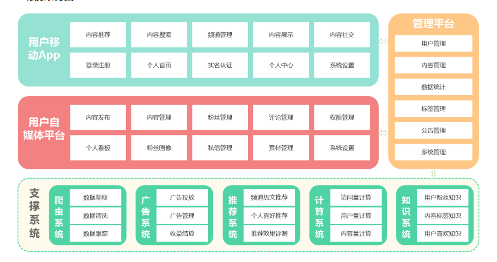
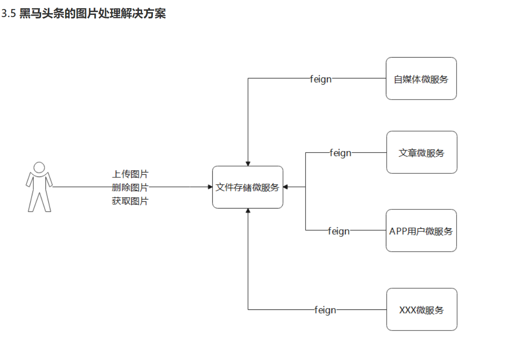
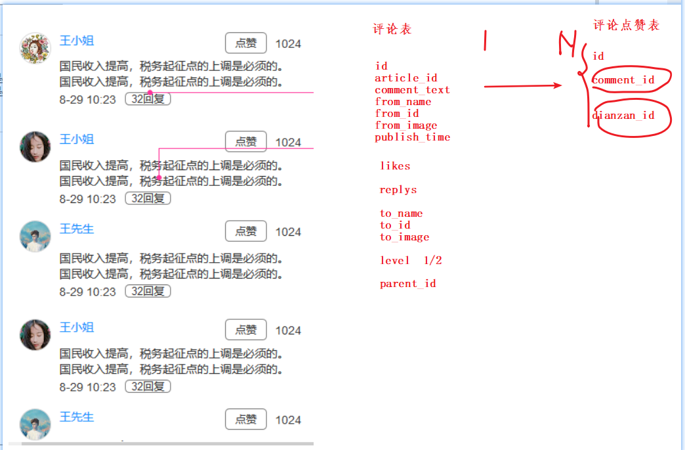
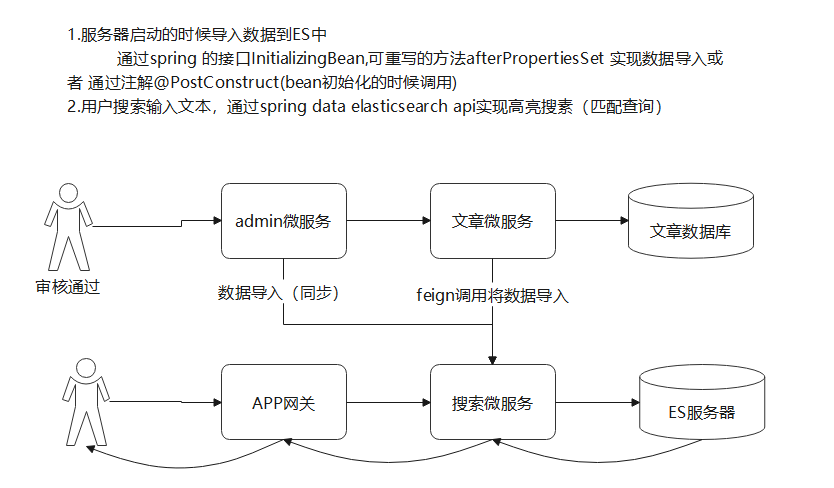

# 十六章_项目总结

## 目标

- 能够自主描述黑马头条项目的介绍
- 能够了解黑马头条项目其他业务
- 能够描述解决业务的一些技术场景

## 1 项目背景

本头条项目形态模拟今日头条互联网社交媒体项目，内容则以技术类文章为主，为终端学习用户提供精准的、感兴趣的技术文章，为技术类的自媒体人提供自运营的平台。

该类项目是互联网中大数据驱动结合内容运营的成功案例，各大公司都纷纷投入该模式的运营，正成为互联网发展的新方向；也因项目背后的技术涉及大数据存储、大数据计算、微服务、DevOps等热门技术的综合应用。

利用用户时间碎片化、地域切换频繁、形态社交化、内容个性化等综合特征下，通过收集用户行为数据、分析用户行为特征、大数据推荐计算，为用户提供感兴趣的、精准的技术文章。

## 2 项目业务

### 2.1 详细功能

在整个黑马头条项目中，咱们是实现了一个以文章为主线的核心业务，作为一个庞大的项目，不仅仅只有文章，还有很多其他的功能点，作为项目开发工程师之一，对其他模块要有所了解，详细请查看需求说明。

<font color='red'>请查阅资料文件夹中的需求说明</font>

### 2.2 黑马头条核心业务流


上图主要是说明了三种数据的流转，登录或注册数据流、文章的数据流（核心）、行为数据流

课程主要实现了核心业务的业务流，并未实现大数据相关推荐的功能，但是一个完整的项目是由多个部门共同开发，java后端程序员就是主要负责功能开发，后期的分析推荐由大数据技术或python语言来完成。

## 3 其他技术解决方案

### 3.1 小视频技术

小视频功能类似于抖音、快手小视频的应用，用户可以上传小视频进行分享，也可以浏览查看别人分享的视频，并且可以对视频评论和点赞操作。

主要实现技术：

fastdfs

阿里云视频点播

https://help.aliyun.com/product/29932.html?spm=a2c4g.11186623.6.540.613a58fcYpGXXH

### 3.2 数据迁移方案

随着业务的增长数据量越来越大，对于爬取的数据，过期的文章等进行迁移，使用mysql 存储会影响mysql的性能，并且我们需要对数据进行流式计算，对数据进行各种统计，mysql满足不了我们的需求，我们就将mysql中的全量数据同步到HBASE中，由HBASE保存海量数据，mysql中的全量数据会定期进行删除。


实现思路：

- 自媒体文章审核通过后，马上同步数据到hbase中，并且在app文章表的字段`sync_status`同步状态，修改为1，  1为同步，0为未同步
- 定时同步，做一个定时任务，每天凌晨扫描app文章表，把没有同步的文章再同步一次
- 定时删除，做一个定时任务，按照文章发布时间，定期删除一个月之前的app端的文章数据
- 查询文章（特别是我的收藏，历史查阅记录等），查询的思路如下：
  - 先去mysql中去找该文章，存在则直接返回
  - 如果mysql中没有找到，则需要查询hbase，返回该文章信息



### 3.3 分库分表方案

请查看资料文件夹《分库分表专题》


## 4 项目中常见面试题

### 4.1 黑马头条项目中的架构是什么样的？有什么好处？


黑马后台是一整套微服务的架构设计

1.错误和故障隔离

当微服务架构隔离功能时，它也会隔离错误。一个微服务中的问题不会关闭整个应用程序，它将包含在该区域中，而其他微服务继续运行。这不仅可以延长正常运行时间，还可以更轻松地查明问题的根源并解决问题。

2.兼容CI / CD和敏捷

微服务架构与软件行业中最有效的过程兼容，包括CI，CD，敏捷和容器方法。团队可以选择最适合他们需求的流程，将微服务集成到他们的开发方法中并使用他们喜欢的任何工具。

3.可扩展

可以从应用程序中轻松提取独立功能，以便在其他应用程序中重用和重新调整用途，并提高可伸缩性。各个开发团队还可以实现和部署他们的代码，而无需考虑更大的IT团队或部门的日程安排。这使得大型组织更容易使用微服务架构来减少可能延迟部署的其他问题。

4.服务独立维护，分工明确

每个微服务都可以交由一个小团队进行开发，测试维护部署，并对整个生命周期负责，当我们将每个微服务都隔离为独立的运行单元之后，任何一个或者多个微服务的失败都将只影响自己或者少量其他微服务，而不会大面积地波及整个服务。


### 4.2 springboot自动配置的原理？

 **1**） **自动配置**

Spring Boot的自动配置是一个运行时（更准确地说，是应用程序启动时）的过程，考虑了众多因素，才决定Spring配置应该用哪个，不该用哪个。该过程是SpringBoot自动完成的。

**2**） **起步依赖**

起步依赖本质上是一个Maven项目对象模型（Project Object Model，POM），定义了对其他库的传递依赖，这些东西加在一起即支持某项功能。

简单的说，起步依赖就是将具备某种功能的坐标打包到一起，并提供一些默认的功能。

**3）自动化配置总结**

1、@SpringBootApplication组合注解，包含三个注解


- **@SpringBootConfiguration**是组合的注解是对@Configuration封装，也就是理解引导类其实也是一个配置类。
- **@ComponentScan**是Spring注解作用是扫描包其实\<context:component-scan>, 规则是 **当前包及其子包所有的注解**

2、**@EnableAutoConfiguration**  是实现Boort自动化配置的注解，给我们内置了大量的约定配置。比如：Tomcat 端口8080， Redis localhost:6379

- @AutoConfigurationPackage是自动化配置的包

- @Import(AutoConfigurationImportSelector.class)：初始化Bean并且存储到IOC容器中，但是并不是所有的Bean对象都会被实例化。我们需要根据@ConditionalOnXXX来去初始化。

  通过AutoConfigurationImportSelector 的getAutoConfigurationEntry 获取所有的**自动化配置的全类名**存到List集合中，等待被初始化。

  

3、以XXXAutoConfiigureation为例


- 判断当前类是否生效，如果生效就开始实例化bean，找 @EnableConfigurationProperties(XXXProperties.class)里面的默认的配置数据。 获取成功之后就会去使用这些默认信息初始化Bean对象，存到IOC容器中。

### 4.3 项目中用到了spring cloud getaway网关，它有什么作用，你们在项目中是如何使用的？


- 路由（route） 路由信息的组成：由一个ID、一个目的URL、一组断言工厂、一组Filter组成。如果路由断言为
  真，说明请求URL和配置路由匹配。
- 断言（Predicate） Spring Cloud Gateway中的断言函数输入类型是Spring 5.0框架中的ServerWebExchange。Spring Cloud Gateway的断言函数允许开发者去定义匹配来自于Http Request中的任何信息比如请求头和参数。
- 过滤器（Filter） 一个标准的Spring WebFilter。 Spring Cloud Gateway中的Filter分为两种类型的Filter，分别是Gateway Filter和Global Filter。过滤器Filter将会对请求和响应进行修改处理。

项目中主要使用了网关的路由和全局过滤器

- 路由：在项目的app端，前端系统访问接口的时候，统一都是由网关进行路由到某一个微服务进行访问，这样的好处就是，后期微服务做集群可以方便的做集群、也可以隐藏真实的微服务的真实地址，变更请求协议，路由都可以完成
- 全局过滤器：在项目中所有请求到网关以后，会携带一个token，然后由全局过滤器进行解析当前的token是否有效合法，如果无效不合法则直接返回该请求，并不会往下一个微服务执行，如果合法则会放行。

### 4.4 项目中用到了nacos，它与eureka有什么区别？

对比：


nacos:

同时支持AP和CP模式,根据服务注册选择临时和永久来决定走AP模式还是CP模式，同时nacos也支持配置中心

### 4.5 项目开发的过程中，与前端人员是如何配合的？接口联调如何做？

前后端分离开发的流程

- 需求分析
- 接口定义
- 前后端同时开发
- 联调

swagger

随着springboot、springcloud等微服务的流行，在微服务的设计下，小公司微服务小的几十，大公司大的几百上万的微服务。这么多的微服务必定产生了大量的接口调用。而接口的调用就必定要写接口文档。在微服务的盛行下，成千上万的接口文档编写，不可能靠人力来编写，故swagger就产生了，它采用自动化实现并解决了人力编写接口文档的问题；它通过在接口及实体上添加几个注解的方式就能在项目启动后自动化生成接口文档，

Swagger 提供了一个全新的维护 API 文档的方式，有4大优点：

- 自动生成文档：只需要少量的注解，Swagger 就可以根据代码自动生成 API 文档，很好的保证了文档的时效性。

- 跨语言性，支持 40 多种语言。

- Swagger UI 呈现出来的是一份可交互式的 API 文档，我们可以直接在文档页面尝试 API 的调用，省去了准备复杂的调用参数的过程。

- 还可以将文档规范导入相关的工具（例如 SoapUI）, 这些工具将会为我们自动地创建自动化测试。

Yapi工具

https://hellosean1025.github.io/yapi/index.html

### 4.6 项目中的异常是如何处理？

全局异常处理器的流程


主要是通过，springmvc提供的一个全局异常处理器拦截异常信息。


黑马头条项目中的异常处理流程：


异常主要分了两种情况：

- 不可预知异常：统一返回错误信息
- 可预知异常，正常返回错误信息


### 4.7 如何解决分布式项目中的分布式事务？

**seata**


**Transaction Coordinator (TC)：** 事务协调器，维护全局事务的运行状态，负责协调并驱动全局事务的提交或回滚。

**Transaction Manager (TM)：** 控制全局事务的边界，负责开启一个全局事务，并最终发起全局提交或全局回滚的决议。

**Resource Manager (RM)：** 控制分支事务，负责分支注册、状态汇报，并接收事务协调器的指令，驱动分支（本地）事务的提交和回滚。

一个典型的分布式事务过程：

1. TM 向 TC 申请开启一个全局事务，全局事务创建成功并生成一个全局唯一的 XID。
2. XID 在微服务调用链路的上下文中传播。
3. RM 向 TC 注册分支事务，将其纳入 XID 对应全局事务的管辖。
4. TM 向 TC 发起针对 XID 的全局提交或回滚决议。
5. TC 调度 XID 下管辖的全部分支事务完成提交或回滚请求。


AT模式机制

基于两阶段提交协议的演变。

一阶段：

​      业务数据和回滚日志记录在同一个本地事务中提交，释放本地锁和连接资源。

二阶段：

​      提交异步化，非常快速地完成。

​      回滚通过一阶段的回滚日志进行反向补偿。


### 4.9 在使用kafka的时候，生产者的消息确认机制有哪些，各有什么特点？

生产者执行流程


消息发送确认机制

- acks=0

  生产者在成功写入消息之前不会等待任何来自服务器的响应，也就是说，如果当中出现了问题，导致服务器没有收到消息，那么生产者就无从得知，消息也就丢失了。不过，因为生产者不需要等待服务器的响应，所以它可以以网络能够支持的最大速度发送消息，从而达到很高的吞吐量。

- acks=1

  只要集群首领节点收到消息，生产者就会收到一个来自服务器的成功响应，如果消息无法到达首领节点，生产者会收到一个错误响应，为了避免数据丢失，生产者会重发消息。

- acks=all

  只有当所有参与赋值的节点全部收到消息时，生产者才会收到一个来自服务器的成功响应，这种模式是最安全的，它可以保证不止一个服务器收到消息，就算有服务器发生崩溃，整个集群仍然可以运行。不过他的延迟比acks=1时更高。

### 4.10 在使用kafka的时候，消费者是如何确保消息不会重复消费的？消息如何保证不会丢失？

kafKa消费消息主要是依靠偏移量进行消费数据的，偏移量是一个不断自增的整数值，当发生重平衡的时候，便于用来恢复数据。

重平衡Rebalance

消费者组内某个消费者实例挂掉后，其他消费者实例自动重新分配订阅主题分区的过程。Rebalance 是 Kafka 消费者端实现高可用的重要手段。

接收消息的流程


发生重平衡时提交偏移量小于客户端处理的最后一个消息的偏移量，那么处于两个偏移量之间的消息就会被重复处理。


如果提交的偏移量大于客户端的最后一个消息的偏移量，那么处于两个偏移量之间的消息将会丢失。


提交偏移量的方式：

- 自动提交偏移量
- 提交当前偏移量（同步提交）
- 异步提交
- 同步和异步组合提交

### 4.11 为什么要使用mongodb?

项目中在存在文章的评论内容的时候，使用的mongodb，主要是当前mongodb的特点来决定使用它。

评论内容的特点：

- 数据量的很大的，

- 查询或新增的比较频繁

- 数据价值比较低，对事务要求不高。

所以最终采用的当前技术解决。

mongodb特点：

（1）**高性能**：

MongoDB提供高性能的数据持久性。特别是,

对嵌入式数据模型的支持减少了数据库系统上的I/O活动。

索引支持更快的查询，并且可以包含来自嵌入式文档和数组的键。

（2）**高可用性：**

MongoDB的复制工具称为副本集（replica set），它可提供自动故障转移和数据冗余。

（3）**高扩展性：**

MongoDB提供了水平可扩展性作为其核心功能的一部分。

分片将数据分布在一组集群的机器上。（海量数据存储，服务能力水平扩展）

（4）**丰富的查询支持：**

MongoDB支持丰富的查询语言，支持读和写操作(CRUD)，比如数据聚合、文本搜索和地理空间查询等。

（5）其他特点：如无模式（动态模式）、灵活的文档模型

### 4.12 为什么要使用Elasticsearch?

ElasticSearch是一个基于Lucene的搜索服务器,是一个分布式、高扩展、高实时的搜索与数据分析引擎

基于RESTful web接口,用Java语言开发的，并作为Apache许可条款下的开放源码发布，是一种流行的企业级搜索引擎

应用场景

- 搜索：海量数据的查询
- 日志数据分析
- 实时数据分析

### 4.13 Elasticsearch中的倒排索引是什么？

倒排索引：将各个文档中的内容，进行分词，形成词条。然后记录词条和数据的唯一标识（id）的对应关系，形成的产物。


### 4.14 为什么使用jenkins? jenkins的优势是什么？

Jenkins的特征：

- 开源的 Java语言开发持续集成工具，支持持续集成，持续部署。
- 易于安装部署配置：可通过 yum安装,或下载war包以及通过docker容器等快速实现安装部署，可方便web界面配置管理。
- 消息通知及测试报告：集成 RSS/E-mail通过RSS发布构建结果或当构建完成时通过e-mail通知，生成JUnit/TestNG测试报告。
- 分布式构建：支持 Jenkins能够让多台计算机一起构建/测试。
- 文件识别： Jenkins能够跟踪哪次构建生成哪些jar，哪次构建使用哪个版本的jar等。
- 丰富的插件支持：支持扩展插件，你可以开发适合自己团队使用的工具，如 git，svn，maven，docker等。

### 4.15 链路追踪的原理是什么？skywalking核心功能有哪些？

其核心功能要点如下：

- **指标分析**：服务，实例，端点指标分析
- **问题分析**：在运行时分析代码，找到问题的根本原因
- **服务拓扑**：提供服务的拓扑图分析
- **依赖分析**：服务实例和端点依赖性分析
- **服务检测**：检测慢速的服务和端点
- **性能优化**：根据服务监控的结果提供性能优化的思路
- **链路追踪**：分布式跟踪和上下文传播
- **数据库监控**：数据库访问指标监控统计，检测慢速数据库访问语句（包括SQL语句）
- **服务告警**：服务告警功能

### 4.16 项目中是如何解决高并发的问题的？

- 前端处理

  - 采用前后端分离的模式，前端项目单独部署到服务器上面

  - 前端加入CDN 加速服务

  - 前端引入Nginx，如果不够，加入集群Nginx

- 后端处理

  - 服务单一原则，如app端目前涉及到了5个微服务，如果某一个压力较大，可根据实际情况增加单个服务集群数量
  - 尽量使用缓存技术来做
  - 限流
  - 降级
  - 熔断

### 4.17 项目中哪一块用到了缓存？

- 搜索联想词
- app文章首页热点数据

### 4.18 在项目开发中，遇到哪些技术难题？最终如何解决的？

分布式事务

分布式任务调度问题：xxl-job

## 5 项目管理

### 5.1 开发流程

基于前后端分离的思路，首先先由产品定制产品需求并给开发进行产品宣讲。接着后端和前端同时动工。各自完成自己的开发任务。最后进行对接联调，同时进行提测。当测试通过之后，才进行上线。

### 5.2 项目周期

为了缩短项目周期，快速占领市场，我们采用敏捷开发的思想。将整个项目分为三期来开发

第1期实现核心功能：需求与设计1个月，编码2个月，上线测试1个月。 4-6个月

第2期增强系统功能：需求与设计1个月，编码2个月，上线测试0.5个月。

第3期补充系统功能：需求与设计1个月，编码2个月，上线测试0.5个月。

### 5.3 团队组成

团队人数：16人

产品经理：2人，负责产品推广与产品调研、确定客户需求。

UI: 2人，负责原型图设计

项目经理：1人

系统架构师：1人，主要负责需求调研、概要设计、详细设计。

资深开发工程师（后端）：2人，主要负责项目核心功能开发。

程序员（后端）：3人，主要负责项目后端代码开发。

前端开发工程师：2人，主要负责项目前端代码开发。

测试工程师：2人，主要负责项目测试。

运维人员：1人，主要负责上线部署。

### 5.4 项目预算

1期项目预算

人工成本明细

| 成本项           | 人月 | 预算    |
| :--------------- | :--- | :------ |
| 项目经理         | 4    | 120,000 |
| UI               | 3    | 30,000  |
| 产品经理         | 2    | 40,000  |
| 后端开发（资深） | 6    | 120,000 |
| 后端开发         | 9    | 90,000  |
| 前端开发         | 4    | 60,000  |
| 测试             | 2    | 20,000  |
| 运维             | 1    | 16,000  |

人工成本合计：496,000

其它成本投入：50,000

合计：546,000


## 6 总结

```
1.读写分离
2.单点登录
3.项目总结	
```

### 6.1 day1-项目结构搭建

 

 




```
核心流程：
    1.用户实名认证 变成自媒体人
	2.自媒体人 发布文章  需要运营（后台）进行审核（机器审核：反垃圾服务，敏感词判断，人工审核：人工进行页面审核）
	3.审核通过 将数据存储到文章表中和ES中 用户可以通过ES来搜索文章记录
    4.用户登录之后，可以查看频道列表 查看频道中的文章的列表数据（1.热数据文章 2.冷数据文章）
    5.用户阅读了文章，点赞了文章，收藏了文章等，通过kafka 流聚合处理，数据统计，将文章的分值进行重新计算，重新设置到redis中（zset）进行排序即可，另外需要一个定时任务（xxl-job）定时查询最近5天的热点数据进行文章的分值计算存储到zset (30条)
    6.后续有大数据支持。（爬虫，数据清洗等，推荐系统） 
    
```


```
+ 开发工程的系统结构
+ 核心流程
+ 接口文档（knif4j结合网关实现接口的测试对接）
   
```


### 6.2 day2-核心工程抽取

```
+ 抽取核心的工程（反射，接口继承，抽象类实现）
	+ controller
	+ feign
	+ seata 自定义起步依赖分布式事务的工程。
+ jwt 来实现单点登录
	jwt 组成：头 载荷 签名  ，轻量级的json的字符串，服务器不需要存储，便于我们在微服务领域中进行传递。
    登录流程说（单点登录流程）
+ 通用的异常
	+ 系统异常 exception
	+ 自定义的异常leadnewsexcetion
+ nacos加上 

```

### 6.3 day03-实名认证

```
流程：
	用户填信息 ---》存储到一个表中---》后台运营进行人工审核（成功，就创建账号（作者账号，自媒体账号））
	feign调用。
+ feign
	底层使用restTemplate--->httpclient -->默认使用jdk自带的，性能差，所用使用了okhttp(连接池)
+ feignclient
+ enablefeignclients
```

### 6.4 day04-素材管理

```
+ 素材如何管理？他的解决方案是什么？


+ 素材就是图片目前
+ fastdfs
	+ 架构 client  tracker storage 
	+ 执行流程 上传  下载流程
	+ 用户访问图片的流程
+如何使用
	+ 依赖 tobato
	+ CRUD
	+ 具体实现图片上传（springmvc+ fastdfs）
	
```




### 6.5 day05-day07发布文章

```
自媒体人发布文章---》创建自媒体文章表（wm_news）待审核的状态--> 发送消息 给管理微服务
管理微服务 收到消息 进行审核，审核之后状态修改掉，状态修改掉之后，数据存储到文章微服务的表中（es对接的）

参考第7天图
```


```
1.kafka
2.阿里云的反垃圾服务（内容检测）
3.feign调用
4.ES
```


```
kafka:
	+ 流媒体（流式处理平台）MQ （同步文章的信息（文章上下架的时候，，，审核的时候，发布文章的时候））
	+ 技术选型对比 kafka rocketmq rabbitmq  
	+ 架构及组成
雪花算法： ID生成器 保证系统全局的主键的唯一性。 64位二进制的数据（1位没用，41位时间戳+10位工作机器ID（5位机器id+数据中心id）+12位序列号） mybatisplus自动集成了，只需要下。推荐（所有的表都采用）
```

### 6.6 day08-分布式任务调度

```
+ 任务调度技术选型
	+ spring task +qurtaz+xxl-job +elastic-job
	+ 技术架构
	+ 写一个类和方法（方法安装要求来写） 修饰一个注解@xxljob(任务的名称)，调度中心根据任务名字创建一个任务 并进行调度。触发调度的规则（CRON表达式）
	
```


```
使用他实现的功能：
	定时 查询待发布的自媒体文章的列表，判断是否已经到了发布时间，如果到了则立即发布（修改状态，数据存储到文章表中，并将数据存储到ES）
```


```
Long类型转换精度丢失问题解决？因为LONG类型数据，转成JSON 返回给前端，前端拿到JSON数据中Long类型的时候就丢失
解决方案：
	+ 将数据转成字符串 返回给前端。返回给前端的时候。默认是使用JACKSON
		+ 自定义一个全局的转换器
		+ 自定义一个局部的（序列化器）在字段上使用自带的注解进行指定使用某一个序列化器来进行序列化。

网关对接微服务的时候，微服务需要获取到登录的用户的ID是怎么获取的？requestContextholder 获取网关解析后存到请求头中的用户的ID 的值，本质是通过threadlocal来实现。


```


### 6.7 day11

```
评论的开发
+ 使用mongdb的原因对比 redis mongdb mysql(innodb)  spring data mongdb
+ 盖楼还是没有盖楼（2层评论）	

```




### 6.8 搜索

```
elasticsearch (是什么？为什么要用他？怎么用的？原理是啥？有哪些特点？)
+ 搜索引擎 基于lucene,隐藏lucene的复杂性。提供的restful API实现搜索的功能。
+ 索引 --》类型(_doc)--》文档--》字段--》映射  （是否分词 是否索引 是否存储） 集群 节点 分片(1) 复制(1)
+ 原因： PB级别的数据，搜索精度高，扩展容易，利用倒排索引结构实现搜索 速度快。
+ 倒排结构流程：
	+ 建立倒排的流程 将文本进行分词（ik），将词存储到倒排表 建立词和文档的映射关系。JSON存储数据到ES中
	+ 搜索的流程 根据关键词，从倒排中进行搜索（按照某一个规则：范围查询，匹配查询，词条查询），先分词，再从倒排进行匹配，匹配上了，将对应的匹配上的文档的ID 获取到，再获取对应的文档的列表（需要经过排序）

+ 可以使用http请求 发送 给ES es返回我们JSON的数据即可
	+ 通过java代码high level rest client (java)
	+ 通过restfull API 实现操作（通过JAVA来模拟发送请求的方式的实现 DSL语句）
+ 使用过程：
	通过 spring data elasticsearch 建立映射的时候通过注解@document @field @id的注解进行映射
	通过接口 实现了CRUD的功能，我们只需要继承接口ealsticsearchRepository CRUD的都可以了。
	在接口中通过@query("DSL语句") 就能实现搜索的功能。
	复杂的查询可以使用模板类ElasticsearchRestTemplate
```





```
使用MQ异步的方式 实现搜索的历史记录的保存。或者使用多线程。
```

